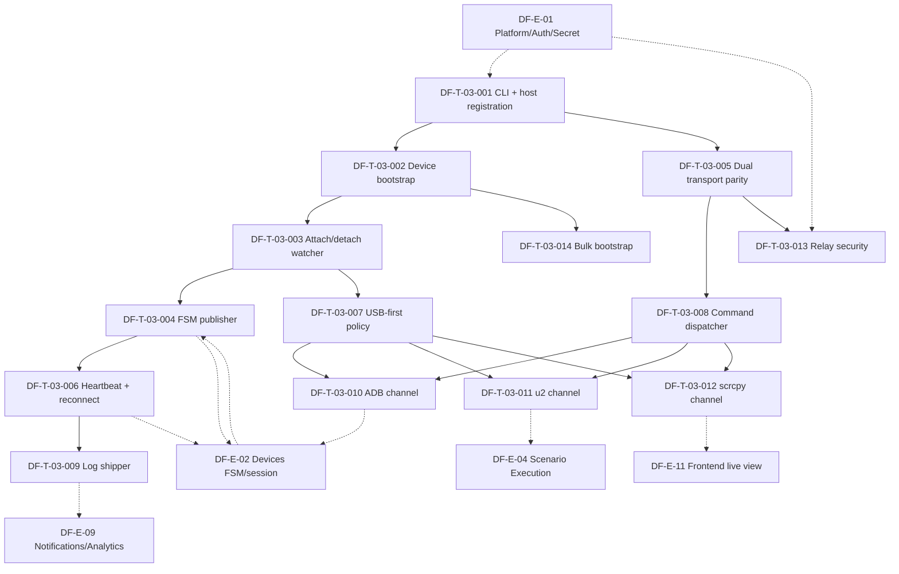

# DF-E-03 — Agent Boot & Relay

> **Mã Epic:** DF-E-03
> **Module gốc:** DF-MOD-03 — Agent Boot & Relay
> **Phiên bản:** 1.0
> **Cập nhật lần cuối:** 2026-05-26
> **Trạng thái:** Active
> **Tài liệu liên quan:** [Đặc tả module](../../official_docs/modules/03-agent-boot-and-relay.md), [Devices & Control Plane](../../official_docs/modules/02-devices-and-control-plane.md), [Backlog README](../README.md)

## 1. Header

| Trường | Giá trị |
|---|---|
| **Epic ID** | DF-E-03 |
| **Title** | Agent Boot & Relay |
| **Module** | DF-MOD-03 |
| **Persona chính** | Fleet Operator, Platform Engineer |
| **Persona phụ** | Social Data Operator, Automation Builder, AI Operations Supervisor |
| **Owner (placeholder)** | (sẽ điền khi import vào tracker) |
| **Status** | Active |
| **Business priority** | Medium - technical enabler cho device online/control; chỉ boot, heartbeat và command path tối thiểu là P0. |
| **Story point tổng** | 71 SP |
| **Số ticket** | 14 |
| **Release target** | M1/M2 — Relay runtime hardening |

## 2. Tổng quan Epic

Epic này biến host vật lý gắn thiết bị Android thành một relay đáng tin cậy của Device Farm. Agent chủ động mở kết nối outbound lên backend, bootstrap u2/ATX khi cần, watch thiết bị attach/detach qua ADB, publish FSM state, duy trì heartbeat/reconnect, và route command xuống các kênh ADB/u2/scrcpy/STF.

Trọng tâm product là giảm thao tác thủ công khi mở rộng fleet và giảm downtime do mạng/host/transport. Trọng tâm kỹ thuật là giữ contract giữa cloud và edge đủ rõ để DF-E-02, 4, 6, 10 và 11 tiêu thụ mà không phụ thuộc implementation chi tiết của agent.

## 3. Mapping FR ↔ Ticket

| FR refs | Phạm vi | Ticket primary | UC refs |
|---|---|---|---|
| FR-03-01 | Agent-boot CLI & host registration | DF-T-03-001 | UC-03-01 |
| FR-03-02 | Device bootstrap u2/ATX idempotent | DF-T-03-002 | UC-03-02 |
| FR-03-03 | ADB attach/detach watcher | DF-T-03-003 | UC-03-02, UC-03-06 |
| FR-03-04 | Agent-side device FSM publisher | DF-T-03-004 | UC-03-06 |
| FR-03-07 | WebSocket/gRPC relay transport parity | DF-T-03-005 | UC-03-07 |
| FR-03-05, FR-03-06 | Heartbeat & reconnect backoff | DF-T-03-006 | UC-03-04, UC-03-08 |
| FR-03-08 | USB-first connection policy & WiFi fallback | DF-T-03-007 | UC-03-05 |
| FR-03-10, FR-03-11, FR-03-12, FR-03-13 | Relay command dispatcher & session guard | DF-T-03-008 | UC-03-07 |
| FR-03-05, FR-03-15 | Agent log shipper & operational telemetry | DF-T-03-009 | UC-03-08, UC-03-10 |
| FR-03-10, FR-03-13 | ADB shell command channel | DF-T-03-010 | UC-03-07 |
| FR-03-11 | u2 gesture & hierarchy channel | DF-T-03-011 | UC-03-02 |
| FR-03-12 | scrcpy stream & remote control channel | DF-T-03-012 | UC-03-03 |
| FR-03-07 | Relay security hardening — secure handshake, gRPC TLS, per-agent identity | DF-T-03-013 | UC-03-07, UC-03-08 |
| FR-03-14 | Bulk bootstrap thiết bị mới trên một host | DF-T-03-014 | UC-03-11 |

## 4. Danh sách ticket

| Ticket ID | Title | Type | Priority | SP | Status | Trace FR |
|---|---|---|---|---|---|---|
| DF-T-03-001 | Agent-boot CLI & host registration | feature | P0 | 5 | Backlog | FR-03-01 |
| DF-T-03-002 | Device bootstrap u2/ATX idempotent | feature | P0 | 5 | Backlog | FR-03-02 |
| DF-T-03-003 | ADB attach/detach watcher | feature | P0 | 3 | Backlog | FR-03-03 |
| DF-T-03-004 | Agent-side device FSM publisher | feature | P0 | 5 | Backlog | FR-03-04 |
| DF-T-03-005 | WebSocket/gRPC relay transport parity | feature | P1 | 8 | Backlog | FR-03-07 |
| DF-T-03-006 | Heartbeat & reconnect backoff | feature | P0 | 5 | Backlog | FR-03-05, FR-03-06 |
| DF-T-03-007 | USB-first connection policy & WiFi fallback | feature | P2 | 3 | Backlog | FR-03-08 |
| DF-T-03-008 | Relay command dispatcher & session guard | feature | P0 | 5 | Backlog | FR-03-10, FR-03-11, FR-03-12, FR-03-13 |
| DF-T-03-009 | Agent log shipper & operational telemetry | feature | P2 | 3 | Backlog | FR-03-05, FR-03-15 |
| DF-T-03-010 | ADB shell command channel | feature | P2 | 5 | Backlog | FR-03-10, FR-03-13 |
| DF-T-03-011 | u2 gesture & hierarchy channel | feature | P0 | 8 | Backlog | FR-03-11 |
| DF-T-03-012 | scrcpy stream & remote control channel | feature | P1 | 5 | Backlog | FR-03-12 |
| DF-T-03-013 | Relay security hardening — secure handshake, gRPC TLS, per-agent identity | feature | P2 | 8 | Backlog | FR-03-07 |
| DF-T-03-014 | Bulk bootstrap thiết bị mới trên một host | feature | P3 | 3 | Backlog | FR-03-14 |

**Tổng:** 14 ticket, 71 SP. Phân bổ priority nghiệp vụ: 7 ticket P0 (36 SP), 2 ticket P1 (13 SP), 4 ticket P2 (19 SP), 1 ticket P3 (3 SP).

## 5. Dependency Graph

## 6. Điều kiện hoàn thành riêng cho Epic

- [ ] Agent khởi động trên host sạch và xuất hiện trong relay registry trong < 60 giây.
- [ ] Thiết bị mới cắm vào được bootstrap idempotent, chuyển ONLINE trong KPI module.
- [ ] Heartbeat/reconnect pass test mất mạng ngắn 2-5 giây và mất mạng dài.
- [ ] WebSocket và gRPC parity test pass cho mọi command envelope được ship.
- [ ] ADB/u2/scrcpy channel có timeout, session guard và structured error.
- [ ] gRPC TLS/per-agent identity hardening có runbook rotate/revoke.
- [ ] Không log secret, device key, credential hoặc payload nhạy cảm.
- [ ] DF-E-02 nhận đủ device state event để fleet view không drift.

## 7. KPI Epic

| KPI | Mục tiêu | Đo từ ticket |
|---|---|---|
| Agent uptime trong giờ vận hành | >= 99% | DF-T-03-006, DF-T-03-009 |
| Bootstrap thiết bị thành công lần đầu | >= 95% | DF-T-03-002, DF-T-03-014 |
| Thời gian từ cắm device tới ONLINE | < 90 s | DF-T-03-002/003/004 |
| DEAD ratio toàn fleet | < 1% tại mọi thời điểm | DF-T-03-004/006 |
| Parity WebSocket/gRPC | 100% command mới | DF-T-03-005 |
| Tỷ lệ command không có structured error khi fail | 0 | DF-T-03-008/010/011/012 |

## 8. Risks Epic-level

- **gRPC chưa TLS hoặc key relay dùng chung:** xử lý ở DF-T-03-013, không mở production rộng trước khi Done.
- **Một host một agent là single point of failure:** mitigate bằng supervisor restart và chia tải thiết bị qua nhiều host; hot standby là lộ trình.
- **WiFi flapping gây mass failure:** DF-T-03-006 backoff + DF-T-03-007 USB-first + retry cấp DF-E-04.
- **Transport parity drift:** CI parity test bắt buộc trước khi merge command mới.

## 9. Truy vết & tài liệu tham chiếu

- Đặc tả module: [03-agent-boot-and-relay.md](../../official_docs/modules/03-agent-boot-and-relay.md)
- Devices & Control Plane: [02-devices-and-control-plane.md](../../official_docs/modules/02-devices-and-control-plane.md)
- Backlog README: [../README.md](../README.md)
