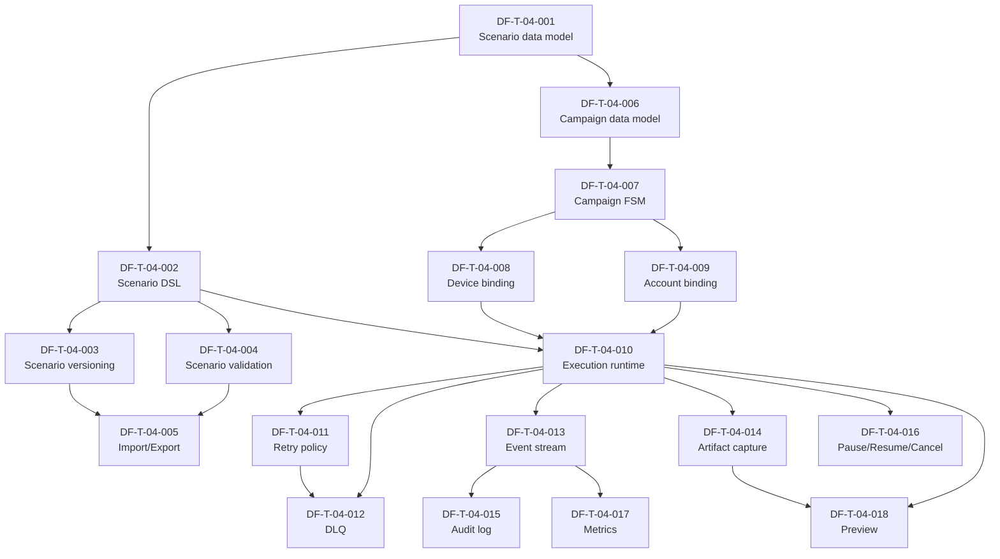
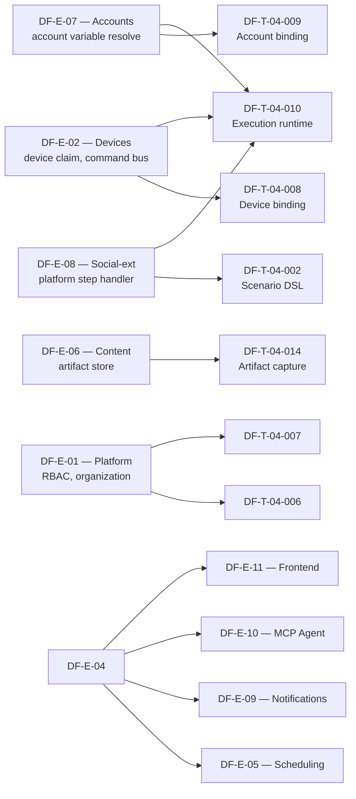

# DF-E-04 — Campaign, Scenario & Execution

## 1. Header

| Trường | Giá trị |
|---|---|
| **Epic ID** | DF-E-04 |
| **Tên Epic** | Campaign, Scenario & Execution |
| **Module gốc** | DF-MOD-04 — Campaign, Scenario & Execution |
| **Persona chính** | Automation Builder, Social Data Operator |
| **Persona phụ** | Fleet Operator, AI Operations Supervisor (forward-looking) |
| **Status** | Active |
| **Business priority** | High - core campaign, scenario và execution là nghiệp vụ chính của sản phẩm. |
| **Owner** | (placeholder — sẽ điền khi import vào tracker) |
| **Tổng Story Points** | 86 SP (18 ticket) |
| **Sprint target** | 4-5 sprint (2 tuần / sprint) |
| **Đặc tả module** | [docs/official_docs/modules/04-campaigns-scenarios-executions.md](../../official_docs/modules/04-campaigns-scenarios-executions.md) |

## 2. Overview

Epic này là **trái tim tự động hóa** của Device Farm. Mọi giá trị nghiệp vụ B2B mà sản phẩm cam kết — chạy hàng nghìn account trên fleet thiết bị thật, lặp lại workflow social ổn định, audit được bằng chứng đến từng step — đều xoay quanh ba khái niệm: **scenario** (kịch bản tự động), **campaign** (vỏ vận hành chứa scenario + device target), và **execution** (lần chạy thực tế của scenario trên một device). Epic này sở hữu vòng đời của cả ba, từ lúc Automation Builder dựng scenario lần đầu cho tới khi Social Data Operator đóng một entry DLQ sau ca trực.

Phạm vi epic bao gồm: data model + DSL scenario, versioning, validation, import/export; data model campaign + lifecycle FSM Draft→Scheduled→Running→Completed→Cancelled; binding campaign↔device và campaign↔account; execution runtime durable trên Temporal với retry policy, DLQ, replay; event stream, artifact attachment, audit log; điều khiển workflow (pause/resume/cancel) và preview execution. Mục tiêu: dev mới đọc xong một ticket trong epic này là đủ context để bắt tay implement, không cần đọc lại spec gốc.

Đây là epic **to nhất** của bộ backlog (18 ticket, 84 SP). Cần đặc biệt chú ý: (a) dependency lên DF-E-02 (devices), DF-E-06 (content), DF-E-07 (accounts), DF-E-08 (social-ext) — không tự ý implement những thứ thuộc epic khác; (b) bảo toàn nguyên tắc bất biến của đặc tả module — Device Farm chạy chính xác theo authored scenario flow, không tự suy diễn recovery và không tự chọn account; (c) tách bạch các execution surface (campaign run / session run / preview run) để error policy nhất quán giữa các đường (gap SPG-001).

## 3. Mapping FR ↔ Ticket

| FR | Mô tả ngắn | Ticket map | Ưu tiên FR |
|---|---|---|---|
| FR-04-01 | Tạo và bảo trì campaign | DF-T-04-006, DF-T-04-007 | Must |
| FR-04-02 | Scenario theo step có thứ tự | DF-T-04-001, DF-T-04-002 | Must |
| FR-04-03 | Scenario theo graph với nhánh điều kiện | DF-T-04-002 | Must |
| FR-04-04 | Nested composition qua `run_scenario` | DF-T-04-002, DF-T-04-004 | Must |
| FR-04-05 | UI-gated default behavior | DF-T-04-002, DF-T-04-010 | Must |
| FR-04-06 | Error policy tường minh | DF-T-04-002, DF-T-04-010 | Must |
| FR-04-07 | Retry policy cấp step | DF-T-04-011 | Must |
| FR-04-08 | 8 step family chuẩn | DF-T-04-002 | Must |
| FR-04-09 | Resolve biến đa tầng | DF-T-04-002, DF-T-04-010 | Must |
| FR-04-10 | Dispatch tới device hoặc device group | DF-T-04-008 | Must |
| FR-04-11 | Execution riêng theo từng device | DF-T-04-010, DF-T-04-008 | Must |
| FR-04-12 | Workflow durable backed by Temporal | DF-T-04-010 | Must |
| FR-04-13 | Fallback dispatcher khi Temporal off | DF-T-04-010 | Should |
| FR-04-14 | Pre/post step capture | DF-T-04-014 | Must |
| FR-04-15 | Checkpoint sau mỗi step thành công | DF-T-04-010, DF-T-04-012 | Must |
| FR-04-16 | DLQ cho execution fail | DF-T-04-012 | Must |
| FR-04-17 | Pause / Resume / Cancel | DF-T-04-016 | Must |
| FR-04-18 | Preview execution trên 1 device | DF-T-04-018 | Should |
| FR-04-19 | Báo cáo step fail chi tiết | DF-T-04-013, DF-T-04-015 | Must |
| FR-04-20 | Không tự suy diễn recovery | DF-T-04-010, DF-T-04-011 | Must |

## 4. Danh sách ticket

| ID | Title | Type | Priority | SP | Status |
|---|---|---|---|---|---|
| DF-T-04-001 | Scenario data model & persistence | feature | P0 | 5 | Backlog |
| DF-T-04-002 | Scenario DSL & step contract (8 step family) | feature | P0 | 8 | Backlog |
| DF-T-04-003 | Scenario versioning & immutability | feature | P2 | 5 | Backlog |
| DF-T-04-004 | Scenario validation pipeline | feature | P0 | 5 | Backlog |
| DF-T-04-005 | Scenario import/export & template library | feature | P2 | 3 | Backlog |
| DF-T-04-006 | Campaign data model | feature | P0 | 3 | Backlog |
| DF-T-04-007 | Campaign lifecycle FSM | feature | P0 | 5 | Backlog |
| DF-T-04-008 | Campaign-device binding & fan-out | feature | P0 | 5 | Backlog |
| DF-T-04-009 | Campaign-account binding | feature | P0 | 5 | Backlog |
| DF-T-04-010 | Execution runtime trên Temporal workflow | feature | P0 | 8 | Backlog |
| DF-T-04-011 | Execution retry policy & backoff | feature | P1 | 5 | Backlog |
| DF-T-04-012 | DLQ — open / replay / close | feature | P2 | 5 | Backlog |
| DF-T-04-013 | Execution event stream | feature | P1 | 5 | Backlog |
| DF-T-04-014 | Pre/post step capture & artifact attachment | feature | P1 | 5 | Backlog |
| DF-T-04-015 | Execution audit log | feature | P2 | 3 | Backlog |
| DF-T-04-016 | Pause / Resume / Cancel control | feature | P1 | 5 | Backlog |
| DF-T-04-017 | Execution metrics & observability | feature | P3 | 3 | Backlog |
| DF-T-04-018 | Preview execution surface | feature | P2 | 3 | Backlog |

Tổng: 18 ticket, 86 SP. Phân bổ priority nghiệp vụ: 8 ticket P0 (44 SP), 4 ticket P1 (20 SP), 5 ticket P2 (19 SP), 1 ticket P3 (3 SP).

## 5. Dependency Graph

### 5.1 Intra-epic (giữa ticket trong DF-E-04)

### 5.2 Cross-epic dependencies

- **Bị chặn bởi DF-E-01 (DF-MOD-01):** mọi ticket campaign cần RBAC + organization scoping.
- **Bị chặn bởi DF-E-02 (DF-MOD-02):** device data model + command bus tới agent — DF-T-04-008, DF-T-04-010 không thể chạy nếu DF-E-02 chưa cung cấp device claim/release và command transport.
- **Bị chặn bởi DF-E-06 (DF-MOD-06):** artifact store + content extraction — DF-T-04-014 lưu artifact vào store của DF-E-06, DF-T-04-002 cần step family Extraction từ DF-E-06.
- **Bị chặn bởi DF-E-07 (DF-MOD-07):** account variable resolve — DF-T-04-009 và DF-T-04-010 đọc account variables.
- **Bị chặn bởi DF-E-08 (DF-MOD-08):** platform-specific step handler — DF-T-04-002 và DF-T-04-010 dispatch step `fb_*` xuống handler của DF-E-08.
- **Blocks DF-E-05 (Scheduling):** Schedule chỉ trigger được khi campaign tồn tại — DF-E-05 phụ thuộc DF-T-04-006, DF-T-04-007, DF-T-04-010.
- **Blocks DF-E-09 (Notifications):** notification về execution fail / DLQ cần event stream DF-T-04-013.
- **Blocks DF-E-10 (MCP):** MCP tool `df_run_campaign` cần lifecycle FSM và execution runtime.
- **Blocks DF-E-11 (Frontend):** dashboard campaign + scenario editor + execution detail.

## 6. Epic-specific Điều kiện hoàn thành

Ngoài DoD chung của bộ backlog (xem `README.md` mục 9), DF-E-04 đóng được khi:

- [ ] Tất cả ticket P0 (12 ticket) đã ở trạng thái Done.
- [ ] Có ít nhất một end-to-end test chạy được scenario gồm ≥ 5 step thuộc ≥ 3 step family trên một device thật, hoàn thành với artifact đầy đủ.
- [ ] Test guard FR-04-20 ("không tự suy diễn recovery") đã pass — có test case riêng cho default stop-on-failure behavior, scenario thiếu account không tự dùng primary account của device.
- [ ] Đo đạt KPI lộ trình: tỷ lệ scenario chạy thành công trên fleet target ≥ 95% trong 1 sprint kiểm thử nội bộ.
- [ ] Workflow trên Temporal đã được test chịu được restart farm — tiến độ không mất, workflow resume trong < 60 giây sau khi Temporal sẵn sàng.
- [ ] DLQ replay đã pass test idempotency — retry không tạo execution mới, không double-dispatch.
- [ ] Tài liệu nghiệp vụ `docs/official_docs/modules/04-campaigns-scenarios-executions.md` không có FR nào không có ticket trace ngược.
- [ ] Đã có dashboard quan sát số execution per state (running / completed / failed / dlq_open / dlq_closed / cancelled).
- [ ] Audit log execution lưu được effective config đầy đủ cho mọi step (yêu cầu KPI 100%).
- [ ] Đã có runbook xử lý DLQ tồn đọng (operator playbook).

## 7. KPI Epic

| KPI | Mục tiêu | Đo bằng |
|---|---|---|
| Tỷ lệ scenario chạy thành công trên fleet target | ≥ 95% | Đếm execution `completed` / tổng execution không phải `cancelled` per campaign |
| Trung vị thời gian từ step fail tới DLQ entry | < 60 giây | Diff timestamp `step.fail` → `execution.dlq_open` |
| Tỷ lệ execution có pre/post capture artifact đầy đủ | ≥ 99% | Đếm execution có ≥ 1 artifact per step (loại trừ scenario tắt capture) |
| Số sự cố cross-device state leakage | 0 / quý | Audit log + bug tracker |
| Thời gian phục hồi workflow sau Temporal restart | < 60 giây | Đo trên staging chaos test |
| Tỷ lệ campaign có effective config đầy đủ trong log | 100% | Query audit log |
| Tỷ lệ scenario được tái sử dụng giữa nhiều campaign | ≥ 50% | Count distinct campaign_id per scenario_id |
| Tỷ lệ DLQ entry được xử lý trong 24h | ≥ 90% | Diff `dlq_open` → `dlq_closed` / `retry_success` |
