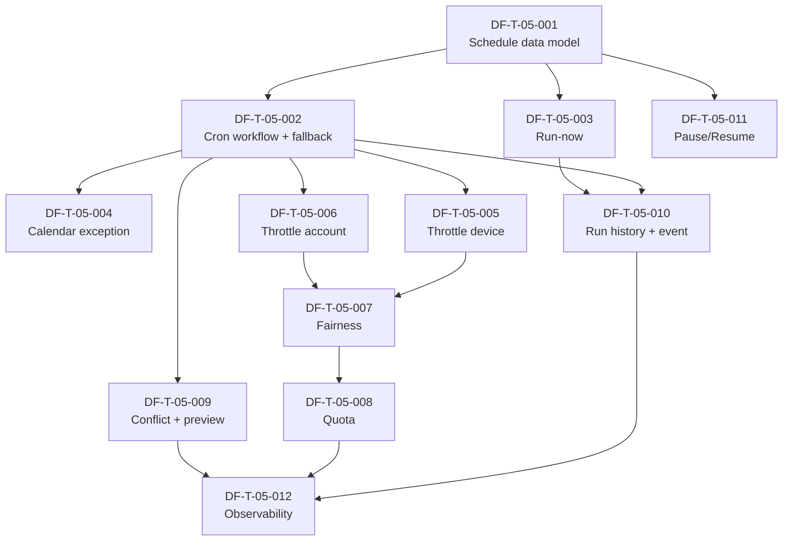
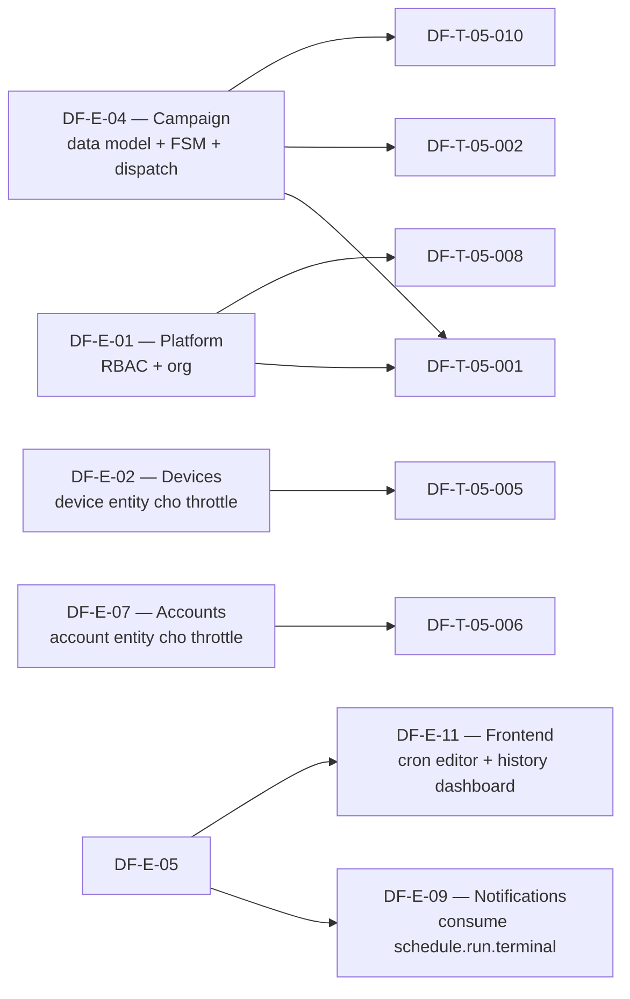

# DF-E-05 — Scheduling

## 1. Header

| Trường | Giá trị |
|---|---|
| **Epic ID** | DF-E-05 |
| **Tên Epic** | Scheduling (Lập lịch) |
| **Module gốc** | DF-MOD-05 — Lập lịch |
| **Persona chính** | Operator (Social Data Operator, Fleet Operator), Automation Builder |
| **Persona phụ** | Supervisor |
| **Status** | Active |
| **Business priority** | Medium - scheduling hữu ích sau manual run; quota, fairness và observability để phase sau. |
| **Owner** | (placeholder) |
| **Tổng Story Points** | 49 SP (12 ticket) |
| **Sprint target** | 3 sprint |
| **Đặc tả module** | [docs/official_docs/modules/05-scheduling.md](../../official_docs/modules/05-scheduling.md) |

## 2. Overview

Epic Scheduling cung cấp cơ chế **trigger campaign theo lịch** thay vì người vận hành ngồi canh giờ bấm "Run". Mỗi schedule gắn với một campaign + cron expression + trạng thái toggle bật/tắt + lịch sử run. Khi tới giờ tick, scheduler tạo schedule_run mới rồi gọi sang DF-E-04 (Campaign dispatch) để chạy.

Phạm vi epic bao gồm: data model schedule, validate cron (frontend + backend), toggle, run-now, lịch sử run với link execution, schedule workflow durable trên Temporal, fallback mode khi Temporal off, throttle per device/account, fairness scheduler (chống starvation), quota theo persona/tenant, conflict detection, schedule preview API, audit log, pause/resume schedule, observability dashboard.

Đây là epic kích thước trung bình (12 ticket, 49 SP) **phụ thuộc trực tiếp DF-E-04** — schedule không thực thi gì, chỉ trigger dispatch campaign. DF-E-05 cần DF-E-04 có DF-T-04-006 (campaign data model), DF-T-04-007 (campaign FSM với state Scheduled), và DF-T-04-010 (execution runtime) trước khi go-live. Lộ trình nhấn mạnh hai giới hạn quan trọng: (a) Concurrency lock chống schedule trùng giờ (đang ở lộ trình), (b) Failure semantics chi tiết của fallback mode (đang phát triển). DF-E-05 phải thiết lập nền cho cả hai và đánh dấu rõ phần lộ trình.

## 3. Mapping FR ↔ Ticket

| FR | Mô tả ngắn | Ticket map | Ưu tiên FR |
|---|---|---|---|
| FR-05-01 | Tạo schedule cho campaign | DF-T-05-001, DF-T-05-002 | Must |
| FR-05-02 | Validate cron 2 phía | DF-T-05-002 | Must |
| FR-05-03 | Cập nhật schedule | DF-T-05-001 | Must |
| FR-05-04 | Xóa schedule | DF-T-05-001 | Should |
| FR-05-05 | Toggle bật/tắt | DF-T-05-001, DF-T-05-011 | Must |
| FR-05-06 | Run-now | DF-T-05-003 | Must |
| FR-05-07 | Lịch sử schedule run | DF-T-05-010, DF-T-05-012 | Must |
| FR-05-08 | Schedule workflow durable Temporal | DF-T-05-002 | Must |
| FR-05-09 | Fallback mode | DF-T-05-002 | Should |
| FR-05-10 | Filter lịch sử theo trạng thái | DF-T-05-012 | Should |
| FR-05-11 | Link schedule run ↔ execution | DF-T-05-010 | Must |
| FR-05-12 | Domain event khi schedule run terminal | DF-T-05-010 | Should |

Ngoài FR core, epic này thêm các tính năng nâng cao theo lộ trình đặc tả module mục 7 và yêu cầu nội bộ:

| Capability | Ticket |
|---|---|
| Calendar (one-shot, recurring exception) | DF-T-05-003 (one-shot run-now), DF-T-05-004 (calendar exception) |
| Throttle per device | DF-T-05-005 |
| Throttle per account | DF-T-05-006 |
| Fairness scheduler — chống starvation | DF-T-05-007 |
| Quota per persona/tenant | DF-T-05-008 |
| Schedule conflict detection | DF-T-05-009 |
| Schedule preview API | DF-T-05-009 |
| Audit log + observability | DF-T-05-010, DF-T-05-012 |

## 4. Danh sách ticket

| ID | Title | Type | Priority | SP | Status |
|---|---|---|---|---|---|
| DF-T-05-001 | Schedule data model & CRUD + toggle | feature | P0 | 5 | Backlog |
| DF-T-05-002 | Cron schedule workflow durable + fallback | feature | P0 | 5 | Backlog |
| DF-T-05-003 | Run-now & one-shot trigger | feature | P0 | 3 | Backlog |
| DF-T-05-004 | Calendar exception (recurring + skip date) | feature | P2 | 3 | Backlog |
| DF-T-05-005 | Throttle per device | feature | P1 | 5 | Backlog |
| DF-T-05-006 | Throttle per account | feature | P1 | 5 | Backlog |
| DF-T-05-007 | Fairness scheduler — chống starvation | feature | P3 | 5 | Backlog |
| DF-T-05-008 | Quota per persona / tenant | feature | P3 | 5 | Backlog |
| DF-T-05-009 | Schedule conflict detection & preview API | feature | P2 | 3 | Backlog |
| DF-T-05-010 | Schedule run history + link execution + domain event | feature | P0 | 5 | Backlog |
| DF-T-05-011 | Schedule pause/resume (bulk) | feature | P2 | 2 | Backlog |
| DF-T-05-012 | Schedule observability dashboard | feature | P3 | 3 | Backlog |

Tổng: 12 ticket, 49 SP. Phân bổ priority nghiệp vụ: 4 ticket P0 (18 SP), 2 ticket P1 (10 SP), 3 ticket P2 (8 SP), 3 ticket P3 (13 SP).

## 5. Dependency Graph

### 5.1 Intra-epic

### 5.2 Cross-epic dependencies

- **Bị chặn bởi DF-E-04 (DF-MOD-04):** schedule chỉ trigger campaign dispatch — phụ thuộc DF-E-04 ở các điểm DF-T-04-006 (campaign data model), DF-T-04-007 (FSM cần state `scheduled`), DF-T-04-010 (execution runtime), DF-T-04-013 (event stream).
- **Bị chặn bởi DF-E-02:** throttle per device cần device entity.
- **Bị chặn bởi DF-E-07:** throttle per account cần account entity.
- **Bị chặn bởi DF-E-01:** RBAC, organization, persona model cho quota.
- **Blocks DF-E-09:** notification về schedule run terminal — DF-E-09 subscribe event DF-T-05-010.
- **Blocks DF-E-11:** UI cron editor + schedule list + history dashboard.

## 6. Epic-specific Điều kiện hoàn thành

Ngoài DoD chung của bộ backlog, DF-E-05 đóng được khi:

- [ ] Tất cả ticket P0 (4 ticket: 001, 002, 003, 010) đã Done.
- [ ] End-to-end test: tạo schedule cron `*/5 * * * *` (mỗi 5 phút) chạy 1 giờ liên tục, không miss tick nào — KPI ≥ 99.5%.
- [ ] Fallback test: chạy schedule trong khi Temporal down 10 phút, tick vẫn được trigger qua fallback, banner hiển thị.
- [ ] Throttle test: 100 schedule cùng giờ trên 10 device — không vượt throttle, fairness không starve.
- [ ] Quota test: persona Operator vượt quota → schedule bị reject với mã lỗi rõ.
- [ ] Audit log: mọi create/update/toggle/delete schedule + mọi tick trigger được log immutable.
- [ ] Tài liệu nghiệp vụ `docs/official_docs/modules/05-scheduling.md` không có FR nào không có ticket trace.
- [ ] Dashboard Grafana có panel cho mọi KPI đặc tả module mục 9.
- [ ] Runbook cho operator: "Khi Temporal off — kiểm tra fallback và escalate".

## 7. KPI Epic

| KPI | Mục tiêu | Đo bằng |
|---|---|---|
| Độ lệch giờ tick cron vs schedule_run created | < 30s (Temporal) / < 90s (fallback) | Diff timestamp tick_at vs created_at |
| Tỷ lệ schedule trigger được khi đến giờ | ≥ 99.5% | (Successful tick) / (Expected tick) |
| Tỷ lệ schedule run hoàn thành thành công | ≥ 95% | (run.status="success") / (total terminal run) |
| Trung vị thời gian từ run-now tới schedule_run | < 5s | Diff request_at vs created_at |
| Tỷ lệ schedule_run trong fallback mode | < 5%/tháng | Count fallback / total |
| Số sự cố schedule trùng giờ tranh chấp device | < 1/quý/org | Bug tracker + audit |
| Tỷ lệ schedule có history truy vấn dưới 1s | ≥ 99% | p99 latency GET /schedules/{id}/runs |
| Quota / fairness violation alert | < 1/tuần | Alert metric |
