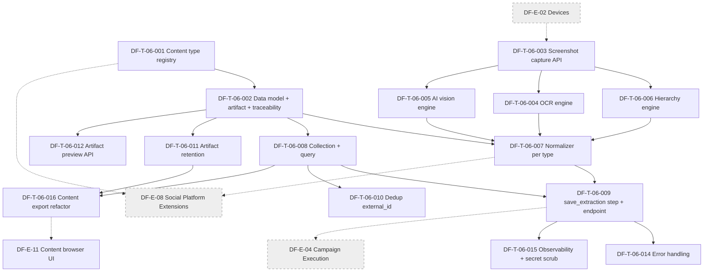

# DF-E-06 — Content Extraction & Artifact

> **Epic ID:** DF-E-06
> **Module gốc:** DF-MOD-06 — Content Extraction & Artifact
> **Phiên bản:** 1.0
> **Cập nhật lần cuối:** 2026-05-26
> **Trạng thái:** Active
> **Owner module:** Team Device Farm — Content & Extraction
> **Persona chính:** Social Data Operator, Automation Builder
> **Persona phụ:** Fleet Operator, AI Operations Supervisor (Preview)
> **Tài liệu nguồn:** [`docs/official_docs/modules/06-content-extraction-artifacts.md`](../../official_docs/modules/06-content-extraction-artifacts.md)

## 1. Header

| Trường | Giá trị |
|---|---|
| **Epic ID** | DF-E-06 |
| **Module** | DF-MOD-06 — Content Extraction & Artifact |
| **Status** | Active |
| **Business priority** | High - content extraction, collection, artifact và export là output nghiệp vụ chính sau execution. |
| **Ước lượng tickets** | 15 |
| **Tổng story points (ước lượng)** | 64 SP |
| **Cửa sổ lộ trình** | Quý hiện tại + 1 quý tiếp theo (song hành DF-E-04 Campaign và DF-E-08 Social Platform Extensions) |
| **Phụ thuộc giữa Epic** | Phụ thuộc DF-E-02 (Devices & Control Plane) cho screenshot/hierarchy capture; cung cấp content type & artifact contract cho DF-E-08 (Social Platform Extensions) và DF-E-04 (Campaign Execution) |
| **KPI chính (xem mục 6)** | 100% content item có content type platform-qualified; ≥ 99% truy vết đầy đủ; ≥ 99% artifact đính kèm execution; latency p50 hierarchy < 3 s, AI vision < 8 s |

## 2. Mục tiêu Epic

Epic này hiện thực hóa toàn bộ module DF-MOD-06: biến quan sát màn hình thiết bị Android thật thành dữ liệu nghiệp vụ có cấu trúc, đồng thời lưu artifact (screenshot, hierarchy snapshot) phục vụ debug. Epic cung cấp ba engine extraction (hierarchy / OCR / AI vision) đi qua cùng một normalizer, lưu content item với content type platform-qualified (`fb_post`, `fb_comment`, `tiktok_video`, `tiktok_comment`, `threads_post`, `threads_comment`, `ig_media`, `ig_comment`, `ig_profile`), gom content thành collection theo dự án, và đẩy artifact lên object storage MinIO/S3 truy cập qua API. Sản phẩm cuối cùng là một pipeline trích xuất chuẩn hóa, traceable, đo lường được, phục vụ trực tiếp use case crawl social ở quy mô của Social Data Operator và workflow `save_extraction` của Automation Builder.

## 3. Mapping FR ↔ Ticket

| FR ID | Tên FR | Ưu tiên FR | Ticket xử lý chính | Ticket liên quan |
|---|---|---|---|---|
| FR-06-01 | Hierarchy extraction engine | Must | DF-T-06-006 | DF-T-06-004, DF-T-06-014 |
| FR-06-02 | OCR engine | Must | DF-T-06-004 | DF-T-06-006, DF-T-06-014 |
| FR-06-03 | AI vision engine | Should | DF-T-06-005 | DF-T-06-014 |
| FR-06-04 | Normalizer thống nhất | Must | DF-T-06-007 | DF-T-06-001, DF-T-06-006 |
| FR-06-05 | Content type platform-qualified | Must | DF-T-06-001 | DF-T-06-007, DF-T-06-008 |
| FR-06-06 | raw_data field | Must | DF-T-06-002 | DF-T-06-007 |
| FR-06-07 | Parent-child qua parent_id và item_level | Must | DF-T-06-002 | DF-T-06-007, DF-T-06-008 |
| FR-06-08 | save_extraction step | Must | DF-T-06-009 | DF-T-06-002, DF-T-06-007 |
| FR-06-09 | Endpoint extract trực tiếp | Should | DF-T-06-003 | DF-T-06-006, DF-T-06-004, DF-T-06-005 |
| FR-06-10 | Content collection | Must | DF-T-06-008 | DF-T-06-011 |
| FR-06-11 | Truy vấn và lọc content | Must | DF-T-06-008 | DF-T-06-010, DF-T-06-012 |
| FR-06-12 | Artifact lưu trên MinIO/S3 | Must | DF-T-06-002 (data model), DF-T-06-011 (retention), DF-T-06-012 (preview API) | DF-T-06-009 |
| FR-06-13 | Truy vết content tới ngữ cảnh nguồn | Must | DF-T-06-002 | DF-T-06-007, DF-T-06-009 |
| FR-06-14 | Không persist provider secret | Must | DF-T-06-005, DF-T-06-014 | DF-T-06-015 |
| FR-06-15 | Báo cáo chi phí AI vision | Should | *(Deferred — ngoài phạm vi Epic)* | DF-T-06-015 (metrics cơ bản) |
| Lộ trình | Export content refactor sau migration export cũ | P1 ngắn hạn | DF-T-06-016 | DF-T-11-009 |

## 4. Danh sách Ticket

| Ticket ID | Title | Priority | SP | Type | Trace FR |
|---|---|---|---|---|---|
| DF-T-06-001 | Content type registry & platform-qualified validation | P2 | 3 | feature | FR-06-05 |
| DF-T-06-002 | Content item & artifact data model (parent_id, item_level, traceability, raw_data) | P0 | 5 | feature | FR-06-05, FR-06-06, FR-06-07, FR-06-12, FR-06-13 |
| DF-T-06-003 | Screenshot & hierarchy capture API cho extraction pipeline | P0 | 3 | feature | FR-06-09 (input), FR-06-12 |
| DF-T-06-004 | OCR extraction pipeline (tiếng Việt + tiếng Anh) | P0 | 5 | feature | FR-06-02 |
| DF-T-06-005 | AI vision extraction pipeline (OpenAI + Gemini) | P3 | 8 | feature | FR-06-03, FR-06-14 |
| DF-T-06-006 | Hierarchy extraction engine + strategy interface | P0 | 5 | feature | FR-06-01 |
| DF-T-06-007 | Content normalization per type (fb/tiktok/threads/ig) | P0 | 5 | feature | FR-06-04, FR-06-05, FR-06-06 |
| DF-T-06-008 | Content collection CRUD + query/filter API | P0 | 5 | feature | FR-06-10, FR-06-11 |
| DF-T-06-009 | `save_extraction` scenario step + endpoint extract trực tiếp | P0 | 5 | feature | FR-06-08, FR-06-09 |
| DF-T-06-010 | Content deduplication theo external_id (collection-scoped) | P2 | 3 | feature | FR-06-11 (Lộ trình dedup) |
| DF-T-06-011 | Artifact retention policy & lifecycle (MinIO/S3) | P3 | 3 | feature | FR-06-12 |
| DF-T-06-012 | Artifact preview API (signed URL theo execution/step) | P0 | 3 | feature | FR-06-12 |
| DF-T-06-014 | Extraction error handling & retry policy | P1 | 3 | feature | FR-06-01, FR-06-02, FR-06-03 |
| DF-T-06-015 | Extraction observability (metric, log, audit, secret scrub) | P3 | 3 | feature | FR-06-14, FR-06-15 |
| DF-T-06-016 | Content export refactor sau migration drop export cũ | P1 | 5 | feature | FR-06-10, FR-06-11, FR-06-12, Lộ trình |

**Tổng:** 15 ticket, 64 SP. Phân bổ priority nghiệp vụ: 8 ticket P0 (36 SP), 2 ticket P1 (8 SP), 2 ticket P2 (6 SP), 3 ticket P3 (14 SP).

> **Ghi chú:** DF-T-06-013 (AI vision cost tracking & budget guardrail) đã **Cancelled** — FR-06-15 deferred; chi phí AI vision theo dõi thủ công qua provider dashboard cho đến khi có epic riêng.

## 5. Dependency Graph

**Đọc graph này như thế nào.** T001 (registry) và T002 (data model) là chân đế bắt buộc trước mọi ticket khác. T003 cung cấp nguồn ảnh và hierarchy cho cả ba engine T004/T005/T006. T007 (normalizer) hợp nhất output của ba engine về schema chuẩn — là phụ thuộc cứng của T009 (`save_extraction`). T008 (collection + query) cũng là phụ thuộc của T009 vì step lưu content phải gắn vào collection. Các ticket "quality / ops" T011/T012/T015 không chặn pipeline core nhưng phải xong trước khi Epic được coi là Done. DF-E-02 cung cấp transport screenshot cho T003; DF-E-08 sẽ tiêu thụ content type registry (T001) và normalizer (T007); DF-E-04 phụ thuộc `save_extraction` (T009) để scenario crawl chạy được.

## 6. KPI Epic-specific (đo trong vận hành thật)

| KPI | Mục tiêu | Nguồn đo | Trace FR |
|---|---|---|---|
| % content item có content type platform-qualified (không generic) | 100% trên content item mới tạo | Query DB theo content_type prefix; legacy được migrate dần | FR-06-05 |
| % content item truy vết được đầy đủ về campaign/scenario/execution/device | ≥ 99% | Audit query content_items thiếu trace ref | FR-06-13 |
| % artifact pre/post capture đính kèm execution | ≥ 99% | Compare count execution × step × 2 vs count artifact | FR-06-12 |
| Latency p50 hierarchy extraction | < 3 s | Metric `extraction_latency_ms{engine=hierarchy}` | FR-06-01 |
| Latency p50 OCR extraction | < 5 s | Metric `extraction_latency_ms{engine=ocr}` | FR-06-02 |
| Latency p50 AI vision extraction | < 8 s | Metric `extraction_latency_ms{engine=ai}` | FR-06-03 |
| % scenario fail do AI vision provider outage | < 1% / tháng | Aggregator theo mã lỗi provider; fallback policy | FR-06-03 |
| Số sự cố leak provider secret vào content / artifact | 0 / quý | Audit định kỳ + scan secret pattern trong DB và object storage | FR-06-14 |
| % content trùng trong cùng collection | < 2% | Random sampling theo external_id | FR-06-11 (Lộ trình dedup) |
| Dung lượng artifact trung bình mỗi execution | Trong ngưỡng SLO đã thỏa thuận | Metric `artifact_bytes_per_execution_total` | FR-06-12 |

## 7. Điều kiện hoàn thành riêng cho Epic

Epic chỉ được coi là Done khi đáp ứng đủ DoD chung (xem [README §9](../README.md#9-definition-of-done-dod--mặc-định)) cộng các điều kiện riêng:

- [ ] Tất cả 15 ticket trong Epic ở trạng thái Done hoặc Cancelled với lý do ghi nhận (DF-T-06-013 Cancelled — budget guardrail deferred).
- [ ] Content type registry có sẵn 9 content type chuẩn (`fb_post`, `fb_comment`, `tiktok_video`, `tiktok_comment`, `threads_post`, `threads_comment`, `ig_media`, `ig_comment`, `ig_profile`) và validation từ chối tên generic (`post`, `comment`, `thread`, `video`).
- [ ] Cùng một bài Facebook đi qua hierarchy engine và AI vision engine cho ra content item có cùng tập cột chuẩn, chỉ khác `raw_data`.
- [ ] `save_extraction` step idempotent với dedup key khai báo: chạy lại 3 lần trên cùng input không tạo bản ghi trùng.
- [ ] Artifact preview API trả signed URL có TTL ≤ 24h; URL hết hạn trả 403.
- [ ] Đã chạy thử pipeline trên 50 device thực, 24 giờ liên tục, đạt KPI artifact đính kèm ≥ 99%.
- [ ] Đã audit không có chuỗi giống pattern provider API key (OpenAI `sk-*`, Gemini `AIzaSy*`) trong bảng content_items và raw_data.
- [ ] Tài liệu nghiệp vụ `docs/official_docs/modules/06-content-extraction-artifacts.md` cập nhật trạng thái Active các capability đã ship.
- [ ] Tài liệu vận hành "Artifact retention runbook" đã viết.
- [ ] Export content server-side đã thay thế scope export cũ sau migration `031_drop_content_exports`; DF-T-11-009 chỉ consume API.

## 8. Risks & Open questions của Epic

**Rủi ro chính.**

- **Chi phí AI vision không kiểm soát được:** một campaign 1000 device × 20 step × AI vision có thể đốt budget rất nhanh — mitigation: khuyến nghị fallback sang hierarchy/OCR; theo dõi chi phí qua provider dashboard (DF-T-06-013 đã Cancelled, FR-06-15 deferred).
- **Dung lượng artifact phình to:** pre/post capture cho mỗi step trên fleet lớn — mitigation tại DF-T-06-011 (retention policy) và default sample rate có thể tinh chỉnh per scenario.
- **Provider rate limit / outage:** OpenAI và Gemini có rate limit — mitigation tại DF-T-06-014 (retry policy) và DF-T-06-015 (alert).
- **Server-side dedup chưa có ở phiên bản 1:** mitigation tại DF-T-06-010 (collection-scoped dedup theo external_id) đưa ra ở mức MVP.
- **Hierarchy không expose dữ liệu khi platform render Canvas / image:** không phải bug Device Farm; tài liệu hướng dẫn cần khuyến nghị chuyển sang OCR hoặc AI vision khi strategy hierarchy rỗng.

**Open question gửi về team Product (giữ nguyên theo đặc tả module):** lộ trình server-side dedup; export định dạng cuối (CSV vs JSON Lines streaming); có hỗ trợ Anthropic làm provider thứ ba không; chính sách scrub PII trong raw_data; chính sách lưu trữ artifact khi quá hạn (archive vs delete); có hỗ trợ schema-guided extraction cho AI vision không.

## 9. Truy vết & tài liệu tham chiếu

- **Đặc tả module:** [docs/official_docs/modules/06-content-extraction-artifacts.md](../../official_docs/modules/06-content-extraction-artifacts.md)
- **Ma trận năng lực:** [03-capability-matrix.md](../../official_docs/03-capability-matrix.md) — mục 4.2, 4.3 (OCR, AI vision, content type platform-qualified)
- **Nhóm người dùng:** [02-personas-and-journeys.md](../../official_docs/02-personas-and-journeys.md) — Social Data Operator (§3.1), Automation Builder (§3.2)
- **Platform profiles:** [facebook.md](../../official_docs/platforms/facebook.md), [tiktok.md](../../official_docs/platforms/tiktok.md), [threads.md](../../official_docs/platforms/threads.md), [instagram.md](../../official_docs/platforms/instagram.md)
- **Thuật ngữ:** [00-glossary.md](../../official_docs/00-glossary.md) — Content item, Content type, raw_data, parent_id/item_level, Artifact, MinIO/S3
- **Module liên kết:** DF-E-02, DF-E-04, DF-E-08
