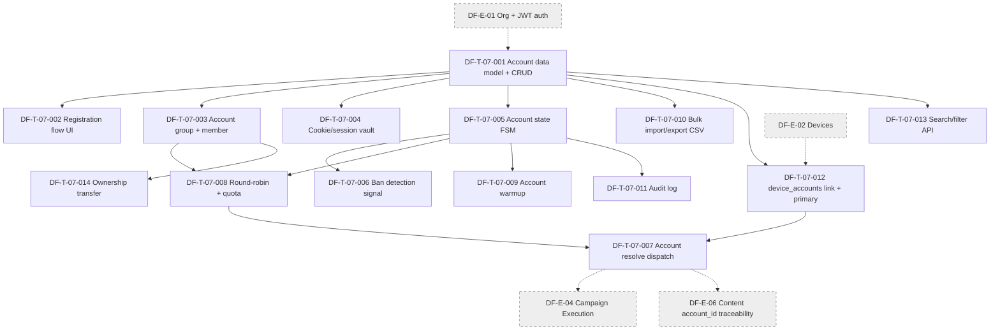

# DF-E-07 — Account & Account Group

> **Epic ID:** DF-E-07
> **Module gốc:** DF-MOD-07 — Account & Account Group
> **Phiên bản:** 1.0
> **Cập nhật lần cuối:** 2026-05-26
> **Trạng thái:** Active
> **Owner module:** Team Device Farm — Accounts
> **Persona chính:** Social Data Operator, Automation Builder
> **Persona phụ:** Fleet Operator, AI Operations Supervisor (Preview)
> **Tài liệu nguồn:** [`docs/official_docs/modules/07-accounts-and-groups.md`](../../official_docs/modules/07-accounts-and-groups.md)

## 1. Header

| Trường | Giá trị |
|---|---|
| **Epic ID** | DF-E-07 |
| **Module** | DF-MOD-07 — Account & Account Group |
| **Status** | Active |
| **Business priority** | High - account inventory, group, device link và account resolution là nghiệp vụ bắt buộc cho campaign social. |
| **Ước lượng tickets** | 14 |
| **Tổng story points (ước lượng)** | 59 SP |
| **Cửa sổ lộ trình** | Quý hiện tại + 1 quý tiếp theo (song hành DF-E-04 Campaign Execution) |
| **Phụ thuộc giữa Epic** | Cung cấp account context cho DF-E-04 (Campaign / Scenario / Execution) và DF-E-06 (truy vết content theo account); phụ thuộc DF-E-02 (device_accounts link cần device); phụ thuộc DF-E-01 (organization scope + JWT auth) |
| **KPI chính (xem mục 6)** | ≥ 99% scenario có account intent resolved đúng; lệch chuẩn usage_counter < 20% trong group; 0 sự cố cross-tenant/quý; trung vị round-robin < 200 ms |

## 2. Mục tiêu Epic

Epic này hiện thực hóa module DF-MOD-07: vòng đời account social platform mà Device Farm sử dụng để vận hành scenario. Phạm vi bao gồm CRUD account, bulk import, account-group binding, device_accounts link với cờ primary, endpoint round-robin, resolve account variable trong dispatch flow, per-device override, truy vết account trên content & execution, và các quy ước nghiệp vụ "canonical-owned-by-scenario" (scenario phải khai báo tường minh — không có fallback ngầm). Module có một số phần Lộ trình (vault-backed credential, mã hóa cookie/session, audit log phong phú) — Epic này dựng MVP cho phép hệ thống vận hành thật với guardrail tối thiểu cho cookie/session lưu trữ.

Sản phẩm cuối: một fleet quản lý hàng nghìn account, có thể gom group theo dự án, scenario resolve account đúng intent ở runtime, và truy vết được "account nào đã làm gì" cho báo cáo cho Social Data Operator.

## 3. Mapping FR ↔ Ticket

| FR ID | Tên FR | Ưu tiên FR | Ticket xử lý chính | Ticket liên quan |
|---|---|---|---|---|
| FR-07-01 | CRUD account | Must | DF-T-07-001 | DF-T-07-002, DF-T-07-013 |
| FR-07-02 | Bulk import account | Must | DF-T-07-010 | DF-T-07-001 |
| FR-07-03 | Cập nhật status account | Must | DF-T-07-005 | DF-T-07-006, DF-T-07-011 |
| FR-07-04 | device_accounts link | Must | DF-T-07-012 | DF-T-07-001 |
| FR-07-05 | account_groups CRUD | Must | DF-T-07-003 | DF-T-07-001, DF-T-07-008 |
| FR-07-06 | Endpoint round-robin | Must | DF-T-07-008 | DF-T-07-003, DF-T-07-005 |
| FR-07-07 | Account variable trong scenario config | Must | DF-T-07-007 | DF-T-07-008 |
| FR-07-08 | Per-device context override account | Must | DF-T-07-007 | DF-T-07-012 |
| FR-07-09 | proxy_id gắn với account | Should | DF-T-07-001 (column) | DF-T-07-007 (resolve) |
| FR-07-10 | usage_counter | Should | DF-T-07-008 | DF-T-07-001, DF-T-07-011 |
| FR-07-11 | Truy vết account trên content và execution | Must | DF-T-07-007 (resolution context inject) | DF-E-06 DF-T-06-002 (content.account_id) |
| FR-07-12 | Không tự suy diễn account | Must | DF-T-07-007 | DF-T-07-008 |
| FR-07-13 | Phân biệt account group và device group | Must | DF-T-07-003 | DF-T-07-001 |
| FR-07-14 | Quyền sở hữu account theo organization | Must | DF-T-07-001 | DF-T-07-013, DF-T-07-014 |
| FR-07-15 | Audit thay đổi account quan trọng | Should | DF-T-07-011 | DF-T-07-005 |
| (Lộ trình) | Ban detection signal & state FSM | — | DF-T-07-006 | DF-T-07-005 |
| (Lộ trình) | Cookie/session secure storage | — | DF-T-07-004 | DF-T-07-001 |
| (Lộ trình) | Account warmup workflow | — | DF-T-07-009 | DF-T-07-005, DF-T-07-008 |
| (Lộ trình) | Account search/filter API | — | DF-T-07-013 | DF-T-07-001 |
| (Lộ trình) | Account ownership transfer | — | DF-T-07-014 | DF-T-07-001, DF-T-07-003 |

## 4. Danh sách Ticket

| Ticket ID | Title | Priority | SP | Type | Trace FR |
|---|---|---|---|---|---|
| DF-T-07-001 | Account inventory data model + CRUD | P0 | 5 | feature | FR-07-01, FR-07-09, FR-07-14 |
| DF-T-07-002 | Account registration flow (UI + API) | P0 | 3 | feature | FR-07-01 |
| DF-T-07-003 | Account group CRUD + member binding | P0 | 5 | feature | FR-07-05, FR-07-13 |
| DF-T-07-004 | Cookie / session secure storage (vault-ready) | P2 | 8 | feature | Lộ trình (vault), FR-07-01 metadata |
| DF-T-07-005 | Account state FSM (active / suspended / cooldown / retired / banned) | P0 | 5 | feature | FR-07-03 |
| DF-T-07-006 | Account ban / checkpoint detection signal | P2 | 5 | feature | Lộ trình, FR-07-03 |
| DF-T-07-007 | Account variable resolution trong dispatch (scenario + per-device override) | P0 | 5 | feature | FR-07-07, FR-07-08, FR-07-11, FR-07-12 |
| DF-T-07-008 | Account round-robin rotation + endpoint + quota | P0 | 5 | feature | FR-07-06, FR-07-10 |
| DF-T-07-009 | Account warmup workflow | P3 | 3 | feature | Lộ trình |
| DF-T-07-010 | Account bulk import / export CSV | P1 | 3 | feature | FR-07-02 |
| DF-T-07-011 | Account audit log | P2 | 3 | feature | FR-07-15 |
| DF-T-07-012 | device_accounts link + primary flag | P0 | 3 | feature | FR-07-04 |
| DF-T-07-013 | Account search / filter API | P2 | 3 | feature | Lộ trình, FR-07-01 list |
| DF-T-07-014 | Account ownership transfer (giữa user / group / tenant) | P3 | 3 | feature | Lộ trình |

**Tổng:** 14 ticket, 59 SP. Phân bổ priority nghiệp vụ: 7 ticket P0 (31 SP), 1 ticket P1 (3 SP), 4 ticket P2 (19 SP), 2 ticket P3 (6 SP).

## 5. Dependency Graph

**Đọc graph này như thế nào.** T001 là chân đế tuyệt đối — mọi ticket khác cần data model account. T003 (account_groups) và T005 (state FSM) phân nhánh, lần lượt phục vụ T008 (round-robin) và T006/T009 (ban detection, warmup). T007 (resolution) là điểm hội tụ — phải có round-robin + device link + state FSM trước. DF-E-01 cung cấp organization scope và JWT. DF-E-02 cung cấp device id cho T012. DF-E-04 sẽ tiêu thụ output resolve (T007) để inject account vào effective runtime config; DF-E-06 lưu account_id từ resolution context vào content_item.

## 6. KPI Epic-specific (đo trong vận hành thật)

| KPI | Mục tiêu | Nguồn đo | Trace FR |
|---|---|---|---|
| % scenario chạy thành công có account variable resolve đúng intent | ≥ 99% | Audit dispatch log; loại trừ scenario không khai báo account | FR-07-07, FR-07-08 |
| Lệch chuẩn usage_counter giữa account trong group | < 20% so với trung bình | Query group stats theo organization | FR-07-10 |
| % scenario fail do thiếu account intent | < 2% | Aggregator error_code MISSING_ACCOUNT_INTENT | FR-07-12 |
| Số sự cố cross-tenant truy cập account | 0 / quý | Audit log entry "cross_tenant_attempt" | FR-07-14 |
| % content_item có account_id liên kết khi scenario có account intent | ≥ 99% | Join content_items × executions × scenario_config | FR-07-11 |
| Thời gian từ phát hiện account "đau" đến cập nhật status | < 4 giờ | Audit log delta `status_change` | FR-07-03 |
| % account có status được duy trì cập nhật trong 30 ngày qua | ≥ 90% | Query last_status_check_at | FR-07-03 |
| Số scenario phụ thuộc legacy fallback (device primary) | 0 cho template mới | Audit dispatch log; flag `legacy_fallback_used` | FR-07-12 (SPG-007) |
| Trung vị thời gian round-robin trả về account | < 200 ms | Metric `account_round_robin_latency_ms` | FR-07-06 |
| % account import thành công ở bulk import | ≥ 95% | Counter `bulk_import_success_total` / `bulk_import_total` | FR-07-02 |

## 7. Điều kiện hoàn thành riêng cho Epic

- [ ] 14 ticket Done hoặc Cancelled với lý do.
- [ ] Account inventory data model production-ready, có 1000+ account test trên staging.
- [ ] Round-robin endpoint trả < 200 ms p95 với 1000 account trong group.
- [ ] Scenario thiếu account intent KHÔNG fallback ngầm — chỉ có flag legacy quá hạn 1 release.
- [ ] Audit log ghi nhận 5 action: create, status_change, group_membership_change, ownership_transfer, deletion.
- [ ] Cookie/session storage tách metadata thường khỏi credential field; credential lưu vault-ready abstraction (có thể plug HashiCorp Vault sau).
- [ ] State FSM transition đầy đủ + tài liệu transition rule.
- [ ] Bulk import CSV qua test với 10k account thành công ≥ 95%.
- [ ] UI phân biệt rõ "Account group" và "Device group" — không gộp tên, không gộp UI section.
- [ ] Đã chạy thử resolve dispatch trên scenario thực 100 execution liên tiếp, KPI achieve.
- [ ] Tài liệu `docs/official_docs/modules/07-accounts-and-groups.md` cập nhật trạng thái Active các capability đã ship; cập nhật bảng SPG-007 / SPG-008 status.

## 8. Risks & Open questions của Epic

**Rủi ro chính.**

- **Legacy fallback SPG-007 vẫn tồn tại:** giảm thiểu: feature flag tắt mặc định; audit script theo dõi scenario nào còn dùng; release plan loại bỏ flag sau 1 quý.
- **Credential plaintext trong metadata legacy:** giảm thiểu: DF-T-07-004 dựng abstraction vault-ready; tài liệu khuyến nghị không xây workflow xoay quanh credential plaintext.
- **Ban detection false positive khiến account bị skip oan:** giảm thiểu: state FSM có signal aggregation + cooldown trước khi mark banned; vận hành review.
- **Round-robin unfair khi 1 account "đau" bị skip làm dồn vào account kế tiếp:** giảm thiểu: usage_counter monitor; có cảnh báo lệch chuẩn.
- **Cross-tenant leak qua API query:** giảm thiểu: organization filter mặc định mọi query; test cross-tenant trong CI.

**Open question (giữ nguyên theo đặc tả module):** khi nào vault-backed credential SPG-008 vào sản phẩm; loại bỏ legacy fallback SPG-007 ở release nào; round-robin có weighted không; account suspended có auto-remove khỏi group không; tag-based filter account group; proxy_id 1-1 có mở rộng thành proxy pool không.

## 9. Truy vết & tài liệu tham chiếu

- **Đặc tả module:** [docs/official_docs/modules/07-accounts-and-groups.md](../../official_docs/modules/07-accounts-and-groups.md)
- **Ma trận năng lực:** [03-capability-matrix.md §4.3 "Account group rotation (round-robin)"](../../official_docs/03-capability-matrix.md)
- **Nhóm người dùng:** [02-personas-and-journeys.md](../../official_docs/02-personas-and-journeys.md) — Social Data Operator (§3.1), Automation Builder (§3.2)
- **Platform profiles:** [facebook.md §7](../../official_docs/platforms/facebook.md), [tiktok.md §7](../../official_docs/platforms/tiktok.md), [threads.md §7](../../official_docs/platforms/threads.md), [instagram.md §7](../../official_docs/platforms/instagram.md)
- **Thuật ngữ:** [Account](../../official_docs/00-glossary.md), [Account group](../../official_docs/00-glossary.md), [Round-robin](../../official_docs/00-glossary.md), [Primary account](../../official_docs/00-glossary.md), [device_accounts link](../../official_docs/00-glossary.md), [Account variable](../../official_docs/00-glossary.md), [Authored scenario flow](../../official_docs/00-glossary.md)
- **Module liên kết:** DF-E-01, DF-E-02, DF-E-04, DF-E-06
