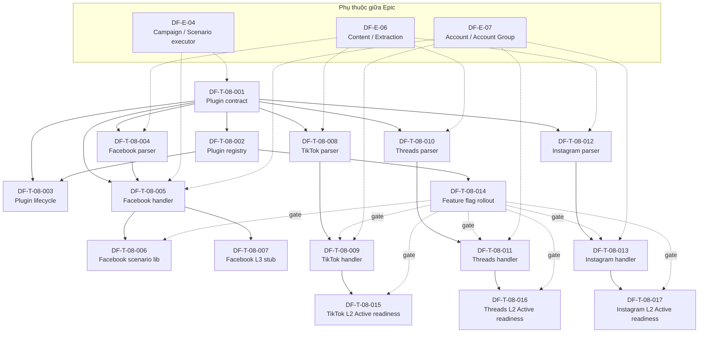

# DF-E-08 — Social Platform Extensions

> **Mã Epic:** DF-E-08
> **Module gốc:** DF-MOD-08 — Social Platform Extensions
> **Phiên bản:** 1.0
> **Cập nhật lần cuối:** 2026-05-26
> **Trạng thái:** Active (contract); coverage theo platform (Facebook L2 Active; TikTok / Threads / Instagram L2 Active target)
> **Đối tượng đọc:** Team Device Farm
> **Tài liệu liên quan:** [Module 08 spec](../../official_docs/modules/08-social-platform-extensions.md), [Ma trận năng lực](../../official_docs/03-capability-matrix.md), [Backlog README](../README.md), [Module 04 — Campaigns](../../official_docs/modules/04-campaigns-scenarios-executions.md), [Module 06 — Content](../../official_docs/modules/06-content-extraction-artifacts.md), [Module 07 — Accounts](../../official_docs/modules/07-accounts-and-groups.md)

## 1. Header Epic

| Trường | Giá trị |
|---|---|
| **Epic ID** | DF-E-08 |
| **Title** | Social Platform Extensions — contract đa platform + Facebook L2 Active + TikTok/Threads/Instagram L2 target |
| **Module** | DF-MOD-08 |
| **Persona chính** | Platform Engineer |
| **Persona phụ** | Automation Builder, Social Data Operator |
| **Trạng thái** | Active (contract); per-platform coverage theo bảng dưới |
| **Business priority** | Medium - chỉ Facebook L2 reference bundle là release slice; multi-platform, L3 và readiness bundle hạ P3. |
| **Số ticket dự kiến** | 17 |
| **Owner** | Team Platform Extensions |

## 2. Mục tiêu nghiệp vụ Epic

Epic này hiện thực hóa contract **Social Platform Extensions** — bộ giao kèo để bất kỳ social platform nào (Facebook, TikTok, Threads, Instagram, hoặc platform thứ năm sau này) đều được đưa lên Device Farm theo cùng một pattern: parser + handler + scenario step + content type platform-qualified, đi qua scenario executor chuẩn của Module Campaign, không có "runner" độc lập.

Mục tiêu nghiệp vụ:

- **Đưa Facebook lên trạng thái L2 Active đầy đủ artifact** (parser, handler, scenario step canonical, content type qualified, frontend node, test, scenario template) — platform reference để các platform sau noi theo.
- **Giữ TikTok, Threads và Instagram ở phase sau** — parser/handler draft, frontend node, scenario template, test bốn tầng, profile/ma trận năng lực và rollout gate không thuộc release core nếu business chưa chốt platform cụ thể ngoài Facebook.
- **Đảm bảo plugin discovery & lifecycle** — Device Farm có thể nạp / unload / version một platform extension mà không phải sửa core.
- **Feature flag rollout** — bật/tắt một platform extension theo organization để pilot có kiểm soát.

## 3. Phạm vi (In-scope / Out-of-scope)

### 3.1 In-scope

- Plugin contract: interface parser + handler + scenario lib + content type schema platform-qualified.
- Plugin registry / discovery: tự động đăng ký platform extension khi boot, expose qua API.
- Plugin lifecycle: load / unload / version một extension; migration giữa version.
- Facebook L2 Active: parser `fb_posts` / `fb_comments`, handler `fb_tap_comment_button` (canonical) + `tap_fb_comment_button` (legacy), scenario starter pack, frontend node.
- Boundary triển khai: contract/registry/feature flag nằm trong `device_farm`; parser XML, extra data, và `raw_data` persistence nằm trong `agent-boot/relay/extra_data`.
- Facebook L3 Foundation: stub MCP guardrail (allowed action cap khung, evidence requirement schema, handoff condition placeholder) — không nằm trong lộ trình ngắn hạn.
- TikTok / Threads / Instagram: parser draft, handler draft và readiness bundle được giữ trong backlog P3 để phase sau.
- Per-platform feature flag + rollout policy theo organization.

### 3.2 Out-of-scope

- Mã parser cụ thể cho từng field của post/comment — thuộc module Content Extraction (DF-MOD-06).
- Logic execute step trong scenario executor — thuộc module Campaign (DF-MOD-04).
- Transport tới thiết bị — thuộc module Devices & Control Plane (DF-MOD-02).
- Định nghĩa MCP tool generic — thuộc module MCP Agent Tools (DF-MOD-10).
- Account login flow, OTP/captcha xử lý — thuộc module Account & Account Group (DF-MOD-07).
- Notification khi extension fail load — thuộc module Notifications & Analytics (DF-MOD-09).

## 4. Mapping FR ↔ Ticket

| FR ID | Tên FR | Ticket(s) |
|---|---|---|
| FR-08-01 | Naming convention cho step action platform-specific | DF-T-08-001, DF-T-08-004, DF-T-08-008, DF-T-08-010, DF-T-08-012 |
| FR-08-02 | Naming convention cho extraction strategy | DF-T-08-001, DF-T-08-004, DF-T-08-008, DF-T-08-010, DF-T-08-012 |
| FR-08-03 | Naming convention cho content type | DF-T-08-001, DF-T-08-005, DF-T-08-009, DF-T-08-011, DF-T-08-013 |
| FR-08-04 | Giữ legacy alias để tương thích ngược | DF-T-08-005 |
| FR-08-05 | Ranh giới: cấm runner platform riêng | DF-T-08-001, DF-T-08-002 |
| FR-08-06 | Profile bắt buộc cho mọi platform | DF-T-08-002, DF-T-08-008, DF-T-08-010, DF-T-08-012 |
| FR-08-07 | Map field vào content_items + `raw_data` | DF-T-08-004, DF-T-08-005, DF-T-08-008, DF-T-08-010, DF-T-08-012 |
| FR-08-08 | Quan hệ parent-child cho dữ liệu phân cấp | DF-T-08-004, DF-T-08-009, DF-T-08-011, DF-T-08-013 |
| FR-08-09 | Dedupe key theo platform | DF-T-08-004, DF-T-08-008, DF-T-08-010, DF-T-08-012 |
| FR-08-10 | Account / session requirement theo platform | DF-T-08-002, DF-T-08-005 |
| FR-08-11 | Frontend flow editor node theo platform | DF-T-08-005, DF-T-08-006 |
| FR-08-12 | Test bắt buộc (schema, executor, parser, persistence) | DF-T-08-001, DF-T-08-004, DF-T-08-005, DF-T-08-006, DF-T-08-015, DF-T-08-016, DF-T-08-017 |
| FR-08-13 | L3 guardrail riêng theo platform | DF-T-08-007 |
| FR-08-14 | Ma trận năng lực luôn đồng bộ code | DF-T-08-003, DF-T-08-014 |
| FR-08-15 | Backward compatibility trong content query | DF-T-08-005 |
| Lộ trình | TikTok L2 Active | DF-T-08-015 | DF-T-08-008, DF-T-08-009 |
| Lộ trình | Threads L2 Active | DF-T-08-016 | DF-T-08-010, DF-T-08-011 |
| Lộ trình | Instagram L2 Active | DF-T-08-017 | DF-T-08-012, DF-T-08-013 |

## 5. Ticket list

| Ticket ID | Title | Type | Priority | SP | Labels chính | Trạng thái |
|---|---|---|---|---|---|---|
| DF-T-08-001 | Plugin contract — interface parser/handler/scenario lib | feature | P1 | 5 | `module:social-ext`, `layer:contract`, `platform:agnostic` | Done |
| DF-T-08-002 | Plugin registry & discovery | feature | P2 | 5 | `module:social-ext`, `layer:backend`, `platform:agnostic` | Done |
| DF-T-08-003 | Plugin lifecycle (load / unload / version) | feature | P3 | 5 | `module:social-ext`, `layer:backend`, `platform:agnostic` | Done |
| DF-T-08-004 | Facebook parser — post / comment / feed | feature | P0 | 8 | `module:social-ext`, `layer:backend`, `platform:facebook`, `coverage:L2` | Done |
| DF-T-08-005 | Facebook handler — like / comment / share / follow | feature | P0 | 8 | `module:social-ext`, `layer:backend`, `platform:facebook`, `coverage:L2` | Done |
| DF-T-08-006 | Facebook scenario library — starter pack | feature | P0 | 5 | `module:social-ext`, `layer:backend`, `platform:facebook`, `coverage:L2` | Done |
| DF-T-08-007 | Facebook L3 Foundation — MCP guardrail stub | feature | P3 | 5 | `module:social-ext`, `layer:backend`, `platform:facebook`, `coverage:L3` | Backlog |
| DF-T-08-008 | TikTok parser draft | feature | P3 | 5 | `module:social-ext`, `layer:backend`, `platform:tiktok`, `coverage:L2` | Backlog |
| DF-T-08-009 | TikTok handler draft | feature | P3 | 5 | `module:social-ext`, `layer:backend`, `platform:tiktok`, `coverage:L2` | Backlog |
| DF-T-08-010 | Threads parser draft | feature | P3 | 5 | `module:social-ext`, `layer:backend`, `platform:threads`, `coverage:L2` | Backlog |
| DF-T-08-011 | Threads handler draft | feature | P3 | 5 | `module:social-ext`, `layer:backend`, `platform:threads`, `coverage:L2` | Backlog |
| DF-T-08-012 | Instagram parser draft | feature | P3 | 5 | `module:social-ext`, `layer:backend`, `platform:instagram`, `coverage:L2` | Backlog |
| DF-T-08-013 | Instagram handler draft | feature | P3 | 5 | `module:social-ext`, `layer:backend`, `platform:instagram`, `coverage:L2` | Backlog |
| DF-T-08-014 | Per-platform feature flag & rollout | feature | P1 | 3 | `module:social-ext`, `layer:backend`, `platform:agnostic` | Done |
| DF-T-08-015 | TikTok L2 Active readiness bundle | feature | P3 | 5 | `module:social-ext`, `layer:backend`, `layer:frontend`, `platform:tiktok`, `coverage:L2` | Backlog |
| DF-T-08-016 | Threads L2 Active readiness bundle | feature | P3 | 5 | `module:social-ext`, `layer:backend`, `layer:frontend`, `platform:threads`, `coverage:L2` | Backlog |
| DF-T-08-017 | Instagram L2 Active readiness bundle | feature | P3 | 5 | `module:social-ext`, `layer:backend`, `layer:frontend`, `platform:instagram`, `coverage:L2` | Backlog |

Tổng story points: 89. Phân bổ priority nghiệp vụ: 3 ticket P0 (21 SP), 2 ticket P1 (8 SP), 1 ticket P2 (5 SP), 11 ticket P3 (55 SP). Phân bổ platform label: Facebook 4 ticket, TikTok 3 ticket, Threads 3 ticket, Instagram 3 ticket, platform-agnostic 4 ticket.

## 6. Dependency Graph

## 7. Cross-Epic Dependency

- **DF-E-04 (Campaign / Scenario / Execution)** — scenario executor là điểm chạy mọi step platform-specific. Mọi handler ở Epic này phụ thuộc executor contract được DF-E-04 chốt.
- **DF-E-06 (Content & Extraction)** — content_items schema, `raw_data` field, save_extraction API là điểm parser ở Epic này ghi dữ liệu vào. Mọi parser phụ thuộc DF-E-06.
- **DF-E-07 (Account & Account Group)** — handler thực hiện like/comment/share/follow cần lấy account runtime từ account group. Handler phụ thuộc account resolution API của DF-E-07.

## 8. Điều kiện hoàn thành riêng cho Epic

Ngoài DoD chung trong [README](../README.md) mục 9, DF-E-08 yêu cầu:

- [ ] Plugin contract đã merge, có golden interface test bảo vệ backward compatibility.
- [ ] Facebook L2 Active: 100% checklist artifact (parser, handler, scenario step canonical + legacy alias, content type qualified, frontend node, test 4 tầng, scenario template).
- [ ] TikTok / Threads / Instagram L2 Active: mỗi platform có readiness ticket Done trước khi ma trận năng lực chuyển từ Draft sang Active.
- [ ] Ma trận năng lực (`docs/official_docs/03-capability-matrix.md`) cập nhật cùng release với code change của ticket.
- [ ] Mỗi platform target (TikTok / Threads / Instagram) có profile cập nhật ở `docs/official_docs/platforms/<platform>.md` ghi rõ known gaps, completion criteria và trạng thái sau release.
- [ ] Feature flag per-platform có default OFF cho 3 platform Draft; chỉ Facebook default ON.
- [ ] Không có platform code chạy ngoài scenario step model (audit qua code review checklist).
- [ ] Mỗi ticket platform-specific có label `platform:*` đúng.
- [ ] Legacy alias `tap_fb_comment_button` vẫn dispatch về cùng handler với canonical `fb_tap_comment_button` — có test guard.

## 9. KPI Epic

| KPI | Mục tiêu | Đo lường |
|---|---|---|
| Tỷ lệ platform có profile đầy đủ artifact checklist | Facebook 100% (Active); ba platform còn lại đạt mức Draft target đầy đủ | Đo qua bảng artifact mục 7.2 đặc tả module |
| Thời gian từ "đồng ý hỗ trợ platform mới" tới trạng thái Draft target | < 1 tuần | Đo từ ticket Product approval tới profile merge |
| Thời gian từ Draft target sang Active cho một platform | 2–4 tuần engineering | Đo lúc đẩy TikTok / Threads / Instagram sang Active sau Epic |
| Tỷ lệ scenario social mới dùng naming canonical | ≥ 90% sau quý chuyển tiếp | Loại trừ scenario legacy |
| Tỷ lệ content item social ghi với content type qualified | ≥ 95% | Đếm trên content_items mới |
| Số sự cố runner platform riêng vượt scenario step model | 0 mỗi quý | Vi phạm contract = regression |
| Số bug runtime do legacy alias `tap_fb_comment_button` hỏng | 0 mỗi quý | Mỗi bug = regression |
| Test coverage bốn tầng (schema + executor + parser + persistence) cho Facebook | 100% file Facebook-specific | CI gate |

## 10. Trace & tài liệu tham chiếu

- **Đặc tả module:** [08-social-platform-extensions.md](../../official_docs/modules/08-social-platform-extensions.md) — FR-08-01 → FR-08-15.
- **Ma trận năng lực:** [03-capability-matrix.md](../../official_docs/03-capability-matrix.md) — mục 4.2 (L2 platform-specific).
- **Platform profiles:** [facebook.md](../../official_docs/platforms/facebook.md), [tiktok.md](../../official_docs/platforms/tiktok.md), [threads.md](../../official_docs/platforms/threads.md), [instagram.md](../../official_docs/platforms/instagram.md).
- **Nhóm người dùng:** [02-personas-and-journeys.md](../../official_docs/02-personas-and-journeys.md) — Platform Engineer, Automation Builder.
- **Thuật ngữ:** [00-glossary.md](../../official_docs/00-glossary.md) — Platform profile, Coverage profile, Platform-qualified content type, Legacy alias, Extraction strategy.
- **Lộ trình:** [99-roadmap-and-faq.md](../../official_docs/99-roadmap-and-faq.md) — platform expansion track.
