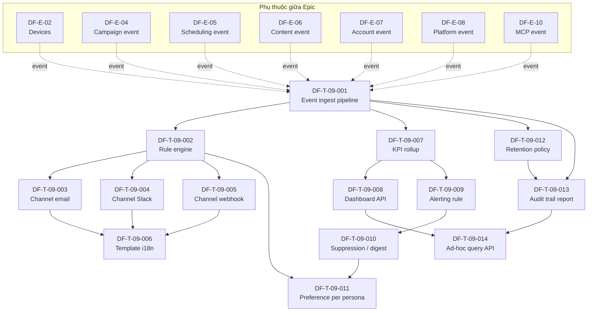

# DF-E-09 — Notifications & Analytics

> **Mã Epic:** DF-E-09
> **Module gốc:** DF-MOD-09 — Notifications & Analytics
> **Phiên bản:** 1.0
> **Cập nhật lần cuối:** 2026-05-26
> **Trạng thái:** Active
> **Đối tượng đọc:** Team Device Farm
> **Tài liệu liên quan:** [Đặc tả Module 09](../../official_docs/modules/09-notifications-and-analytics.md), [Ma trận năng lực](../../official_docs/03-capability-matrix.md), [Backlog README](../README.md), [Module 02 — Devices](../../official_docs/modules/02-devices-and-control-plane.md), [Module 04 — Campaigns](../../official_docs/modules/04-campaigns-scenarios-executions.md), [Module 05 — Scheduling](../../official_docs/modules/05-scheduling.md), [Module 06 — Content](../../official_docs/modules/06-content-extraction-artifacts.md), [Module 07 — Accounts](../../official_docs/modules/07-accounts-and-groups.md)

## 1. Header Epic

| Trường | Giá trị |
|---|---|
| **Epic ID** | DF-E-09 |
| **Title** | Notifications & Analytics — event ingest, multi-channel notification, KPI rollup, alerting, retention |
| **Module** | DF-MOD-09 |
| **Persona chính** | Operator, Supervisor |
| **Persona phụ** | Admin, Social Data Operator, Fleet Operator, AI Operations Supervisor |
| **Trạng thái** | Active |
| **Business priority** | Low - notification/analytics là visibility layer phase sau; core inbox tối thiểu chỉ giữ P2. |
| **Số ticket dự kiến** | 15 |
| **Owner** | Team Platform & Observability |

## 2. Mục tiêu nghiệp vụ Epic

Epic này hiện thực hóa lớp **visibility** của Device Farm — biến domain event thành notification record, activity log entry và webhook delivery. Sau khi reprioritize theo happy path nghiệp vụ, Epic này được giữ ở Business priority Low: inbox tối thiểu có thể làm ở phase 2, còn channel email/Slack/webhook, KPI rollup, alerting, retention và ad-hoc analytics không chặn release core.

Mục tiêu nghiệp vụ:

- **Giữ inbox tối thiểu ở P2**: event ingest, rule tạo notification in-app và inbox API đủ cho phase 2.
- **Để channel và analytics sâu ở P3**: email, Slack, webhook, KPI dashboard data API, audit trail report, alerting, suppression, retention và ad-hoc query.
- **Không đưa MCP event vào core release**: MCP là DF-E-10 Preview nên không kéo dependency vào R1.

## 3. Phạm vi (In-scope / Out-of-scope)

### 3.1 In-scope

- Event ingest pipeline: domain phát event qua `notification_service` và `activity_logger`, không tự ghi DB.
- Notification rule engine: rule "khi nào tạo notification, gửi channel nào, gửi cho ai".
- Channel email: SMTP/SES transport, template i18n.
- Channel Slack: payload chuẩn, deep link tới resource.
- Channel webhook custom: HTTP POST + ghi nhận kết quả delivery.
- Notification template i18n (vi/en) cho mọi event type.
- KPI rollup daily/weekly: aggregate event → metric per org/persona/resource.
- KPI dashboard data API: endpoint trả số liệu cho frontend.
- Alerting rule threshold-based: "khi tỷ lệ DLQ > 20% trong 1h, alert".
- Alerting suppression / digest: chống ngợp khi event burst.
- Per-persona notification preference: opt-in/out theo event type.
- Activity_log retention policy: cấu hình per org, job dọn dẹp tự động.
- Audit trail report: export activity_log theo filter cho audit.
- Ad-hoc query API cho analytics.

### 3.2 Out-of-scope

- Prometheus metric / distributed tracing — thuộc DF-E-01 infra observability.
- BI dashboard chuyên sâu (cohort, funnel) — thực hiện ngoài hệ thống qua warehouse export.
- HMAC signing webhook payload — sẽ là backlog Q3 (nêu trong spec mục 8).
- External log shipping — DF-E-01.
- UI dashboard hiển thị notification panel — DF-E-11 (Frontend); Epic này chỉ ship API.

## 4. Mapping FR ↔ Ticket

| FR ID | Tên FR | Ticket(s) |
|---|---|---|
| FR-09-01 | Tạo notification channel | DF-T-09-003, DF-T-09-004, DF-T-09-005 |
| FR-09-02 | CRUD notification channel | DF-T-09-003, DF-T-09-004, DF-T-09-005 |
| FR-09-03 | Notification in-app | DF-T-09-001, DF-T-09-002, DF-T-09-015 |
| FR-09-04 | Unread count endpoint | DF-T-09-015 |
| FR-09-05 | Đánh dấu đã đọc | DF-T-09-015 |
| FR-09-06 | Đánh dấu đã đọc tất cả | DF-T-09-015 |
| FR-09-07 | Webhook dispatcher | DF-T-09-005 |
| FR-09-08 | Domain event chuẩn từ Campaign | DF-T-09-001 |
| FR-09-09 | Domain event chuẩn từ Scheduling | DF-T-09-001 |
| FR-09-10 | Activity log append-style | DF-T-09-001, DF-T-09-011, DF-T-09-012 |
| FR-09-11 | Endpoint analytics activity | DF-T-09-007, DF-T-09-013, DF-T-09-014 |
| FR-09-12 | Tách biệt write path khỏi domain | DF-T-09-001 |
| FR-09-13 | Ghi nhận kết quả webhook delivery | DF-T-09-005 |
| FR-09-14 | Phân biệt notification cá nhân / tổ chức | DF-T-09-002, DF-T-09-010 |
| FR-09-15 | Deep link về resource gốc | DF-T-09-006 |
| (Lộ trình → Active) | KPI rollup daily/weekly | DF-T-09-007 |
| (Lộ trình → Active) | Dashboard data API | DF-T-09-008 |
| (Lộ trình → Active) | Alerting rule engine | DF-T-09-009 |
| (Lộ trình → Active) | Suppression / digest | DF-T-09-010 |
| (Lộ trình → Active) | Notification preference per persona | DF-T-09-011 |
| (Lộ trình → Active) | Retention policy | DF-T-09-012 |
| (Lộ trình → Active) | Audit trail report | DF-T-09-013 |
| (Lộ trình → Active) | Ad-hoc query API | DF-T-09-014 |

## 5. Ticket list

| Ticket ID | Title | Type | Priority | SP | Labels chính | Trạng thái |
|---|---|---|---|---|---|---|
| DF-T-09-001 | Event ingest pipeline (domain → notification_service + activity_logger) | feature | P2 | 5 | `module:notif-analytics`, `layer:backend` | Ready |
| DF-T-09-002 | Notification rule engine (event → channel + recipient) | feature | P2 | 5 | `module:notif-analytics`, `layer:backend` | Ready |
| DF-T-09-003 | Channel: email (SMTP/SES + template i18n) | feature | P3 | 5 | `module:notif-analytics`, `layer:backend` | Ready |
| DF-T-09-004 | Channel: Slack (payload + deep link) | feature | P3 | 3 | `module:notif-analytics`, `layer:backend` | Ready |
| DF-T-09-005 | Channel: webhook custom (HTTP POST + delivery log) | feature | P3 | 3 | `module:notif-analytics`, `layer:backend` | Ready |
| DF-T-09-006 | Notification template i18n (vi/en) cho mọi event type | feature | P3 | 3 | `module:notif-analytics`, `layer:backend`, `layer:docs` | Ready |
| DF-T-09-007 | KPI rollup daily/weekly | feature | P3 | 5 | `module:notif-analytics`, `layer:backend`, `layer:db` | Ready |
| DF-T-09-008 | KPI dashboard data API | feature | P3 | 3 | `module:notif-analytics`, `layer:backend`, `layer:contract` | Ready |
| DF-T-09-009 | Alerting rule engine (threshold-based) | feature | P3 | 5 | `module:notif-analytics`, `layer:backend` | Ready |
| DF-T-09-010 | Alerting suppression / digest | feature | P3 | 3 | `module:notif-analytics`, `layer:backend` | Ready |
| DF-T-09-011 | Notification preference per persona (opt-in/out) | feature | P3 | 3 | `module:notif-analytics`, `layer:backend` | Ready |
| DF-T-09-012 | Analytics retention policy (activity_log dọn dẹp) | feature | P3 | 5 | `module:notif-analytics`, `layer:backend`, `layer:db` | Ready |
| DF-T-09-013 | Audit trail report (export activity_log theo filter) | feature | P3 | 3 | `module:notif-analytics`, `layer:backend`, `layer:contract` | Ready |
| DF-T-09-014 | Ad-hoc query API for analytics | feature | P3 | 5 | `module:notif-analytics`, `layer:backend`, `layer:contract` | Ready |
| DF-T-09-015 | Notification inbox API — unread count & mark read | feature | P2 | 3 | `module:notif-analytics`, `layer:backend`, `layer:contract` | Ready |

Tổng story points: 62. Phân bổ priority nghiệp vụ: 3 ticket P2 (13 SP), 12 ticket P3 (49 SP).

## 6. Dependency Graph

## 7. Cross-Epic Dependency

DF-E-09 là **consumer của hầu hết Epic** — bất kỳ domain phát event nào cũng phải đi qua `notification_service` / `activity_logger` của DF-E-09.

- **DF-E-02 (Devices)** — event device offline / online.
- **DF-E-04 (Campaign)** — event campaign dispatch / completed / failed / DLQ open.
- **DF-E-05 (Scheduling)** — event schedule run fail.
- **DF-E-06 (Content)** — event content collection rollover, export complete.
- **DF-E-07 (Account)** — event account rotation, account locked.
- **DF-E-08 (Social Platform Extensions)** — event extension load/unload (audit), guardrail dry-run block.
- **DF-E-10 (MCP Agent Tools — Preview)** — event MCP action nhạy cảm.
- **DF-E-01 (Platform & Auth)** — role `platform-admin`, `org-admin`, RBAC để gate API admin endpoint.
- **DF-E-11 (Frontend & Dashboard)** — consumer API của DF-E-09 (notification panel, dashboard KPI).

## 8. Điều kiện hoàn thành riêng cho Epic

Ngoài DoD chung trong [README](../README.md) mục 9, DF-E-09 yêu cầu:

- [ ] Mọi domain module (Campaign, Scheduling, Devices, Content, Account, Platform Ext, MCP) refactor xong: không tự ghi `notifications` hoặc `activity_log` trực tiếp — code review enforce.
- [ ] Test guard chạy trong CI: grep insert/update SQL trực tiếp tới 2 bảng đó từ domain code → fail.
- [ ] 3 channel (in-app, email, slack, webhook) đều có integration test e2e.
- [ ] Template i18n có cả vi/en cho 100% event type được produce trong release.
- [ ] Retention policy mặc định: activity_log giữ 180 ngày; configurable per org.
- [ ] Alerting rule engine có UI ở DF-E-11 nhưng API + engine ready trong Epic này.
- [ ] KPI dashboard API response < 1s p95 cho query trong window 7 ngày.
- [ ] Audit trail report export được tới 100k row mỗi lần (CSV).

## 9. KPI Epic

| KPI | Mục tiêu | Đo lường |
|---|---|---|
| Tỷ lệ campaign hoàn thành / fail có notification gắn người dispatch | 100% | Đo từ event Campaign, loại trừ MCP dispatch ẩn danh |
| Tỷ lệ schedule run fail có notification | 100% | Mỗi miss = sự cố nghiệp vụ nghiêm trọng |
| Độ trễ từ domain event đến notification record | Trung vị < 5s, p99 < 30s | Timestamp event vs timestamp DB |
| Tỷ lệ webhook delivery thành công | ≥ 99% trong giờ vận hành | Loại trừ outage endpoint phía nhận |
| Độ trễ unread count endpoint | Trung vị < 500ms, p99 < 2s | Endpoint gọi thường xuyên |
| Tỷ lệ event đi qua service thay vì ghi DB trực tiếp | 100% | Code grep audit |
| Tỷ lệ notification có deep link đúng resource | 100% trong release ổn định | Loại trừ resource đã xóa hợp pháp |
| Số sự cố mất notification | 0 mỗi quý | Mỗi sự cố = post-mortem |
| Tỷ lệ activity_log entry sửa/xóa qua API user | 0 | Vi phạm = sự cố |
| Độ phủ template i18n vi/en | 100% event type produce trong release | Grep event type → template |
| Thời gian từ event burst → digest gửi ra | Trung vị < 15 phút | Đo qua rule digest |
| Tỷ lệ alerting rule trigger đúng pattern | ≥ 95% true positive | Đối chiếu với incident report |

## 10. Trace & tài liệu tham chiếu

- **Đặc tả module:** [09-notifications-and-analytics.md](../../official_docs/modules/09-notifications-and-analytics.md) — FR-09-01 → FR-09-15, mục 8 (giới hạn) → lộ trình items chuyển sang Active trong Epic này.
- **Ma trận năng lực:** [03-capability-matrix.md](../../official_docs/03-capability-matrix.md) — mục 4.3 (cross-cutting), mục 6 (tích hợp ngoài Slack/Telegram).
- **Module Campaign:** [04-campaigns-scenarios-executions.md](../../official_docs/modules/04-campaigns-scenarios-executions.md).
- **Module Scheduling:** [05-scheduling.md](../../official_docs/modules/05-scheduling.md).
- **Module Devices:** [02-devices-and-control-plane.md](../../official_docs/modules/02-devices-and-control-plane.md).
- **Nhóm người dùng:** [02-personas-and-journeys.md](../../official_docs/02-personas-and-journeys.md) — mọi persona.
- **Thuật ngữ:** [00-glossary.md](../../official_docs/00-glossary.md) — Notification channel, Activity log, Webhook, Domain event, Unread count.
- **Lộ trình:** [99-roadmap-and-faq.md](../../official_docs/99-roadmap-and-faq.md) — observability hardening.
