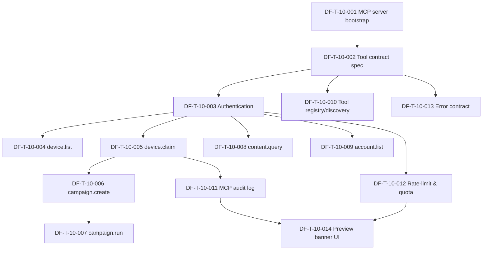

# DF-E-10 — MCP Agent Tools (Preview / Experimental)

| Trường | Giá trị |
|---|---|
| **Epic ID** | DF-E-10 |
| **Module** | DF-MOD-10 — MCP Agent Tools |
| **Trạng thái Epic** | Preview implementation complete — pending external 24h staging soak |
| **Business priority** | Low - MCP là Preview/Experimental, không thuộc release happy path cho end-user. |
| **Release track** | Preview / Experimental — phần mở rộng nghiên cứu, KHÔNG thuộc năng lực cốt lõi |
| **Persona chính** | AI Operations Supervisor (Preview) |
| **Persona phụ** | Automation Builder, Fleet Operator, Social Data Operator |
| **Số ticket dự kiến** | 14 |
| **Cập nhật lần cuối** | 2026-06-01 |
| **Owner** | (placeholder) |

## 1. Mục tiêu Epic

DF-E-10 hiện thực hóa toàn bộ năng lực **MCP Agent Tools** — mặt phẳng điều khiển dành cho AI agent (Claude, GPT, Gemini, ...) thao tác Device Farm ở mức L3 (coverage experimental). Epic gồm bootstrap MCP server stdio, định nghĩa contract `df_*` tool family, hai mô hình token (`DEVICE_FARM_MCP_TOKEN` device-scoped và `MCP_AUTH_TOKEN` user-scoped), tool wrap HTTP route đã có cho device / session / scenario / campaign / content, hệ thống activity log + rate limit cho rủi ro vận hành AI agent, error contract chuẩn, và disclosure UI banner để mọi người dùng dashboard hiểu rõ trạng thái Preview.

> **Lưu ý định vị Epic — đọc kỹ trước khi pull ticket vào sprint:**
> Toàn bộ ticket trong Epic này thuộc nhóm Preview / Experimental. Team không cam kết SLA production cho ticket DF-E-10. Contract có thể bị thay đổi hoặc thu hồi giữa các release. Bất kỳ tool nào release từ Epic này khi expose ra agent bên ngoài đều phải có warning Preview rõ ràng. Quyết định "tuyên bố L3 active" cho một platform thuộc DF-E-08 (Social Platform Extensions) chứ không thuộc DF-E-10.

## 2. Phạm vi Epic

### 2.1 In-scope (theo đặc tả module mục 3.1)

- MCP server stdio bootstrap, expose tool list theo schema chuẩn.
- Định nghĩa contract `df_*` tool family + tài liệu Preview.
- Hai loại token MCP (device-scoped và user-scoped) + rotation.
- Tool device/session lifecycle (`df_start_session`, `df_end_session`, `df_get_session_info`).
- Tool device.list (mới — wrap route list device cho agent có ngữ cảnh fleet).
- Tool device.claim (alias semantic của `df_start_session` ở góc nhìn agent reservation).
- Tool campaign (create, run/dispatch, status).
- Tool content (query, save_extraction).
- Tool account (list — agent đọc account khả dụng để bind vào scenario).
- Tool registry / discovery — agent hỏi danh sách tool còn được hỗ trợ ở Preview channel nào.
- MCP audit log (tách / kế thừa activity log).
- Rate-limit & quota cho agent (tránh agent loop làm sập hệ thống).
- Error contract chuẩn `df.*` codes.
- Disclosure UI banner Preview trên dashboard.

### 2.2 Out-of-scope

- Định nghĩa step social platform-specific (thuộc DF-E-08).
- Handoff workflow UX end-to-end giữa agent ↔ supervisor — chỉ ở mức backend hook và notification (xem mục Open question module 10).
- Multi-agent cooperation tool — không có trong Epic này.
- Vault credential cho token MCP — dùng env config hiện hành; vault thuộc DF-E-01.

## 3. Mapping FR ↔ Ticket

| FR module 10 | Ticket DF-E-10 chính | Ticket liên quan |
|---|---|---|
| FR-10-01 (MCP server stdio) | DF-T-10-001 | DF-T-10-010 |
| FR-10-02 (df_* tool family chuẩn) | DF-T-10-002 | tất cả ticket tool |
| FR-10-03 (Tham số device serial / session_id) | DF-T-10-002 | DF-T-10-004, DF-T-10-005 |
| FR-10-04 (DEVICE_FARM_MCP_TOKEN) | DF-T-10-003 | DF-T-10-005 |
| FR-10-05 (MCP_AUTH_TOKEN) | DF-T-10-003 | DF-T-10-006, DF-T-10-007, DF-T-10-008, DF-T-10-009 |
| FR-10-06 (Persist mcp_sessions) | DF-T-10-005 | DF-T-10-011 |
| FR-10-07 (Mô hình L3) | DF-T-10-005 | DF-T-10-002 |
| FR-10-08 (Parity HTTP route) | DF-T-10-002 | DF-T-10-004 → DF-T-10-009 |
| FR-10-09 (Activity log MCP) | DF-T-10-011 | mọi ticket tool |
| FR-10-10 (Khung guardrail platform) | DF-T-10-002 | (đầu mối hợp tác DF-E-08) |
| FR-10-11 (Evidence requirement) | DF-T-10-008 | DF-T-10-011 |
| FR-10-12 (Handoff condition) | DF-T-10-011 | DF-T-10-013 |
| FR-10-13 (Tool device/session lifecycle) | DF-T-10-005 | DF-T-10-004 |
| FR-10-14 (Tool gesture) | wrap qua DF-T-10-002 (contract) | (chi tiết gesture: tham chiếu module 02) |
| FR-10-15 (Tool UI hierarchy) | DF-T-10-008 (qua content.query và evidence) | DF-T-10-013 |
| FR-10-16 (Tool task queue) | DF-T-10-007 (campaign.run async) | DF-T-10-013 |
| FR-10-17 (Tool scenario preview/run) | DF-T-10-007 | DF-T-10-006 |
| FR-10-18 (Tool campaign) | DF-T-10-006, DF-T-10-007 | DF-T-10-013 |
| FR-10-19 (Tool content) | DF-T-10-008 | DF-T-10-011 |
| FR-10-20 (Ownership ngăn cross-agent) | DF-T-10-005 | DF-T-10-011, DF-T-10-013 |

## 4. Danh sách ticket

| Ticket ID | Tên | Loại | Priority | SP | Status |
|---|---|---|---|---|---|
| DF-T-10-001 | Bootstrap MCP server stdio (Preview) | feature | P3 | 5 | Done |
| DF-T-10-002 | Đặc tả contract `df_*` tool family | feature | P3 | 5 | Done |
| DF-T-10-003 | Authentication: DEVICE_FARM_MCP_TOKEN + MCP_AUTH_TOKEN | feature | P3 | 5 | Done |
| DF-T-10-004 | Tool `df_device_list` — agent enumerate fleet | feature | P3 | 3 | Done |
| DF-T-10-005 | Tool `df_device_claim` / `df_start_session` — reserve device | feature | P3 | 5 | Done |
| DF-T-10-006 | Tool `df_campaign_create` — agent tạo campaign | feature | P3 | 3 | Done |
| DF-T-10-007 | Tool `df_campaign_run` / `df_run_scenario` — dispatch & status | feature | P3 | 5 | Done |
| DF-T-10-008 | Tool `df_content_query` / `df_save_extraction` — content tool | feature | P3 | 3 | Done |
| DF-T-10-009 | Tool `df_account_list` — agent đọc account khả dụng | feature | P3 | 2 | Done |
| DF-T-10-010 | Tool registry / discovery (`tools/list` Preview channel) | feature | P3 | 3 | Done |
| DF-T-10-011 | MCP audit log (mọi tool call persist) | feature | P3 | 5 | Done |
| DF-T-10-012 | Rate-limit & quota cho AI agent | feature | P3 | 3 | Done |
| DF-T-10-013 | Error contract chuẩn `df.*` codes | feature | P3 | 3 | Done |
| DF-T-10-014 | Preview disclosure banner trên dashboard | feature | P3 | 2 | Done |

Tổng story point ước lượng: **52 SP**. Phân bổ priority nghiệp vụ: 14 ticket P3 (52 SP).

## 5. Dependency graph

## 6. Phụ thuộc giữa Epic

| Phụ thuộc Epic | Lý do |
|---|---|
| **DF-E-02 (Devices & Control Plane)** | Tool `df_device_list`, `df_device_claim`, session lifecycle wrap route device. Cần FSM device + reservation đã sẵn sàng. |
| **DF-E-04 (Campaign, Scenario & Execution)** | Tool `df_campaign_create`, `df_campaign_run`, `df_run_scenario` wrap route campaign/scenario. |
| **DF-E-06 (Content Extraction & Artifact)** | Tool `df_content_query`, `df_save_extraction` wrap route content + artifact. |
| **DF-E-07 (Account & Account Group)** | Tool `df_account_list` wrap route account. |
| **DF-E-01 (Nền tảng & Bảo mật)** | Token model — DF-E-10 phát hành token MCP nhưng dựa vào nền identity của DF-E-01. |
| **DF-E-09 (Notifications & Analytics)** | Activity log MCP kế thừa pattern activity log của DF-E-09. |
| **DF-E-11 (Frontend & Dashboard)** | Preview banner UI (DF-T-10-014) cần app shell DF-E-11. |

## 7. Điều kiện hoàn thành riêng cho Epic

DF-E-10 chỉ chuyển sang trạng thái "Preview release" (không phải GA) khi:

- [x] Tất cả 14 ticket đạt DoD chung (xem `README.md` mục 9) **và** điều kiện riêng từng ticket ở phạm vi local implementation.
- [ ] MCP server stdio chạy ổn định ≥ 24h liên tục trong môi trường staging với ≥ 1 agent (Claude hoặc tương đương) làm smoke test. **Pending external staging soak; không thể chứng minh bằng local test trong lượt này.**
- [x] 100% tool `df_*` có schema in/out đầy đủ và đều wrap đúng một HTTP route đã có (parity audit pass).
- [x] Audit log ghi ≥ 99% tool call (loại trừ tool đọc thuần được khai báo).
- [x] Rate-limit có ngưỡng baseline và đã được test với scenario agent loop.
- [x] Disclosure Preview hiển thị đúng ở mọi entry point: dashboard banner (DF-T-10-014), `tools/list` response (DF-T-10-010), tài liệu nghiệp vụ module 10.
- [x] Tài liệu module `docs/official_docs/modules/10-mcp-agent-tools.md` cập nhật mọi thay đổi contract trong cùng release.
- [x] **Đã ghi rõ vào tài liệu nghiệp vụ rằng tool còn ở trạng thái Preview, có warning khi dùng từ AI agent bên ngoài.**
- [x] Đã thông báo nội bộ rằng contract DF-E-10 có thể thay đổi giữa các release (release note ghi rõ "no GA SLA").

## 10. Implementation Evidence — 2026-06-01

| Area | Evidence |
|---|---|
| MCP stdio / registry | `device_farm/mcp/server.py` exposes `preview`, `contract_version`, `server_status`, output schemas, tool metadata, canonical Epic 10 aliases, and `df_mcp_registry`. |
| Token model | `device_farm/mcp/token_store.py` stores only hashed generated MCP tokens with atomic write + lock-file protected updates; dashboard `dfmcp_*` tokens decode through the shared auth path, while env tokens `DEVICE_FARM_MCP_TOKEN` and `MCP_AUTH_TOKEN` remain supported for stdio runtime. |
| Tool parity | Canonical tools wrap HTTP routes: devices live list, sessions start/end/get, campaigns create/dispatch/run, content query/save, accounts list. |
| Audit / rate-limit / error contract | `tools/call` records JSONL audit entries for success and failure, redacts sensitive input, applies per-token rate limits, and returns structured `df.*` errors without traceback leakage. |
| Backend API | `/api/mcp/tools`, `/api/mcp/tokens`, `/api/mcp/tokens/{token_id}/revoke`, and `/api/mcp/audit-log` expose Preview registry, tenant-scoped token lifecycle, and tenant-scoped audit review. |
| Dashboard disclosure | `/dashboard/mcp`, `/dashboard/mcp/tools`, `/dashboard/mcp/tokens`, `/dashboard/mcp/audit-log`, and `/dashboard/mcp/sandbox` show the Preview banner with `contract_version` and consent gate for token creation. |
| Regression evidence | `uv run --project device_farm pytest -q device_farm/tests/test_epic10_mcp_contract.py` → 9 passed; `py_compile` for new backend modules passed; frontend MCP files passed ESLint; nav route check passed. |

## 8. KPI Epic

| KPI | Mục tiêu Preview | Cách đo |
|---|---|---|
| Tỷ lệ parity giữa MCP tool và HTTP route | 100% | Audit định kỳ mỗi release (FR-10-08). |
| Tỷ lệ MCP action ghi vào audit log | ≥ 99% | DF-T-10-011. |
| Số sự cố agent bypass ownership session | 0 | Test guard DF-T-10-005 + DF-T-10-011. |
| Trung vị thời gian tool device-level | < 2 s | Telemetry DF-T-10-005, DF-T-10-008. |
| Tỷ lệ session agent kết thúc ở terminal state | ≥ 95% | DF-T-10-005 + DF-T-10-011. |
| Tỷ lệ tool call vi phạm rate-limit / tổng tool call | < 1% | DF-T-10-012. |
| Tỷ lệ tài liệu Preview disclosure hiển thị ở mọi entry | 100% | DF-T-10-014 + DF-T-10-010. |

## 9. Truy vết & tài liệu tham chiếu

- Đặc tả module: [10-mcp-agent-tools.md](../../official_docs/modules/10-mcp-agent-tools.md).
- Persona: [02-personas-and-journeys.md §3.5 AI Operations Supervisor (Preview)](../../official_docs/02-personas-and-journeys.md).
- Lộ trình: [99-roadmap-and-faq.md §4.3 Câu hỏi về AI và MCP](../../official_docs/99-roadmap-and-faq.md) — toàn bộ nội dung Epic này nằm trong nhóm forward-looking Preview.
- Ma trận năng lực: [03-capability-matrix.md](../../official_docs/03-capability-matrix.md).
