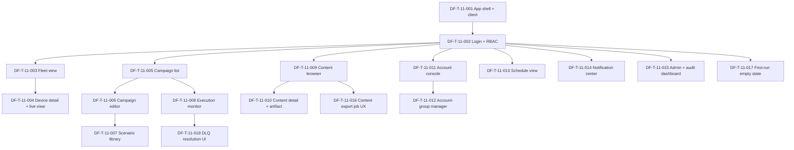

# DF-E-11 — Frontend & Dashboard

| Trường | Giá trị |
|---|---|
| **Epic ID** | DF-E-11 |
| **Module** | DF-MOD-11 — Frontend & Dashboard |
| **Trạng thái Epic** | Active |
| **Business priority** | High - frontend là bề mặt end-user dùng để login, xem fleet, chạy campaign, xem content và export kết quả. |
| **Persona chính** | Tất cả persona (Social Data Operator, Automation Builder, Fleet Operator, Admin, AI Operations Supervisor Preview) |
| **Số ticket dự kiến** | 18 |
| **Cập nhật lần cuối** | 2026-05-26 |
| **Owner** | (placeholder) |

## 1. Mục tiêu Epic

DF-E-11 dựng **dashboard Next.js** — cánh cửa duy nhất mà mọi persona Device Farm dùng để tương tác với hệ thống. Epic gồm app shell + navigation, login + RBAC, fleet view, device detail, campaign list + editor scenario flow graph, execution monitor, content browser, content detail + artifact preview, content export job UX, account console, account-group manager và first-run empty state cho core workflow. Schedule, notification center, admin/audit và DLQ UI vẫn có ticket nhưng được ưu tiên thấp hơn happy path.

Frontend không định nghĩa chân lý API — backend phát hành OpenAPI sinh TypeScript client (`DeviceFarmApi.ts`); feature folder theo domain (mỗi domain nghiệp vụ có UI + hook + service riêng); Next API proxy chỉ là cầu tạm khi generated client chưa kịp.

## 2. Phạm vi Epic

### 2.1 In-scope (theo đặc tả module mục 3.1)

- App shell + navigation đa domain.
- Login + RBAC UI + i18n.
- Trang devices, device detail, live view scrcpy.
- Trang campaigns, scenario editor, scenario library, execution monitor.
- Trang content, content detail + artifact.
- Trang accounts, account-groups.
- Trang schedules, notifications, activity log, admin & audit.

### 2.2 Out-of-scope

- Chân lý API + schema dữ liệu — backend modules.
- gRPC transport relay — DF-E-03.
- BI tool / phân tích sâu — lộ trình.
- Offline mode — lộ trình.
- Audit user action ở frontend — lộ trình.
- Banner MCP Preview — thuộc DF-E-10 (DF-T-10-014); DF-E-11 chỉ cung cấp app shell.

## 3. Mapping FR ↔ Ticket

| FR module 11 | Ticket DF-E-11 chính | Ticket liên quan |
|---|---|---|
| FR-11-01 (Feature folder per domain) | DF-T-11-001 | mọi ticket UI |
| FR-11-02 (Generated TypeScript client) | DF-T-11-001 | mọi ticket UI |
| FR-11-03 (Next API proxy adapter) | DF-T-11-001 | DF-T-11-013, DF-T-11-014 |
| FR-11-04 (i18n routing) | DF-T-11-001 | DF-T-11-002 |
| FR-11-05 (Trang devices dashboard) | DF-T-11-003 | DF-T-11-004 |
| FR-11-06 (Live view device qua scrcpy) | DF-T-11-004 | DF-T-11-003 |
| FR-11-07 (Dashboard relay agent) | DF-T-11-003 | DF-T-11-015 |
| FR-11-08 (Scenario flow editor) | DF-T-11-006 | DF-T-11-007 |
| FR-11-09 (Trang campaign + scenario template) | DF-T-11-005 | DF-T-11-006, DF-T-11-007, DF-T-11-008, DF-T-11-018 |
| FR-11-10 (Trang accounts + account-groups) | DF-T-11-011 | DF-T-11-012 |
| FR-11-11 (Trang content) | DF-T-11-009 | DF-T-11-010, DF-T-11-016 |
| FR-11-12 (Trang schedules) | DF-T-11-013 | |
| FR-11-13 (Notification panel + unread count) | DF-T-11-014 | DF-T-11-001 |
| FR-11-14 (Activity log view) | DF-T-11-015 | DF-T-11-014 |
| FR-11-15 (Feature-local service module) | DF-T-11-001 | mọi ticket UI |
| Core empty state / onboarding mỏng | DF-T-11-017 | DF-T-11-003, DF-T-11-005, DF-T-11-009, DF-T-11-011 |

## 4. Danh sách ticket

| Ticket ID | Tên | Loại | Priority | SP | Status |
|---|---|---|---|---|---|
| DF-T-11-001 | App shell + navigation + feature folder + generated client | feature | P0 | 8 | Backlog |
| DF-T-11-002 | Login + RBAC UI + i18n bootstrap | feature | P0 | 5 | Backlog |
| DF-T-11-003 | Fleet view UI — danh sách device + relay agent status | feature | P0 | 5 | Backlog |
| DF-T-11-004 | Device detail UI — metadata, live view scrcpy, session control | feature | P0 | 8 | Backlog |
| DF-T-11-005 | Campaign list + filter UI | feature | P0 | 5 | Backlog |
| DF-T-11-006 | Campaign editor + scenario step UI | feature | P0 | 8 | Backlog |
| DF-T-11-007 | Scenario library browser UI | feature | P2 | 3 | Backlog |
| DF-T-11-008 | Execution monitor UI — live log + per-device tiến độ | feature | P0 | 5 | Backlog |
| DF-T-11-009 | Content browser UI — collection, filter, phân trang | feature | P0 | 5 | Backlog |
| DF-T-11-010 | Content detail + artifact preview UI | feature | P0 | 5 | Backlog |
| DF-T-11-011 | Account console UI — CRUD + filter + bulk action | feature | P0 | 5 | Backlog |
| DF-T-11-012 | Account-group manager UI | feature | P1 | 3 | Backlog |
| DF-T-11-013 | Schedule view UI — cron, toggle, run-now, history | feature | P2 | 5 | Backlog |
| DF-T-11-014 | Notification center UI + unread count + deep link | feature | P2 | 5 | Backlog |
| DF-T-11-015 | Admin & audit dashboard UI — activity log, relay agent ops | feature | P2 | 5 | Backlog |
| DF-T-11-016 | Content export job UX — tạo export, theo dõi trạng thái và tải file | feature | P1 | 5 | Backlog |
| DF-T-11-017 | First-run onboarding & empty-state CTA cho luồng core | feature | P1 | 3 | Backlog |
| DF-T-11-018 | DLQ resolution UI — mở lỗi, replay và close failed execution item | feature | P2 | 5 | Backlog |

Tổng story point ước lượng: **93 SP**. Phân bổ priority nghiệp vụ: 10 ticket P0 (59 SP), 3 ticket P1 (11 SP), 5 ticket P2 (23 SP).

## 5. Dependency graph

## 6. Phụ thuộc giữa Epic

| Phụ thuộc Epic | Lý do |
|---|---|
| **DF-E-01** | JWT, RBAC, identity. |
| **DF-E-02** | Device + reservation + relay agent. |
| **DF-E-03** | Stream scrcpy qua WebSocket; relay agent status. |
| **DF-E-04** | Campaign, scenario, execution. |
| **DF-E-05** | Schedule cron. |
| **DF-E-06** | Content + artifact. |
| **DF-E-07** | Account + account-group. |
| **DF-E-08** | Platform metadata để render label đúng. |
| **DF-E-09** | Notification + activity log. |
| **DF-E-10 (Preview)** | App shell host banner Preview (DF-T-10-014); DF-E-11 không phụ thuộc tính năng nhưng phải hỗ trợ component reuse. |

## 7. Điều kiện hoàn thành riêng cho Epic

- [ ] Tất cả 18 ticket đạt DoD chung và điều kiện riêng.
- [ ] ≥ 90% feature tiêu thụ generated TypeScript client (KPI module 11).
- [ ] 100% feature folder không có ad hoc fetch trong component.
- [ ] LCP trang chính trung vị < 2 s; p99 < 5 s.
- [ ] Live view device mở < 3 s trung vị; reconnect ≥ 95%.
- [ ] i18n đầy đủ cho vi + en ≥ 95% chuỗi.
- [ ] Mỗi Next API proxy có ghi chú lý do + issue tracking.
- [ ] Tài liệu module 11 cập nhật.
- [ ] Smoke test cross-browser (Chrome, Edge, Safari).

## 8. KPI Epic

| KPI | Mục tiêu | Cách đo |
|---|---|---|
| Tỷ lệ feature dùng generated client | ≥ 90% | DF-T-11-001 |
| Tỷ lệ feature folder không có ad hoc fetch | 100% | DF-T-11-001 + code review |
| LCP trang chính | Trung vị < 2 s | RUM, mọi ticket UI |
| Live view mở | Trung vị < 3 s; p99 < 8 s | DF-T-11-004 |
| Reconnect WebSocket | ≥ 95% | DF-T-11-004, DF-T-11-008 |
| Mở scenario flow editor | Trung vị < 3 s | DF-T-11-006 |
| Bản dịch i18n | ≥ 95% | DF-T-11-001, DF-T-11-002 |
| Cross-domain leak | 0/quý | Code review |
| Mỗi proxy có issue tracking | 100% | DF-T-11-001 |
| MTTR backend schema break | < 4h | Toàn Epic |

## 9. Truy vết & tài liệu tham chiếu

- Đặc tả module: [11-frontend-dashboard.md](../../official_docs/modules/11-frontend-dashboard.md).
- Persona: [02-personas-and-journeys.md](../../official_docs/02-personas-and-journeys.md) — toàn bộ persona.
- Ma trận năng lực: [03-capability-matrix.md](../../official_docs/03-capability-matrix.md).
- Lộ trình: [99-roadmap-and-faq.md](../../official_docs/99-roadmap-and-faq.md).
