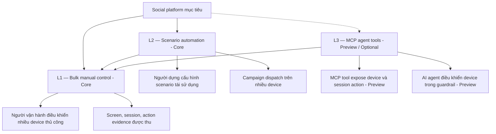
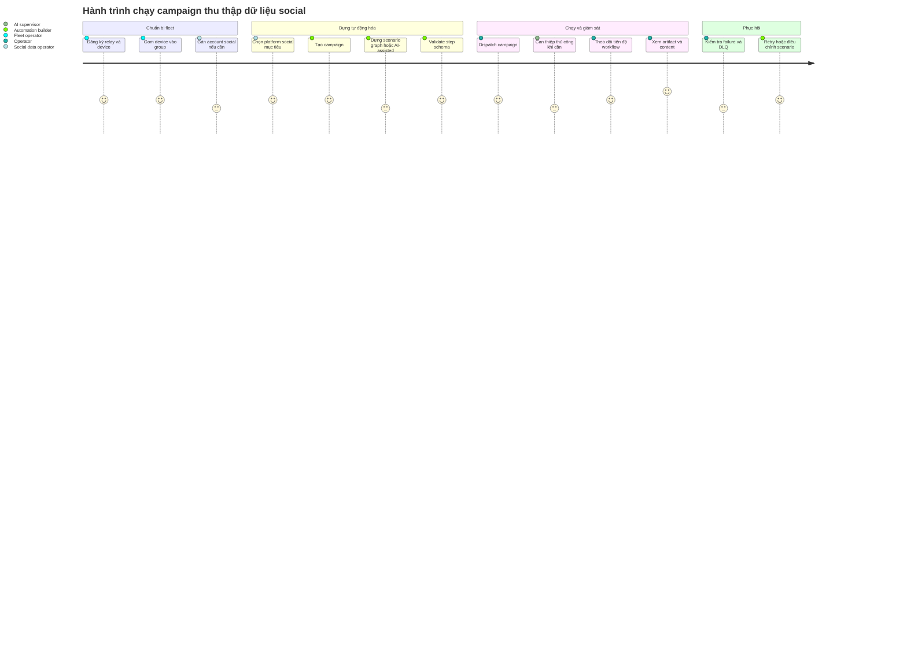

# Tổng quan sản phẩm Device Farm

> **Mã tài liệu:** DF-DOC-01-OVERVIEW
> **Phiên bản:** 1.0
> **Cập nhật lần cuối:** 2026-05-25
> **Trạng thái:** Approved
> **Đối tượng đọc:** Team Device Farm
> **Tài liệu liên quan:** [Glossary](00-glossary.md), [Personas & Journeys](02-personas-and-journeys.md), [Capability Matrix](03-capability-matrix.md)

## 1. Tóm tắt (TL;DR)

Device Farm là nền tảng **tự động hóa thiết bị Android ở quy mô (device automation at scale) chuyên biệt cho nghiệp vụ social media**, vận hành trên fleet (cụm) thiết bị Android thật và được quản lý tập trung. Sản phẩm phục vụ các đội ngũ cần vận hành tự động hóa social ở quy mô lớn, thu thập dữ liệu social có truy vết nguồn gốc, và phối hợp giữa thực thi tự động và can thiệp thủ công có giám sát. Bốn nền tảng social mục tiêu giai đoạn đầu là TikTok, Threads, Facebook, và Instagram, trong đó Facebook đang ở trạng thái L2 active. Device Farm có thêm một module preview cho phép AI agent điều khiển device qua giao thức MCP (Model Context Protocol); đây là phần mở rộng đang được nghiên cứu, không phải năng lực cốt lõi của sản phẩm hiện tại.

## 2. Tầm nhìn sản phẩm

> *"Dành cho các đội vận hành social media và đội thu thập dữ liệu social ở quy mô lớn, những người đang phải xử lý hàng trăm thiết bị Android thủ công, Device Farm là nền tảng tự động hóa thiết bị và thu thập dữ liệu giúp họ điều phối fleet, tự động hóa workflow, và phục hồi từ lỗi, mà vẫn giữ được khả năng giám sát thủ công và truy vết bằng chứng. Khác với các công cụ test mobile chung như STF, Maestro, hay Droidrun — và khác với các giải pháp tự xây nội bộ tại agency và growth team — Device Farm có khác biệt cốt lõi là **chuyên biệt cho nghiệp vụ social automation và data collection ở quy mô fleet**: scenario, account group, content type, evidence, observability đều được thiết kế xung quanh workflow social, không phải workflow test app generic."*

Tầm nhìn này được phản ánh qua sáu mục tiêu sản phẩm dưới đây.

## 3. Mục tiêu sản phẩm

Device Farm theo đuổi sáu mục tiêu chiến lược dài hạn. Các mục tiêu này định hướng việc ưu tiên tính năng và đánh giá độ hoàn thiện sản phẩm:

Cung cấp các phương pháp tự động hóa workflow social trên thiết bị Android thật, không qua giả lập. Hỗ trợ thu thập dữ liệu social ở quy mô lớn trên các nền tảng mainstream — bắt đầu với TikTok, Threads, Facebook, Instagram. Cho phép người vận hành kết hợp hai chế độ chính trên cùng một nền tảng: thực thi tự động (automatic) và giám sát thủ công (manual). AI-agent control qua MCP là phần mở rộng đang được nghiên cứu, hiện ở trạng thái preview. Cho phép xây dựng, chạy, phục hồi, và kiểm tra các scenario tự động hóa trên nhiều thiết bị song song. Đảm bảo mức observability đủ để người vận hành hiểu trạng thái device, campaign, execution, notification, và activity. Duy trì tài liệu sản phẩm có cấu trúc, cho phép mở rộng module mà không cần dựa vào các đặc tả lỗi thời.

## 4. Vấn đề và bối cảnh thị trường

Các đội vận hành social media và đội thu thập dữ liệu social ở quy mô lớn hiện đang đối mặt với ba nhóm vấn đề.

Thứ nhất, **vấn đề kiểm soát thiết bị thật ở quy mô**. Khi số lượng device tăng từ chục lên hàng trăm, việc thao tác thủ công không còn khả thi. Các công cụ remote control hiện có thường chỉ giải quyết một phần — STF tập trung điều khiển từng máy, Maestro tập trung kiểm thử app, Droidrun tập trung scripting. Không có công cụ nào được thiết kế chuyên biệt cho workflow social repeatable trên nhiều device với account khác nhau.

Thứ hai, **vấn đề kết nối giữa tự động hóa và can thiệp thủ công**. Tự động hóa social không bao giờ chạy "tự nó" — luôn cần can thiệp khi UI thay đổi, khi cần xử lý captcha, khi cần ra quyết định nghiệp vụ. Các công cụ hiện có buộc người vận hành chọn một trong hai chế độ; không có công cụ nào cho phép cùng một thiết bị, cùng một workflow chuyển mượt giữa tự động và thủ công.

Thứ ba, **vấn đề đưa AI vào vận hành một cách có guardrail**. Các đội đang thử AI agent (Claude, GPT, Gemini) cho thao tác device, nhưng thiếu hạ tầng để AI có thể vừa thao tác vừa thu evidence, vừa bị giới hạn trong phạm vi an toàn, vừa có thể bàn giao lại cho người khi cần.

Device Farm giải quyết các nhóm vấn đề này trong một sản phẩm thống nhất, với điểm khác biệt cốt lõi là **chuyên biệt cho nghiệp vụ social automation và data collection ở quy mô fleet** — đối lập với các giải pháp tự xây nội bộ rời rạc tại các agency và growth team, và với các công cụ test mobile generic. Module AI agent qua MCP là phần mở rộng preview cho hướng "đưa AI vào vận hành có guardrail", chưa được khuyến cáo dùng như năng lực cốt lõi.

## 5. Người dùng mục tiêu và personas

Bốn persona cốt lõi sử dụng Device Farm được mô tả chi tiết tại [Personas & Journeys](02-personas-and-journeys.md). Ở đây chỉ tóm tắt nhanh:

| Persona | Nhu cầu cốt lõi | Tín hiệu thành công |
|---|---|---|
| **Social Data Operator** — người thu thập dữ liệu social | Thu thập dữ liệu ở quy mô lớn trên các platform mục tiêu | Dữ liệu và evidence truy vết được tới campaign, device, platform, account |
| **Automation Builder** — người dựng kịch bản tự động hóa | Tạo scenario tái sử dụng, chạy trên nhiều device | Scenario run repeatable, debuggable, observable |
| **Fleet Operator** — người vận hành cụm thiết bị | Đăng ký, gom nhóm, giám sát, reserve, phục hồi device | Device kiểm soát và chẩn đoán được mà không cần chạm vật lý |
| **Platform Engineer** — kỹ sư mở rộng nền tảng | Mở rộng module mà giữ API và data contract nhất quán | Module mới tuân thủ ranh giới sẵn có, docs đồng bộ với mã nguồn |

Ngoài bốn persona cốt lõi, tài liệu Personas & Journeys mô tả thêm một persona forward-looking — **AI Operations Supervisor (Preview)** — đang được nghiên cứu cho phần mở rộng tương lai (AI agent control qua MCP — xem [module 10](modules/10-mcp-agent-tools.md) ở trạng thái Preview). Persona này không nằm trong bảng tóm tắt bốn persona cốt lõi vì module 10 chưa phải năng lực sản phẩm hiện tại.

## 6. Bản đồ năng lực (Capability Map)

Sơ đồ dưới đây trình bày tất cả các nhóm năng lực mà Device Farm cung cấp. Mỗi nhóm năng lực ánh xạ tới một module được mô tả chi tiết tại thư mục `modules/`.

```mermaid
flowchart TB
    Product[Device Farm]
    Product --> Fleet[Quản lý fleet thiết bị]
    Product --> Control[Mặt phẳng điều khiển từ xa]
    Product --> Auto[Tự động hóa social media]
    Product --> Data[Thu thập dữ liệu social]
    Product --> Scenario[Tự động hóa campaign và scenario]
    Product --> Content[Trích xuất nội dung và artifact]
    Product --> Accounts[Quản lý account và rotation]
    Product --> Schedule[Lập lịch]
    Product --> Visibility[Thông báo và analytics]
    Product --> Relay[Agent boot và relay]
    Product --> AI[Tích hợp AI agent Preview - đang nghiên cứu]

    Auto --> Platforms[TikTok, Threads, Facebook, Instagram]
    Auto --> Manual[Hỗ trợ thủ công có giám sát]
    Auto --> Automatic[Thực thi scenario tự động]
    Data --> Crawl[Campaign thu thập quy mô lớn]
    AI --> Intelligent[Thao tác thông minh nhận biết màn hình - Preview]
    Fleet --> Groups[Device group]
    Control --> Gestures[Gesture, UI hierarchy, media]
    Scenario --> Graph[Scenario graph và step schema]
    Scenario --> Executions[Execution, workflow, DLQ]
    Content --> Extract[Hierarchy, OCR, AI extraction]
    Content --> Artifacts[Screenshot và artifact thực thi]
    Accounts --> AccountGroups[Account group và assignment]
    Visibility --> Activity[Activity log]
    Visibility --> Notifications[Notification channel]
    Relay --> Channels[ADB, u2, scrcpy, STF]
```

## 7. Mô hình ba cấp coverage (L1 / L2 / L3)

Một đặc trưng riêng của Device Farm là **mô hình ba cấp coverage** được áp dụng cho mọi platform. L1 và L2 là **core coverage levels** mà mọi platform mục tiêu nhắm tới; L3 (MCP agent tools) là **preview / experimental**, vẫn ghi nhận tồn tại trong sản phẩm nhưng KHÔNG bắt buộc để một platform được coi là "supported". Một platform được coi là **Active** khi đạt L2; L3 là bonus optional cho hướng nghiên cứu AI agent.

L2 và L3 đều phải đi qua các primitive của L1 — không bypass quyền sở hữu session, danh tính device, hoặc thu artifact. Một platform được coi là hỗ trợ ở mức L2 (đủ để được khai báo "Active") khi đã có scenario step, extraction strategy, content type, account requirement, và failure mode được tài liệu hóa rõ ràng. L3 là cấp coverage experimental: một platform có thể đạt trạng thái Active mà không cần L3; L3 chỉ được khai báo khi đã có thêm bộ guardrail riêng cho platform đó và được hiểu là phần preview phục vụ nghiên cứu AI agent.

Trạng thái hiện tại của bốn platform mục tiêu:

| Platform | Trạng thái coverage |
|---|---|
| Facebook | L2 active (L3 foundation — preview / không bắt buộc) |
| TikTok | Draft target (chưa active) |
| Threads | Draft target (chưa active) |
| Instagram | Draft target (chưa active) |

Chi tiết tại [Capability Matrix](03-capability-matrix.md) và `platforms/*.md`.

## 8. Định vị sản phẩm

Device Farm KHÔNG phải là các sản phẩm sau, và không nên kỳ vọng sản phẩm cạnh tranh trực tiếp với chúng:

Device Farm không phải mobile cloud marketplace chung. Sản phẩm không bán quyền truy cập device theo giờ cho bên thứ ba, không cung cấp catalog hàng nghìn loại thiết bị, không nhắm vào use case generic mobile testing. Device Farm không phải hệ thống quản lý test case. Sản phẩm không cung cấp test suite, test reporting tool, hay flaky-test analytics; những công cụ chuyên dụng cho test app (Maestro, Appium, BrowserStack) phù hợp hơn cho nhu cầu này. Device Farm không phải bản clone của STF, Maestro, Droidrun, hay GADS. Các PRD cũ của các công cụ này được lưu tại `docs/archive/external-prd/` chỉ để tham khảo lịch sử.

Device Farm cũng **không tự suy diễn nhánh phục hồi** khi scenario chạy. Nếu một step không tìm thấy UI mong đợi, scenario sẽ dừng và báo step lỗi, trừ khi người dựng đã cấu hình tường minh các nhánh retry, branch, loop, hoặc nested scenario. Đây là quyết định thiết kế có chủ ý — Device Farm tôn trọng authored scenario flow, không tự ý "đoán" thay người dựng.

Đối thủ trực tiếp nhất theo phân khúc nghiệp vụ social automation và data collection là các giải pháp tự xây nội bộ tại các agency và growth team; Device Farm cung cấp một sản phẩm có cấu trúc, có document, có observability để thay thế các giải pháp tự xây này.

## 9. Hành trình tổng quát của người dùng

Sơ đồ dưới mô tả vòng đời tiêu biểu của một campaign thu thập dữ liệu social, từ chuẩn bị fleet đến phục hồi sau sự cố. Hành trình chi tiết theo từng persona được trình bày trong [Personas & Journeys](02-personas-and-journeys.md).

## 10. Chỉ số thành công cốt lõi

Bộ KPI chiến lược phản ánh ưu tiên sản phẩm dài hạn. Các KPI chi tiết theo module nằm trong từng tài liệu module tại `modules/`.

| Lĩnh vực | KPI |
|---|---|
| Thu thập dữ liệu social | Campaign sinh ra content record và evidence có truy vết cho các platform mục tiêu |
| Phạm vi tự động hóa social | Các workflow phổ biến trên TikTok, Threads, Facebook, Instagram và platform tương lai có thể biểu diễn dưới dạng scenario hoặc AI-assisted flow |
| Cấp coverage | Mỗi platform mục tiêu khai báo rõ trạng thái L1/L2/L3 và gap còn thiếu |
| Độ tin cậy fleet | Device đăng ký, điều khiển, và phục hồi được mà không cần can thiệp DB thủ công |
| Độ tin cậy execution | Campaign run hiển thị tiến độ, trạng thái terminal, DLQ/retry, và artifact |
| Chất lượng triển khai | Tính năng mới đồng bộ giữa module docs, API route matrix, data schema |
| Tính nhất quán API | Backend route, OpenAPI spec, generated frontend client, và route docs cùng phiên bản |
| Khả năng theo dõi vận hành | Activity history, notification, artifact, content record đều truy vết được |

## 11. Lưu ý về mức độ hoàn thiện

Sản phẩm hiện ở mức **staging-ready** — phù hợp triển khai pilot và proof-of-concept. Một số hạng mục hardening còn ở backlog, trong đó đáng chú ý: backup cơ sở dữ liệu chuyên dụng (hiện dùng Docker volume cục bộ), TLS và mTLS cho relay transport, structured logging và Prometheus metric, distributed tracing, và xử lý high-availability multi-instance cho farm backend.

Use case đang đánh giá triển khai production quy mô lớn có thể tham khảo phần "Hạng mục hardening" trong `99-roadmap-and-faq.md` để có bức tranh đầy đủ. Các hạn chế này không bị giấu; minh bạch là một trong các nguyên tắc bộ tài liệu này tuân thủ.

## 12. Lộ trình tóm tắt

Lộ trình chi tiết được trình bày tại [Roadmap & FAQ](99-roadmap-and-faq.md). Ở mức tóm tắt:

**Ngắn hạn (Quý hiện tại):** Hoàn thiện 4 platform profile mục tiêu (TikTok, Threads, Instagram đang ở draft cần đẩy lên L2), fleet automation hardening, structured logging và metric tối thiểu, cải thiện observability.

**Trung hạn (3–6 tháng):** Backup database chuyên dụng, mTLS relay, vault-backed reference cho credential, typed config schema cho scenario (thay vì free-form JSON), HA multi-instance farm, mở rộng platform coverage L1/L2.

**Dài hạn / Nghiên cứu (6–12 tháng):** Mở rộng platform thứ năm trở đi theo cùng contract, marketplace nội bộ cho scenario template, multi-region fleet. Các hướng nghiên cứu liên quan AI / MCP (guardrail L3 cho Facebook và các platform khác, AI-assisted scenario builder, multi-agent cooperation) nằm trong nhóm dài hạn / nghiên cứu, chưa cam kết timeline.

## 13. Câu hỏi sản phẩm còn mở

Một số câu hỏi sản phẩm chưa có câu trả lời chính thức và đang được team Product làm việc cùng pilot để chốt:

Persona nào là ưu tiên cho milestone tiếp theo — Social Data Operator hay Automation Builder hay Fleet Operator? Mức quality bar tối thiểu để một capability được coi là "complete" là gì — chỉ cần API, hay phải có thêm frontend, hay phải có thêm test và runbook? Có nên cho phép module docs trực tiếp drive implementation không, hay mọi capability mới đều phải xuất hiện trong PRD trước với acceptance checklist?

Phản hồi về các câu hỏi này có thể gửi tới team Product qua kênh hỗ trợ chính thức.
