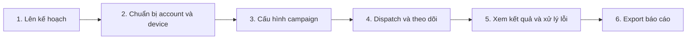
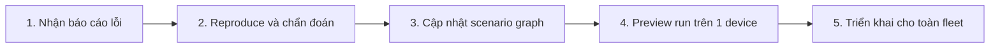
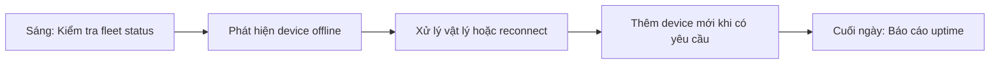
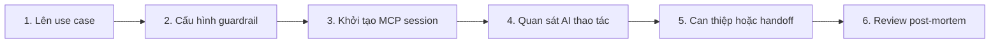

# Personas và Hành trình người dùng

> **Mã tài liệu:** DF-DOC-02-PERSONAS
> **Phiên bản:** 1.0
> **Cập nhật lần cuối:** 2026-05-25
> **Trạng thái:** Approved
> **Đối tượng đọc:** Team Device Farm
> **Tài liệu liên quan:** [Product Overview](01-product-overview.md), [Capability Matrix](03-capability-matrix.md)

## 1. Mục đích tài liệu

Tài liệu này mô tả bốn persona cốt lõi của Device Farm và một persona forward-looking đang được nghiên cứu cho phần mở rộng tương lai, kèm hành trình điển hình của mỗi persona khi sử dụng sản phẩm. Persona được xây dựng theo khung Jobs-to-be-Done (JTBD): mỗi persona có nhu cầu chức năng, nhu cầu cảm xúc, và tín hiệu thành công đo lường được. Hành trình được trình bày theo phong cách swim-lane của Nielsen Norman Group, gồm các giai đoạn, hành động, suy nghĩ, và cơ hội cải thiện sản phẩm.

Tài liệu này phục vụ tham chiếu nội bộ: xác định ai trong các tổ chức triển khai sẽ sử dụng Device Farm và họ sẽ tương tác với sản phẩm như thế nào, đồng thời làm cơ sở khi viết user story và ưu tiên backlog.

## 2. Tóm tắt bốn persona cốt lõi

| Persona | Vai trò tổ chức | Mức kỹ thuật | Tần suất dùng Device Farm |
|---|---|---|---|
| **Social Data Operator** | Đội data, growth, agency | Trung bình — biết cấu hình, không lập trình | Hằng ngày |
| **Automation Builder** | Đội automation, ops, dev intern | Cao — hiểu logic, biết viết JSON | Hằng tuần (build), hằng ngày (debug) |
| **Fleet Operator** | Đội IT ops, hardware, vận hành | Trung bình — biết Android, ADB cơ bản | Hằng tuần |
| **Platform Engineer** | Đội kỹ sư nội bộ Device Farm | Rất cao — đọc code | Hằng ngày trong sprint |

Ngoài bốn persona cốt lõi trên, tài liệu mô tả thêm một persona forward-looking — **AI Operations Supervisor (Preview)** — đang được nghiên cứu cho phần mở rộng tương lai (AI agent control qua MCP — xem [module 10](modules/10-mcp-agent-tools.md) ở trạng thái Preview). Persona này được tách thành mục riêng (3.5) và không nằm trong bảng tóm tắt bốn persona cốt lõi.

## 3. Persona chi tiết

### 3.1 Social Data Operator — Người thu thập dữ liệu social

**Bối cảnh nghề nghiệp.** Làm việc trong đội data, đội growth, hoặc agency cung cấp dịch vụ thu thập dữ liệu social cho khách hàng B2B. Hiểu rõ nghiệp vụ social media (thuật toán feed, hành vi người dùng, quy tắc nền tảng) nhưng không phải developer. Hằng ngày phải chạy nhiều tab trình duyệt, nhiều device test trên bàn, ghi chú thủ công.

**Jobs-to-be-Done.**

*Chức năng:* Thu thập dữ liệu bài post, comment, video, profile trên các social platform mục tiêu ở quy mô hàng nghìn hoặc hàng chục nghìn item mỗi ngày. Đảm bảo dữ liệu có truy vết được tới nguồn (account nào, device nào, lúc nào). Lọc trùng và xuất ra báo cáo cho khách hàng.

*Cảm xúc:* Cảm thấy chủ động và kiểm soát được kết quả thay vì lệ thuộc vào "công cụ hộp đen". Tự tin báo cáo khách hàng rằng dữ liệu thu thập là chính xác.

*Xã hội:* Được đồng nghiệp và quản lý nhìn nhận là "người có thể thu thập được mọi thứ mà người khác không thu được".

**Pain point chính.** Hiện dùng giải pháp tự xây hoặc bot Python tạp ăn — không tin cậy, không evidence, không truy vết. Khi khách hàng đặt câu hỏi "bài này lấy từ đâu", không có cách trả lời. Hằng tuần mất 1–2 ngày để dọn dữ liệu trùng.

**Tín hiệu thành công.** Thu được ít nhất X bài/ngày trên mỗi platform với evidence đầy đủ. Tỷ lệ trùng dưới Y%. Thời gian từ "khách yêu cầu thêm platform" đến "chạy được campaign mới" dưới 2 ngày.

**Quote đại diện.** *"Khách hàng cần dữ liệu hôm qua. Tôi cần một công cụ chạy thay tôi qua đêm, sáng ra có sẵn báo cáo, và khi sếp hỏi 'lấy ở đâu' thì tôi mở ra được."*

**Anti-persona.** Không phải tester app, không phải SOC analyst, không phải researcher học thuật cần dataset chuẩn hóa.

---

### 3.2 Automation Builder — Người dựng kịch bản tự động hóa

**Bối cảnh nghề nghiệp.** Có nền tảng kỹ thuật trung bình–cao. Là dev intern, junior developer, hoặc automation engineer được giao việc dựng scenario cho đội data hoặc đội ops. Đọc được JSON và YAML, hiểu graph và state machine, nhưng không phải full-stack engineer.

**Jobs-to-be-Done.**

*Chức năng:* Tạo và bảo trì các scenario tái sử dụng cho từng platform social, từng nghiệp vụ (crawl feed, crawl comment, post bài, react bài). Scenario phải chạy được trên nhiều device song song với account khác nhau, có nhánh điều kiện cho biến thể UI, có retry cho lỗi tạm thời.

*Cảm xúc:* Cảm thấy tự hào khi scenario chạy mượt và đội data dùng được mà không cần hỏi lại.

*Xã hội:* Được nhìn nhận là "người làm cho hệ thống tự chạy".

**Pain point chính.** Khi UI nền tảng thay đổi, scenario hỏng. Không biết step nào fail nếu không có log chi tiết. Không có cách test scenario trước khi dispatch lên hàng trăm device. Không có cách reuse một đoạn flow trong nhiều scenario.

**Tín hiệu thành công.** Scenario chạy thành công ≥ 95% trên fleet target. Thời gian từ "phát hiện UI thay đổi" đến "scenario được vá" dưới 4 giờ. Tỷ lệ scenario được tái sử dụng giữa các campaign khác nhau ≥ 50%.

**Quote đại diện.** *"Cho tôi xem step nào fail và screenshot lúc nó fail. Tôi sửa được. Đừng bắt tôi đoán."*

**Anti-persona.** Không phải product manager (không quyết định nên thu thập gì), không phải data analyst (không xử lý dữ liệu cuối).

---

### 3.3 Fleet Operator — Người vận hành cụm thiết bị

**Bối cảnh nghề nghiệp.** Làm việc trong đội IT ops, đội hardware, hoặc đội vận hành phòng máy. Quen với ADB, cài Android, sửa hardware. Trách nhiệm chính là giữ cho 100–1000 thiết bị luôn online, sẵn sàng nhận lệnh.

**Jobs-to-be-Done.**

*Chức năng:* Đăng ký device mới vào fleet, gom nhóm device theo dự án/khách hàng, theo dõi trạng thái online/offline, phát hiện device hỏng để xử lý vật lý, recover device sau khi mất kết nối.

*Cảm xúc:* Tự tin rằng đội tự động hóa "luôn có máy chạy" và không gọi lên giữa đêm vì fleet sập.

*Xã hội:* Được đội khác coi như nền móng — "không có fleet thì không có gì để tự động hóa".

**Pain point chính.** Không biết device nào đang offline trong khi đội data đang chờ. Phải cắm USB thủ công kiểm tra. Khi WiFi flap, hàng loạt device drop và phải reconnect thủ công. Không có dashboard cho biết "máy nào yếu pin, máy nào nóng, máy nào treo".

**Tín hiệu thành công.** Tỷ lệ device online ≥ 99% trong giờ vận hành. Thời gian phát hiện device chết dưới 5 phút. Thời gian phục hồi device sau sự cố mạng dưới 10 phút.

**Quote đại diện.** *"Tôi cần một dashboard cho biết máy nào còn sống, máy nào đang dùng, máy nào cần xem lại. Đừng bắt tôi chạy `adb devices` trên 20 cổng."*

**Anti-persona.** Không phải developer (không sửa code), không phải PM (không ưu tiên feature).

---

### 3.4 Platform Engineer — Kỹ sư mở rộng nền tảng

**Bối cảnh nghề nghiệp.** Là kỹ sư nội bộ của Device Farm hoặc là đối tác triển khai nâng cao. Đọc được code Python và TypeScript, hiểu kiến trúc microservice, đã từng làm việc với Temporal, gRPC, hoặc các framework workflow tương tự.

**Jobs-to-be-Done.**

*Chức năng:* Mở rộng năng lực sản phẩm — thêm platform social mới, thêm step type mới, mở rộng MCP tool, tích hợp với hệ thống khách hàng — mà không phá vỡ API/data contract hiện có.

*Cảm xúc:* Tự hào khi module mới của mình tuân thủ contract và không gây regression cho phần khác.

*Xã hội:* Được đội nhìn nhận là người "biết hệ thống chạy thế nào".

**Pain point chính.** Khó tìm điểm bắt đầu khi thêm platform mới — code rải rác, contract không rõ. Khi thay đổi API, frontend client không tự đồng bộ. Module docs lệch với mã nguồn.

**Tín hiệu thành công.** Module mới chỉ chạm đúng các điểm cần chạm. Tài liệu được cập nhật trong cùng PR với mã nguồn. Test pass trên cả unit và integration.

**Quote đại diện.** *"Tôi không muốn vừa code vừa lo phá hệ thống. Cho tôi contract rõ, doc đúng, test đủ."*

**Anti-persona.** Không phải end-user (không dùng dashboard), không phải PM (không quyết định feature).

---

### 3.5 Persona forward-looking — AI Operations Supervisor (Preview)

> **Lưu ý:** Persona đang được nghiên cứu cho phần mở rộng tương lai (AI agent control qua MCP — xem [module 10](modules/10-mcp-agent-tools.md) ở trạng thái Preview). Mọi nội dung dưới đây mô tả một hướng nghiên cứu, không phải vai trò end-user được hỗ trợ trong sản phẩm hiện tại của Device Farm.

**Bối cảnh nghề nghiệp.** Làm việc trong đội AI ops hoặc ML ops, hoặc là một growth ops có nền tảng AI. Đã từng làm việc với Claude, GPT, Gemini, hiểu prompt engineering và tool use. Đang thử nghiệm chuyển dịch một số workflow social sang AI agent để giảm phụ thuộc vào scenario cứng — đây vẫn là use case experimental trên Device Farm.

**Jobs-to-be-Done.**

*Chức năng:* Cấu hình và giám sát AI agent thực hiện các thao tác trên device qua MCP. Đảm bảo AI agent chỉ làm trong phạm vi cho phép (guardrail), thu evidence đầy đủ, và có thể chuyển quyền cho người vận hành khi gặp trạng thái khó.

*Cảm xúc:* Tự tin rằng AI không "làm bậy" mà người không biết. Có khả năng giải thích cho stakeholder rằng AI đang làm gì và tại sao.

*Xã hội:* Được nhìn nhận là người tiên phong đưa AI vào vận hành thực tế chứ không phải demo PowerPoint.

**Pain point chính.** Khi giao việc cho AI agent, không biết nó đang làm gì trên device. Không có cách review hành động sau khi chạy. Không có cách bắt buộc agent dừng lại và bàn giao khi gặp UI lạ. Không có cách thay agent (Claude → GPT) mà không phải viết lại tích hợp.

**Tín hiệu thành công.** AI agent hoàn thành ≥ X% session mà không cần can thiệp thủ công. Mỗi action có screenshot và metadata. Khi agent bàn giao, người vận hành nhận được session ở đúng trạng thái và có thể tiếp tục.

**Quote đại diện.** *"AI hay không AI thì cuối cùng vẫn phải có người chịu trách nhiệm. Cho tôi thấy AI đã làm gì, ở đâu, và tại sao."*

**Anti-persona.** Không phải researcher AI (không quan tâm benchmark model), không phải MLE đào tạo model (chỉ tiêu thụ).

## 4. Hành trình người dùng theo persona

### 4.1 Hành trình của Social Data Operator: chạy chiến dịch crawl feed Facebook qua đêm

**Giai đoạn 1 — Lên kế hoạch.** Người vận hành nhận yêu cầu từ khách hàng: cần 5.000 bài Facebook từ 50 nhóm cụ thể trong 24 giờ. Họ vào dashboard, kiểm tra số device sẵn có và số account khả dụng.

**Giai đoạn 2 — Chuẩn bị account và device.** Người vận hành import danh sách 50 account social vào hệ thống nếu chưa có, gán mỗi account làm primary cho một device, hoặc gom account vào account group để rotation. Đảm bảo proxy phù hợp được cấu hình.

**Giai đoạn 3 — Cấu hình campaign.** Người vận hành chọn scenario template có sẵn (do Automation Builder tạo trước đó) tên "FB Group Feed Crawl". Cấu hình per-device variable: mỗi device target một danh sách group khác nhau. Đặt scenario default config: số bài tối đa per group, pacing giữa các thao tác.

**Giai đoạn 4 — Dispatch và theo dõi.** Người vận hành nhấn "Run campaign". Trên dashboard hiện ngay danh sách execution per device với trạng thái running. Họ rời bàn nhưng đặt một schedule notification để được nhắc nếu campaign fail trên ≥ 10% device.

**Suy nghĩ trong đầu:** "Hy vọng không có account nào bị checkpoint. Nếu có, tôi muốn biết ngay để không tốn thêm device."

**Giai đoạn 5 — Xem kết quả và xử lý lỗi.** Sáng hôm sau, dashboard cho thấy 47/50 device hoàn thành, 3 device fail. Họ mở DLQ, xem screenshot của 3 device fail và hiểu rằng 2 account bị checkpoint, 1 device hết pin. Họ retry 1 device sau khi sạc, vô hiệu hóa 2 account fail.

**Giai đoạn 6 — Export báo cáo.** Họ vào content collection "FB Group Feed - Khách hàng X - Đợt 5", export ra dưới định dạng phù hợp, đính kèm metadata truy vết (campaign id, device serial, account, thời gian thu thập). Gửi khách hàng.

**Cơ hội cải thiện sản phẩm.** Cảnh báo proactive khi account có dấu hiệu sắp bị checkpoint. Quy chuẩn template báo cáo export. Tự động retry với account khác trong cùng group khi account hiện fail.

---

### 4.2 Hành trình của Automation Builder: dựng scenario mới khi UI Instagram thay đổi

**Giai đoạn 1 — Nhận báo cáo lỗi.** Social Data Operator báo: từ tối qua, scenario "IG Feed Crawl" fail trên 80% device. DLQ cho thấy lỗi tập trung ở step `tap_selector` với selector "Comments button".

**Giai đoạn 2 — Reproduce và chẩn đoán.** Automation Builder mở DLQ entry, xem screenshot tại thời điểm fail. UI Instagram đã đổi: button comment giờ là icon bóng nói thay vì text. Họ mở dashboard, reserve một device, manual control để dò selector mới.

**Giai đoạn 3 — Cập nhật scenario graph.** Trong flow editor `/scenario-flow/{id}`, họ tìm step `tap_selector`, cập nhật selector. Cẩn thận hơn, họ thêm một nhánh `if_element` để xử lý cả UI cũ và UI mới — nếu UI cũ thì làm theo selector cũ, nếu UI mới thì làm theo selector mới.

**Suy nghĩ trong đầu:** "Lần sau UI đổi nữa thì không phải sửa lại từ đầu."

**Giai đoạn 4 — Preview run trên 1 device.** Họ tạo một execution preview chạy scenario mới trên một device cô lập. Theo dõi step-by-step, đảm bảo cả hai nhánh đều chạy đúng. Pass.

**Giai đoạn 5 — Triển khai cho toàn fleet.** Họ commit scenario version mới. Báo lại cho Social Data Operator để dispatch lại campaign.

**Cơ hội cải thiện sản phẩm.** Diff giữa scenario version để review trước khi merge. Cảnh báo selector "lạ" trước khi failed. Library selector pattern chung cho từng platform.

---

### 4.3 Hành trình của Fleet Operator: ngày làm việc điển hình

Đầu ngày, Fleet Operator mở dashboard `/dashboard/relay-agents` và `/dashboard/device-farm`. Thấy 247/250 device online. 3 device offline — họ kiểm tra: 1 hết pin, 1 mất WiFi, 1 đang ở trạng thái RECONNECTING từ FSM. Họ cắm sạc device 1, reset router cho device 2, đợi device 3 tự reconnect theo backoff.

Trong ngày, đội Social Data Operator yêu cầu thêm 10 device cho dự án mới. Fleet Operator cắm device, chạy `agent-boot` trên máy host mới, pair từng device. Nhóm 10 device vào device group "Project Y".

Cuối ngày, Fleet Operator xem activity log để báo cáo uptime tuần: 99.3%, đạt mục tiêu nội bộ 99%. Ghi chú device nào hay rớt để tuần sau thay.

**Cơ hội cải thiện sản phẩm.** Dashboard health summary tự động (RAM, pin, nhiệt độ). Alert proactive khi device sắp rớt theo pattern. Bulk pair từ file CSV.

---

### 4.4 Hành trình của Platform Engineer: thêm platform thứ năm vào sản phẩm

Hành trình của Platform Engineer được trình bày ngắn gọn vì đối tượng này không phải end-user thông thường.

Platform Engineer nhận task: hỗ trợ X (platform mới, ví dụ YouTube Shorts). Họ bắt đầu bằng cách đọc tài liệu `modules/08-social-platform-extensions.md` để nắm contract. Họ tạo platform profile tại `platforms/x.md` theo template. Thêm step type mới (`x_open_video_comments`), extraction strategy mới (`x_videos`, `x_comments`), content type mới (`x_video`, `x_comment`). Cập nhật schema và handler. Mở rộng frontend flow editor để hiển thị node mới. Viết test. Cập nhật module docs trong cùng PR.

Sau hai tuần, platform X được tuyên bố ở trạng thái draft target, sẵn sàng cho pilot với khách hàng.

**Cơ hội cải thiện sản phẩm.** Scaffold tool tự sinh khung cho platform mới. Checklist tự kiểm tra mức độ hoàn thiện platform.

---

### 4.5 Hành trình của AI Operations Supervisor: chạy session AI-agent qua MCP

> **Lưu ý:** Hành trình dưới đây mô tả phần mở rộng Preview đang được nghiên cứu, không phải vận hành core hiện tại của sản phẩm. Module MCP Agent Tools đang ở trạng thái Preview; không khuyến cáo dùng cho production-grade workflow.

**Giai đoạn 1 — Lên use case.** Supervisor muốn thử nghiệm: cho AI agent (Claude qua MCP) tự duyệt qua 20 profile TikTok và quyết định profile nào "đáng follow" theo tiêu chí của khách hàng.

**Giai đoạn 2 — Cấu hình guardrail.** Họ định nghĩa rõ trong prompt: agent chỉ được phép scroll, tap follow, tap unfollow. Không được nhắn tin, không được like, không được comment. Nếu UI có dấu hiệu captcha hoặc cảnh báo, dừng và bàn giao.

**Giai đoạn 3 — Khởi tạo MCP session.** Họ chạy MCP server với token user-scoped, agent gọi `df_start_session` lên một device đã reserve.

**Giai đoạn 4 — Quan sát AI thao tác.** Trên dashboard, supervisor mở live view của device. Mỗi action AI thực hiện đều có log: screenshot trước, screenshot sau, tool name, parameter, kết quả. Agent đang scroll feed, đọc profile, ra quyết định follow.

**Suy nghĩ trong đầu:** "Nó đang làm theo prompt. Tốt. Nhưng nếu nó follow nhầm profile, tôi sẽ thấy gì?"

**Giai đoạn 5 — Can thiệp hoặc handoff.** Agent gặp một profile có UI lạ (modal đăng nhập lại). Agent gọi handoff theo guardrail. Supervisor nhận thông báo, mở session, xử lý modal, trả lại session cho agent.

**Giai đoạn 6 — Review post-mortem.** Sau session, supervisor xem activity log của MCP session — 18 follow, 0 unfollow, 1 lần handoff. Xem lại từng quyết định AI, ghi chú vào prompt để cải tiến lần sau.

**Cơ hội cải thiện sản phẩm.** Recording phiên dạng video. Cảnh báo "AI đang làm điều khác thường" dựa trên pattern. Library guardrail template theo platform.

## 5. Ma trận persona ↔ module

Bảng dưới đây liên kết mỗi persona với các module Device Farm mà họ tương tác nhiều nhất, giúp việc ưu tiên module theo persona trở nên rõ ràng hơn.

| Module | Social Data Operator | Automation Builder | AI Ops Supervisor (Preview) | Fleet Operator | Platform Engineer |
|---|---|---|---|---|---|
| Devices & Control Plane | Cao | Cao | Cao | **Rất cao** | Trung bình |
| Agent Boot & Relay | Thấp | Thấp | Thấp | **Rất cao** | Cao |
| Campaigns/Scenarios/Executions | **Rất cao** | **Rất cao** | Trung bình | Thấp | Cao |
| Scheduling | Cao | Trung bình | Trung bình | Thấp | Trung bình |
| Content/Extraction/Artifacts | **Rất cao** | Cao | Cao | Thấp | Cao |
| Accounts & Groups | **Rất cao** | Cao | Trung bình | Thấp | Trung bình |
| Social Platform Extensions | Trung bình | Cao | Cao | Thấp | **Rất cao** |
| Notifications & Analytics | Cao | Cao | Cao | Cao | Trung bình |
| MCP Agent Tools | Thấp | Trung bình | **Rất cao** | Thấp | Cao |
| Frontend / Dashboard | **Rất cao** | **Rất cao** | Cao | **Rất cao** | Trung bình |
| Platform Runtime & API Auth | Thấp | Thấp | Thấp | Trung bình | **Rất cao** |

## 6. Lưu ý khi viết user story

Mỗi user story trong backlog Device Farm nên định danh persona rõ ràng (sử dụng tên persona trong tài liệu này) và liên kết tới ít nhất một module và một use case ID được mô tả trong `modules/*.md`. Cách diễn đạt khuyến nghị:

> *"Là [persona tên đầy đủ tiếng Việt], tôi muốn [hành động cụ thể trong sản phẩm] để [kết quả nghiệp vụ đo lường được]. Acceptance: [tiêu chí kiểm thử]. Liên quan: [module link], [use case ID]."*

Ví dụ:

> *"Là Social Data Operator, tôi muốn nhận notification khi tỷ lệ device fail trong một campaign vượt ngưỡng cấu hình, để tôi can thiệp sớm thay vì đợi đến sáng hôm sau. Acceptance: notification trigger trong vòng 60 giây sau khi tỷ lệ vượt ngưỡng; notification có link tới campaign và danh sách device fail. Liên quan: modules/09-notifications-and-analytics.md, UC-09-04."*

Tham khảo `modules/*.md` để có danh sách use case ID đầy đủ.
