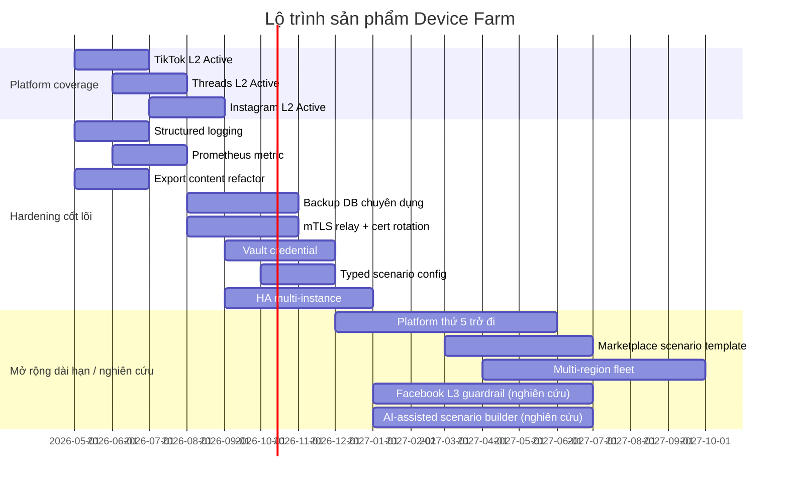

# Lộ trình, Chỉ số thành công & Câu hỏi thường gặp

> **Mã tài liệu:** DF-DOC-99-ROADMAP-FAQ
> **Phiên bản:** 1.0
> **Cập nhật lần cuối:** 2026-05-25
> **Trạng thái:** Approved
> **Đối tượng đọc:** Team Device Farm
> **Tài liệu liên quan:** [Product Overview](01-product-overview.md), [Capability Matrix](03-capability-matrix.md), [Module Index](modules/README.md)

## 1. Mục đích tài liệu

Tài liệu này gồm ba phần. Phần đầu trình bày lộ trình sản phẩm Device Farm theo các khung thời gian ngắn hạn, trung hạn, dài hạn — kèm các hạng mục hardening còn lại. Phần hai chuẩn hóa bộ chỉ số thành công (KPI) ở cấp sản phẩm và ánh xạ chúng tới từng module. Phần ba là tập câu hỏi thường gặp, kèm câu trả lời chính thức.

Tài liệu này là điểm tham chiếu để team có câu trả lời nhất quán khi có câu hỏi về tương lai sản phẩm. Khi nội dung tại đây và nội dung trong PRD chính (`docs/product/prd.md`) khác biệt, PRD thắng và tài liệu này phải được cập nhật trong cùng release.

## 2. Lộ trình sản phẩm

Lộ trình được chia làm ba khoảng thời gian. Mỗi hạng mục được khai báo trạng thái (Đang triển khai / Trong backlog ưu tiên / Nghiên cứu) để tránh kỳ vọng sai lệch.

### 2.1 Ngắn hạn — Quý hiện tại

Trong quý hiện tại, ưu tiên cao nhất là **đẩy ba platform Draft (TikTok, Threads, Instagram) lên trạng thái Active ở mức L2**, đi đôi với fleet automation hardening và observability. Cụ thể:

Hoàn thiện platform profile cho TikTok với parser, handler, frontend node, test, và content type `tiktok_video` cùng `tiktok_comment`. Hoàn thiện platform profile cho Threads với content type `threads_post` (không dùng `thread` generic), parser, và bộ test cơ bản. Hoàn thiện platform profile cho Instagram với content type `ig_media`, `ig_comment`, `ig_profile`, kèm cảnh báo riêng về account safety vì Instagram là nền tảng có rủi ro checkpoint cao.

Song song, đội Engineering triển khai một số hạng mục hardening tối thiểu: **structured logging** thống nhất xuyên hệ thống, **Prometheus metric** cho các chỉ số sản phẩm cốt lõi (device online rate, campaign success rate), và **export content** được refactor sau khi migration `031_drop_content_exports` xóa export cũ.

Hạng mục guardrail L3 cho Facebook (định nghĩa action cap, evidence requirement, handoff condition cho AI agent) **không nằm trong ngắn hạn**; đã được chuyển xuống nhóm dài hạn / nghiên cứu cùng các hạng mục AI / MCP khác.

### 2.2 Trung hạn — 3 đến 6 tháng tới

Trong giai đoạn 3–6 tháng tới, ưu tiên dịch chuyển sang **hardening sản phẩm cho triển khai production-grade**. Các hạng mục quan trọng nhất:

**Backup cơ sở dữ liệu chuyên dụng.** Hiện cơ sở dữ liệu Postgres đang chạy với Docker volume cục bộ. Trong khung thời gian này, team triển khai backup tự động với WAL archiving và point-in-time recovery, đáp ứng yêu cầu RPO/RTO của triển khai enterprise. **mTLS cho relay transport.** Hiện gRPC relay đang dùng kênh không mã hóa (insecure) và shared static API key. Team triển khai mTLS với per-agent certificate, hỗ trợ rotation. **Vault-backed reference cho credential.** Hiện account credential vẫn được chấp nhận dưới dạng free-form JSON. Team triển khai vault integration để scenario reference credential qua secret ID thay vì plaintext. **Typed config schema cho scenario.** Hiện scenario config là free-form JSON. Team giới thiệu schema validation cho các trường quan trọng, đồng thời giữ backward compatibility với free-form. **High-availability multi-instance farm backend.** Hiện một số state vẫn ở in-memory (AdbRelayManager singleton, TaskQueue non-Temporal path). Team tách state ra Redis/Postgres để cho phép active-active deployment.

### 2.3 Dài hạn — 6 đến 12 tháng tới

Trong dài hạn, các hướng đầu tư chiến lược và nghiên cứu:

**Mở rộng platform thứ năm trở đi.** Sau khi 4 platform mục tiêu đầu (TikTok/Threads/Facebook/Instagram) đều Active, team mở rộng theo nhu cầu thực tế từ use case triển khai — ưu tiên YouTube Shorts, X (Twitter), LinkedIn, Reddit tùy thị trường. Mỗi platform mới đi qua contract Social Platform Extensions, ước tính 2–4 tuần engineering. **Marketplace nội bộ cho scenario template.** Cho phép chia sẻ scenario template trong cùng tổ chức, có versioning, có review, có rating. **Multi-region fleet.** Cho phép một tổ chức quản lý device ở nhiều khu vực địa lý với routing thông minh.

Nhóm nghiên cứu AI / MCP (không cam kết timeline): **Guardrail L3 cho Facebook và các platform khác** — định nghĩa action cap, evidence requirement, handoff condition cho AI agent. **AI-assisted scenario builder** — tận dụng AI để giảm thời gian dựng scenario từ giờ xuống phút: người dựng mô tả ý định bằng ngôn ngữ tự nhiên, AI gợi ý step graph, người dựng review và điều chỉnh. **Multi-agent cooperation** — cho phép nhiều AI agent phối hợp trên một workflow.

> **Lưu ý:** Các hạng mục AI / MCP nằm trong nhóm nghiên cứu, chưa cam kết timeline. Đây là phần mở rộng preview, không phải năng lực cốt lõi hiện tại của Device Farm.

### 2.4 Hạng mục hardening còn lại

Bảng dưới đây liệt kê đầy đủ các hạng mục hardening đã được nhận diện trong architecture review, kèm trạng thái và ưu tiên. Khi đánh giá triển khai quy mô lớn, bảng này nên được xem như một phần của due diligence.

| Hạng mục | Mô tả ngắn | Mức rủi ro hiện tại | Ưu tiên |
|---|---|---|---|
| Backup database chuyên dụng | Postgres backup tự động + WAL archiving | Cao | P0 — Trung hạn |
| mTLS relay transport | Mã hóa kênh gRPC + per-agent cert | Cao | P0 — Trung hạn |
| Rotation RELAY_API_KEY | Per-agent identity thực sự, không shared key | Cao | P0 — Trung hạn |
| HA multi-instance farm | Tách state in-memory ra Redis/Postgres | Cao | P0 — Trung hạn |
| Persist TaskQueue non-Temporal | Đảm bảo at-least-once cho mọi path | Trung bình | P1 — Trung hạn |
| Vault-backed credential | Scenario reference secret qua vault | Trung bình | P1 — Trung hạn |
| Typed scenario config | Validation cho trường quan trọng | Trung bình | P1 — Trung hạn |
| Structured logging | Log có cấu trúc, ship được sang ELK/Loki | Trung bình | P1 — Ngắn hạn |
| Prometheus metric | Scrape endpoint cho metric sản phẩm | Trung bình | P1 — Ngắn hạn |
| Distributed tracing | OpenTelemetry tracing xuyên service | Thấp | P2 — Dài hạn |
| SSO / SAML / OIDC | Đăng nhập doanh nghiệp | Thấp | P2 — Dài hạn |
| Audit log frontend action | Ghi nhận hành động UI ngoài backend log | Thấp | P2 — Dài hạn |
| Concurrency lock schedule | Tránh 2 schedule trùng giờ chạy chồng | Thấp | P2 — Trung hạn |
| Webhook retry policy + HMAC ký | Đảm bảo delivery + tránh giả mạo | Thấp | P2 — Trung hạn |
| Refactor `control-record-view.tsx` | Component frontend 1070 dòng | Thấp | P3 — Dài hạn |
| Migrate khỏi dual JWT storage | Giảm rủi ro XSS với localStorage | Thấp | P2 — Trung hạn |

### 2.5 Sơ đồ tổng quan lộ trình

## 3. Chỉ số thành công cấp sản phẩm

Chỉ số thành công ở cấp sản phẩm phản ánh xem Device Farm có đang phục vụ tốt các use case triển khai và đạt mục tiêu chiến lược không. Các KPI dưới đây được đo lường hàng tháng và báo cáo nội bộ cho team Product.

### 3.1 KPI nghiệp vụ cốt lõi

| Lĩnh vực | KPI | Mục tiêu | Cách đo |
|---|---|---|---|
| Thu thập dữ liệu social | Số content item thu thập được mỗi ngày trên fleet | Theo cam kết của use case triển khai (thường 10.000–100.000) | Đếm trong content_items, group theo platform |
| Truy vết bằng chứng | Tỷ lệ content item có đầy đủ traceability (campaign, device, account, execution) | ≥ 99% | Kiểm tra null trên field traceability |
| Phạm vi tự động hóa | Tỷ lệ workflow social phổ biến biểu diễn được bằng scenario | ≥ 90% cho platform Active | Khảo sát người dựng |
| Cấp coverage | Số platform khai báo trạng thái L1/L2/L3 rõ ràng | 4/4 platform mục tiêu | Tra cứu capability matrix |
| Độ tin cậy fleet | Tỷ lệ device online trong giờ vận hành | ≥ 99% | Heartbeat từ relay |
| Độ tin cậy execution | Tỷ lệ execution kết thúc ở trạng thái terminal (completed/failed/cancelled) thay vì treo | ≥ 99% | Đếm execution không có terminal state sau N giờ |
| Tỷ lệ scenario thành công | Tỷ lệ execution hoàn thành thành công | ≥ 95% trên platform Active | execution.status = completed |
| Chất lượng triển khai | Tỷ lệ tính năng mới đồng bộ giữa module docs, API route matrix, data schema, generated client | ≥ 95% | Audit định kỳ |
| Khả năng theo dõi vận hành | Tỷ lệ event có entry trong activity log | ≥ 99% | Đối chiếu domain event với activity log |

**Nhóm KPI forward-looking (Preview — chưa nằm trong KPI cốt lõi):**

| Lĩnh vực | KPI | Mục tiêu | Cách đo |
|---|---|---|---|
| AI vận hành (Preview) | Tỷ lệ MCP session hoàn thành không cần handoff | ≥ X% (theo từng use case triển khai) | mcp_sessions completion |

KPI nhóm forward-looking phản ánh phần mở rộng AI agent qua MCP đang ở trạng thái preview, không phải năng lực cốt lõi của sản phẩm hiện tại.

### 3.2 KPI vận hành kỹ thuật

Các chỉ số này không phải nội dung mà use case nghiệp vụ quan tâm trực tiếp, nhưng được team Engineering theo dõi để đảm bảo sản phẩm chạy ổn định:

| Lĩnh vực | KPI | Mục tiêu |
|---|---|---|
| API availability | Tỷ lệ uptime endpoint `/api/*` | ≥ 99.5% |
| Latency | Scenario start latency p95 | < 5 giây |
| Latency | Frame delivery latency p95 (live stream) | < 200ms |
| Latency | Notification delivery latency p95 | < 30 giây |
| Lỗi | Tỷ lệ 5xx trên `/api/*` | < 0.5% |
| Phục hồi | MTTR (Mean Time To Recover) cho sự cố P0 | < 30 phút |
| Recovery | Thời gian phục hồi device sau sự cố mạng | < 10 phút |

### 3.3 Ánh xạ KPI tới module

| Module | KPI chính |
|---|---|
| Nền tảng & Bảo mật truy cập | API availability, tỷ lệ 5xx |
| Thiết bị & Mặt phẳng điều khiển | Device online rate, frame latency, gesture success rate |
| Agent Boot & Relay | Heartbeat freshness, reconnect time, mass-fail rate |
| Campaign, Scenario & Execution | Scenario success rate, DLQ rate, scenario start latency |
| Lập lịch | Schedule run success rate, delay từ tick |
| Trích xuất nội dung & Artifact | Số content item theo platform, deduplication rate, extraction failure rate |
| Account & Account Group | Account active/banned ratio, rotation hit rate |
| Mở rộng nền tảng social | Số platform Active, số step/strategy mỗi platform |
| Thông báo & Analytics | Notification delivery rate, webhook success rate |
| Công cụ AI Agent qua MCP | MCP session count, MCP tool error rate, handoff rate |
| Frontend & Dashboard | Page load time, UI error rate, generated client parity coverage |

## 4. Câu hỏi thường gặp

Phần này tập hợp các câu hỏi thường gặp khi đánh giá hoặc triển khai Device Farm, kèm câu trả lời chính thức.

### 4.1 Câu hỏi về định vị sản phẩm

**Hỏi:** Device Farm có phải là phiên bản thay thế cho STF (Smartphone Test Farm), Maestro, hoặc Droidrun không?

Không. Device Farm là sản phẩm chuyên biệt cho nghiệp vụ social automation và data collection, không phải sản phẩm chung cho mobile testing. STF/Maestro/Droidrun là các công cụ rất tốt cho test app — Device Farm không cạnh tranh ở phân khúc đó. Use case cần test app mobile generic vẫn nên dùng các công cụ chuyên dụng. Device Farm phù hợp khi: (a) cần tự động hóa workflow social ở quy mô lớn, (b) cần thu thập dữ liệu social có truy vết, (c) cần đưa AI agent vào vận hành với guardrail.

**Hỏi:** Device Farm có thể dùng cho test app mobile không?

Có thể, nhưng không phải focus. Các primitive L1 (gesture, hierarchy, screenshot, stream) đủ dùng cho việc điều khiển một device thực hiện kịch bản kiểm thử. Tuy nhiên, Device Farm không có test reporting, test suite management, flaky test analytics — những thứ này là focus của Maestro/Appium. Đánh giá: dùng được cho test ad-hoc; không khuyến cáo cho test ở quy mô CI/CD.

**Hỏi:** Device Farm có giả lập (emulator) không? Có thể chạy không cần device thật không?

Không. Device Farm chuyên biệt cho **device Android thật**. Quyết định thiết kế này có chủ ý: nhiều platform social phát hiện được emulator và áp checkpoint chặt; dữ liệu thu được từ device thật chân thực hơn. Use case cần emulator có thể tham khảo Android Studio Emulator hoặc Genymotion.

### 4.2 Câu hỏi về platform support

**Hỏi:** Triển khai Device Farm hôm nay có thể crawl được TikTok/Instagram không?

Có thể, nhưng có giới hạn. Cả TikTok và Instagram đều ở trạng thái **Draft target** — chưa có step type và extraction strategy chuyên biệt. Vẫn có thể dùng các step generic (`tap`, `tap_selector`, `swipe`, `extract` với strategy `screen_data`, OCR, AI vision) để tự dựng scenario. Tuy nhiên, các content type `tiktok_video`, `tiktok_comment`, `ig_media`, `ig_comment`, `ig_profile` chưa có parser. Khuyến nghị: hoặc đợi roadmap đẩy 3 platform này lên Active (Q hiện tại), hoặc phối hợp với team Platform Engineer để hoàn thiện theo contract Social Platform Extensions.

**Hỏi:** Device Farm có hỗ trợ X (YouTube, LinkedIn, Reddit, Twitter, Pinterest...) không?

Hiện không có trong roadmap ngắn hạn. Sau khi 4 platform mục tiêu đầu (TikTok/Threads/Facebook/Instagram) đều Active, team mở rộng theo nhu cầu thực tế. Nhu cầu cụ thể có thể được gửi tới team Product để đưa vào pipeline đánh giá.

**Hỏi:** Khi platform social thay đổi UI, Device Farm có tự cập nhật không?

Không tự động. Khi UI nền tảng thay đổi, scenario có thể fail ở step `tap_selector` hoặc step extraction. Người dựng kịch bản tự động hóa cần cập nhật selector hoặc graph để xử lý UI mới. Khuyến nghị thêm nhánh `if_element` để xử lý cả UI cũ và mới — giảm rủi ro khi nền tảng đổi đột ngột.

### 4.3 Câu hỏi về AI và MCP

**Hỏi:** Device Farm có hỗ trợ AI agent không?

Có, Device Farm có module MCP Agent Tools cho phép AI agent điều khiển device qua giao thức Model Context Protocol — tuy nhiên đây là **phần mở rộng ở trạng thái Preview**, không phải năng lực cốt lõi hiện tại của sản phẩm. **Không khuyến cáo dùng cho production-grade workflow.** Module này phù hợp cho thử nghiệm, proof-of-concept, và đánh giá nội bộ về hướng "đưa AI vào vận hành có guardrail"; năng lực cốt lõi để dựa vào ngày hôm nay là tự động hóa scenario và thu thập dữ liệu social ở quy mô fleet.

**Hỏi:** AI agent qua MCP có thể tự động làm mọi việc không?

Không. AI agent qua MCP làm việc trong **phạm vi guardrail** mà người giám sát định nghĩa. Hiện tại, guardrail platform-specific cho TikTok/Threads/Instagram chưa được khai báo đầy đủ — chỉ Facebook ở mức Foundation. Cần lưu ý: đây là phần mở rộng preview của Device Farm, không phải năng lực cốt lõi. Khuyến nghị: bắt đầu với use case hẹp, prompt rõ ràng, theo dõi sát qua activity log; mở rộng dần khi đã tin tưởng pattern.

**Hỏi:** MCP hỗ trợ AI model nào?

MCP là giao thức chuẩn của Anthropic. Bất kỳ AI agent nào hỗ trợ MCP đều có thể gọi tool của Device Farm — bao gồm Claude (Anthropic), một số phiên bản của GPT (OpenAI) qua MCP wrapper, và Gemini (Google) qua MCP wrapper. Sản phẩm không lock vào model cụ thể. Cần nhắc lại: tích hợp MCP là phần mở rộng preview, không phải năng lực cốt lõi hiện tại.

**Hỏi:** AI có thể điều khiển nhiều device cùng lúc không?

Mô hình hiện tại là **1 AI agent ↔ 1 device hoặc 1 session**. Khi cần nhiều device, dùng nhiều agent song song. Multi-agent cooperation đang trong nghiên cứu, chưa có roadmap cụ thể. Toàn bộ hướng này nằm trong nhóm preview — đây là phần mở rộng đang được nghiên cứu, không phải năng lực cốt lõi hiện tại.

### 4.4 Câu hỏi về bảo mật và compliance

**Hỏi:** Device Farm đã đạt SOC 2, ISO 27001, GDPR chưa?

Hiện chưa. Device Farm đang ở giai đoạn staging-ready, một số hạng mục hardening (mTLS, vault credential, backup chuyên dụng, structured logging) còn trong roadmap trung hạn. Use case cần compliance certification cụ thể có thể được thảo luận với team Product để đưa vào pilot scope.

**Hỏi:** Account social được lưu ở đâu? Có an toàn không?

Account và metadata lưu trong Postgres với cấu trúc CRUD chuẩn. **Hiện chưa có vault integration**, nên credential cần được xử lý cẩn trọng. Khuyến nghị: không đặt password plaintext trong scenario config; dùng device_accounts link để gán account cho device và để scenario reference qua account_group_id thay vì credential trực tiếp. Vault-backed credential nằm trong roadmap trung hạn.

**Hỏi:** Dữ liệu thu thập (content_items) được lưu ở đâu? Có thể export ra ngoài không?

Content lưu trong Postgres với object lớn (screenshot, hierarchy) lưu ở MinIO/S3. **Export content đang trong giai đoạn refactor** sau khi migration `031_drop_content_exports` xóa export cũ — use case cần export sản xuất có thể phối hợp với đội triển khai để có giải pháp tạm thời.

**Hỏi:** Khi device hoặc relay agent bị compromise, hệ thống có cô lập được không?

Hiện một số hạn chế: gRPC relay chưa có TLS, RELAY_API_KEY shared static. Trong khoảng thời gian trung hạn, mTLS với per-agent certificate được triển khai, cho phép revoke cert riêng lẻ. Trước thời điểm đó, khuyến nghị triển khai Device Farm trong network nội bộ hoặc qua VPN/Tailscale (xem `docs/operations/tailscale-setup.md`).

### 4.5 Câu hỏi về triển khai và vận hành

**Hỏi:** Bao nhiêu device là tối đa cho một deployment Device Farm?

Trên lý thuyết không có cap cứng. Trên thực tế hiện tại, deployment đơn instance khuyến cáo trong khoảng 50–200 device do giới hạn của Dispatcher threading model và in-memory state. Khi HA multi-instance được triển khai (trung hạn), số lượng device có thể mở rộng đáng kể.

**Hỏi:** Device Farm hỗ trợ Android phiên bản nào?

Hỗ trợ Android 8.0 trở lên. Một số tính năng (scrcpy stream chất lượng cao) hoạt động tốt hơn trên Android 11+. Phiên bản Android cũ vẫn dùng được nhưng có thể gặp limitation về UI hierarchy.

**Hỏi:** Có cần root device không?

Không bắt buộc. Device Farm dùng ADB và uiautomator2 — không yêu cầu root. Một số tính năng nâng cao (như chặn ứng dụng, tweak system) sẽ yêu cầu root nhưng không nằm trong scope chính.

**Hỏi:** Bao lâu thì triển khai xong Device Farm cho một use case mới?

Pilot deployment cơ bản: 1–2 tuần (cài đặt infrastructure, pair vài device, test 1 platform). Production-ready deployment ở quy mô: 4–8 tuần tùy số device, số platform, mức độ tích hợp với hệ thống bên ngoài.

### 4.6 Câu hỏi về roadmap và đầu tư

**Hỏi:** Device Farm có open-source không?

Hiện không open-source. Sản phẩm thuộc bản quyền của team Product. Tuy nhiên, team cân nhắc open-source một số component cụ thể (ví dụ contract Social Platform Extensions, MCP tool definition) trong dài hạn.

**Hỏi:** Có thể phản hồi về roadmap qua kênh nào?

Qua kênh hỗ trợ chính thức được thông báo riêng cho từng triển khai. Team Product họp review roadmap hàng tháng và ưu tiên hóa theo nhu cầu thực tế cùng cường độ kỹ thuật.

## 5. Câu hỏi sản phẩm còn mở

Một số câu hỏi chiến lược chưa có câu trả lời chính thức và đang được team Product làm việc cùng các pilot để chốt:

**Persona ưu tiên cho milestone tiếp theo.** Trong bốn persona cốt lõi (Social Data Operator, Automation Builder, Fleet Operator, Platform Engineer), đâu là persona nên được đầu tư nhiều nhất ở milestone kế? Mỗi lựa chọn dẫn tới một roadmap khác nhau. Persona forward-looking AI Operations Supervisor (Preview) chưa được đưa vào danh sách ưu tiên milestone vì module MCP Agent Tools còn ở trạng thái preview.

**Mức quality bar tối thiểu cho một capability "complete".** Một capability nên được coi là hoàn thành khi: chỉ có API, hay phải có thêm frontend, hay phải có thêm test và runbook? Câu trả lời ảnh hưởng tới tốc độ ship và mức độ thoải mái khi handover ra ngoài.

**Cho phép module docs drive implementation hay phải qua PRD.** Hiện sản phẩm có cả PRD lẫn module docs làm chân lý. Có nên cho phép một capability mới chỉ cần ở module docs, hay mọi capability phải xuất hiện trong PRD trước với acceptance checklist?

Phản hồi về các câu hỏi này có thể gửi tới team Product. Mọi phản hồi đều được ghi nhận và đưa vào discussion của team.
