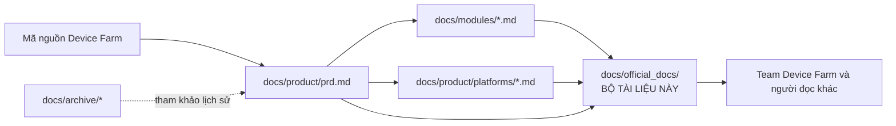

# Device Farm — Bộ tài liệu nghiệp vụ chính thức

> **Mã tài liệu:** DF-DOC-INDEX
> **Phiên bản:** 1.0
> **Cập nhật lần cuối:** 2026-05-25
> **Trạng thái:** Approved
> **Đối tượng đọc:** Team Device Farm

## Giới thiệu

Bộ tài liệu này được team Device Farm duy trì để mô tả sản phẩm ở góc nhìn **sản phẩm và nghiệp vụ**, bổ trợ cho tài liệu kỹ thuật triển khai. Tài liệu phục vụ tham chiếu nội bộ trong team khi lập kế hoạch, ưu tiên backlog, viết user story, hoặc trả lời câu hỏi nghiệp vụ, và có thể được chia sẻ ra ngoài khi cần.

Mọi mô tả nghiệp vụ trong bộ tài liệu này được trích xuất, chuẩn hóa và Việt hóa từ nguồn chân lý của sản phẩm tại `docs/product/prd.md`, các đặc tả module tại `docs/modules/`, và các hồ sơ nền tảng social tại `docs/product/platforms/`. Mã nguồn được giữ ngoài bộ tài liệu này; chỉ sơ đồ Mermaid được dùng để minh họa luồng nghiệp vụ. Khi có khác biệt giữa tài liệu nghiệp vụ và mã nguồn, mã nguồn là chân lý và bộ tài liệu được cập nhật trong cùng một thay đổi.

## Cấu trúc bộ tài liệu

```
docs/official_docs/
├── README.md                            ← Index hiện tại
├── 00-glossary.md                       Bảng thuật ngữ tiếng Anh – Việt
├── 01-product-overview.md               Tổng quan sản phẩm, định vị, capability map
├── 02-personas-and-journeys.md          Personas và hành trình người dùng
├── 03-capability-matrix.md              Ma trận năng lực L1/L2/L3 theo platform
├── modules/
│   ├── README.md                        Bản đồ module nghiệp vụ
│   ├── 01-platform-runtime-and-access.md
│   ├── 02-devices-and-control-plane.md
│   ├── 03-agent-boot-and-relay.md
│   ├── 04-campaigns-scenarios-executions.md
│   ├── 05-scheduling.md
│   ├── 06-content-extraction-artifacts.md
│   ├── 07-accounts-and-groups.md
│   ├── 08-social-platform-extensions.md
│   ├── 09-notifications-and-analytics.md
│   ├── 10-mcp-agent-tools.md
│   └── 11-frontend-dashboard.md
├── platforms/
│   ├── README.md                        Tổng quan các social platform được hỗ trợ
│   ├── facebook.md
│   ├── tiktok.md
│   ├── threads.md
│   └── instagram.md
└── 99-roadmap-and-faq.md                Lộ trình, KPI và câu hỏi thường gặp
```

## Thứ tự đọc đề xuất

Tài liệu có thể được đọc theo các lộ trình khác nhau tùy mục đích, để rút ngắn thời gian tiếp cận sản phẩm.

**Lộ trình 30 phút — tổng quan nhanh:**

1. `01-product-overview.md` — hiểu Device Farm giải bài toán gì, cho ai.
2. `03-capability-matrix.md` — đánh giá nhanh năng lực hiện có theo platform.
3. `99-roadmap-and-faq.md` — biết lộ trình và những giới hạn cần lưu ý.

**Lộ trình 2 giờ — hiểu sản phẩm và backlog:**

1. `01-product-overview.md` → `02-personas-and-journeys.md` → `03-capability-matrix.md`.
2. `modules/README.md` để có bản đồ phân chia trách nhiệm giữa các module.
3. Đọc lần lượt các module tại `modules/` theo thứ tự đánh số.
4. Đọc 4 hồ sơ platform tại `platforms/` để hiểu phạm vi tự động hóa và thu thập dữ liệu cho từng nền tảng social.
5. `99-roadmap-and-faq.md`.

**Đọc theo nhu cầu — tra cứu use case và test:**

1. `00-glossary.md` — nắm thuật ngữ trước khi vào use case.
2. Mở từng `modules/*.md` để lấy bảng đặc tả tính năng (Functional Spec) và Use Case ID.
3. Tham chiếu `platforms/*.md` khi viết test case phụ thuộc nền tảng.

## Quy ước văn phong và thuật ngữ

Bộ tài liệu tuân thủ các quy ước sau để đảm bảo tính nhất quán xuyên suốt:

Thuật ngữ chuẩn ngành tiếng Anh được **giữ nguyên** trong văn bản tiếng Việt. Cụ thể: API, fleet, scenario, campaign, execution, workflow, MCP, ADB, OCR, JWT, webhook, và các tên riêng kỹ thuật khác. Khi một thuật ngữ xuất hiện lần đầu trong một tài liệu, kèm theo chú thích tiếng Việt ngắn trong ngoặc đơn — ví dụ "fleet (cụm thiết bị)". Bảng đầy đủ nằm tại `00-glossary.md`.

Vai trò người dùng được Việt hóa: "operators" → "người vận hành", "automation builder" → "người dựng kịch bản tự động hóa", "supervisor" → "người giám sát". Khi cần ngắn gọn trong sơ đồ, dạng tiếng Anh nguyên bản được dùng và ghi chú trong glossary.

Cách xưng hô: tài liệu dùng giọng impersonal khi mô tả sản phẩm; khi cần nói về team viết tài liệu, dùng "team" hoặc "chúng tôi" (team Device Farm).

Mỗi tài liệu module áp dụng cấu trúc 10 phần cố định (Tóm tắt, Bối cảnh & Vấn đề, Phạm vi, Personas & Use Cases, Luồng nghiệp vụ chính, Đặc tả tính năng, Capability Matrix, Giới hạn & Rủi ro, KPIs, Glossary refs & Open questions) để có thể đọc đối chiếu giữa các module mà không cần đoán cấu trúc.

## Quan hệ với các tập tài liệu khác



Bộ `official_docs` được sinh ra từ ba nguồn chân lý nội bộ: PRD, module specs, và platform profiles. Bộ này **không** là chân lý kỹ thuật — khi có khác biệt với mã nguồn hoặc PRD, hai nguồn đó thắng. Bộ này tập trung vào việc trình bày dễ tiếp cận, không thêm yêu cầu sản phẩm mới.

## Mức độ hoàn thiện hiện tại

Mức độ hoàn thiện được khai báo minh bạch theo từng module và từng platform để tránh kỳ vọng sai lệch. Trạng thái sản phẩm tổng thể: **staging-ready** — phù hợp triển khai pilot, đánh giá nội bộ, và proof-of-concept cho use case khách hàng; chưa khuyến cáo chạy production-grade ở quy mô lớn nếu chưa hoàn thiện các hạng mục hardening được liệt kê trong `99-roadmap-and-faq.md`.

Trong bốn social platform mục tiêu, **Facebook đang ở trạng thái L2 active** (đạt yêu cầu để được coi là "supported"); TikTok, Threads, Instagram đang ở trạng thái **draft target** — có khung contract và định hướng coverage, nhưng chưa có parser, handler, và frontend support hoàn chỉnh. Cấp L3 (MCP agent tools) là phần mở rộng preview / experimental, không bắt buộc cho trạng thái Active của một platform; Facebook hiện có L3 foundation ở dạng nghiên cứu. Chi tiết tại `03-capability-matrix.md` và `platforms/*.md`.

## Liên hệ và cập nhật

Tài liệu được duy trì bởi team Product của Device Farm. Đề xuất chỉnh sửa hoặc câu hỏi nghiệp vụ được gửi qua kênh hỗ trợ chính thức (định danh đầu mối liên hệ được thông báo riêng cho từng triển khai).
