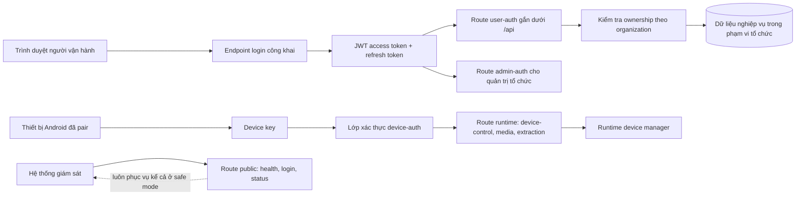
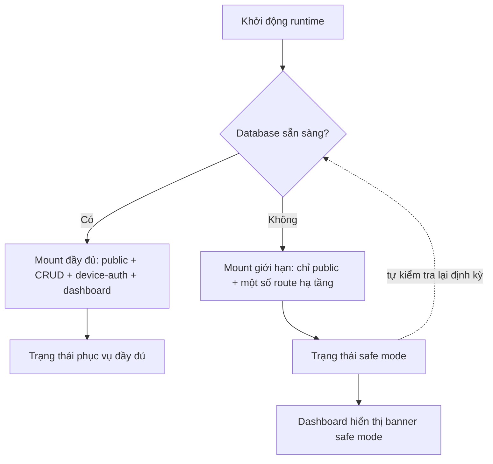

# Nền tảng & Bảo mật truy cập (Platform Runtime & API Auth/Tenancy)

> **Mã module:** DF-MOD-01
> **Phiên bản:** 1.0
> **Cập nhật lần cuối:** 2026-05-25
> **Trạng thái:** Active
> **Đối tượng đọc:** Team Device Farm
> **Tài liệu liên quan:** [Product Overview](../01-product-overview.md), [Glossary](../00-glossary.md), [Personas & Journeys](../02-personas-and-journeys.md), [Devices & Control Plane](02-devices-and-control-plane.md), [Agent Boot & Relay](03-agent-boot-and-relay.md)

## 1. Tóm tắt (TL;DR)

Module Nền tảng & Bảo mật truy cập là lớp hạ tầng cốt lõi mà mọi module khác của Device Farm dựa lên. Module này sở hữu việc khởi động runtime, lắp ráp toàn bộ HTTP route, xác thực người dùng qua JWT, xác thực thiết bị qua device key, cô lập dữ liệu giữa các tổ chức khách hàng theo mô hình multi-tenancy, chế độ safe mode khi cơ sở dữ liệu tạm tắt, và entrypoint cho kênh WebSocket realtime. OpenAPI spec do backend xuất bản là chân lý duy nhất cho mọi tích hợp client; thư viện TypeScript được sinh tự động từ spec này phục vụ dashboard. Đây là nền móng kỹ thuật để các module nghiệp vụ phía trên có ranh giới rõ về quyền và phạm vi dữ liệu.

## 2. Bối cảnh & Vấn đề giải quyết

Một sản phẩm SaaS B2B phục vụ nhiều tổ chức khách hàng (organization) cần ba bảo đảm cơ bản trước khi bàn tới chuyện tự động hóa social media. Thứ nhất, danh tính người gọi phải rõ — là người vận hành đang đăng nhập, là thiết bị Android đang gọi runtime API, hay là tiến trình tự động không cần xác thực. Thứ hai, dữ liệu của tổ chức này không được rò sang tổ chức khác. Thứ ba, khi một số thành phần phụ trợ tạm sự cố (ví dụ cơ sở dữ liệu cần restart), những route công khai như health check vẫn phải trả lời để giám sát hạ tầng hoạt động.

Device Farm giải ba bài toán này tại cùng một lớp. Lớp này chịu trách nhiệm gắn (mount) từng nhóm route vào đúng auth boundary, gắn middleware xác thực, và quyết định những thành phần nào còn được phục vụ khi safe mode được kích hoạt. Mọi tính năng nghiệp vụ phía trên — campaign, scenario, device, content — đều phải đi qua ranh giới này; không có "shortcut" để bypass.

## 3. Phạm vi

### 3.1 In-scope

Module này sở hữu khởi động tiến trình runtime (lifecycle), lắp ráp ứng dụng FastAPI, khai báo bốn auth boundary (public / user-auth / admin-auth / device-auth), cấp và xác thực JWT cho người dùng cuối, cấp và xác thực device key cho thiết bị Android gọi runtime API, mô hình tổ chức (organization) và thành viên tổ chức (organization members), chế độ safe mode khi database tạm không sẵn sàng, entrypoint cho kênh WebSocket dùng cho stream và event realtime, công bố OpenAPI spec làm chân lý API, và quy trình sinh thư viện TypeScript client để dashboard sử dụng. Module này cũng định nghĩa quy ước rằng kiểm tra ownership chi tiết (ai sở hữu campaign này, scenario này) là trách nhiệm của từng route nghiệp vụ — module này chỉ bảo đảm danh tính đã được xác minh trước khi route nghiệp vụ chạy.

### 3.2 Out-of-scope

Module này không sở hữu logic nghiệp vụ của bất kỳ domain nào — không xử lý scenario step, không rotate account, không quyết định device nào nhận lệnh, không validate dữ liệu social platform. Module này không sở hữu giao diện người dùng (dashboard); nó chỉ cung cấp OpenAPI spec để frontend tự sinh client. Module này không sở hữu observability sâu (metric Prometheus, distributed tracing) — các hạng mục đó nằm trong roadmap hardening. Module này cũng không cung cấp giải pháp SSO doanh nghiệp (SAML, OIDC) — hiện nay danh tính người dùng được quản lý qua tài khoản nội bộ Device Farm.

## 4. Personas & Use Cases

### 4.1 Persona liên quan

Persona chính tương tác với module này được mô tả chi tiết tại [Personas & Journeys](../02-personas-and-journeys.md): Kỹ sư nền tảng (Platform Engineer) chịu trách nhiệm gắn module mới đúng auth boundary và đồng bộ OpenAPI; quản trị tổ chức (Admin tổ chức) chịu trách nhiệm quản lý thành viên và phạm vi truy cập trong phạm vi tổ chức của mình. Các persona vận hành khác (Social Data Operator, Automation Builder, Fleet Operator, AI Operations Supervisor) tiêu thụ module này gián tiếp qua việc đăng nhập dashboard và gọi API thông qua giao diện.

### 4.2 Bảng use case

| ID | Persona | Mô tả | Mức ưu tiên |
|---|---|---|---|
| UC-01-01 | Người vận hành (mọi vai trò) | Là người vận hành, tôi muốn đăng nhập bằng tên đăng nhập và mật khẩu để nhận JWT và truy cập dashboard của tổ chức tôi. | Must |
| UC-01-02 | Người vận hành | Là người vận hành, tôi muốn token đăng nhập tự gia hạn qua refresh token để không phải đăng nhập lại trong mỗi phiên làm việc dài. | Must |
| UC-01-03 | Admin tổ chức | Là admin tổ chức, tôi muốn mời thành viên mới vào tổ chức để họ chỉ thấy được tài nguyên thuộc tổ chức của chúng tôi. | Must |
| UC-01-04 | Admin tổ chức | Là admin tổ chức, tôi muốn vô hiệu hóa thành viên rời tổ chức để họ không truy cập được dữ liệu sau khi rời. | Must |
| UC-01-05 | Kỹ sư nền tảng | Là kỹ sư nền tảng, tôi muốn gắn route mới vào đúng auth boundary (public / user-auth / admin-auth / device-auth) để mỗi route được bảo vệ đúng mức. | Must |
| UC-01-06 | Kỹ sư nền tảng | Là kỹ sư nền tảng, tôi muốn frontend tự đồng bộ với backend qua OpenAPI để không phải duy trì hai bộ client thủ công. | Must |
| UC-01-07 | Thiết bị Android (qua agent) | Là thiết bị Android đã đăng ký, tôi muốn gọi runtime API bằng device key để gửi kết quả thực thi mà không cần JWT người dùng. | Must |
| UC-01-08 | Hệ thống giám sát hạ tầng | Là hệ thống giám sát, tôi muốn endpoint health luôn trả lời ngay cả khi database tạm tắt để phân biệt được sự cố database với sự cố toàn bộ ứng dụng. | Should |
| UC-01-09 | Dashboard frontend | Là dashboard, tôi muốn kết nối WebSocket để nhận stream và event realtime sau khi đã xác thực JWT. | Must |
| UC-01-10 | Admin tổ chức | Là admin tổ chức, tôi muốn xem trạng thái safe mode để biết khi nào toàn bộ chức năng nghiệp vụ đang bị treo do hạ tầng. | Could |

## 5. Luồng nghiệp vụ chính

### 5.1 Luồng đăng nhập và phân nhánh auth boundary

Sơ đồ dưới mô tả cách Device Farm phân loại mỗi request HTTP vào một trong bốn auth boundary và đường đi của một phiên người dùng từ lúc đăng nhập tới lúc gọi API nghiệp vụ.

Khi người vận hành mở dashboard, trình duyệt gọi endpoint đăng nhập (thuộc nhóm public) với tên đăng nhập và mật khẩu. Hệ thống trả về JWT access token cùng refresh token. Mọi request tiếp theo tới các route user-auth phải kèm JWT; lớp xác thực dựng đối tượng `CurrentUser` để route nghiệp vụ biết người gọi là ai và thuộc tổ chức nào. Các route admin-auth dành cho quản trị tổ chức sử dụng cùng JWT nhưng yêu cầu vai trò admin trong tổ chức.

Đối với thiết bị Android, mỗi thiết bị đã pair giữ một device key riêng; runtime API (device-control, media, extraction) yêu cầu device key thay vì JWT người dùng. Đây là ranh giới quan trọng — thiết bị không "đăng nhập như user" mà có danh tính máy riêng. Các route public (health, login, status) không yêu cầu xác thực và luôn phục vụ kể cả khi safe mode đang bật.

### 5.2 Luồng safe mode khi cơ sở dữ liệu tạm tắt

Khi cơ sở dữ liệu không sẵn sàng (đang restore, đang nâng cấp, hoặc tạm sự cố), Device Farm tự chuyển sang safe mode. Trong chế độ này, ứng dụng vẫn khởi động được, route public và một số route hạ tầng vẫn phục vụ, nhưng các route CRUD nghiệp vụ không được mount.

Frontend nhận biết safe mode qua endpoint status và hiển thị banner cho người vận hành, giúp họ phân biệt giữa "sản phẩm sập" và "sản phẩm còn sống nhưng đang chờ database phục hồi".

## 6. Đặc tả tính năng (Functional Spec)

| ID | Tính năng | Mô tả nghiệp vụ | Ưu tiên | Acceptance criteria |
|---|---|---|---|---|
| FR-01-01 | Đăng nhập bằng tên đăng nhập và mật khẩu | Người vận hành cung cấp credential; hệ thống trả về JWT access token và refresh token. | Must | Đăng nhập đúng credential trả về 200 kèm token; sai credential trả về 401; token có thời hạn cấu hình được; refresh token không tự log mật khẩu. |
| FR-01-02 | Gia hạn token qua refresh token | Người vận hành đổi refresh token còn hiệu lực lấy access token mới mà không nhập lại mật khẩu. | Must | Refresh hợp lệ trả về access token mới; refresh đã thu hồi trả về 401; refresh không kéo dài vô hạn. |
| FR-01-03 | Xác thực JWT cho route user-auth | Mọi route nghiệp vụ yêu cầu danh tính người dùng từ chối request không có JWT hoặc JWT hết hạn. | Must | Request thiếu Authorization header bị trả 401; JWT hết hạn bị trả 401; JWT hợp lệ nhận diện đúng user và organization. |
| FR-01-04 | Phân biệt vai trò admin tổ chức | Một số route chỉ cho phép thành viên có vai trò admin trong tổ chức. | Must | Thành viên thường gọi route admin bị trả 403; admin gọi thành công; vai trò chỉ áp dụng trong phạm vi tổ chức. |
| FR-01-05 | Mô hình tổ chức multi-tenancy | Mọi tài nguyên nghiệp vụ (devices, campaigns, content, accounts) gắn vào đúng organization và không nhìn thấy được từ tổ chức khác. | Must | Truy vấn dữ liệu kèm filter organization mặc định; thử truy cập tài nguyên ngoài tổ chức bị trả 403 hoặc 404; admin tổ chức A không thấy được dữ liệu tổ chức B. |
| FR-01-06 | Mời và quản lý thành viên tổ chức | Admin tổ chức có thể mời, vô hiệu hóa, đổi vai trò của thành viên trong tổ chức của mình. | Must | Mời tạo bản ghi pending; thành viên nhận lời mời gia nhập đúng tổ chức; vô hiệu hóa cắt quyền truy cập ngay sau lần xác thực kế tiếp. |
| FR-01-07 | Device-auth qua device key | Thiết bị đã pair gọi runtime API kèm device key được phép thực hiện gesture, đọc hierarchy, lấy artifact. | Must | Request không kèm device key hoặc key sai bị trả 401; key hợp lệ nhận diện đúng device; device-auth tách biệt với JWT người dùng. |
| FR-01-08 | OpenAPI spec là chân lý API | Backend tự sinh OpenAPI spec từ định nghĩa route; frontend dùng spec này sinh TypeScript client. | Must | Spec sinh ra phản ánh đúng route hiện tại; client sinh từ spec biên dịch thành công; không có route nghiệp vụ nào không nằm trong spec. |
| FR-01-09 | Safe mode khi database tạm tắt | Khi database không sẵn sàng, runtime vẫn khởi động và phục vụ route public; route CRUD nghiệp vụ không được mount. | Should | Database tắt vẫn cho /health trả 200; CRUD route trả 503 hoặc không tồn tại; tự kiểm tra lại và mount lại khi database trở lại. |
| FR-01-10 | Endpoint trạng thái safe mode | Frontend đọc trạng thái safe mode để hiển thị banner cho người vận hành. | Should | Endpoint trả về cờ safe mode đúng thực trạng; dashboard hiển thị banner khi cờ bật; banner mất khi runtime trở lại bình thường. |
| FR-01-11 | WebSocket entrypoint cho realtime | Sau khi xác thực JWT, dashboard mở kết nối WebSocket để nhận stream và event realtime. | Must | Kết nối WebSocket không có JWT bị từ chối; sau khi xác thực, dashboard nhận được event realtime; mất kết nối tự reconnect được. |
| FR-01-12 | Tách biệt 4 auth boundary khi mount route | Mỗi route mới khi gắn vào ứng dụng phải khai báo rõ thuộc public / user-auth / admin-auth / device-auth. | Must | Code review từ chối route không khai báo boundary; ma trận route (route matrix) phản ánh phân loại đúng; không có route nào "vô tình" public. |
| FR-01-13 | Ranh giới ownership chuyển cho route nghiệp vụ | Module runtime chỉ xác minh danh tính; kiểm tra "user này có sở hữu campaign này không" là trách nhiệm của route nghiệp vụ. | Must | Tài liệu module nghiệp vụ có mục ownership riêng; ownership không bị suy diễn từ param URL; có test cho ownership ở mỗi route nghiệp vụ. |

## 7. Capability matrix

Module này không phụ thuộc platform social. Bảng dưới khai báo trạng thái coverage theo nhóm năng lực hạ tầng.

| Nhóm năng lực | Trạng thái |
|---|---|
| JWT user authentication (đăng nhập, refresh) | Active |
| Device-auth qua device key | Active |
| Multi-tenancy theo organization | Active |
| Public / user-auth / admin-auth / device-auth boundary | Active |
| Safe mode khi database tạm tắt | Active |
| WebSocket entrypoint cho stream và event | Active |
| OpenAPI spec là chân lý API | Active |
| Generated TypeScript client cho frontend | Active |
| SSO doanh nghiệp (SAML / OIDC) | Roadmap |
| Per-agent identity và rotation cho relay | Roadmap |
| Rate limit trung ương cho REST API | Roadmap |
| Structured logging với request ID và trace ID | Roadmap |

## 8. Giới hạn, ràng buộc & rủi ro

Phần này minh bạch các giới hạn hiện tại của module để có cơ sở đánh giá đúng trước khi triển khai ở quy mô lớn.

**Drift giữa OpenAPI spec và generated client.** Quy trình sinh client TypeScript là chuỗi nhiều bước (xuất spec từ backend, copy file JSON, chạy generator). Các phân nhóm route hay thay đổi — đáng chú ý là Notifications, Relay agents, và Analytics — dễ rơi vào tình trạng spec cập nhật mà client chưa được sinh lại trong cùng release. Team kiểm tra ba phân nhóm này đầu tiên khi regenerate spec. Cần lưu ý điểm này khi tích hợp Device Farm qua thư viện sinh sẵn.

**Một số endpoint hạ tầng dưới-doc.** Vài endpoint mang tính vận hành nội bộ chưa được ghi đầy đủ ngang với các endpoint nghiệp vụ — cụ thể là endpoint trạng thái safe mode `/api/server/safe-mode`, endpoint trạng thái relay `/api/relay/status`, kênh WebSocket gốc `/ws`, và các đường relay `/device-agent`, `/relay-agent`. Các endpoint này hoạt động ổn định nhưng tài liệu chi tiết đang được bổ sung theo nguyên tắc "doc cùng release với code".

**Chưa hỗ trợ SSO doanh nghiệp.** Hiện tại danh tính người dùng được quản lý bằng tài khoản nội bộ của Device Farm. Tích hợp SAML, OIDC, hoặc các identity provider doanh nghiệp chưa có trong release hiện tại; được liệt kê ở roadmap. Use case doanh nghiệp yêu cầu SSO bắt buộc cần tham vấn đội Product để chốt thời gian biểu.

**Route device-control phụ thuộc trạng thái database để áp auth.** Trong cấu hình triển khai mà database chạy bình thường, mọi route runtime được bảo vệ bởi device-auth. Tuy nhiên có một trường hợp biên cần lưu ý: ở chế độ chạy không có database (chỉ dùng cho phát triển cục bộ), một số route device-control có thể không enforce auth đầy đủ. Khuyến cáo: không bao giờ chạy production với cấu hình tắt database; đây là cấu hình dành cho phát triển và demo cục bộ.

**Chưa có rotation per-agent cho device key.** Hiện nay một thiết bị giữ một device key cố định sau khi pair. Cơ chế rotation định kỳ và revocation list nằm trong roadmap hardening cùng với cải thiện cho relay (xem [Agent Boot & Relay](03-agent-boot-and-relay.md)).

**Chưa có rate limit trung ương.** Mỗi route nghiệp vụ tự quản lý mức tải của mình; chưa có lớp rate limit trung ương cho toàn bộ REST API. Roadmap có hạng mục này, hiện tạm thời dựa vào reverse proxy ở tầng triển khai để hạn chế lạm dụng.

## 9. Chỉ số đo lường thành công (KPIs)

| KPI | Mục tiêu | Ghi chú |
|---|---|---|
| Tỷ lệ đăng nhập thành công (loại trừ sai mật khẩu) | ≥ 99,5% trong giờ vận hành | Đo từ phía dashboard; loại trừ lỗi do người dùng nhập sai. |
| Độ trễ phát hành JWT | Trung vị < 200 ms; p99 < 1 s | Bao gồm verify mật khẩu và tạo token. |
| Tỷ lệ request user-auth được nhận diện đúng organization | 100% | Không chấp nhận lỗi cross-tenant; bug ở đây là sự cố nghiêm trọng. |
| Tỷ lệ đồng bộ giữa OpenAPI spec và generated TypeScript client | 100% trong mỗi release | Quy trình release block nếu có drift được phát hiện. |
| Thời gian khôi phục từ safe mode về phục vụ đầy đủ sau khi database trở lại | < 60 s | Đo từ thời điểm database sẵn sàng đến khi CRUD route trả 200. |
| Số sự cố bypass auth boundary phát hiện trong sản phẩm | 0 mỗi quý | Mỗi sự cố loại này được coi là critical và post-mortem ngay. |
| Tỷ lệ uptime của endpoint health public | ≥ 99,9% | Đo từ hệ thống giám sát hạ tầng. |

## 10. Glossary refs & Open questions

**Thuật ngữ chính tham chiếu Glossary:** [Organization](../00-glossary.md), [JWT](../00-glossary.md), [Refresh token](../00-glossary.md), [Device-auth](../00-glossary.md), [Public router](../00-glossary.md), [Safe mode](../00-glossary.md), [OpenAPI](../00-glossary.md), [Generated client](../00-glossary.md), [WebSocket](../00-glossary.md).

**Câu hỏi nghiệp vụ còn mở:**

Khi nào Device Farm nên ưu tiên đưa SSO doanh nghiệp (SAML hoặc OIDC) vào sản phẩm — gắn với milestone triển khai cụ thể, hay sau khi đạt số lượng tổ chức nhất định? Phạm vi quyền trong một tổ chức nên chia đến cấp nào — chỉ admin và thành viên thường, hay cần thêm vai trò chi tiết (ví dụ "chỉ xem campaign", "chỉ chạy scenario có sẵn")? Cơ chế audit ai đăng nhập, ai đổi mật khẩu, ai mời thành viên có cần đẩy ra một mục riêng cho compliance không? Khi có nhiều instance Device Farm chạy song song (high-availability), trạng thái safe mode nên là cờ chung toàn cluster hay cờ riêng từng instance?
