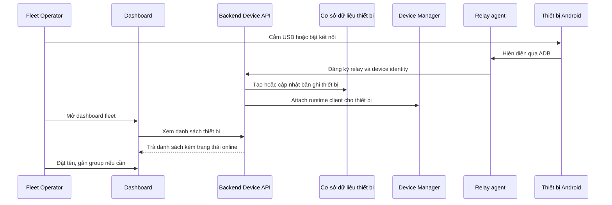
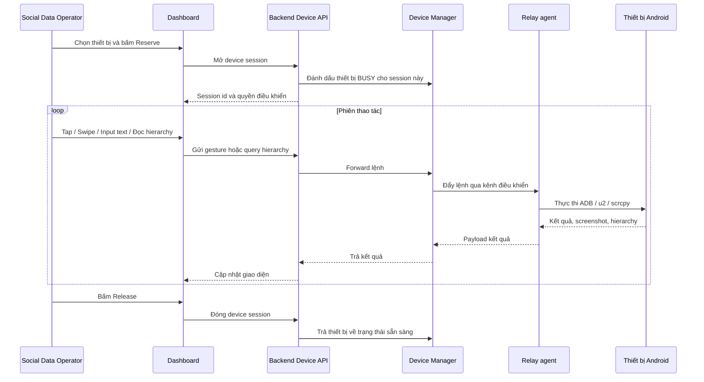
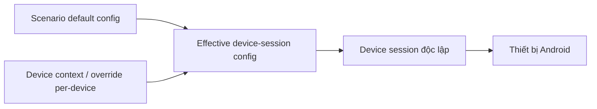
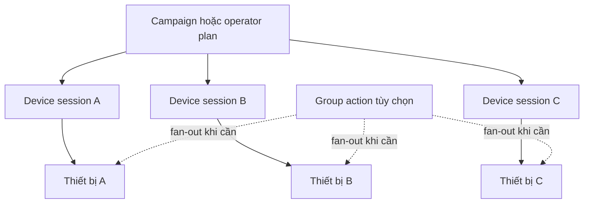

# Thiết bị & Mặt phẳng điều khiển (Devices & Control Plane)

> **Mã module:** DF-MOD-02
> **Phiên bản:** 1.0
> **Cập nhật lần cuối:** 2026-05-25
> **Trạng thái:** Active
> **Đối tượng đọc:** Team Device Farm
> **Tài liệu liên quan:** [Product Overview](../01-product-overview.md), [Glossary](../00-glossary.md), [Personas & Journeys](../02-personas-and-journeys.md), [Platform Runtime & Access](01-platform-runtime-and-access.md), [Agent Boot & Relay](03-agent-boot-and-relay.md), [Campaigns/Scenarios/Executions](04-campaigns-scenarios-executions.md)

## 1. Tóm tắt (TL;DR)

Module Thiết bị & Mặt phẳng điều khiển là nơi Device Farm quản lý toàn bộ vòng đời thiết bị Android — từ lúc pair lần đầu, qua giai đoạn vận hành (reserve, gửi gesture, đọc UI hierarchy, xem screenshot và stream realtime), tới khi gom nhóm để dispatch theo lô. Mô hình sản phẩm cốt lõi là **nhiều device session độc lập**: mỗi device thực thi trong ngữ cảnh riêng của nó, với cấu hình per-device override scenario default. Group action là helper điều phối lô chứ không phải mô hình thực thi chính. Module này cung cấp các primitive L1 mà mọi module L2 (scenario automation — core) dựa lên; module L3 (MCP agent — phần mở rộng Preview, không thuộc nhóm năng lực cốt lõi) cũng dùng các primitive này.

## 2. Bối cảnh & Vấn đề giải quyết

Khi một đội vận hành quản lý 100 đến 1000 thiết bị Android thật, ba bài toán xuất hiện gần như cùng lúc. Thứ nhất, **danh tính thiết bị bị nhân lên không đồng nhất** — một thiết bị có thể có serial Android, có ADB serial endpoint khác (đặc biệt khi qua WiFi), có id trong cơ sở dữ liệu, và có relay serial do agent-boot tự sinh. Nếu hệ thống nhầm giữa các định danh này, người vận hành mất khả năng truy vết. Thứ hai, **cùng một thiết bị phục vụ nhiều phiên làm việc** — có lúc người vận hành thủ công đang điều khiển, có lúc scenario tự động chạy, có lúc AI agent đang dùng. Nếu không có cơ chế reserve, hai phiên cùng can thiệp một thiết bị sẽ đánh nhau. Thứ ba, **tự động hóa social cần ngữ cảnh khác nhau cho từng thiết bị** — mỗi thiết bị có account riêng, có danh sách target riêng, có pacing riêng; không thể dùng một bộ cấu hình duy nhất cho cả fleet.

Device Farm giải ba bài toán này thông qua mô hình "nhiều device session độc lập có ngữ cảnh per-device" và bộ primitive điều khiển thống nhất (gesture, hierarchy, screenshot, stream). Mỗi device là một đơn vị thực thi tự chủ; group chỉ là helper điều phối khi cần dispatch theo lô. Quyết định thiết kế này tôn trọng thực tế rằng tự động hóa social không bao giờ "đồng nhất hóa" toàn bộ fleet.

## 3. Phạm vi

### 3.1 In-scope

Module này sở hữu việc đăng ký thiết bị vào inventory, quy trình pairing để đưa thiết bị mới vào fleet, quản lý device session với hành vi reserve và release, gom nhóm thiết bị thành device group, và toàn bộ primitive điều khiển realtime: gesture (tap, swipe, scroll, long_tap, key, input_text, clipboard, drag, pinch, double_tap), đọc UI hierarchy của Android, chụp screenshot, mở stream video realtime, attach/detach scrcpy cho live view, và các helper STF cho thao tác mức thấp. Module này cũng quản lý cấu hình ngữ cảnh per-device (per-device context override) cho phép từng thiết bị nhận giá trị khác với scenario default. Group action được hỗ trợ ở mức coordination helper — fan-out một action ra nhiều thiết bị cùng lúc — nhưng không thay thế mô hình per-device session.

### 3.2 Out-of-scope

Module này không sở hữu logic nghiệp vụ của campaign hoặc scenario. Nó không hiểu "Facebook" hay "Instagram"; các step platform-specific thuộc về module mở rộng platform. Module này không sở hữu kho artifact dài hạn (screenshot lưu vĩnh viễn theo project) — kho đó thuộc module trích xuất nội dung và artifact. Module này không sở hữu việc xác thực người dùng (thuộc Nền tảng & Bảo mật) hay việc bootstrap host máy vận hành agent (thuộc Agent Boot & Relay). Module này cũng không sở hữu việc rotation account hay quyết định account nào dùng cho session nào — chỉ chấp nhận cấu hình ngữ cảnh do module account cung cấp.

## 4. Personas & Use Cases

### 4.1 Persona liên quan

Persona chính của module này được mô tả chi tiết tại [Personas & Journeys](../02-personas-and-journeys.md): người vận hành fleet (Fleet Operator) là người tương tác trực tiếp và thường xuyên nhất, chịu trách nhiệm pair thiết bị, theo dõi sức khỏe fleet, và phục hồi thiết bị offline; người thu thập dữ liệu social (Social Data Operator) là người dùng device session qua thao tác thủ công hoặc qua scenario. Người dựng kịch bản tự động hóa (Automation Builder) sử dụng module này gián tiếp qua module L2. Người giám sát AI vận hành (AI Operations Supervisor) là persona forward-looking thuộc phần mở rộng AI agent đang được nghiên cứu — sử dụng module này gián tiếp qua module L3 ở trạng thái Preview.

### 4.2 Bảng use case

| ID | Persona | Mô tả | Mức ưu tiên |
|---|---|---|---|
| UC-02-01 | Fleet Operator | Là người vận hành fleet, tôi muốn pair một thiết bị Android mới vào hệ thống để đưa nó vào inventory và sẵn sàng nhận lệnh. | Must |
| UC-02-02 | Fleet Operator | Là người vận hành fleet, tôi muốn xem danh sách thiết bị trong fleet kèm trạng thái online/offline để biết thiết bị nào cần can thiệp. | Must |
| UC-02-03 | Fleet Operator | Là người vận hành fleet, tôi muốn gom các thiết bị thuộc cùng dự án vào một device group để dispatch theo lô. | Must |
| UC-02-04 | Social Data Operator | Là người thu thập dữ liệu, tôi muốn reserve một thiết bị cho phiên làm việc thủ công để không bị scenario tự động hoặc người khác chiếm cùng lúc. | Must |
| UC-02-05 | Social Data Operator | Là người thu thập dữ liệu, tôi muốn release thiết bị khi xong phiên để thiết bị quay lại pool dùng chung. | Must |
| UC-02-06 | Social Data Operator | Là người thu thập dữ liệu, tôi muốn gửi gesture (tap, swipe, scroll, input_text, key, clipboard...) từ dashboard tới thiết bị đang reserve để thao tác thủ công có giám sát. | Must |
| UC-02-07 | Social Data Operator | Là người thu thập dữ liệu, tôi muốn đọc UI hierarchy của thiết bị để xác định selector cho thao tác tiếp theo. | Must |
| UC-02-08 | Social Data Operator | Là người thu thập dữ liệu, tôi muốn xem screenshot và mở stream realtime của thiết bị để giám sát thao tác từ xa. | Must |
| UC-02-09 | Automation Builder | Là người dựng kịch bản, tôi muốn override cấu hình per-device (account, target list, pacing) để cùng một scenario chạy khác nhau trên từng thiết bị. | Must |
| UC-02-10 | Fleet Operator | Là người vận hành fleet, tôi muốn fan-out một action (ví dụ "khóa màn hình", "mở app cụ thể") tới tất cả thiết bị trong group cùng lúc để chuẩn bị hàng loạt. | Should |
| UC-02-11 | Fleet Operator | Là người vận hành fleet, tôi muốn attach scrcpy cho live view của một thiết bị để giám sát trực quan; detach khi không cần để tiết kiệm tài nguyên. | Should |
| UC-02-12 | Fleet Operator | Là người vận hành fleet, tôi muốn xem device session đang active trên mỗi thiết bị, ai sở hữu session, để xử lý xung đột. | Should |
| UC-02-13 | Fleet Operator | Là người vận hành fleet, tôi muốn unpair một thiết bị khỏi fleet khi thiết bị đó được tái phân bổ hoặc loại bỏ. | Should |
| UC-02-14 | AI Operations Supervisor | Là người giám sát AI, tôi muốn AI agent reserve một thiết bị qua MCP và thực thi cùng các primitive gesture/hierarchy/screenshot mà người vận hành dùng. | Could |

## 5. Luồng nghiệp vụ chính

### 5.1 Luồng pair thiết bị mới vào fleet

Sơ đồ dưới mô tả vòng đời từ lúc cắm một thiết bị Android mới vào máy host có agent-boot đang chạy, tới lúc thiết bị xuất hiện trong dashboard và sẵn sàng nhận lệnh.

Quy trình pair giữ rõ bốn định danh khác nhau cho cùng một vật thể: id thiết bị trong cơ sở dữ liệu, device serial do Android trả về, ADB serial endpoint, và relay serial do agent-boot quản lý. Việc giữ tách biệt các định danh này quan trọng vì cùng một thiết bị có thể xuất hiện qua USB hôm nay và qua WiFi ngày mai với endpoint ADB khác.

### 5.2 Luồng reserve và thao tác thủ công có giám sát

Sơ đồ dưới mô tả phiên người vận hành reserve một thiết bị, gửi gesture, đọc hierarchy, xem stream, rồi release.

Trong suốt phiên reserve, thiết bị không nhận lệnh từ scenario tự động hoặc người khác. Cơ chế này bảo đảm thao tác thủ công không bị "đè" lên giữa chừng.

### 5.3 Mô hình per-device context override scenario default

Khi một scenario chạy trên nhiều thiết bị, mỗi thiết bị có thể nhận cấu hình riêng. Sơ đồ dưới giải thích cách cấu hình cuối cùng (effective config) được tổng hợp.

Quy tắc đơn giản: với mỗi key cấu hình, nếu device có override thì dùng giá trị của device; nếu không thì rơi về scenario default. Mô hình này cho phép, ví dụ, scenario "FB Group Feed Crawl" chạy trên 50 thiết bị với 50 danh sách group khác nhau và 50 account khác nhau, nhưng vẫn dùng chung pacing và số bài tối đa do scenario default quy định.

### 5.4 Group action là coordination helper, không phải execution model

Sơ đồ dưới minh họa quan hệ giữa per-device session và group action.

Group action hữu ích cho các thao tác chuẩn bị đồng loạt (khóa màn hình, mở app, đóng app, restart). Group action **không thay thế** session độc lập; nếu một group action fan-out tới một thiết bị đang reserve cho session khác, hệ thống tôn trọng session đang sở hữu thiết bị thay vì chen ngang.

## 6. Đặc tả tính năng (Functional Spec)

| ID | Tính năng | Mô tả nghiệp vụ | Ưu tiên | Acceptance criteria |
|---|---|---|---|---|
| FR-02-01 | Pair thiết bị mới | Đăng ký một thiết bị Android vào inventory với đầy đủ định danh (db id, device serial, relay serial). | Must | Pair thành công tạo bản ghi thiết bị; thiết bị xuất hiện trong dashboard trong vòng 10 s; bốn loại định danh được lưu tách biệt, không nhầm lẫn. |
| FR-02-02 | Liệt kê thiết bị trong fleet | Người vận hành xem danh sách thiết bị thuộc tổ chức kèm trạng thái online/offline, group, owner session hiện tại. | Must | Danh sách phân trang được; lọc theo group, trạng thái, owner; dữ liệu cập nhật trong vòng 5 s khi trạng thái đổi. |
| FR-02-03 | Reserve device session | Người vận hành hoặc tiến trình tự động reserve một thiết bị cho một phiên có ngữ cảnh. | Must | Reserve thành công đánh dấu thiết bị BUSY và trả session id; reserve trên thiết bị đã bị reserve trả lỗi rõ ràng; thiết bị BUSY không nhận lệnh từ session khác. |
| FR-02-04 | Release device session | Người vận hành hoặc tiến trình tự động kết thúc phiên và trả thiết bị về pool. | Must | Release trả thiết bị về sẵn sàng; nếu session timeout, hệ thống auto-release sau ngưỡng cấu hình. |
| FR-02-05 | Gửi gesture realtime | Trong phiên đã reserve, gửi tap, swipe, scroll, long_tap, double_tap, pinch, drag, key, input_text, clipboard set/get. | Must | Mỗi loại gesture có endpoint riêng và validate tham số; gesture thực thi trên thiết bị trong < 2 s ở điều kiện mạng bình thường; lỗi thực thi trả về thông báo nghiệp vụ rõ. |
| FR-02-06 | Đọc UI hierarchy | Lấy snapshot cây UI element hiện tại của thiết bị. | Must | Hierarchy trả về dạng cấu trúc phân cấp; có thể lọc theo text, resource-id, content-description; thời gian lấy hierarchy < 3 s. |
| FR-02-07 | Lấy screenshot | Chụp ảnh màn hình thiết bị hiện tại. | Must | Trả ảnh dạng nhị phân; thời gian lấy < 2 s; ảnh có thể được tham chiếu lại làm artifact. |
| FR-02-08 | Mở stream realtime | Bật kênh video realtime của thiết bị về dashboard. | Must | Stream khởi tạo trong < 5 s; người dùng có thể tap/swipe qua stream view; nhiều stream đồng thời bị giới hạn theo cấu hình hệ thống. |
| FR-02-09 | Attach/detach scrcpy | Người vận hành bật và tắt live view qua scrcpy theo nhu cầu. | Should | Attach mở phiên scrcpy mà không kill phiên hiện hữu; detach trả tài nguyên về pool; nhiều người vận hành không attach cùng phiên một thiết bị. |
| FR-02-10 | Per-device context override | Khai báo giá trị cấu hình cụ thể cho từng thiết bị trong scenario run, ghi đè scenario default. | Must | Effective config được merge đúng quy tắc (device override > scenario default); thiếu key ở device fallback về default; biên bản run lưu lại effective config thực sự dùng. |
| FR-02-11 | Tạo và quản lý device group | Người vận hành tạo group, thêm/xóa thành viên, xóa group khi không còn cần. | Must | Group có tên, mô tả; một thiết bị thuộc nhiều group; xóa group không xóa thiết bị; group được tham chiếu khi dispatch campaign. |
| FR-02-12 | Group action fan-out | Gửi cùng một action tới tất cả thiết bị trong group cùng lúc như helper điều phối. | Should | Action fan-out trả kết quả per-device riêng biệt; thiết bị BUSY ở session khác không bị chen ngang; partial failure báo rõ device nào fail. |
| FR-02-13 | Xem trạng thái device session | Người vận hành biết thiết bị nào đang BUSY, owner là ai (manual operator, scenario run id, MCP session id). | Should | Trang trạng thái hiển thị owner; admin tổ chức có thể buộc release session khi cần. |
| FR-02-14 | Unpair thiết bị | Loại thiết bị khỏi fleet khi không còn dùng. | Should | Unpair giữ lịch sử artifact, chỉ chuyển trạng thái thiết bị; unpair từ chối nếu thiết bị đang trong session active. |
| FR-02-15 | Phân biệt 4 loại định danh thiết bị | Hệ thống lưu rõ và không nhầm lẫn db id, device serial, ADB serial, relay serial. | Must | API trả mỗi loại id ở field riêng; tài liệu route nói rõ mỗi endpoint nhận id loại nào; lỗi truyền sai loại id trả thông báo rõ ràng. |

## 7. Capability matrix

Bảng dưới khai báo trạng thái coverage L1 của module trên bốn platform mục tiêu. Vì các primitive ở module này độc lập platform, trạng thái Active đồng đều giữa các platform.

| Năng lực | Facebook | TikTok | Threads | Instagram |
|---|---|---|---|---|
| Reserve và release device session | Active | Active | Active | Active |
| Gesture đầy đủ (tap/swipe/scroll/long_tap/key/input_text/clipboard/drag/pinch/double_tap) | Active | Active | Active | Active |
| Đọc UI hierarchy | Active | Active | Active | Active |
| Screenshot và stream realtime | Active | Active | Active | Active |
| Attach/detach scrcpy | Active | Active | Active | Active |
| Device group và group action fan-out | Active | Active | Active | Active |
| Per-device context override | Active | Active | Active | Active |

Trạng thái Active ở đây nghĩa là **primitive L1 sẵn sàng**; bước automation L2 (core) nằm ở module khác và có trạng thái riêng theo platform; AI agent L3 là phần mở rộng Preview, không thuộc nhóm năng lực cốt lõi (tham khảo [Capability Matrix](../03-capability-matrix.md)).

## 8. Giới hạn, ràng buộc & rủi ro

Phần này minh bạch các điểm cần lưu ý của module để triển khai đúng kỳ vọng.

**Phân biệt loại id ở từng endpoint cần đọc kỹ.** Một số endpoint của module này dùng device serial làm path parameter (đặc biệt là endpoint điều khiển thời gian thực qua relay), trong khi một số endpoint khác dùng db id (đặc biệt là endpoint CRUD). Lý do lịch sử là endpoint điều khiển hướng tới giao tiếp với phần cứng trực tiếp, còn endpoint CRUD hướng tới ngữ nghĩa cơ sở dữ liệu. Khi tích hợp qua API, cần đọc kỹ tài liệu route để biết endpoint cần loại id nào. Team đang chuẩn hóa dần để mỗi endpoint nói rõ loại định danh nhận về.

**Route device-control phụ thuộc trạng thái database để áp auth.** Như đã đề cập tại [Platform Runtime & Access](01-platform-runtime-and-access.md), nếu hệ thống chạy ở chế độ tắt database (chỉ dành cho phát triển và demo cục bộ), một số route device-control có thể không enforce auth đầy đủ. Triển khai production phải luôn bật database; đây là cấu hình mặc định.

**Giới hạn về số thiết bị stream đồng thời.** Stream video realtime và scrcpy live view tiêu tốn băng thông và tài nguyên trên host relay. Tổng số stream đồng thời bị giới hạn theo cấu hình triển khai. Khi vượt giới hạn, stream mới phải đợi hoặc bị từ chối — không có "background streaming" cho toàn fleet. Trong thực tế vận hành, người vận hành chỉ attach stream cho thiết bị họ đang giám sát chứ không phải toàn fleet đồng loạt.

**Group action là coordination helper, không bảo đảm transactional.** Khi fan-out một action tới nhiều thiết bị, mỗi thiết bị thực thi độc lập. Nếu 50 thiết bị trong group, có thể 47 thành công và 3 thất bại — đó là trạng thái hợp lệ. Hệ thống báo cáo kết quả per-device để người vận hành xử lý partial failure. Không có cơ chế rollback "all-or-nothing" ở mức group.

**Auto-release session timeout cần cấu hình hợp lý.** Nếu một session bị bỏ quên (người vận hành đóng tab không bấm release, hoặc scenario chết giữa chừng), hệ thống tự release sau ngưỡng cấu hình. Đặt ngưỡng quá ngắn sẽ cắt phiên thật đang chạy; đặt quá dài giữ thiết bị BUSY vô ích. Mặc định hiện tại phù hợp với phiên thao tác thông thường nhưng cần rà soát cho từng workflow cụ thể.

**Phụ thuộc vào agent-boot ở mỗi host.** Toàn bộ module này dựa trên việc relay agent đang chạy trên host gắn thiết bị. Khi relay agent đứt kết nối, mọi thiết bị trên host đó tạm thời offline khỏi fleet view và không nhận lệnh. Vấn đề và biện pháp khắc phục được trình bày chi tiết tại [Agent Boot & Relay](03-agent-boot-and-relay.md).

## 9. Chỉ số đo lường thành công (KPIs)

| KPI | Mục tiêu | Ghi chú |
|---|---|---|
| Tỷ lệ thiết bị online trong giờ vận hành | ≥ 99% | Đo trên fleet đã pair, loại trừ thiết bị tạm rút khỏi hệ thống có kế hoạch. |
| Thời gian từ cắm thiết bị đến xuất hiện trong fleet | < 60 s | Bao gồm pair, đăng ký, hiện diện trong dashboard. |
| Độ trễ thực thi gesture trung vị | < 500 ms | Đo từ lúc dashboard gửi đến lúc nhận kết quả. |
| Độ trễ khởi tạo stream | < 5 s | Từ lúc bấm attach đến frame đầu tiên hiển thị. |
| Tỷ lệ session reserve không xung đột | 100% | Cùng một thiết bị không bị hai session active cùng lúc. |
| Tỷ lệ thiết bị có owner session rõ ràng khi BUSY | 100% | Mọi BUSY phải truy được ai sở hữu (manual, scenario id, MCP id). |
| Thời gian phục hồi thiết bị sau sự cố mạng | < 10 phút | Phục hồi tự động qua reconnect; can thiệp thủ công là ngoại lệ. |
| Tỷ lệ group action báo cáo per-device đầy đủ | 100% | Không chấp nhận "fan-out thành công" mà thiếu kết quả per-device. |

## 10. Glossary refs & Open questions

**Thuật ngữ chính tham chiếu Glossary:** [Device](../00-glossary.md), [Device serial](../00-glossary.md), [Device key](../00-glossary.md), [Pairing](../00-glossary.md), [Device session](../00-glossary.md), [Reservation](../00-glossary.md), [Device group](../00-glossary.md), [Group action](../00-glossary.md), [Gesture](../00-glossary.md), [Hierarchy](../00-glossary.md), [Selector](../00-glossary.md), [Stream](../00-glossary.md), [Per-device context / override](../00-glossary.md).

**Câu hỏi nghiệp vụ còn mở:**

Khi một thiết bị thuộc nhiều group, group action fan-out trên các group khác nhau có cần khử trùng lặp action (de-duplicate) ở mức thiết bị không? Có nên cho phép người vận hành xếp hàng đợi (queue) cho session reserve khi thiết bị đang BUSY, hay luôn từ chối ngay? Khi unpair một thiết bị, các artifact và session history của thiết bị đó có nên lưu vĩnh viễn cho mục đích audit, hay có TTL? Có nên hỗ trợ "shadow session" — một observer chỉ xem stream mà không can thiệp — song song với owner session? Mức tham số stream (độ phân giải, FPS) nên cố định theo cấu hình hệ thống hay cho phép người vận hành điều chỉnh theo nhu cầu?
