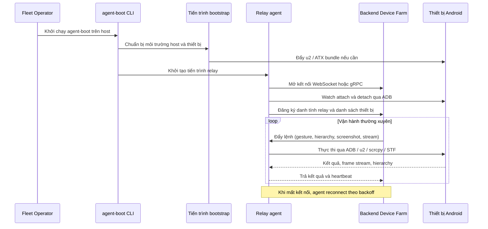
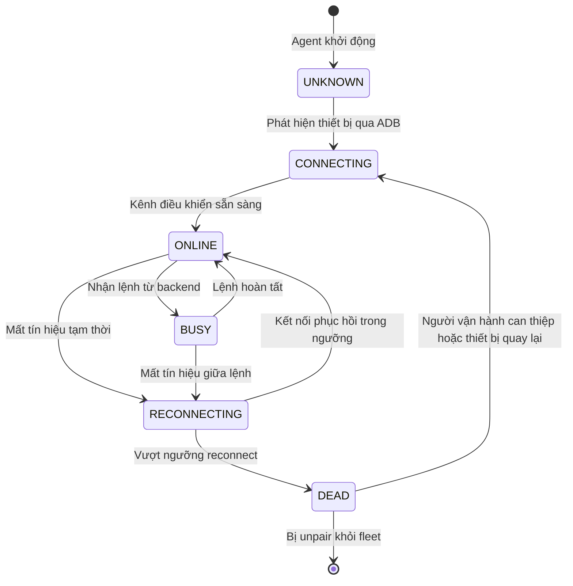
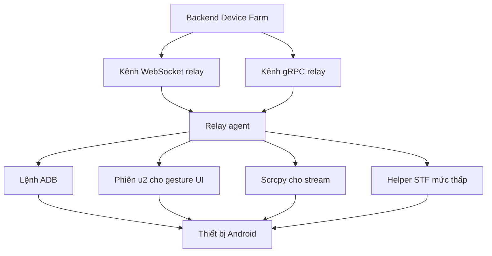

# Agent Boot & Relay

> **Mã module:** DF-MOD-03
> **Phiên bản:** 1.0
> **Cập nhật lần cuối:** 2026-05-25
> **Trạng thái:** Active
> **Đối tượng đọc:** Team Device Farm
> **Tài liệu liên quan:** [Product Overview](../01-product-overview.md), [Glossary](../00-glossary.md), [Personas & Journeys](../02-personas-and-journeys.md), [Platform Runtime & Access](01-platform-runtime-and-access.md), [Devices & Control Plane](02-devices-and-control-plane.md)

## 1. Tóm tắt (TL;DR)

Agent Boot & Relay là phần mềm chạy tại máy host vật lý gắn các thiết bị Android. Vai trò của nó là cầu nối hai chiều giữa backend Device Farm trên cloud và các thiết bị Android ngoại biên. Module này bootstrap môi trường (đẩy u2/ATX bundle khi cần), theo dõi thiết bị attach/detach qua ADB, mở các kênh điều khiển (ADB, u2, scrcpy, STF), duy trì heartbeat về backend, và quản lý FSM trạng thái thiết bị từ UNKNOWN tới DEAD. Module sử dụng song song hai transport — WebSocket và gRPC — để bù trừ nhau. USB được ưu tiên hơn WiFi nhằm tránh các sự cố mạng thường gặp. Trang `/dashboard/relay-agents` cung cấp giao diện theo dõi tình trạng các relay agent đang vận hành.

## 2. Bối cảnh & Vấn đề giải quyết

Khi vận hành 100 đến 1000 thiết bị Android thật, hai bài toán hạ tầng hiện ra ngay lập tức. Thứ nhất, **backend cloud không thể "vươn tay" trực tiếp tới thiết bị** đang ở phòng máy ngoại biên — ADB chỉ thấy thiết bị qua USB hoặc qua WiFi trong cùng lớp mạng, không có cách gọi trực tiếp từ Internet. Thứ hai, **mạng giữa cloud và phòng máy không ổn định** — WiFi có thể chập chờn 2–5 giây, NAT có thể timeout, ISP có thể downstream nhỏ. Nếu backend bắt buộc giữ kết nối hai chiều cho từng thiết bị, một sự cố mạng nhỏ sẽ kéo theo mass failure.

Device Farm giải hai bài toán này bằng mô hình "outbound relay" — agent-boot chạy ngay tại máy host, chủ động mở kết nối lên backend, đa hợp (multiplex) lệnh và kết quả của nhiều thiết bị qua cùng một kênh truyền. Nhờ vậy backend không cần thấy thiết bị; tường lửa tại site triển khai không cần mở cổng inbound. FSM trạng thái thiết bị tại agent cho phép xử lý attach/detach và mất kết nối tạm thời một cách dự đoán được. Cả hai transport (WebSocket và gRPC) đều được hỗ trợ để có đường lui khi một phía gặp sự cố.

## 3. Phạm vi

### 3.1 In-scope

Module này sở hữu tiến trình agent-boot chạy tại máy host vận hành thiết bị, bao gồm: bước bootstrap (đẩy bundle phần mềm, cài u2 và ATX vào thiết bị nếu cần), giám sát thiết bị attach và detach qua ADB, mở và duy trì các kênh thực thi (ADB cho shell command, u2 cho gesture UI, scrcpy cho stream và remote control, STF cho một số helper mức thấp), gửi heartbeat định kỳ về backend, vòng lặp reconnect khi mất kết nối, FSM trạng thái cho mỗi thiết bị, ưu tiên kết nối USB hơn WiFi, đăng ký danh tính relay tới backend, và phục vụ các đường relay từ backend (`/relay-agent`, `/device-agent`). Frontend dashboard có trang riêng `/dashboard/relay-agents` để theo dõi tình trạng từng agent đang vận hành.

### 3.2 Out-of-scope

Module này không sở hữu logic nghiệp vụ campaign hoặc scenario; agent chỉ thực thi lệnh được đẩy về. Module này không sở hữu CRUD nghiệp vụ — không quản lý campaign, content, account; chỉ chuyển lệnh và kết quả. Module này không sở hữu UI dashboard tổng thể, chỉ chịu trách nhiệm trang `/dashboard/relay-agents`. Module này cũng không sở hữu việc xác thực người dùng cuối — danh tính người dùng nằm ở module Nền tảng & Bảo mật, agent chỉ dùng device-auth và identity riêng của relay.

## 4. Personas & Use Cases

### 4.1 Persona liên quan

Persona chính được mô tả tại [Personas & Journeys](../02-personas-and-journeys.md). Người vận hành fleet (Fleet Operator) là người trực tiếp triển khai agent-boot trên các máy host và theo dõi tình trạng các agent. Kỹ sư nền tảng (Platform Engineer) chịu trách nhiệm bảo trì module — cập nhật bundle, vá lỗi kênh điều khiển, mở rộng transport. Các persona khác tiêu thụ module này gián tiếp: scenario tự động hoặc AI agent qua MCP đều chạm tới thiết bị qua relay.

### 4.2 Bảng use case

| ID | Persona | Mô tả | Mức ưu tiên |
|---|---|---|---|
| UC-03-01 | Fleet Operator | Là người vận hành fleet, tôi muốn cài và khởi chạy agent-boot trên một máy host mới để host đó tham gia fleet. | Must |
| UC-03-02 | Fleet Operator | Là người vận hành fleet, tôi muốn agent-boot tự bootstrap thiết bị Android mới cắm vào (đẩy u2 và ATX khi cần) để thiết bị sẵn sàng nhận lệnh. | Must |
| UC-03-03 | Fleet Operator | Là người vận hành fleet, tôi muốn xem tất cả relay agent đang hoạt động tại trang `/dashboard/relay-agents` để biết host nào còn online. | Must |
| UC-03-04 | Fleet Operator | Là người vận hành fleet, tôi muốn agent tự reconnect khi mất kết nối tạm thời để không phải khởi động lại thủ công. | Must |
| UC-03-05 | Fleet Operator | Là người vận hành fleet, tôi muốn agent ưu tiên USB hơn WiFi để giảm sự cố do WiFi chập chờn. | Must |
| UC-03-06 | Fleet Operator | Là người vận hành fleet, tôi muốn biết FSM state của từng thiết bị (UNKNOWN, CONNECTING, ONLINE, BUSY, RECONNECTING, DEAD) để chẩn đoán nhanh tình trạng. | Must |
| UC-03-07 | Platform Engineer | Là kỹ sư nền tảng, tôi muốn agent-boot dùng được cả WebSocket và gRPC để có đường lui khi một transport gặp sự cố. | Must |
| UC-03-08 | Platform Engineer | Là kỹ sư nền tảng, tôi muốn heartbeat của agent định kỳ về backend để dashboard nhận biết agent còn sống. | Must |
| UC-03-09 | Platform Engineer | Là kỹ sư nền tảng, tôi muốn cập nhật bundle (u2/ATX) trên agent mà không gián đoạn các phiên đang chạy quá lâu. | Should |
| UC-03-10 | Fleet Operator | Là người vận hành fleet, tôi muốn nhận cảnh báo khi một relay agent rớt hoặc khi tỷ lệ thiết bị DEAD vượt ngưỡng. | Should |
| UC-03-11 | Platform Engineer | Là kỹ sư nền tảng, tôi muốn bootstrap hàng loạt thiết bị mới gắn vào một host qua một thao tác để giảm công đăng ký từng máy. | Should |

## 5. Luồng nghiệp vụ chính

### 5.1 Vòng đời relay agent từ khởi động tới phục vụ

Sơ đồ dưới mô tả quá trình từ khi người vận hành chạy agent-boot trên một máy host, tới khi backend đẩy lệnh xuống và thiết bị thực thi.

Quy trình bootstrap chỉ cần chạy một lần cho thiết bị mới hoặc khi nâng cấp bundle. Sau khi bootstrap xong, agent giữ trạng thái sẵn sàng và backend có thể đẩy lệnh xuống bất kỳ lúc nào.

### 5.2 FSM trạng thái thiết bị

Mỗi thiết bị Android được agent quản lý qua một máy trạng thái hữu hạn. Sơ đồ dưới mô tả các trạng thái và chuyển trạng thái chính.

Trạng thái FSM cho phép người vận hành chẩn đoán nhanh: thiết bị ở `CONNECTING` lâu nghĩa là agent thấy thiết bị nhưng chưa khởi tạo được kênh điều khiển; thiết bị ở `RECONNECTING` nghĩa là đang mất tín hiệu tạm thời; thiết bị ở `DEAD` nghĩa là cần can thiệp thủ công (kiểm tra cáp, sạc pin, reset router).

### 5.3 Hai transport song song WebSocket và gRPC

Sơ đồ dưới mô tả cách backend và agent dùng song song hai transport để bù trừ nhau.

Cả hai transport mang ngữ nghĩa lệnh tương đương. Khi một transport sự cố (ví dụ gRPC bị tường lửa chặn), agent có thể chuyển sang transport còn lại mà nghiệp vụ vẫn liền mạch. Tài liệu duy trì cam kết rằng hành vi lệnh giữa hai transport là tương đương từ góc nhìn nghiệp vụ.

### 5.4 Ưu tiên USB hơn WiFi

Khi một thiết bị có thể truy cập qua cả USB và WiFi, agent chọn USB. Lý do: USB không phụ thuộc WiFi access point switching, không bị NAT timeout, có băng thông ổn định hơn. Khi USB không khả dụng (ví dụ host xa thiết bị, dùng farm với USB hub kém), agent fallback sang WiFi.

## 6. Đặc tả tính năng (Functional Spec)

| ID | Tính năng | Mô tả nghiệp vụ | Ưu tiên | Acceptance criteria |
|---|---|---|---|---|
| FR-03-01 | Khởi chạy agent-boot trên host | Người vận hành chạy lệnh CLI để khởi tạo tiến trình agent trên máy host. | Must | Khởi động thành công trả mã thoát 0; agent xuất hiện trên dashboard trong < 60 s; log khởi động cho biết transport nào được dùng. |
| FR-03-02 | Bootstrap thiết bị mới | Khi phát hiện thiết bị chưa có u2 hoặc ATX, agent tự đẩy bundle để thiết bị sẵn sàng nhận lệnh. | Must | Bootstrap chỉ chạy khi cần (idempotent); thiết bị sau bootstrap chuyển sang ONLINE; lỗi bootstrap không làm agent crash. |
| FR-03-03 | Watch device attach/detach | Agent giám sát thiết bị cắm vào hoặc rút ra qua ADB và cập nhật trạng thái về backend. | Must | Sự kiện attach phản ánh trong < 10 s; detach trong < 10 s; ghi log đầy đủ cho audit. |
| FR-03-04 | FSM trạng thái thiết bị | Mỗi thiết bị có trạng thái UNKNOWN → CONNECTING → ONLINE ↔ BUSY → RECONNECTING → DEAD với quy tắc chuyển trạng thái rõ. | Must | Trạng thái hiển thị trên dashboard; chuyển trạng thái không bỏ qua các bước hợp lệ; ngưỡng RECONNECTING → DEAD cấu hình được. |
| FR-03-05 | Heartbeat định kỳ về backend | Agent gửi tín hiệu sống về backend theo chu kỳ cấu hình. | Must | Mất heartbeat quá ngưỡng đánh dấu agent offline trên dashboard; chu kỳ heartbeat cấu hình được; heartbeat trễ không kéo theo failure ngay lập tức. |
| FR-03-06 | Reconnect loop với exponential backoff | Khi mất kết nối, agent thử kết nối lại với khoảng thời gian tăng dần. | Must | Lần thử đầu sau khoảng ngắn, các lần sau tăng dần lên ngưỡng tối đa; tổng thời gian thử trước khi báo DEAD cấu hình được; reconnect thành công khôi phục mọi thiết bị trên agent. |
| FR-03-07 | Hỗ trợ song song WebSocket và gRPC | Agent có thể chạy qua WebSocket hoặc gRPC; hai transport tương đương về ngữ nghĩa lệnh. | Must | Cấu hình transport cho mỗi agent; chuyển transport không yêu cầu thay đổi nghiệp vụ ở phía backend; tài liệu nói rõ cam kết tương đương. |
| FR-03-08 | Ưu tiên USB hơn WiFi | Khi thiết bị có cả hai đường, agent chọn USB; chỉ fallback WiFi khi USB không khả dụng. | Must | Quy tắc ưu tiên hiển thị trong log lựa chọn; chuyển từ USB sang WiFi khi USB rút không kéo theo mất phiên đang chạy quá lâu. |
| FR-03-09 | Trang `/dashboard/relay-agents` | Người vận hành xem danh sách relay agent, trạng thái online/offline, danh sách thiết bị trên từng agent. | Must | Danh sách cập nhật trong < 10 s khi trạng thái đổi; bấm vào agent xem danh sách thiết bị; có chỉ báo heartbeat cuối. |
| FR-03-10 | Kênh ADB cho shell command | Agent thực thi shell command Android (ADB) theo lệnh từ backend. | Must | Lệnh ADB thực thi với timeout; kết quả trả về có exit code; lỗi không làm crash agent. |
| FR-03-11 | Kênh u2 cho gesture UI | Agent dùng u2 thực thi gesture (tap, swipe, scroll, input_text) trên thiết bị. | Must | Gesture thực thi trong < 2 s ở điều kiện bình thường; lỗi u2 trả thông báo nghiệp vụ; phiên u2 được tái sử dụng để tránh chi phí khởi tạo. |
| FR-03-12 | Kênh scrcpy cho stream và remote control | Agent mở phiên scrcpy cho live view và điều khiển từ xa. | Must | Stream khởi tạo trong < 5 s; detach trả tài nguyên về pool; không leak tiến trình scrcpy khi detach. |
| FR-03-13 | Helper STF mức thấp | Agent dùng các helper từ STF cho một số thao tác mà u2 không phục vụ tốt. | Should | Lỗi STF không kéo theo lỗi toàn bộ phiên; helper được dùng có chủ đích, không thay thế u2 ở các thao tác chuẩn. |
| FR-03-14 | Bulk bootstrap thiết bị mới | Người vận hành kích hoạt bootstrap hàng loạt cho các thiết bị mới gắn vào một host. | Should | Bulk bootstrap chạy tuần tự hoặc song song có giới hạn; báo cáo kết quả per-device. |
| FR-03-15 | Cảnh báo khi agent offline | Hệ thống thông báo cho người vận hành khi một relay agent mất heartbeat quá ngưỡng. | Should | Cảnh báo trong < 5 phút sau khi mất heartbeat; cảnh báo có link tới agent; không spam khi flapping (cấu hình debounce). |

## 7. Capability matrix

Module này không phụ thuộc platform social — agent chỉ cung cấp kênh điều khiển. Bảng dưới trình bày trạng thái coverage theo nhóm năng lực hạ tầng và transport.

| Nhóm năng lực | Trạng thái |
|---|---|
| Bootstrap u2 / ATX cho thiết bị mới | Active |
| Watch attach / detach qua ADB | Active |
| FSM trạng thái thiết bị (UNKNOWN → DEAD) | Active |
| Heartbeat và reconnect loop với exponential backoff | Active |
| Transport WebSocket (relay-agent) | Active |
| Transport gRPC (relay) | Active (transport hoạt động; xem mục 8 về bảo mật) |
| Ưu tiên USB hơn WiFi | Active |
| Kênh ADB cho shell command | Active |
| Kênh u2 cho gesture UI | Active |
| Kênh scrcpy cho stream và remote control | Active |
| Helper STF cho thao tác mức thấp | Active |
| Trang `/dashboard/relay-agents` cho theo dõi | Active |
| Bulk bootstrap thiết bị mới | Active |
| TLS cho gRPC relay | Active khi cấu hình `RELAY_TLS_CERT_FILE` / `RELAY_TLS_KEY_FILE`; agent bật bằng `grpcs://`, `RELAY_GRPC_TLS` hoặc `RELAY_GRPC_ROOT_CERT_FILE` |
| Per-agent identity và token revoke | Active cho enrollment token, owner scope và reject token revoke khi đăng ký lại |
| Hot standby / leader election cho agent trên cùng host | Roadmap |
| Cảnh báo proactive khi tỷ lệ DEAD vượt ngưỡng | Đang phát triển |

## 8. Giới hạn, ràng buộc & rủi ro

Module này là biên giữa cloud và thiết bị vật lý nên các giới hạn và rủi ro tại đây có ảnh hưởng vận hành đáng kể. Phần này minh bạch để có cơ sở lập kế hoạch triển khai phù hợp.

**Quan trọng — gRPC relay mặc định vẫn cho phép insecure ở môi trường local/dev.** Backend đã hỗ trợ TLS bằng `RELAY_TLS_CERT_FILE` và `RELAY_TLS_KEY_FILE`, đồng thời có thể chặn insecure gRPC ở production/staging bằng `RELAY_ALLOW_INSECURE_GRPC=false`. Agent bật TLS bằng `grpcs://`, `RELAY_GRPC_TLS=true` hoặc `RELAY_GRPC_ROOT_CERT_FILE`. Với use case yêu cầu bảo mật cao, vẫn khuyến cáo chạy qua VPN/network overlay khi chưa có PKI vận hành đầy đủ.

**Quan trọng — RELAY_API_KEY vẫn là shared transport key, nhưng relay identity đã có enrollment token riêng.** Relay agent gửi enrollment token trên control channel để backend resolve owner, organization và token version. Token bị revoke sẽ bị reject khi đăng ký lại và các API relay được scope theo owner/org. Hạn chế còn lại: revoke token chưa cưỡng bức ngắt control stream đang active; cần restart hoặc reconnect để áp dụng ngay.

**Quan trọng — Mỗi máy host chạy một agent-boot duy nhất; mất agent kéo theo toàn bộ thiết bị trên host offline.** Mô hình hiện tại là một host vận hành đúng một tiến trình agent-boot, đa hợp lệnh và kết quả của tất cả thiết bị gắn vào host đó qua kênh truyền duy nhất. Nếu tiến trình agent crash hoặc treo, toàn bộ thiết bị trên host đó cùng lúc offline khỏi fleet. Hệ thống tự khởi động lại agent theo cấu hình supervisor, nhưng mọi phiên đang chạy giữa chừng đều bị gián đoạn. Mô hình hot standby hoặc leader election chưa có; đây là hạn chế đã biết về single-point-of-failure ở cấp host. Khi vận hành ở quy mô lớn, nên phân bổ thiết bị quan trọng trên nhiều host để giảm rủi ro.

**Sự cố WiFi 2–5 giây có thể trigger mass failure trên agent đó.** Khi đường truyền giữa agent và backend bị gián đoạn ngay cả trong vài giây, các lệnh đang chờ kết quả từ thiết bị có thể fail đồng loạt vì agent không kịp phản hồi backend trong cửa sổ timeout. Reconnect loop sẽ phục hồi kết nối, nhưng phiên đã fail thì cần retry ở cấp scenario hoặc cấp campaign. Đây là lý do USB được ưu tiên hơn WiFi — USB không gặp pattern flapping này. Team đang nghiên cứu cơ chế "circuit breaker" giữ lệnh thay vì fail ngay khi đứt kết nối ngắn; chưa có trong release hiện tại.

**Trạng thái DEAD đạt được nhanh nếu cấu hình mặc định không phù hợp môi trường mạng kém.** Ngưỡng chuyển từ RECONNECTING sang DEAD hiện được cấu hình ở mức chấp nhận được cho mạng ổn định. Trong môi trường WiFi yếu, ngưỡng mặc định có thể chuyển thiết bị sang DEAD sớm. Cần điều chỉnh ngưỡng phù hợp với điều kiện mạng tại phòng máy.

**Ngữ nghĩa lệnh giữa WebSocket và gRPC cam kết tương đương nhưng phải kiểm tra khi mở rộng.** Hiện tại team cam kết hai transport phải mang ngữ nghĩa lệnh tương đương. Khi mở rộng lệnh mới, cả hai transport phải được cập nhật cùng release. Có rủi ro drift nếu quy trình không nghiêm; điểm này nằm trong checklist code review.

**Cập nhật bundle u2/ATX cần thiết bị tạm rời khỏi phục vụ trong vài chục giây.** Trong giai đoạn bootstrap đẩy bundle mới, thiết bị tạm không sẵn sàng nhận lệnh. Khi nâng cấp đồng loạt cho fleet, cần lập kế hoạch lăn (rolling) để không cắt toàn fleet cùng lúc.

## 9. Chỉ số đo lường thành công (KPIs)

| KPI | Mục tiêu | Ghi chú |
|---|---|---|
| Tỷ lệ uptime của relay agent trong giờ vận hành | ≥ 99% | Tính theo thời gian agent online so với tổng thời gian dự kiến phục vụ. |
| Thời gian phục hồi trung bình (MTTR) sau khi mất heartbeat | < 2 phút cho sự cố tạm thời | Bao gồm thời gian reconnect tự động và bootstrap lại nếu cần. |
| Tỷ lệ bootstrap thiết bị mới thành công ngay lần đầu | ≥ 95% | Đo trên các thiết bị mới được pair vào fleet. |
| Thời gian từ cắm thiết bị mới đến ONLINE | < 90 s | Bao gồm detect, bootstrap nếu cần, mở kênh điều khiển. |
| Tỷ lệ thiết bị ở trạng thái DEAD trên fleet | < 1% tại mọi thời điểm | Vượt ngưỡng kích hoạt cảnh báo. |
| Số sự cố mất kết nối > 5 phút mỗi tuần | ≤ 1 trên fleet bình thường | Mỗi sự cost dài cần post-mortem ngắn. |
| Tỷ lệ lệnh được thực thi qua USB (so với WiFi) | ≥ 90% trong môi trường khuyến cáo | KPI này phản ánh kỷ luật triển khai vật lý. |
| Tỷ lệ tương đương ngữ nghĩa lệnh giữa WebSocket và gRPC | 100% | Mỗi lệnh mới phải pass test trên cả hai transport. |

## 10. Glossary refs & Open questions

**Thuật ngữ chính tham chiếu Glossary:** [agent-boot](../00-glossary.md), [Relay agent](../00-glossary.md), [Relay serial](../00-glossary.md), [Bootstrap](../00-glossary.md), [Heartbeat](../00-glossary.md), [FSM (Finite State Machine)](../00-glossary.md), [ADB (Android Debug Bridge)](../00-glossary.md), [ADB serial](../00-glossary.md), [u2 / uiautomator2](../00-glossary.md), [scrcpy](../00-glossary.md), [STF (Smartphone Test Farm)](../00-glossary.md), [ATX](../00-glossary.md), [WebSocket](../00-glossary.md), [gRPC](../00-glossary.md).

**Câu hỏi nghiệp vụ còn mở:**

Khi triển khai cho use case có yêu cầu compliance (GDPR, SOC2), thứ tự ưu tiên giữa "bật TLS cho gRPC" và "per-agent identity với rotation" nên là gì? Mô hình giá có nên tính theo số relay agent (mỗi host trả riêng) hay theo số thiết bị quản lý qua relay (toàn fleet trả gộp)? Khi một host có hai agent-boot chạy song song cho mục đích hot standby, ai sở hữu danh tính chính của các thiết bị — agent active hay cả hai? Cấu hình ngưỡng FSM (số lần thử reconnect, exponential backoff) nên là cấu hình toàn cục hay cho phép từng tổ chức tự đặt? Có nên ghi audit log chi tiết cho mọi lệnh đi qua relay (gesture nào, thiết bị nào, kết quả gì) hay chỉ ghi sự kiện cấp phiên để giảm dung lượng?
