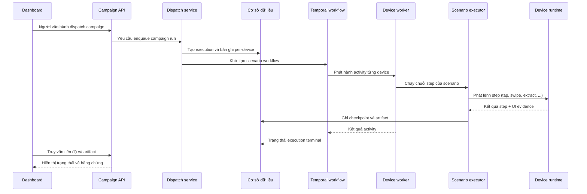
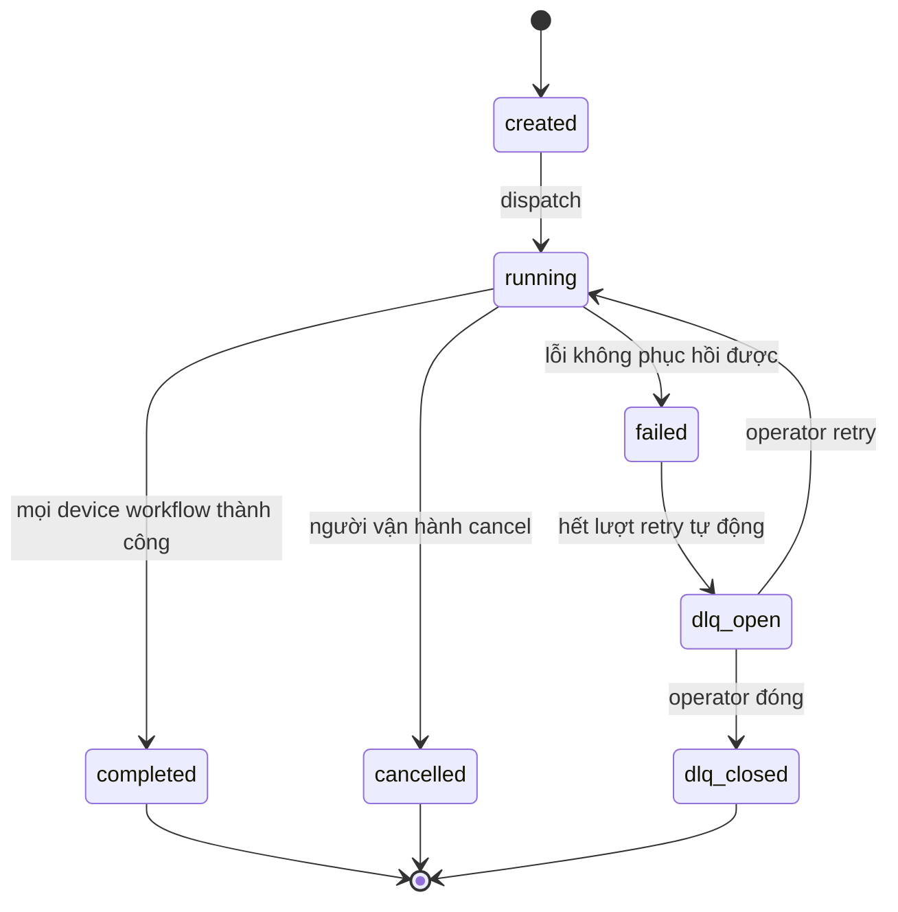
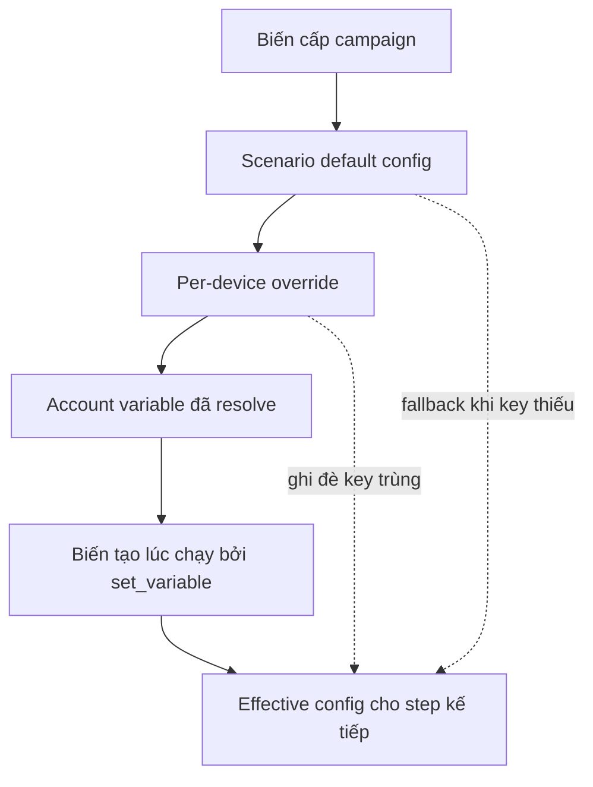

# Campaign, Scenario & Execution

> **Mã module:** DF-MOD-04
> **Phiên bản:** 1.0
> **Cập nhật lần cuối:** 2026-05-25
> **Trạng thái:** Active
> **Đối tượng đọc:** Team Device Farm
> **Tài liệu liên quan:** [Product Overview](../01-product-overview.md), [Glossary](../00-glossary.md), [Personas & Journeys](../02-personas-and-journeys.md), [Devices & Control Plane](02-devices-and-control-plane.md), [Scheduling](05-scheduling.md), [Content/Extraction/Artifacts](06-content-extraction-artifacts.md), [Accounts & Groups](07-accounts-and-groups.md), [Social Platform Extensions](08-social-platform-extensions.md)

## 1. Tóm tắt (TL;DR)

Module Campaign, Scenario & Execution là trái tim tự động hóa của Device Farm. Một campaign (chiến dịch) chứa một hoặc nhiều scenario (kịch bản); mỗi scenario là chuỗi step (bước) có thứ tự hoặc một graph (đồ thị) với nhánh điều kiện, vòng lặp, và scenario lồng. Khi người vận hành dispatch (đẩy chạy) một campaign, hệ thống tạo execution riêng cho từng device hoặc device group, vận hành durable (bền bỉ) qua workflow engine Temporal, thu artifact (bằng chứng) và checkpoint (điểm lưu tiến độ), và đưa các execution thất bại vào DLQ (Dead Letter Queue — hàng đợi xử lý lỗi) để retry. Toàn bộ luồng tuân thủ một nguyên tắc bất biến: Device Farm chạy chính xác theo authored scenario flow (luồng kịch bản do người dựng định nghĩa) — không tự suy diễn recovery, không tự chọn account thay người dựng.

## 2. Bối cảnh & Vấn đề giải quyết

Các đội vận hành social media ở quy mô lớn thường phải lặp đi lặp lại cùng một chuỗi thao tác trên hàng trăm thiết bị với các account khác nhau. Khi quy mô tăng, ba vấn đề trở nên nghiêm trọng. Thứ nhất, không có cách diễn đạt thống nhất cho "việc cần làm trên thiết bị" — mỗi đội tự viết script Python hoặc shell, mỗi thay đổi UI khiến toàn bộ phải sửa lại. Thứ hai, khi một run thất bại, không có cách biết step nào fail, ở thời điểm nào, với evidence gì — đội data và đội automation đổ lỗi cho nhau. Thứ ba, không có cách phục hồi một cách có kiểm soát: hoặc retry toàn bộ campaign từ đầu (lãng phí), hoặc bỏ qua silent (mất dữ liệu).

Device Farm giải ba vấn đề này bằng một mô hình thống nhất. Scenario là ngôn ngữ chung để diễn đạt workflow tự động hóa. Execution lưu trữ trạng thái của mỗi lần chạy với checkpoint và artifact. Workflow durable cho phép pause, resume, cancel mà không mất tiến độ. DLQ tách bạch execution thất bại để người vận hành xử lý chủ động.

## 3. Phạm vi

### 3.1 In-scope

Module này sở hữu vòng đời campaign từ khi tạo đến khi terminal, định nghĩa scenario graph và step schema, cơ chế resolve biến (variable resolution) theo thứ tự ưu tiên, dispatch campaign tới device hoặc device group, thực thi scenario qua executor có hỗ trợ pre/post capture (chụp màn hình trước/sau bước), retry policy, error policy, nested composition qua step `run_scenario`, ghi nhận execution theo từng device, thu artifact và checkpoint, vòng đời workflow durable trên Temporal (pause/resume/cancel), và DLQ với hành vi retry hoặc đóng. Module này cũng định nghĩa contract bất biến rằng mọi nhánh recovery phải được người dựng cấu hình tường minh — Device Farm không tự suy diễn.

### 3.2 Out-of-scope

Module này không sở hữu transport cấp thấp tới thiết bị (gesture, hierarchy, screenshot — thuộc module Devices & Control Plane), không sở hữu logic trích xuất nội dung và lưu content item (thuộc module Content/Extraction/Artifacts), không sở hữu quản lý account hay rotation (thuộc module Accounts & Groups), không sở hữu việc thêm step type mới cho platform social cụ thể (thuộc contract Social Platform Extensions), và không sở hữu cron hay schedule (thuộc module Scheduling). Module này cũng không sở hữu trạng thái graph editor frontend chưa được persist qua campaign hoặc scenario model.

## 4. Personas & Use Cases

### 4.1 Persona liên quan

Hai persona chính tương tác với module này được mô tả chi tiết tại [Personas & Journeys](../02-personas-and-journeys.md). Automation Builder chịu trách nhiệm tạo scenario tái sử dụng, debug khi UI nền tảng thay đổi, và thêm nhánh recovery khi cần thiết. Social Data Operator tiêu thụ scenario sẵn có, dispatch campaign trên fleet, theo dõi tiến độ, và xử lý execution fail qua DLQ. AI Operations Supervisor — persona forward-looking thuộc phần mở rộng AI agent đang được nghiên cứu — tương tác gián tiếp khi MCP agent (Preview, xem [module 10](10-mcp-agent-tools.md)) chạy scenario hoặc step qua tool df_.

### 4.2 Bảng use case

| ID | Persona | Mô tả | Mức ưu tiên |
|---|---|---|---|
| UC-04-01 | Automation Builder | Là người dựng kịch bản, tôi muốn tạo một scenario gồm chuỗi step có thứ tự để diễn đạt workflow social mà tôi muốn lặp lại trên nhiều device. | Must |
| UC-04-02 | Automation Builder | Là người dựng kịch bản, tôi muốn biểu diễn scenario dạng graph với nhánh điều kiện và vòng lặp để xử lý các biến thể UI mà không phải duplicate scenario. | Must |
| UC-04-03 | Automation Builder | Là người dựng kịch bản, tôi muốn sử dụng step `run_scenario` để gọi một scenario con bên trong scenario cha nhằm tái sử dụng các đoạn flow phổ biến. | Must |
| UC-04-04 | Automation Builder | Là người dựng kịch bản, tôi muốn khai báo error policy (`ignore_error`, `on_error`) và retry policy ở cấp step để định nghĩa tường minh khi nào scenario được phép tiếp tục sau lỗi. | Must |
| UC-04-05 | Automation Builder | Là người dựng kịch bản, tôi muốn preview run scenario trên một device cô lập trước khi dispatch để xác minh từng step trước khi triển khai diện rộng. | Should |
| UC-04-06 | Social Data Operator | Là người thu thập dữ liệu social, tôi muốn tạo một campaign chọn scenario có sẵn, chọn fleet device hoặc device group, và dispatch trong một thao tác. | Must |
| UC-04-07 | Social Data Operator | Là người thu thập dữ liệu social, tôi muốn đặt biến per-device (per-device override) để cùng một scenario chạy với input khác nhau trên từng device. | Must |
| UC-04-08 | Social Data Operator | Là người thu thập dữ liệu social, tôi muốn theo dõi tiến độ campaign theo từng device với trạng thái running, completed, failed, và artifact đính kèm. | Must |
| UC-04-09 | Social Data Operator | Là người thu thập dữ liệu social, tôi muốn pause, resume, hoặc cancel một campaign đang chạy mà không mất tiến độ đã đạt được. | Must |
| UC-04-10 | Social Data Operator | Là người thu thập dữ liệu social, tôi muốn xem các execution fail trong DLQ, đọc screenshot tại thời điểm fail, và quyết định retry hoặc đóng. | Must |
| UC-04-11 | Automation Builder | Là người dựng kịch bản, khi một step UI-gated không tìm thấy element mong đợi, tôi muốn scenario dừng và báo step lỗi rõ ràng thay vì hệ thống "đoán" hành vi phục hồi. | Must |
| UC-04-12 | Social Data Operator | Là người thu thập dữ liệu social, tôi muốn artifact thu được (screenshot, hierarchy snapshot) đính kèm theo execution để truy vết khi báo cáo cho khách hàng B2B. | Must |
| UC-04-13 | Automation Builder | Là người dựng kịch bản, tôi muốn biến của campaign, scenario default, per-device override, account, và runtime được resolve theo thứ tự ưu tiên rõ ràng để tôi đoán được hành vi runtime. | Must |

## 5. Luồng nghiệp vụ chính

### 5.1 Vòng đời campaign từ dispatch đến terminal

Sơ đồ dưới mô tả chuỗi tương tác từ thời điểm người vận hành nhấn "Run campaign" cho tới khi campaign đạt trạng thái terminal. Người vận hành chỉ tương tác với hai đầu — đầu vào và đầu ra; các thành phần ở giữa là cơ chế durable của Device Farm.



Người vận hành mở dashboard, chọn campaign, chọn fleet device hoặc device group, và dispatch. Dispatch service tạo execution kèm danh sách device, sau đó khởi tạo workflow durable trên Temporal. Mỗi device chạy execution độc lập — không chia sẻ state runtime với device khác. Executor đọc chuỗi step, resolve biến trước mỗi step, gọi handler tương ứng với loại step, ghi artifact và checkpoint sau mỗi step. Khi tất cả device hoàn thành, workflow chuyển execution sang trạng thái terminal phù hợp.

### 5.2 Vòng đời trạng thái execution

Trạng thái execution tuân thủ máy trạng thái sau, với các nhánh phục hồi DLQ tách bạch.



Trạng thái terminal — completed, cancelled, dlq_closed — đánh dấu execution không còn được engine xử lý nữa. Trạng thái dlq_open là điểm dừng có giám sát: hệ thống đã thử retry tự động theo retry policy nhưng vẫn fail; người vận hành xem xét, retry thủ công nếu nguyên nhân có thể khắc phục (ví dụ device offline đã online lại), hoặc đóng nếu nguyên nhân là lỗi cấu hình scenario.

### 5.3 Thứ tự resolve biến runtime

Một scenario chạy với một "effective config" — tập biến cuối cùng được executor sử dụng cho mỗi step. Thứ tự ưu tiên khi resolve biến là một hợp đồng quan trọng để người dựng đoán được hành vi.



Đọc thứ tự này thế nào? Khi executor cần đọc một biến tại một step, nó tìm theo thứ tự: biến tạo runtime (cao nhất, do step `set_variable` ghi), biến account (resolve từ scenario config, device context, hoặc account group), per-device override, scenario default, và campaign vars (thấp nhất). Key trùng ở tầng cao hơn ghi đè tầng thấp hơn. Nếu một key không có ở bất kỳ tầng nào, executor coi đó là cấu hình thiếu — thuộc trách nhiệm người dựng — chứ không tự sinh giá trị mặc định ẩn.

### 5.4 Step dispatch và recovery có chủ ý

Mỗi step đi qua chuỗi xử lý dưới đây. Lưu ý hai điểm: pre/post capture là tự động (Device Farm chụp evidence quanh step không cần người dựng yêu cầu), và recovery chỉ kích hoạt khi người dựng đã khai báo retry hoặc error policy tường minh.

```mermaid
flowchart TB
    RawStep[Bước nguyên bản từ scenario] --> Resolve[Resolve biến]
    Resolve --> PreCapture[Pre-step capture (tùy chọn)]
    PreCapture --> Dispatch{Phân loại step}
    Dispatch --> Navigation[Handler điều hướng]
    Dispatch --> Interaction[Handler tương tác]
    Dispatch --> Control[Handler control flow]
    Dispatch --> Extraction[Handler trích xuất]
    Dispatch --> Composition[Handler run_scenario lồng]
    Dispatch --> Platform[Handler platform-specific]
    Navigation --> PostCapture[Post-step capture]
    Interaction --> PostCapture
    Control --> PostCapture
    Extraction --> PostCapture
    Composition --> PostCapture
    Platform --> PostCapture
    PostCapture --> Retry{Lỗi retryable và còn lượt?}
    Retry -->|Có| Backoff[Backoff + thử lại]
    Backoff --> Dispatch
    Retry -->|Không| Result[Ghi nhận kết quả step]
    Result --> Checkpoint[Đẩy checkpoint]
```

Sơ đồ này quan trọng vì nó là điểm phân biệt Device Farm với các công cụ test app generic. Người dựng không phải viết handler riêng cho mỗi loại step — họ khai báo step trong scenario; executor chọn handler đúng và đảm bảo các invariant: pre/post capture, retry theo cấu hình, depth limit cho nested composition, checkpoint sau mỗi step thành công.

## 6. Đặc tả tính năng (Functional Spec)

| ID | Tính năng | Mô tả nghiệp vụ | Ưu tiên | Acceptance criteria |
|---|---|---|---|---|
| FR-04-01 | Tạo và bảo trì campaign | Người dùng tạo campaign, đặt tên, gắn một hoặc nhiều scenario, gán device hoặc device group đích. | Must | Campaign tạo ra có id riêng; xóa campaign không xóa scenario gốc; ràng buộc ownership theo organization. |
| FR-04-02 | Tạo scenario theo step có thứ tự | Người dựng định nghĩa scenario là chuỗi step tuần tự. | Must | Scenario lưu được thứ tự step; validation từ chối scenario rỗng; scenario có scenario_version để truy vết. |
| FR-04-03 | Tạo scenario theo graph | Người dựng biểu diễn scenario dạng graph với node và edge có nhánh điều kiện. | Must | Frontend flow editor lưu được graph; runtime đi đúng edge theo điều kiện `if_element`, `if_variable`. |
| FR-04-04 | Nested composition qua `run_scenario` | Một scenario có thể gọi scenario khác như một step để tái sử dụng. | Must | Depth limit được áp dụng để tránh đệ quy vô tận; biến truyền vào nested scenario theo cơ chế resolve chuẩn. |
| FR-04-05 | UI-gated default behavior | Mọi step social mặc định chỉ thành công khi UI thiết bị đang ở trạng thái mong đợi; nếu không, scenario dừng. | Must | Step không tìm thấy element bị mark là failed; scenario dừng tại step đó trừ khi có nhánh recovery tường minh. |
| FR-04-06 | Error policy tường minh | Người dựng khai báo `ignore_error` hoặc `on_error` ở cấp step để cho phép tiếp tục sau lỗi. | Must | Mặc định stop-on-failure; chỉ tiếp tục khi có khai báo; error policy nhất quán giữa các execution surface. |
| FR-04-07 | Retry policy cấp step | Người dựng cấu hình số lần retry và backoff cho step có lý do retryable. | Must | Retry chạy đúng số lần; backoff áp dụng được; sau khi hết lượt, step được mark fail và scenario theo error policy. |
| FR-04-08 | 8 step family chuẩn | Hệ thống hỗ trợ 8 nhóm step: Navigation, Interaction, Input/Wait, Verification, Variables/Control flow, Composition, Extraction/Content, Platform-specific. | Must | Mỗi step được phân loại đúng nhóm; schema từ chối step không thuộc nhóm hỗ trợ; doc liệt kê step theo nhóm. |
| FR-04-09 | Resolve biến đa tầng | Biến được resolve theo thứ tự: campaign vars → scenario default → per-device override → account vars → runtime vars. | Must | Effective config được log mỗi step; key trùng ghi đè đúng tầng; key thiếu báo lỗi cấu hình, không tự sinh giá trị. |
| FR-04-10 | Dispatch tới device hoặc device group | Campaign run được phát tới một danh sách device cụ thể hoặc tới một device group. | Must | Mỗi device nhận execution riêng; device group fan-out đúng danh sách thành viên tại thời điểm dispatch. |
| FR-04-11 | Execution riêng theo từng device | Cùng một scenario chạy độc lập trên từng device với effective config riêng. | Must | Execution per device không chia sẻ runtime state; artifact gắn đúng device id; kết quả tổng hợp theo execution cha. |
| FR-04-12 | Workflow durable backed by Temporal | Workflow execution chịu được restart farm, restart worker, network blip. | Must | Pause/resume/cancel hoạt động qua workflow id; tiến độ không bị mất khi worker khởi động lại; Temporal là chân lý trạng thái workflow. |
| FR-04-13 | Fallback dispatcher khi Temporal không sẵn sàng | Khi Temporal tạm tắt, hệ thống vẫn cho dispatch campaign qua đường fallback. | Should | Dispatch không từ chối khi Temporal off; banner cảnh báo trạng thái fallback; fallback execution được đánh dấu rõ trong UI. |
| FR-04-14 | Pre/post step capture | Trước và sau mỗi step, executor có thể chụp screenshot và hierarchy snapshot làm bằng chứng. | Must | Artifact gắn execution; truy cập được qua dashboard; có thể tắt capture theo cấu hình để tối ưu chi phí. |
| FR-04-15 | Checkpoint sau mỗi step thành công | Tiến độ execution được lưu vào checkpoint sau mỗi step để khôi phục. | Must | Workflow restart đọc checkpoint và tiếp tục từ step kế tiếp; checkpoint không ghi đè artifact cũ. |
| FR-04-16 | DLQ cho execution fail | Execution thất bại không phục hồi được chuyển vào DLQ, sẵn sàng cho retry hoặc đóng. | Must | DLQ có endpoint truy vấn; retry quay lại dispatch service giữ ownership và idempotency; đóng đưa execution sang dlq_closed. |
| FR-04-17 | Pause / Resume / Cancel workflow | Người vận hành điều khiển workflow đang chạy mà không mất state. | Must | Pause dừng activity kế tiếp; Resume tiếp tục từ step dừng; Cancel chuyển execution sang cancelled và dừng dispatch. |
| FR-04-18 | Preview execution trên một device | Người dựng chạy thử scenario trên một device cô lập trước khi dispatch diện rộng. | Should | Preview tạo execution có marker preview; không tính vào campaign run history; artifact đầy đủ. |
| FR-04-19 | Báo cáo step fail chi tiết | Khi step fail, log ghi rõ index, type, message, screenshot, và hierarchy tại thời điểm fail. | Must | DLQ entry mở ra hiển thị đủ thông tin để người dựng debug mà không cần truy vấn DB. |
| FR-04-20 | Không tự suy diễn recovery | Device Farm không tự ý thêm nhánh retry hoặc account fallback nếu người dựng chưa khai báo. | Must | Test guard rằng default behavior là stop-on-failure; mọi nhánh khác phải có cấu hình tường minh trong scenario. |

## 7. Capability matrix

Module này gồm tám nhóm step family. Bảng dưới mô tả nghiệp vụ của từng nhóm, phục vụ người dựng kịch bản chọn step phù hợp mà không cần tra mã nguồn.

| Nhóm step | Mục đích nghiệp vụ | Ví dụ thao tác |
|---|---|---|
| **Navigation** | Mở app, mở URL, gửi phím cứng — đưa thiết bị vào màn hình xuất phát của scenario. | Mở app Facebook, mở deep link tới một bài, nhấn nút back |
| **Interaction** | Mọi thao tác chạm và vuốt mô phỏng người dùng trên màn hình. | Tap theo tọa độ, tap theo selector, swipe để cuộn, long-tap menu ngữ cảnh |
| **Input/Wait** | Nhập text vào ô input và chờ trạng thái UI ổn định trước khi tiếp tục. | Nhập từ khóa tìm kiếm, chờ trang load xong, chờ một element xuất hiện |
| **Verification** | Khẳng định trạng thái UI đúng kỳ vọng trước khi step kế tiếp chạy — đây là cơ chế bảo vệ chính của tính UI-gated. | Assert một element tồn tại, verify scope màn hình đúng |
| **Variables / Control flow** | Gán biến, rẽ nhánh điều kiện, vòng lặp, chọn ngẫu nhiên — diễn đạt mọi logic phi tuyến trong scenario. | Set biến từ kết quả extract, if theo điều kiện, repeat n lần, break sớm |
| **Composition** | Lồng scenario con vào scenario cha để tái sử dụng đoạn flow. | Gọi scenario "Mở comment box" như một step trong scenario crawl comment |
| **Extraction / Content** | Trích xuất dữ liệu từ hierarchy, OCR, AI vision, hoặc strategy platform-specific; lưu vào content store. | Extract bài post theo strategy `fb_posts`, OCR một vùng màn hình, save_extraction |
| **Platform-specific** | Step có ngữ nghĩa riêng cho một social platform — hiện chỉ Facebook active, các platform khác draft theo contract Social Platform Extensions. | `tap_fb_comment_button` (legacy), `fb_tap_comment_button` (canonical) |

Trạng thái thực thi tổng quan:

| Năng lực | Trạng thái |
|---|---|
| Scenario step tuần tự | Active |
| Scenario graph với nhánh điều kiện | Active |
| Nested composition qua `run_scenario` | Active (có depth limit) |
| Variable resolution 5 tầng | Active |
| UI-gated default + error policy tường minh | Active |
| Retry policy cấp step | Active |
| Workflow durable backed by Temporal | Active |
| Fallback dispatcher khi Temporal off | Active (xem ràng buộc ở mục 8) |
| Pause / Resume / Cancel | Active |
| Pre/post step capture artifact | Active |
| Checkpoint sau mỗi step | Active |
| DLQ retry và đóng | Active |
| Preview execution trên 1 device | Active |
| Typed config schema (`type`, `required`, `secret`, ...) | Roadmap (hiện free-form JSON) |
| Diff giữa scenario version | Đang phát triển |

## 8. Giới hạn, ràng buộc & rủi ro

Phần này minh bạch các giới hạn để có cơ sở đánh giá đúng trước khi triển khai diện rộng.

**Nhiều execution surface có thể áp dụng error policy không đồng nhất.** Các execution surface core của Device Farm là: **campaign run** (Temporal-backed — đường thực thi chính cho production-grade workflow), **session run** (manual, qua phiên reserved bởi người vận hành), và **preview run** (chạy thử trên một device cô lập). Ngoài ba surface core này, còn có **MCP-triggered run** ở dạng **execution surface preview** — thuộc phần mở rộng AI agent đang được nghiên cứu (xem [module 10](10-mcp-agent-tools.md) ở trạng thái Preview), không nằm trong nhóm năng lực cốt lõi. Mỗi đường có lịch sử phát triển riêng và có thể áp dụng `ignore_error` hay `on_error` không hoàn toàn giống nhau. Đây là gap được ghi nhận tại SPG-001 trong kế hoạch khắc phục nội bộ. Team Product cam kết audit và đồng bộ tất cả đường thực thi core trước, surface MCP-triggered preview theo sau; trong giai đoạn chuyển tiếp, scenario nên được test trên đúng surface mà campaign sẽ chạy.

**Fallback dispatcher không persist trạng thái như Temporal.** Khi Temporal không sẵn sàng, hệ thống chuyển sang fallback in-process dispatcher để không từ chối campaign. Tuy nhiên đường fallback này không có cùng đảm bảo durable — nếu farm restart trong khi fallback đang chạy, trạng thái có thể bị mất. Khuyến cáo cho triển khai production: luôn chạy Temporal song song với farm và coi fallback là chế độ tạm thời, không phải chế độ vận hành dài hạn.

**Legacy primary-account fallback vẫn còn trong một số đường dispatch.** Hợp đồng nghiệp vụ hiện tại nói rõ: thiếu account/login là lỗi cấu hình thuộc trách nhiệm người dựng, Device Farm không tự suy diễn account. Tuy nhiên một số đường dispatch cũ vẫn có thể infer primary account của device khi scenario không khai báo (gap SPG-007). Team Product đang quyết định giữa giữ behavior dưới flag tương thích hay loại bỏ sau khi template được migrate. Trong giai đoạn này, scenario nên khai báo account tường minh để tránh phụ thuộc vào hành vi ngầm.

**Config scenario là free-form JSON, chưa có typed schema.** Hiện tại hệ thống chỉ validate "valid JSON", chưa có metadata `type`, `default`, `required`, `description`, `secret`, `allowed_values`. Hệ quả là lỗi cấu hình thường chỉ lộ ở thời điểm chạy. Roadmap có hạng mục typed schema và sẽ giữ tương thích ngược với scenario cũ. Trong giai đoạn này, nên viết template scenario có ví dụ rõ ràng để Automation Builder mới tra cứu.

**Preview run không phải là môi trường tách biệt hoàn toàn.** Preview chạy trên device thật, dùng artifact thật, ghi vào content store thật. Người dựng cần chú ý nếu scenario có step thao tác social thật (như follow, post) để tránh tạo dữ liệu rác. Khuyến nghị có một collection riêng cho artifact preview để dễ làm sạch sau.

**Depth limit của `run_scenario` là tham số runtime.** Nested composition có depth limit để tránh đệ quy vô tận. Vượt depth, scenario bị mark fail. Use case cần chuỗi composition sâu nên trao đổi với team Product để cân nhắc nâng depth có kiểm soát.

**Cancel không phải undo.** Cancel dừng dispatch và không thực hiện các step còn lại, nhưng các step đã chạy đã thay đổi UI thiết bị và có thể đã ghi content. Cancel không hoàn tác các thay đổi đó. Người dựng cần thiết kế scenario sao cho điểm cancel có ý nghĩa nghiệp vụ (ví dụ sau mỗi nhóm thao tác hoàn chỉnh).

## 9. Chỉ số đo lường thành công (KPIs)

| KPI | Mục tiêu | Ghi chú |
|---|---|---|
| Tỷ lệ scenario chạy thành công trên fleet target | ≥ 95% | Đo theo từng campaign, loại trừ device offline. |
| Thời gian từ phát hiện UI nền tảng thay đổi tới vá scenario | < 4 giờ | Đo từ ticket DLQ đầu tiên đến scenario version mới được commit. |
| Tỷ lệ scenario được tái sử dụng giữa các campaign khác nhau | ≥ 50% | Đo qua số campaign tham chiếu cùng scenario id. |
| Tỷ lệ execution có pre/post capture artifact đầy đủ | ≥ 99% | Loại trừ scenario tắt capture tường minh. |
| Trung vị thời gian phát hiện step fail tới khi vào DLQ | < 60 giây | Bao gồm retry policy mặc định. |
| Tỷ lệ DLQ entry được xử lý (retry hoặc đóng) trong 24 giờ | ≥ 90% | Đo theo organization, để giám sát tồn đọng DLQ. |
| Số sự cố cross-device state leakage | 0 mỗi quý | Mỗi sự cố là critical; execution per device phải độc lập. |
| Thời gian phục hồi workflow sau khi Temporal restart | < 60 giây | Đo từ Temporal sẵn sàng đến workflow đang chạy được resume. |
| Tỷ lệ campaign có effective config được log đầy đủ cho mỗi step | 100% | Yêu cầu nghiệp vụ để audit và debug. |

## 10. Glossary refs & Open questions

**Thuật ngữ chính tham chiếu Glossary:** [Campaign](../00-glossary.md), [Scenario](../00-glossary.md), [Scenario version](../00-glossary.md), [Step](../00-glossary.md), [Step family](../00-glossary.md), [UI-gated](../00-glossary.md), [Error policy](../00-glossary.md), [Retry policy](../00-glossary.md), [run_scenario](../00-glossary.md), [Scenario default config](../00-glossary.md), [Per-device context / override](../00-glossary.md), [Account variable](../00-glossary.md), [Execution](../00-glossary.md), [Workflow](../00-glossary.md), [Dispatch](../00-glossary.md), [Checkpoint](../00-glossary.md), [DLQ](../00-glossary.md), [Temporal](../00-glossary.md), [Activity](../00-glossary.md), [Worker](../00-glossary.md), [Artifact](../00-glossary.md), [Authored scenario flow](../00-glossary.md).

**Câu hỏi nghiệp vụ còn mở:**

Khi nào Device Farm nên đưa typed config schema vào sản phẩm — gắn với milestone triển khai cụ thể yêu cầu validation chặt, hay sau khi đạt số lượng scenario template nhất định trong nền tảng? Có nên cho phép một campaign chứa nhiều scenario chạy song song theo phase (ví dụ phase 1 trên một subset device, phase 2 trên phần còn lại), hay giữ mô hình hiện tại là 1 campaign tương ứng với 1 plan dispatch duy nhất? Khi DLQ tồn đọng quá ngưỡng, có nên auto-pause campaign tiếp theo của cùng scenario để buộc người vận hành xem lại cấu hình, hay giữ chính sách hiện tại là chỉ cảnh báo? Diff giữa hai scenario version để PM/QA review trước khi commit có nên là tính năng chính thức của module này không? Cuối cùng, khi một workflow chạy ở fallback dispatcher rồi Temporal trở lại, có nên migrate workflow sang Temporal "nóng" hay để workflow chạy hết trên fallback?
