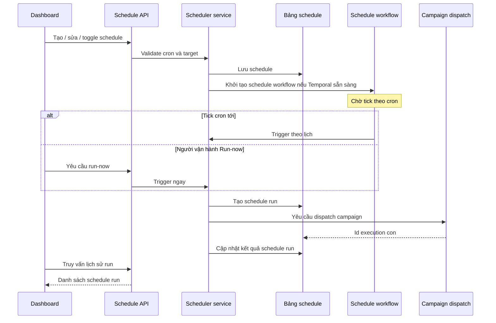
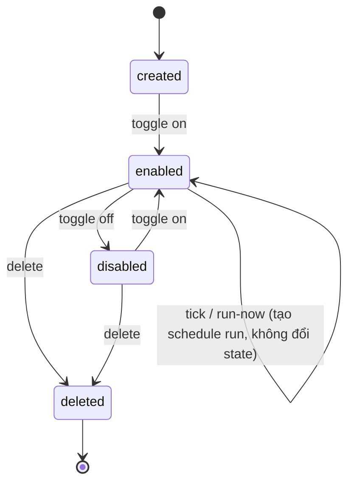
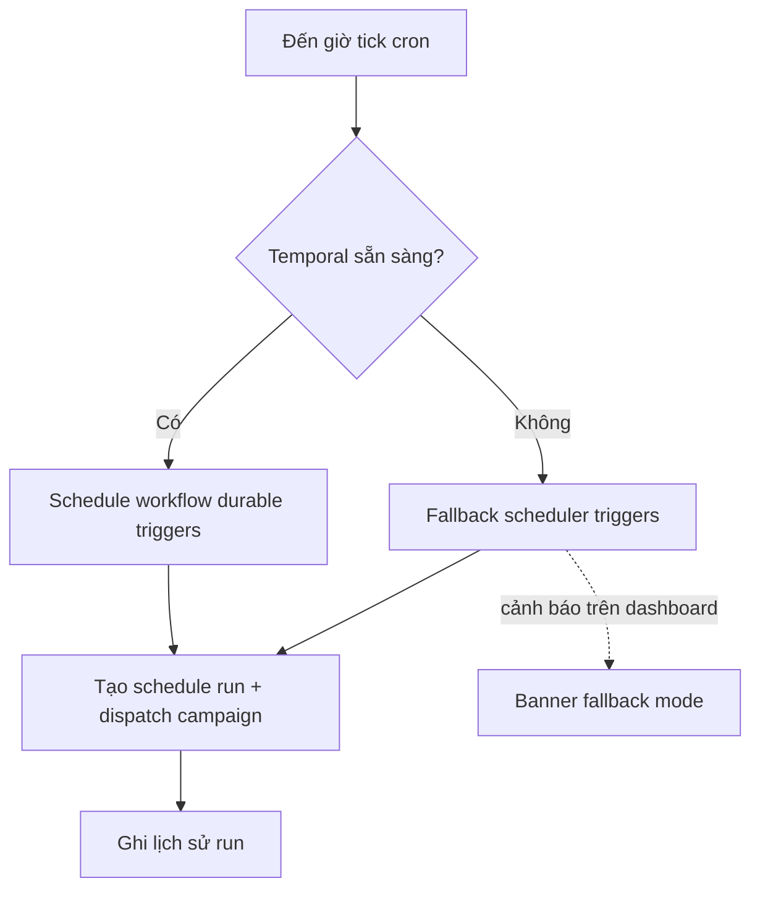

# Lập lịch (Scheduling)

> **Mã module:** DF-MOD-05
> **Phiên bản:** 1.0
> **Cập nhật lần cuối:** 2026-05-25
> **Trạng thái:** Active
> **Đối tượng đọc:** Team Device Farm
> **Tài liệu liên quan:** [Product Overview](../01-product-overview.md), [Glossary](../00-glossary.md), [Campaign, Scenario & Execution](04-campaigns-scenarios-executions.md), [Notifications & Analytics](09-notifications-and-analytics.md)

## 1. Tóm tắt (TL;DR)

Module Lập lịch cho phép người vận hành hẹn giờ chạy campaign theo cron (cú pháp lịch lặp) hoặc chạy ngay (run-now) mà không phải túc trực dashboard. Mỗi schedule gắn với một campaign hoặc một fleet dispatch, có cấu hình cron, trạng thái bật/tắt qua toggle, và lịch sử thực thi (schedule run) phục vụ debug. Hệ thống vận hành durable trên schedule workflow của Temporal khi sẵn sàng; khi Temporal tạm tắt, đường fallback đảm bảo schedule vẫn được trigger ở mức cơ bản. Module này không tự thực thi scenario — nó chỉ là cơ chế trigger, chuyển dispatch sang module Campaign khi đến giờ.

## 2. Bối cảnh & Vấn đề giải quyết

Các đội vận hành social media làm việc theo nhịp thời gian — feed bài giờ vàng, crawl comment đầu giờ sáng, dispatch chiến dịch theo lịch khách hàng. Trước khi có Scheduling, người vận hành phải tự ngồi canh giờ và bấm "Run campaign", hoặc viết script ngoài hệ thống dùng cron máy chủ. Cả hai cách đều mong manh: người quên, script lỗi không ai biết, không có nơi xem "campaign nào đã trigger lúc mấy giờ".

Module này giải bài toán bằng một cơ chế trigger có trạng thái, có lịch sử, có thể bật tắt mà không cần xóa cấu hình. Người vận hành định nghĩa schedule một lần, hệ thống chịu trách nhiệm trigger campaign đúng giờ theo cron. Khi không cần lịch tạm thời, toggle tắt thay vì xóa — giữ được cấu hình cho lần sau. Khi cần chạy ngoài lịch, run-now không phá lịch định kỳ. Lịch sử run cho người vận hành thấy "đã chạy lúc nào, thành công hay thất bại" mà không phải đọc log hạ tầng.

## 3. Phạm vi

### 3.1 In-scope

Module này sở hữu định nghĩa schedule (gắn với campaign hoặc fleet dispatch), validate cron expression ở backend và frontend, toggle bật/tắt schedule, run-now để trigger ngoài lịch, ghi nhận schedule run cho từng lần thực thi (cả trigger định kỳ và trigger run-now), và hiển thị lịch sử run kèm trạng thái execution con. Module này cũng định nghĩa hành vi khi Temporal sẵn sàng (dùng schedule workflow durable) và khi Temporal không sẵn sàng (đường fallback cơ bản).

### 3.2 Out-of-scope

Module này không sở hữu logic thực thi scenario hay điều khiển thiết bị — khi tới giờ, schedule chỉ gọi sang module Campaign để dispatch. Module này không sở hữu cron expression parser ở phía thiết bị; mọi parse cron diễn ra ở backend. Module này không sở hữu notification về kết quả schedule run — khi cần báo cho người vận hành, schedule run phát domain event và module Notifications & Analytics xử lý. Module này cũng không sở hữu cơ chế concurrency control sâu (vd lock chống chạy chồng) — hiện ràng buộc concurrency được nêu ở mục Giới hạn, là gap đang được khắc phục.

## 4. Personas & Use Cases

### 4.1 Persona liên quan

Hai persona chính được mô tả chi tiết tại [Personas & Journeys](../02-personas-and-journeys.md). Người vận hành (Operator — đại diện cho Social Data Operator và Fleet Operator) tạo schedule cho campaign định kỳ, bật/tắt theo nhu cầu, và xem lịch sử để theo dõi vận hành. Người dựng kịch bản tự động hóa (Automation Builder) thường tạo schedule trong giai đoạn rollout một scenario mới — chạy thử theo lịch nhẹ trước khi đẩy thành lịch sản xuất.

### 4.2 Bảng use case

| ID | Persona | Mô tả | Mức ưu tiên |
|---|---|---|---|
| UC-05-01 | Operator | Là người vận hành, tôi muốn tạo schedule cho một campaign theo cron expression để campaign chạy tự động đúng giờ mỗi ngày mà không cần tôi can thiệp. | Must |
| UC-05-02 | Operator | Là người vận hành, tôi muốn cập nhật cron expression hoặc đổi campaign đích của schedule khi nhu cầu thay đổi mà không phải tạo lại schedule. | Must |
| UC-05-03 | Operator | Là người vận hành, tôi muốn toggle bật/tắt schedule mà không phải xóa định nghĩa để khi cần bật lại tôi không phải nhập cron từ đầu. | Must |
| UC-05-04 | Operator | Là người vận hành, tôi muốn xóa schedule khi đã chắc chắn không dùng nữa để dọn danh sách schedule. | Should |
| UC-05-05 | Operator | Là người vận hành, tôi muốn trigger run-now một schedule ngoài lịch (ví dụ test ngay sau khi tạo) mà không phá lịch định kỳ. | Must |
| UC-05-06 | Operator | Là người vận hành, tôi muốn xem lịch sử các lần schedule đã chạy với trạng thái (đã trigger, thành công, thất bại) và id execution con để debug. | Must |
| UC-05-07 | Automation Builder | Là người dựng kịch bản, tôi muốn frontend cảnh báo cron expression không hợp lệ ngay trong form để tôi không phải đợi backend phản hồi. | Should |
| UC-05-08 | Operator | Là người vận hành, tôi muốn schedule tiếp tục hoạt động ở mức cơ bản khi Temporal tạm tắt để không mất tick quan trọng. | Should |
| UC-05-09 | Operator | Là người vận hành, tôi muốn biết khi nào hai schedule trùng giờ có khả năng chạy chồng để chủ động giãn cron. | Could |

## 5. Luồng nghiệp vụ chính

### 5.1 Vòng đời schedule từ tạo đến tick

Sơ đồ dưới mô tả hành trình một schedule từ thời điểm tạo cho tới lần thực thi đầu tiên. Lưu ý điểm tách giữa nhánh tick định kỳ và nhánh run-now — cả hai cùng dẫn đến tạo schedule run nhưng nguồn gốc trigger khác nhau.

Khi người vận hành tạo schedule, hệ thống validate cron expression (cả frontend và backend) và lưu định nghĩa. Nếu Temporal sẵn sàng, một schedule workflow được khởi tạo để chờ tick theo cron. Khi tick tới, scheduler service tạo một schedule run mới, gọi module Campaign để dispatch campaign đích, và cập nhật kết quả vào schedule run. Run-now đi tắt — bỏ qua chờ tick và trigger ngay — nhưng vẫn ghi vào lịch sử như một schedule run bình thường.

### 5.2 Vòng đời trạng thái schedule

Schedule có hai trạng thái vận hành: enabled (đang được scheduler theo dõi) và disabled (đã tắt nhưng định nghĩa vẫn còn). Toggle chuyển qua lại giữa hai trạng thái. Tick cron hoặc run-now không thay đổi trạng thái schedule — chúng chỉ tạo schedule run mới. Xóa schedule là hành vi terminal; lịch sử run của schedule đã xóa được giữ lại để truy vết.

### 5.3 Chế độ fallback khi Temporal không sẵn sàng

Khi Temporal tạm tắt — đang khởi động lại, đang upgrade, hoặc gặp sự cố — Device Farm chuyển sang fallback mode để schedule vẫn được trigger ở mức cơ bản.

Trong chế độ fallback, schedule run vẫn được tạo và campaign vẫn được dispatch, nhưng các đảm bảo durable (chống mất tick khi farm restart đúng lúc tick) không tương đương với đường Temporal. Module này hiển thị banner cảnh báo trên dashboard để người vận hành biết, và team Product khuyến cáo coi fallback là chế độ tạm thời cho đến khi Temporal trở lại.

## 6. Đặc tả tính năng (Functional Spec)

| ID | Tính năng | Mô tả nghiệp vụ | Ưu tiên | Acceptance criteria |
|---|---|---|---|---|
| FR-05-01 | Tạo schedule cho campaign | Người vận hành định nghĩa schedule gồm campaign đích, cron expression, tên hiển thị. | Must | Schedule tạo ra có id duy nhất; ràng buộc ownership theo organization; cron không hợp lệ bị từ chối trước khi lưu. |
| FR-05-02 | Validate cron expression ở hai phía | Frontend cảnh báo cron không hợp lệ ngay trong form; backend xác minh lại trước khi persist. | Must | Cron sai cú pháp bị từ chối ở cả hai phía; thông báo lỗi nhất quán giữa frontend và backend. |
| FR-05-03 | Cập nhật schedule (patch) | Người vận hành đổi cron, đổi campaign đích, đổi tên schedule. | Must | Patch không tạo schedule mới; lịch sử run trước đó được giữ; tick kế tiếp theo cron mới. |
| FR-05-04 | Xóa schedule | Người vận hành xóa schedule khi không còn dùng. | Should | Xóa không xóa schedule run lịch sử; xóa chuyển schedule sang trạng thái terminal; không trigger thêm tick. |
| FR-05-05 | Toggle bật/tắt schedule | Người vận hành tạm dừng schedule mà không xóa định nghĩa. | Must | Toggle off dừng tick ngay tick kế tiếp; toggle on khôi phục lịch theo cron đã định nghĩa; không reset lịch sử. |
| FR-05-06 | Run-now không đợi tick | Người vận hành trigger schedule ngay lập tức, không đợi cron. | Must | Run-now tạo schedule run mới với marker run-now; không thay đổi lịch tick định kỳ; lịch sử ghi rõ nguồn trigger. |
| FR-05-07 | Lịch sử schedule run | Mỗi lần schedule trigger (cron hoặc run-now) tạo một schedule run với trạng thái và id execution con. | Must | Lịch sử truy vấn được qua API và dashboard; mỗi run có timestamp, nguồn trigger, kết quả, id execution con; cho phép sắp xếp giảm dần thời gian. |
| FR-05-08 | Schedule workflow durable backed by Temporal | Khi Temporal sẵn sàng, schedule chạy qua workflow durable chịu được restart. | Must | Tick không bị mất khi farm restart đúng lúc tick (nếu Temporal up); workflow tiếp tục sau khi Temporal restart. |
| FR-05-09 | Fallback mode khi Temporal off | Schedule vẫn trigger được ở mức cơ bản khi Temporal tạm tắt. | Should | Tick được trigger trong fallback mode; dashboard hiển thị banner; schedule run đánh dấu trigger source là fallback. |
| FR-05-10 | Bộ lọc lịch sử theo trạng thái | Người vận hành lọc schedule run theo thành công, thất bại, đang chạy. | Should | Filter trả về tập kết quả đúng; phân trang ổn định; tổng số theo filter hiển thị chính xác. |
| FR-05-11 | Liên kết schedule run với execution | Mỗi schedule run hiển thị link mở execution con để xem artifact và DLQ nếu fail. | Must | Click vào schedule run mở đúng execution detail của module Campaign; không có liên kết treo. |
| FR-05-12 | Domain event khi schedule run kết thúc | Khi schedule run đạt trạng thái terminal, hệ thống phát domain event cho module Notifications. | Should | Notification gửi đúng kênh đã cấu hình; event chứa schedule id, run id, trạng thái, link execution. |

## 7. Capability matrix

Module này không phụ thuộc social platform cụ thể. Bảng dưới khai báo trạng thái coverage theo nhóm năng lực.

| Nhóm năng lực | Trạng thái |
|---|---|
| Tạo / sửa / xóa schedule | Active |
| Validate cron ở frontend và backend | Active (xem ràng buộc ở mục 8) |
| Toggle bật/tắt schedule | Active |
| Run-now không đợi tick | Active |
| Lịch sử schedule run với trạng thái và id execution | Active |
| Schedule workflow durable backed by Temporal | Active |
| Fallback mode khi Temporal off | Active (xem ràng buộc ở mục 8) |
| Filter lịch sử theo trạng thái | Active |
| Liên kết schedule run với execution con | Active |
| Concurrency lock chống chạy chồng giữa các schedule trùng giờ | Roadmap |
| Failure semantics chi tiết của fallback mode | Đang phát triển |
| Schedule timezone-aware | Roadmap |
| Schedule với điều kiện ngắt (skip-if) | Roadmap |
| Bulk pause toàn bộ schedule theo organization khi sự cố | Roadmap |

## 8. Giới hạn, ràng buộc & rủi ro

Phần này minh bạch các giới hạn để có cơ sở đánh giá đúng trước khi triển khai schedule diện rộng.

**Validate cron expression cần đồng bộ giữa frontend và backend.** Hiện tại frontend dùng một parser, backend dùng parser khác — về tổng thể tương đương nhưng có thể khác biệt ở một số dạng cron đặc biệt (vd ký tự đặc biệt, range, step value). Team đang theo dõi tính nhất quán và sẽ đồng bộ về một parser duy nhất hoặc bộ test chéo. Trong giai đoạn này, nên dùng cron dạng phổ thông (5 trường chuẩn, không dùng ký tự đặc biệt hiếm gặp) để tránh sai biệt.

**Fallback mode chưa có failure semantics chi tiết.** Khi Temporal tạm tắt, fallback đảm bảo schedule vẫn trigger được, nhưng các kịch bản biên — fallback chạy đúng lúc farm restart, fallback và Temporal cùng trigger trong giai đoạn chuyển tiếp, fallback retry khi dispatch fail — chưa được tài liệu hóa đầy đủ. Team Product cam kết bổ sung failure semantics; trong giai đoạn này, nên coi fallback là "best-effort" và không dùng cho schedule mang ý nghĩa SLA cao.

**Chưa có concurrency lock giữa các schedule trùng giờ.** Khi hai schedule cùng tổ chức được cấu hình tick cùng một thời điểm và cùng nhắm vào một tập device, hệ thống không tự động chặn — cả hai sẽ tạo schedule run và cùng gọi dispatch. Module Campaign dispatch xử lý ở mức của nó (mỗi device có execution riêng), nhưng có thể dẫn đến tranh chấp device hoặc account. Khuyến cáo: giãn cron giữa các schedule ít nhất vài phút; hoặc dùng device group riêng cho mỗi schedule. Roadmap có hạng mục concurrency lock cấp scheduler.

**Xóa schedule không xóa lịch sử nhưng có thể tạo "orphan" trong UI.** Schedule run lịch sử của schedule đã xóa vẫn truy vấn được theo run id, nhưng từ UI lịch sử schedule không thể quay lại schedule cha (đã xóa). Đây là quyết định nhằm giữ truy vết audit; cần xuất lịch sử trước khi xóa nếu muốn giữ context.

**Schedule chưa timezone-aware tường minh.** Cron expression hiện được parse theo timezone của server. Trong triển khai multi-region hoặc team phân tán địa lý, cần thống nhất quy ước (thường là UTC) để tránh nhầm lẫn. Timezone per-schedule là hạng mục roadmap.

**Không có cơ chế ngắt khi điều kiện không thỏa.** Schedule hiện trigger campaign vô điều kiện đến giờ. Nếu cần "chỉ chạy khi có ≥ N device online", "chỉ chạy nếu campaign trước đã hoàn thành", logic đó phải thiết kế vào scenario (qua step verification và branch). Hạng mục skip-if cấp schedule nằm trong roadmap.

## 9. Chỉ số đo lường thành công (KPIs)

| KPI | Mục tiêu | Ghi chú |
|---|---|---|
| Độ lệch giữa giờ tick cron và giờ thực tế schedule run được tạo | < 30 giây (Temporal); < 90 giây (fallback) | Đo độ chính xác trigger. |
| Tỷ lệ schedule run trigger được khi đến giờ | ≥ 99,5% trong giờ vận hành | Loại trừ schedule disabled và Temporal off có chủ ý. |
| Tỷ lệ schedule run hoàn thành thành công | ≥ 95% | Đo theo execution con; loại trừ device offline. |
| Thời gian phát hiện lệch giữa cron frontend và backend | < 1 ngày từ khi bug được báo | Đo trong giai đoạn đồng bộ parser. |
| Tỷ lệ schedule có lịch sử run truy vấn được dưới 1 giây | ≥ 99% | Đo trải nghiệm dashboard. |
| Số sự cố schedule trùng giờ gây tranh chấp device | < 1 sự cố / quý / organization | Mỗi sự cố được audit, đưa vào case roadmap concurrency lock. |
| Tỷ lệ schedule run nằm trong fallback mode | < 5% theo tháng | Cảnh báo khi vượt; nghĩa là Temporal mất ổn định. |
| Trung vị thời gian từ run-now tới schedule run được tạo | < 5 giây | Đo trải nghiệm tức thời. |

## 10. Glossary refs & Open questions

**Thuật ngữ chính tham chiếu Glossary:** [Schedule](../00-glossary.md), [Schedule run](../00-glossary.md), [Cron expression](../00-glossary.md), [Run-now](../00-glossary.md), [Toggle](../00-glossary.md), [Temporal](../00-glossary.md), [Workflow](../00-glossary.md), [Dispatch](../00-glossary.md), [Campaign](../00-glossary.md), [Execution](../00-glossary.md), [Domain event](../00-glossary.md).

**Câu hỏi nghiệp vụ còn mở:**

Schedule có nên timezone-aware ở cấp định nghĩa (mỗi schedule chọn timezone riêng) hay giữ ở cấp organization (mọi schedule chung một timezone)? Khi hai schedule trùng giờ và trùng device, cơ chế concurrency lock nên là first-come-first-served (schedule trigger trước thắng) hay theo priority cấu hình trước? Khi fallback mode kéo dài (Temporal tắt nhiều giờ), có nên tự động pause toàn bộ schedule mang ý nghĩa SLA cao để tránh "thầm lặng best-effort", hay vẫn chạy fallback và cảnh báo qua notification? Lịch sử schedule run nên giữ bao lâu — vĩnh viễn cho audit, hay retention policy theo organization? Có nên cho phép schedule trigger theo event ngoài (vd "khi campaign A hoàn thành thì schedule B chạy") thay vì chỉ theo cron không?
