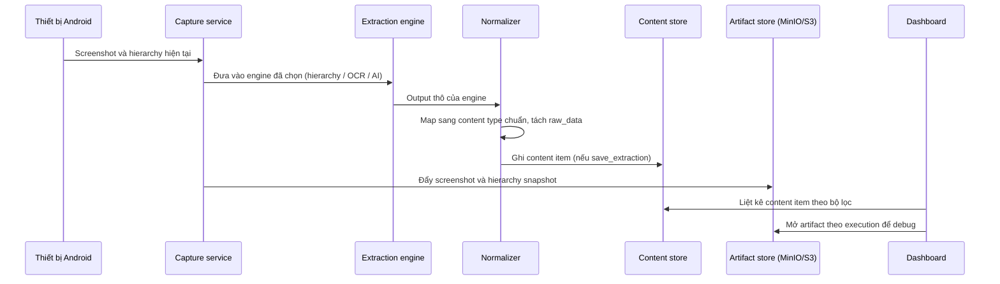
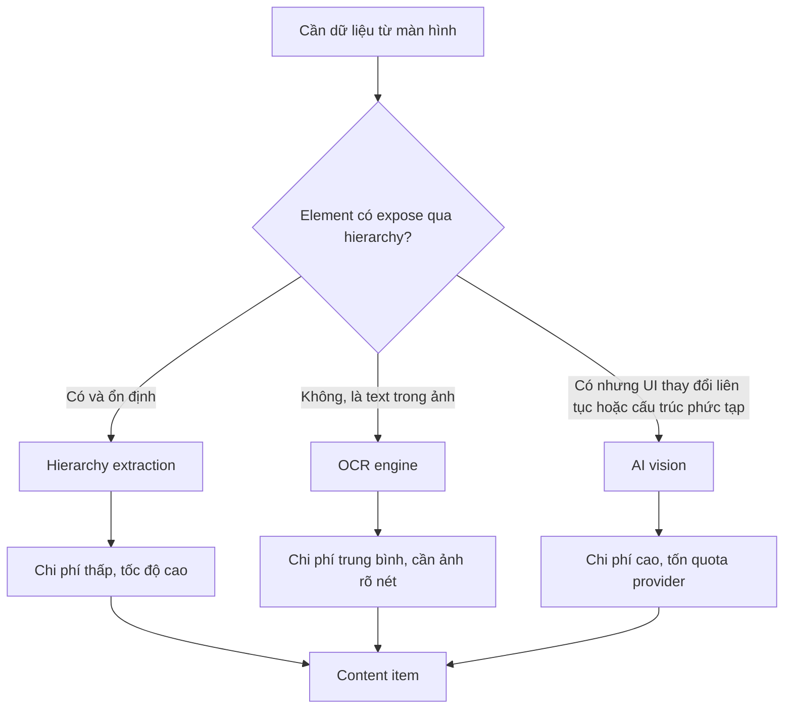

# Trích xuất nội dung & Artifact (Content, Extraction & Artifacts)

> **Mã module:** DF-MOD-06
> **Phiên bản:** 1.0
> **Cập nhật lần cuối:** 2026-05-25
> **Trạng thái:** Active
> **Đối tượng đọc:** Team Device Farm
> **Tài liệu liên quan:** [Product Overview](../01-product-overview.md), [Glossary](../00-glossary.md), [Personas & Journeys](../02-personas-and-journeys.md), [Devices & Control Plane](02-devices-and-control-plane.md), [Campaigns/Scenarios/Executions](04-campaigns-scenarios-executions.md), [Accounts & Groups](07-accounts-and-groups.md), [Social Platform Extensions](08-social-platform-extensions.md)

## 1. Tóm tắt (TL;DR)

Module Trích xuất nội dung & Artifact biến quan sát màn hình thiết bị Android thật thành dữ liệu nghiệp vụ có cấu trúc. Module cung cấp ba engine song song — hierarchy extraction (đọc cây UI), OCR (Optical Character Recognition — nhận dạng ký tự quang học), và AI vision (mô hình OpenAI/Gemini đọc screenshot) — để chọn theo bài toán. Kết quả được chuẩn hóa thành **content item** với content type platform-qualified (`fb_post`, `fb_comment`, `tiktok_video`, `tiktok_comment`, `threads_post`, `ig_media`, `ig_comment`), gom thành **content collection** theo dự án, và truy vết được tới campaign, device, scenario, execution, và account đã tạo ra dữ liệu. Song song với content store dùng cho dữ liệu nghiệp vụ, hệ thống lưu **artifact** (screenshot trước/sau bước, snapshot hierarchy) cho mục đích debug execution, đẩy trên object storage MinIO/S3. Mọi đường trích xuất — qua step `save_extraction` trong scenario hoặc qua endpoint trực tiếp `/api/devices/{serial}/extract/{hierarchy|ocr|ai}` — đều đi qua cùng một normalizer và cùng một content store, không tạo bản ghi song song.

## 2. Bối cảnh & Vấn đề giải quyết

Các đội thu thập dữ liệu social ở quy mô lớn gặp ba rào cản mà công cụ scraper truyền thống không xử lý được. Thứ nhất, dữ liệu trên màn hình điện thoại không có DOM ổn định như web — cùng một bài Facebook có thể hiện khác nhau theo phiên bản app, theo region, theo tài khoản, và theo cách Meta A/B test giao diện. Một chiến lược trích xuất duy nhất sẽ vỡ trận khi UI đổi. Thứ hai, mỗi nền tảng social có schema riêng (Facebook khác TikTok khác Threads khác Instagram) và bên trong mỗi nền tảng cũng có nhiều biến thể (post thường, post reel, post share, post album); người dùng đầu cuối cần dữ liệu chuẩn hóa để báo cáo, không phải JSON thô lung tung. Thứ ba, khi một campaign chạy fail, đội QA phải mở lại "hiện trường" — biết step nào fail, lúc đó màn hình hiển thị cái gì, hierarchy ra sao — mà không phải xin truy cập thiết bị thật.

Device Farm giải ba bài toán này bằng cách tách rõ hai khái niệm: **content** (dữ liệu nghiệp vụ chuẩn hóa, có content type và collection) và **artifact** (bằng chứng kỹ thuật của lần chạy). Ba engine extraction được thiết kế để bổ sung nhau, không loại trừ — engine được chọn theo độ ổn định UI và yêu cầu chi phí. raw_data field giữ nguyên dữ liệu platform-specific để không mất thông tin khi schema thay đổi. parent_id và item_level mô hình hóa quan hệ comment-reply mà không cần model riêng cho từng platform.

## 3. Phạm vi

### 3.1 In-scope

Module này sở hữu ba engine trích xuất (hierarchy, OCR, AI vision), normalizer chuẩn hóa kết quả về schema content item, persistence của content item vào cơ sở dữ liệu, quản lý content collection theo người sở hữu và dự án, và lưu artifact (screenshot pre/post bước, hierarchy snapshot, log) trên object storage MinIO/S3. Module này cung cấp hai bề mặt triệu gọi extraction: step `save_extraction` bên trong scenario (đường chuẩn cho workflow tự động), và endpoint trực tiếp `/api/devices/{serial}/extract/{hierarchy|ocr|ai}` (đường nhanh cho thao tác đặc biệt hoặc tích hợp ngoài scenario). Module cũng định nghĩa content type platform-qualified, hợp đồng raw_data, mô hình parent-child qua parent_id + item_level, và API truy vấn artifact theo execution.

### 3.2 Out-of-scope

Module này không sở hữu việc dispatch campaign hay scheduling scenario (thuộc module Campaign/Scenario/Execution và Scheduling). Module này không định nghĩa step type platform-specific (thuộc Social Platform Extensions) — module chỉ cung cấp engine và content type khung; step như `extract_fb_posts` được mô tả ở profile platform tương ứng. Module này không sở hữu transport stream realtime hay gesture (thuộc Devices & Control Plane); endpoint `/api/screenshot/{serial}` và `/api/stream/{serial}` chỉ được tham chiếu tại đây vì nguồn ảnh đi vào engine, không phải vì thuộc về module này. Module không sở hữu việc xuất dữ liệu định dạng cuối (CSV, JSON archive) trên đường route export cũ — đường export cũ đã được rút khỏi cơ sở dữ liệu qua migration 031 và đang trong giai đoạn refactor (xem mục 8). Module không sở hữu việc bảo mật secret của provider AI; cam kết là không persist provider secret vào bản ghi content.

## 4. Personas & Use Cases

### 4.1 Persona liên quan

Hai persona tương tác trực tiếp với module này. Social Data Operator là người tiêu thụ chính: chạy campaign, mở content collection, lọc theo content type, tải dữ liệu phục vụ khách hàng B2B, và mở artifact khi cần kiểm chứng. Automation Builder định nghĩa cách extract: chọn engine, chọn strategy platform-specific, gắn `save_extraction` ở vị trí phù hợp trong scenario, và quyết định trường nào về cột chuẩn, trường nào về raw_data. Fleet Operator và AI Operations Supervisor tương tác gián tiếp khi mở artifact để debug sự cố thiết bị hoặc khi MCP agent gọi tool extract.

### 4.2 Bảng use case

| ID | Persona | Mô tả | Mức ưu tiên |
|---|---|---|---|
| UC-06-01 | Automation Builder | Là người dựng kịch bản, tôi muốn chọn hierarchy extraction cho các phần UI ổn định để tiết kiệm chi phí và đạt độ chính xác cao nhất. | Must |
| UC-06-02 | Automation Builder | Là người dựng kịch bản, tôi muốn dùng OCR cho text nằm trong ảnh hoặc trong vùng không expose qua hierarchy. | Must |
| UC-06-03 | Automation Builder | Là người dựng kịch bản, tôi muốn dùng AI vision cho các trang social phức tạp có schema thay đổi liên tục, kèm prompt mô tả cấu trúc tôi cần. | Should |
| UC-06-04 | Automation Builder | Là người dựng kịch bản, tôi muốn gọi step `save_extraction` để lưu kết quả vào content store với content type platform-qualified. | Must |
| UC-06-05 | Automation Builder | Là người dựng kịch bản, tôi muốn các trường platform-specific không khớp cột chuẩn được giữ trong raw_data để không mất thông tin. | Must |
| UC-06-06 | Automation Builder | Là người dựng kịch bản, tôi muốn biểu diễn comment-reply qua parent_id và item_level để truy vấn theo cây hội thoại. | Must |
| UC-06-07 | Social Data Operator | Là người thu thập dữ liệu social, tôi muốn xem danh sách content item lọc theo content type, theo collection, theo campaign, theo khoảng thời gian. | Must |
| UC-06-08 | Social Data Operator | Là người thu thập dữ liệu social, tôi muốn tạo content collection để gom dữ liệu theo dự án phục vụ khách hàng B2B, không lẫn giữa các yêu cầu khác nhau. | Must |
| UC-06-09 | Social Data Operator | Là người thu thập dữ liệu social, tôi muốn truy vết một content item về campaign, device, scenario, execution, và account đã tạo ra nó. | Must |
| UC-06-10 | Social Data Operator | Là người thu thập dữ liệu social, tôi muốn mở artifact của một execution để xem screenshot và hierarchy snapshot tại từng step khi báo cáo cho khách hàng B2B. | Must |
| UC-06-11 | Automation Builder | Là người dựng kịch bản, tôi muốn gọi `/api/devices/{serial}/extract/{hierarchy|ocr|ai}` ngoài scenario để thử strategy mới trên thiết bị đang reserve. | Should |
| UC-06-12 | Social Data Operator | Là người thu thập dữ liệu social, tôi muốn dữ liệu trùng lặp tối thiểu trong cùng một collection để báo cáo không bị thổi số liệu. | Should |
| UC-06-13 | Social Data Operator | Là người thu thập dữ liệu social, tôi muốn nhìn rõ giới hạn ngân sách AI vision đã dùng để chủ động chuyển engine khi gần ngưỡng. | Could |

## 5. Luồng nghiệp vụ chính

### 5.1 Luồng tổng quát từ màn hình thiết bị đến content item

Sơ đồ dưới mô tả đường đi của dữ liệu từ thời điểm thiết bị đang ở một màn hình social cho tới khi một content item được lưu vào cơ sở dữ liệu và artifact được đẩy lên object storage.



Điểm cốt yếu để hiểu sơ đồ này: extraction và artifact là hai dòng dữ liệu song song, không phụ thuộc nhau. Artifact được lưu mỗi khi capture chạy (pre/post step), bất kể step có `save_extraction` hay không. Content item chỉ được lưu khi step extraction yêu cầu persist hoặc khi endpoint extract trực tiếp được gọi với cờ save. Điều này cho phép bật pre/post capture cho mọi scenario để có evidence đầy đủ, mà không bị "ngợp" bản ghi content do mỗi step đều ghi.

### 5.2 Ba engine extraction và tiêu chí chọn engine

Module cung cấp ba engine với đặc tính khác nhau. Sơ đồ dưới mô tả luồng quyết định ở mức nghiệp vụ, để người dựng kịch bản chọn engine cho từng strategy.



Hierarchy extraction là lựa chọn mặc định cho dữ liệu nằm trong UI element của Android. Engine này đọc thuộc tính text, content-description, resource-id của từng node và áp một extraction strategy (do người dựng định nghĩa) để map sang content schema. Tốc độ nhanh, chi phí thấp, không gọi provider ngoài. Yếu điểm: khi nền tảng social không expose dữ liệu qua hierarchy (ví dụ render thành Canvas hoặc image), hierarchy không trả được giá trị.

OCR engine chạy nhận dạng ký tự trên ảnh screenshot. Phù hợp với text nằm trong vùng ảnh hoặc trên thumbnail. Chi phí trung bình do tốn CPU/GPU và cần ảnh đủ độ phân giải. Engine này không hiểu ngữ nghĩa text — chỉ trả chuỗi ký tự kèm tọa độ; người dựng có trách nhiệm map về trường schema.

AI vision dùng mô hình của OpenAI hoặc Gemini đọc screenshot kèm prompt mô tả cấu trúc cần extract. Engine này linh hoạt nhất, xử lý được UI phức tạp và biến thể schema, nhưng tốn token provider — cần tính chi phí trước khi đưa vào scenario chạy diện rộng. Hệ thống không persist secret của provider trong content; secret được nạp vào engine từ cấu hình runtime và rời tiến trình sau khi gọi xong.

### 5.3 Mô hình dữ liệu content item và truy vết

Một content item không sống cô lập — nó là điểm giao của nhiều thực thể nghiệp vụ. Sơ đồ ER rút gọn dưới đây trình bày các quan hệ chính.

```mermaid
erDiagram
    content_collections ||--o{ content_items : nhóm
    campaigns ||--o{ content_items : sinh ra
    executions ||--o{ content_items : tạo trong lần chạy
    devices ||--o{ content_items : thu trên thiết bị
    scenarios ||--o{ content_items : theo kịch bản
    accounts ||--o{ content_items : thực hiện bởi
    content_items ||--o{ content_items : parent-child (parent_id)
    executions ||--o{ execution_artifacts : có
```

Quy ước truy vết: từ một content item, đi ngược về execution để biết "ai chạy", về scenario để biết "chạy cái gì", về campaign để biết "thuộc plan nào", về device để biết "trên máy nào", và về account để biết "với tài khoản nào". Từ một execution, đi xuống artifact để mở screenshot và hierarchy snapshot tại bất kỳ step nào trong lần chạy. Trường parent_id và item_level cho phép biểu diễn cấu trúc cây — comment có parent là post; reply có parent là comment và item_level cao hơn một bậc; thread items có thể nối nhau qua chuỗi parent_id.

### 5.4 Đường gọi extraction: scenario step so với endpoint trực tiếp

Sơ đồ dưới phân biệt hai đường gọi để biết khi nào dùng đường nào.

```mermaid
flowchart LR
    SC[Scenario step save_extraction] --> Handler[Extraction handler]
    Direct[Endpoint /api/devices/{serial}/extract/...] --> Handler
    Handler --> Engine[3 engine + normalizer]
    Engine --> Persist[Content store + Artifact store]
```

Đường scenario step là chuẩn cho workflow lặp lại trên fleet — scenario được định nghĩa một lần, chạy trên nhiều device, kết quả tự lưu vào content store với đầy đủ liên kết campaign/scenario/execution. Đường endpoint trực tiếp dùng khi người dựng đang trong phiên reserve thiết bị và muốn thử nghiệm nhanh một strategy mới, hoặc khi tích hợp ngoài cần extract một lần không qua scenario. Cả hai đường dùng chung handler, chung engine, chung normalizer, chung schema content item — không tồn tại bản ghi "extract ngoài scenario" có schema khác với "extract trong scenario".

## 6. Đặc tả tính năng (Functional Spec)

| ID | Tính năng | Mô tả nghiệp vụ | Ưu tiên | Acceptance criteria |
|---|---|---|---|---|
| FR-06-01 | Hierarchy extraction engine | Trích xuất dữ liệu từ cây UI element của Android theo extraction strategy được khai báo. | Must | Engine trả về dữ liệu có cấu trúc từ một hierarchy snapshot; strategy không khớp trả lỗi nghiệp vụ rõ ràng; tốc độ trả về < 3 s cho hierarchy thông thường. |
| FR-06-02 | OCR engine | Nhận dạng ký tự từ ảnh screenshot toàn màn hình hoặc vùng cụ thể. | Must | OCR trả về chuỗi text kèm tọa độ; hỗ trợ tiếng Việt; thời gian < 5 s/ảnh ở chế độ chuẩn. |
| FR-06-03 | AI vision engine | Gọi provider OpenAI hoặc Gemini với screenshot kèm prompt để trích xuất dữ liệu có cấu trúc. | Should | Engine chấp nhận provider, prompt, schema mong đợi; trả output đã parse; ghi rõ provider, latency, ước tính token để theo dõi chi phí. |
| FR-06-04 | Normalizer thống nhất | Output từ ba engine đều đi qua một normalizer để map về schema content item chuẩn. | Must | Cùng một bài Facebook qua hierarchy hay AI vision đều cho ra content item với cùng tập cột chuẩn; chênh lệch giữa engine nằm ở raw_data. |
| FR-06-05 | Content type platform-qualified | Mỗi content item gắn `content_type` theo định dạng `<platform>_<object>` (ví dụ `fb_post`, `tiktok_comment`). | Must | Validation từ chối content type generic như "post" hay "comment"; trường `platform` cũng được điền song song để filter; danh sách content type hỗ trợ trùng với Glossary. |
| FR-06-06 | raw_data field | Trường JSON lưu các thuộc tính platform-specific không khớp cột chuẩn. | Must | raw_data được lưu nguyên vẹn; query trên content item không bắt buộc parse raw_data; tài liệu strategy nói rõ key nào đi vào raw_data. |
| FR-06-07 | Parent-child qua parent_id và item_level | Biểu diễn comment-reply, thread item, nested object bằng hai trường này. | Must | Có thể query cây hội thoại theo parent_id; item_level tăng đúng một bậc giữa các tầng; root content có parent_id null. |
| FR-06-08 | save_extraction step | Step scenario lưu kết quả extraction vào content store và gắn vào collection. | Must | Step nhận tham số collection, content type, mapping; step idempotent theo cấu hình (re-run không nhân đôi nếu khai báo dedup); step thất bại được xử lý theo error policy. |
| FR-06-09 | Endpoint extract trực tiếp | `/api/devices/{serial}/extract/{hierarchy|ocr|ai}` cho phép trích xuất ngoài scenario. | Should | Endpoint yêu cầu thiết bị đang reserve cho session gọi; output trùng schema với scenario step; có cờ persist để chọn lưu hay chỉ trả về. |
| FR-06-10 | Content collection | Gom content item theo project/khách hàng để tổ chức và xuất dữ liệu. | Must | Collection có owner và metadata mô tả; một content item thuộc một collection chính; xóa collection không xóa content item nếu chưa khai báo cascade. |
| FR-06-11 | Truy vấn và lọc content | Người dùng lọc theo platform, content type, collection, campaign, execution, device, account, khoảng thời gian. | Must | Bộ lọc phân trang được; bộ lọc kết hợp nhiều tiêu chí; thời gian phản hồi < 3 s cho top 1000 record. |
| FR-06-12 | Artifact lưu trên MinIO/S3 | Screenshot pre/post step và hierarchy snapshot được đẩy lên object storage và truy cập qua API artifact theo execution. | Must | Artifact gắn execution id và step index; URL ký có thời hạn để truy cập an toàn; xóa execution cũ có thể đi kèm cleanup artifact theo chính sách lưu trữ. |
| FR-06-13 | Truy vết content tới ngữ cảnh nguồn | Mỗi content item lưu tham chiếu campaign id, scenario id, execution id, device id, account id (nếu có). | Must | API content trả về các id liên kết; UI mở chi tiết content hiển thị breadcrumb truy vết; thiếu một id phải có lý do nghiệp vụ rõ (ví dụ extract trực tiếp ngoài campaign). |
| FR-06-14 | Không persist provider secret | Khóa API của OpenAI/Gemini không bao giờ được lưu trong content record hay artifact. | Must | Audit log xác nhận không có chuỗi giống secret pattern trong DB content; secret chỉ tồn tại trong cấu hình runtime; rotation secret không cần migrate dữ liệu. |
| FR-06-15 | Báo cáo chi phí AI vision | Mỗi lần gọi AI vision ghi nhận provider, model, ước tính token, để dashboard tổng hợp theo organization. | Should | Có trang xem chi phí theo ngày/tuần/tháng; cảnh báo khi vượt ngưỡng budget; chi phí không ảnh hưởng kết quả content item đã lưu. |

## 7. Capability matrix

Bảng dưới khai báo trạng thái của ba engine và các năng lực liên quan trên bốn nền tảng social mục tiêu. Engine là độc lập platform, nhưng chiến lược (strategy) thì gắn với platform.

| Năng lực | Facebook | TikTok | Threads | Instagram |
|---|---|---|---|---|
| Hierarchy extraction engine | Active | Active | Active | Active |
| OCR engine | Active | Active | Active | Active |
| AI vision engine (OpenAI/Gemini) | Active | Active | Active | Active |
| Strategy `*_posts` (post listing) | Active | Active | Active | Active |
| Strategy `*_comments` (comment listing) | Active | Active | Active | Active |
| Content type platform-qualified | `fb_post`, `fb_comment` Active | `tiktok_video`, `tiktok_comment` Active | `threads_post` Active | `ig_media`, `ig_comment` Active |
| parent_id + item_level cho comment-reply | Active | Active | Active | Active |
| Endpoint extract trực tiếp | Active | Active | Active | Active |
| Content collection theo project | Active | Active | Active | Active |
| Pre/post step capture artifact | Active | Active | Active | Active |
| Export định dạng cuối (CSV/JSON archive) | Đang refactor | Đang refactor | Đang refactor | Đang refactor |
| Server-side dedup content trong cùng collection | Roadmap | Roadmap | Roadmap | Roadmap |

Trạng thái "Active" nghĩa là tính năng đã triển khai và sẵn dùng trong sản phẩm; "Đang refactor" xem chi tiết tại mục 8; "Roadmap" là cam kết phát triển nhưng chưa có trong phiên bản hiện tại.

## 8. Giới hạn, ràng buộc & rủi ro

Phần này minh bạch các điểm cần biết trước khi đưa module này vào pipeline thu thập dữ liệu diện rộng.

**Tính năng export định dạng cuối đang trong giai đoạn refactor.** Đường export cũ đã được rút khỏi cơ sở dữ liệu qua migration 031 (031_drop_content_exports). Trong tài liệu cũ và trong một vài UI cũ vẫn còn tham chiếu tới "export job"; những tham chiếu này không còn phản ánh hiện trạng. Đường export mới đang được thiết kế lại trên trục stream — sẽ có thông báo trước khi mở lại. Trong giai đoạn này, nên dùng API truy vấn content có phân trang để lấy dữ liệu ra hệ thống bên ngoài, hoặc đề xuất yêu cầu export cụ thể để team ưu tiên triển khai.

**Chi phí AI vision có thể tăng nhanh nếu không có guardrail ngân sách.** AI vision gọi provider ngoài (OpenAI hoặc Gemini) và tính theo token. Một campaign chạy diện rộng dùng AI vision cho mọi step extraction có thể đốt ngân sách nhanh chóng, đặc biệt khi gặp UI dài hoặc khi gọi lại nhiều lần do retry policy. Lưu ý: AI vision cũng chịu rate limit và outage của provider; khi provider không khả dụng, scenario có thể fail hàng loạt. Khuyến nghị nghiệp vụ: dùng AI vision như engine bổ sung cho phần UI khó, để hierarchy extraction là engine chính cho phần ổn định, và đặt ngưỡng cảnh báo budget ở dashboard.

**Dedup chưa được enforce ở server-side.** Hiện tại việc tránh trùng lặp content item phụ thuộc client (scenario gọi extraction phải tự khai báo dedup key hoặc kiểm tra trước khi save). Hệ thống chưa từ chối ghi content item trùng ở phía server. Hệ quả: nếu cùng một post được crawl hai lần bởi hai scenario khác nhau, hai bản ghi content item sẽ tồn tại trong cùng collection. Roadmap có hạng mục server-side dedup theo (collection, platform, external_id). Trong giai đoạn này, nên thiết kế strategy có external_id ổn định (post id, comment id của platform) và đề xuất chính sách dedup cho từng dự án.

**Hierarchy không phải lúc nào cũng phản ánh đủ nội dung hiển thị.** Một số nền tảng (đặc biệt khi render qua Canvas hoặc image) không expose text qua UI hierarchy. Khi đó hierarchy extraction trả về rỗng dù mắt người vẫn thấy nội dung. Đây là giới hạn của Android UI Automator nói chung, không phải lỗi Device Farm. Trong trường hợp này, cần chuyển sang OCR hoặc AI vision cho strategy tương ứng.

**Provider secret không được persist trong content.** Đây là cam kết bảo mật của module: dù dùng API key của OpenAI hoặc Gemini, key đó chỉ tồn tại trong cấu hình runtime của provider, không vào content record và không vào artifact. Hệ quả: nếu xuất content ra hệ thống bên ngoài, key sẽ không đi cùng — đây là hành vi mong muốn. Tuy nhiên, hệ thống cũng chưa có cơ chế "secret filtering" toàn cục cho mọi log trace, nên team vận hành cần cẩn thận khi share output debug ra ngoài tổ chức.

**raw_data có thể chứa dữ liệu nhạy cảm tùy strategy.** Vì raw_data lưu nguyên payload platform trả về, có khả năng nó chứa tên hiển thị, avatar URL, comment có thông tin cá nhân. Trách nhiệm tuân thủ chính sách dữ liệu (GDPR, các luật bản địa) thuộc về team triển khai khi định nghĩa strategy và collection. Device Farm cung cấp công cụ xóa content item và collection nhưng không tự suy diễn dữ liệu nào "nên" xóa.

**Artifact pre/post capture chi phí lưu trữ đáng kể.** Mặc định mọi step trong scenario kích hoạt pre/post capture, đẩy hai screenshot lên MinIO/S3 cho mỗi step. Một campaign 1000 device với scenario 20 step sẽ tạo ~40,000 screenshot. Chính sách lưu trữ artifact theo execution có thể được cấu hình ở triển khai; cần rà soát chính sách giữ artifact (ví dụ giữ 30 ngày, sau đó archive hoặc xóa).

## 9. Chỉ số đo lường thành công (KPIs)

| KPI | Mục tiêu | Ghi chú |
|---|---|---|
| Tỷ lệ content item có content type platform-qualified (không generic) | 100% | Đo trên content item mới tạo; legacy được migrate dần. |
| Tỷ lệ content item truy vết được đầy đủ về campaign/scenario/execution/device | ≥ 99% | Loại trừ extract trực tiếp ngoài campaign có lý do nghiệp vụ ghi nhận. |
| Tỷ lệ artifact pre/post capture đính kèm execution đầy đủ | ≥ 99% | Loại trừ scenario tắt capture tường minh. |
| Latency trung vị hierarchy extraction | < 3 s | Đo trên hierarchy thông thường, không kể network jitter. |
| Latency trung vị AI vision (OpenAI/Gemini) | < 8 s | Đo từ lúc gửi request tới khi nhận output đã parse. |
| Tỷ lệ scenario bị fail do AI vision provider outage | < 1% mỗi tháng | Đo theo organization; khuyến nghị fallback engine khi vượt ngưỡng. |
| Số sự cố leak provider secret vào content/artifact | 0 mỗi quý | Mỗi sự cố là critical; audit định kỳ. |
| Tỷ lệ content item trùng trong cùng collection | < 2% | Trong khi server-side dedup còn ở roadmap, đo qua kiểm tra external_id ngẫu nhiên. |
| Thời gian phục hồi sau khi provider AI rate limit | < 30 phút | Đo từ lúc bắt rate limit tới khi pipeline tiếp tục bình thường. |
| Dung lượng artifact trung bình mỗi execution | Trong ngưỡng đã thỏa thuận | Đo để dự báo chi phí object storage. |

## 10. Glossary refs & Open questions

**Thuật ngữ chính tham chiếu Glossary:** [OCR](../00-glossary.md), [AI vision](../00-glossary.md), [Hierarchy extraction](../00-glossary.md), [Extraction strategy](../00-glossary.md), [Content item](../00-glossary.md), [Content type](../00-glossary.md), [Content collection](../00-glossary.md), [raw_data](../00-glossary.md), [parent_id / item_level](../00-glossary.md), [save_extraction](../00-glossary.md), [Artifact](../00-glossary.md), [MinIO / S3](../00-glossary.md), [Platform-qualified content type](../00-glossary.md), [Execution](../00-glossary.md), [Hierarchy](../00-glossary.md).

**Câu hỏi nghiệp vụ còn mở:**

Khi nào Device Farm nên đưa server-side dedup trên content item vào sản phẩm — gắn với cấu trúc external_id chuẩn cho mỗi platform, hay theo tổ hợp (collection, platform, content_type, external_id) mà người dùng tự khai báo? Đường export định dạng cuối nên ưu tiên CSV cho use case business hay JSON Lines streaming cho tích hợp pipeline phía sau? Có nên đưa AI vision provider thứ ba (ví dụ Anthropic) vào danh sách được hỗ trợ, hay tập trung củng cố OpenAI và Gemini? Khi raw_data có thể chứa dữ liệu cá nhân, sản phẩm nên cung cấp công cụ "scrub PII" tự động hay để team triển khai tự định nghĩa policy? Khi artifact vượt ngưỡng lưu trữ, chính sách mặc định nên là archive sang cold storage hay xóa kèm thông báo? AI vision có nên hỗ trợ "schema-guided extraction" (use case cung cấp JSON schema, engine bảo đảm output đúng schema) trong phiên bản tới?
