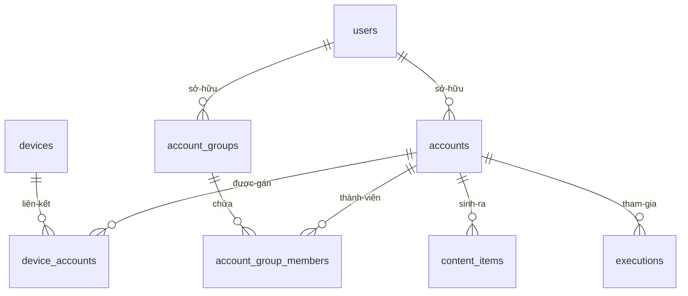
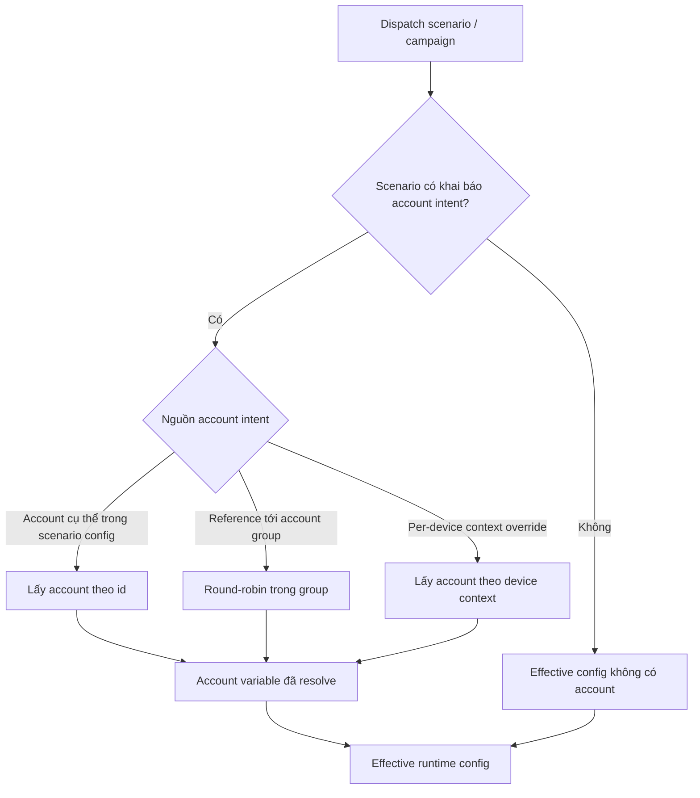
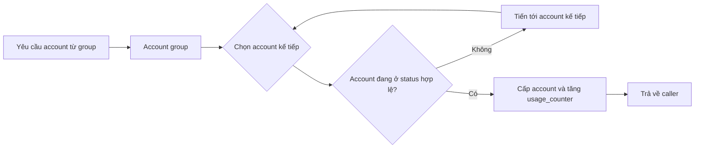

# Account & Account Group

> **Mã module:** DF-MOD-07
> **Phiên bản:** 1.0
> **Cập nhật lần cuối:** 2026-05-25
> **Trạng thái:** Active
> **Đối tượng đọc:** Team Device Farm
> **Tài liệu liên quan:** [Product Overview](../01-product-overview.md), [Glossary](../00-glossary.md), [Personas & Journeys](../02-personas-and-journeys.md), [Devices & Control Plane](02-devices-and-control-plane.md), [Campaign, Scenario & Execution](04-campaigns-scenarios-executions.md), [Content/Extraction/Artifacts](06-content-extraction-artifacts.md), [Social Platform Extensions](08-social-platform-extensions.md)

## 1. Tóm tắt (TL;DR)

Module Account & Account Group sở hữu vòng đời của các tài khoản social platform mà Device Farm sử dụng để vận hành scenario tự động hóa. Module quản lý CRUD account (Facebook, TikTok, Threads, Instagram, ...), gắn account cho device qua bảng device_accounts, và gom account thành account group (nhóm tài khoản) để cấp phát theo round-robin (xoay vòng đều). Khi một scenario hoặc campaign chạy, account variable (biến account) được resolve từ scenario config, per-device context, hoặc account group reference — và được đưa vào effective runtime config cùng các biến khác. Module này tuân thủ một nguyên tắc nghiệp vụ cốt lõi: Device Farm chạy chính xác theo authored scenario flow — nếu scenario cần đăng nhập hoặc cần account, người dựng phải khai báo tường minh; runtime không tự "đoán" account thay cho người dựng. Cùng với module Campaign, Scenario & Execution và module Devices & Control Plane, module này tạo thành tam giác nghiệp vụ mà mọi workflow social đều đi qua.

## 2. Bối cảnh & Vấn đề giải quyết

Khi một đội thu thập dữ liệu social vận hành ở quy mô hàng trăm thiết bị, bài toán "account nào dùng cho việc nào trên thiết bị nào" trở thành một bài toán tách biệt với bài toán "scenario làm gì". Ba vấn đề thường gặp ở các đội chưa có công cụ phù hợp như sau. Thứ nhất, account bị "đính cứng" vào script — đổi account phải sửa script, không thể tái sử dụng scenario cho dự án khác. Thứ hai, không có cơ chế rotation (xoay vòng) — một account bị dùng quá nhiều dễ bị nền tảng social phát hiện và hạn chế, trong khi các account khác lại không được dùng đều. Thứ ba, không có ranh giới rõ giữa "account là trách nhiệm của ai" — khi scenario chạy fail do thiếu credential, đội data đổ lỗi cho đội automation và ngược lại.

Device Farm giải ba vấn đề này bằng cách tách account thành thực thể độc lập với scenario, và chuẩn hóa cách scenario tham chiếu account. Account là tài nguyên user-scoped với platform, username, status, tag, metadata, usage_counter, và proxy_id tùy chọn — đầy đủ thông tin để quản lý fleet tài khoản. Account group cho phép gom các account cùng mục đích để hệ thống cấp phát theo round-robin một cách công bằng. Khi scenario cần account, người dựng khai báo trong scenario config (hoặc per-device context) — runtime resolve về một account cụ thể tại thời điểm dispatch và đưa vào effective runtime config. Ranh giới trách nhiệm rõ: thiếu account/login là lỗi cấu hình thuộc người dựng scenario, không phải lỗi runtime của Device Farm.

## 3. Phạm vi

### 3.1 In-scope

Module này sở hữu mô hình dữ liệu account (platform, username, status, tag, metadata, usage_counter, proxy_id) và CRUD account theo user owner, import account hàng loạt (bulk import), endpoint round-robin để cấp phát account cho người gọi, mô hình device_accounts link gắn account với device (có cờ primary), mô hình account_groups và account_group_members để gom account theo mục đích, cơ chế resolve account variable trong dispatch flow của scenario, và quy ước truy vết "account nào đã thực hiện hành vi nào" qua tham chiếu account id trên content item và execution. Module cũng định nghĩa hợp đồng nghiệp vụ rằng intent về account/login là canonical-owned-by-scenario — scenario phải khai báo tường minh nhu cầu account, không có fallback ngầm từ Device Farm.

### 3.2 Out-of-scope

Module này không sở hữu logic step social hay flow đăng nhập của platform cụ thể (thuộc Social Platform Extensions) — module chỉ cung cấp account record và resolution; bản thân scenario phải có step "đăng nhập bằng credential ấy". Module này không sở hữu device group hay membership của device (thuộc Devices & Control Plane); account group và device group là hai thực thể tách biệt — không được gộp tên hay logic. Module này không sở hữu workflow dispatch hay scenario execution (thuộc Campaign, Scenario & Execution) — module cung cấp dữ liệu account để dispatch service tiêu thụ. Module này hiện không sở hữu vault hay credential secret manager — credential field hiện chấp nhận giá trị JSON tự do, không được mã hóa ở lớp ứng dụng (xem ràng buộc tại mục 8). Module này không tự suy diễn hành vi đăng nhập, không tự xử lý 2FA, và không tự refresh session cookie khi platform yêu cầu.

## 4. Personas & Use Cases

### 4.1 Persona liên quan

Hai persona chính tương tác với module này được mô tả tại [Personas & Journeys](../02-personas-and-journeys.md). Người thu thập dữ liệu social (Social Data Operator) là người quản lý fleet account: nhập account từ nguồn ngoài, gắn account cho device, tạo account group theo dự án, và theo dõi usage_counter để điều phối tải. Người dựng kịch bản tự động hóa (Automation Builder) là người tham chiếu account trong scenario: khai báo "scenario này cần account Facebook" hoặc "scenario này dùng account group X round-robin", và thiết kế step đăng nhập tương ứng với credential mà account cung cấp. Người vận hành fleet (Fleet Operator) quan tâm tới mối quan hệ account–device khi rotate thiết bị; người giám sát AI vận hành (AI Operations Supervisor) tiêu thụ gián tiếp khi MCP agent đọc account context của session.

### 4.2 Bảng use case

| ID | Persona | Mô tả | Mức ưu tiên |
|---|---|---|---|
| UC-07-01 | Social Data Operator | Là người thu thập dữ liệu social, tôi muốn tạo một account với platform, username, status, tag và metadata để bắt đầu vận hành. | Must |
| UC-07-02 | Social Data Operator | Là người thu thập dữ liệu social, tôi muốn import danh sách account hàng loạt từ file để khởi tạo nhanh fleet account của một dự án mới. | Must |
| UC-07-03 | Social Data Operator | Là người thu thập dữ liệu social, tôi muốn cập nhật status account (active, suspended, retired) để phản ánh tình trạng thực tế và loại các account "đau" ra khỏi rotation. | Must |
| UC-07-04 | Social Data Operator | Là người thu thập dữ liệu social, tôi muốn gắn account vào device qua device_accounts link, có cờ primary để đánh dấu account chính cho device. | Must |
| UC-07-05 | Social Data Operator | Là người thu thập dữ liệu social, tôi muốn tạo account group và thêm account vào group để hệ thống cấp phát theo round-robin khi scenario chạy. | Must |
| UC-07-06 | Social Data Operator | Là người thu thập dữ liệu social, tôi muốn gọi endpoint round-robin để lấy account kế tiếp trong group khi cần dispatch không qua scenario hoặc khi tích hợp ngoài. | Should |
| UC-07-07 | Automation Builder | Là người dựng kịch bản, tôi muốn khai báo account intent trong scenario config (chọn account cụ thể hoặc reference tới account group) để runtime resolve khi dispatch. | Must |
| UC-07-08 | Automation Builder | Là người dựng kịch bản, tôi muốn account variable được resolve theo cùng cơ chế resolve biến của scenario (xem module Campaign) để hành vi runtime đoán được. | Must |
| UC-07-09 | Social Data Operator | Là người thu thập dữ liệu social, tôi muốn gắn proxy_id cho account để khi scenario chạy, các request mạng đi qua proxy phù hợp. | Should |
| UC-07-10 | Social Data Operator | Là người thu thập dữ liệu social, tôi muốn xem usage_counter của account để biết account nào đang dùng quá nhiều và cần nghỉ. | Should |
| UC-07-11 | Social Data Operator | Là người thu thập dữ liệu social, tôi muốn dữ liệu content item lưu được account id đã sinh ra dữ liệu để truy vết và báo cáo theo account. | Must |
| UC-07-12 | Automation Builder | Là người dựng kịch bản, khi scenario không khai báo account intent mà step lại cần login, tôi muốn scenario fail rõ ràng thay vì Device Farm tự chọn account thay tôi. | Must |
| UC-07-13 | Social Data Operator | Là người thu thập dữ liệu social, tôi muốn phân biệt account group với device group trong UI và tài liệu để không nhầm lẫn khi cấu hình campaign. | Must |

## 5. Luồng nghiệp vụ chính

### 5.1 Vòng đời account và quan hệ với device

Sơ đồ dưới mô tả các thực thể chính của module và quan hệ giữa chúng. Quan hệ chéo qua device_accounts là điểm cốt lõi của vận hành — một device có thể gắn nhiều account và ngược lại.

Một account là tài nguyên user-scoped (thuộc một owner trong phạm vi tổ chức). Một device có thể gắn nhiều account qua device_accounts, mỗi link có thể được đánh dấu primary để chỉ ra account "chính" của device đó. Một account có thể thuộc nhiều account_group qua account_group_members. Khi scenario chạy, content_items và execution mới có thể lưu tham chiếu account id để truy vết "account nào đã thực hiện hành vi nào". Đây là nền tảng để báo cáo "fleet account đã làm những gì" theo trục account thay vì chỉ theo trục device.

### 5.2 Luồng resolve account variable khi dispatch scenario

Sơ đồ dưới mô tả cách dispatch service resolve account variable từ thời điểm scenario được kích hoạt cho đến khi effective runtime config có giá trị account cụ thể.

Khi dispatch service đọc scenario, nó kiểm tra account intent. Nếu scenario không khai báo, effective runtime config sẽ không có account và scenario phải tự chịu nếu step bên trong cần đăng nhập — runtime không can thiệp. Nếu scenario khai báo account id cụ thể, dispatch nạp account đó vào effective config. Nếu scenario reference tới account group, dispatch lấy account kế tiếp theo round-robin trong group. Nếu per-device context override một account khác (ví dụ device A muốn chạy với account X riêng), context override thắng theo thứ tự resolve biến đã mô tả ở [module Campaign](04-campaigns-scenarios-executions.md). Kết quả cuối là một account variable được đưa vào effective runtime config cùng các biến khác để scenario step tiêu thụ.

### 5.3 Round-robin trong account group

Round-robin là cơ chế cấp phát account đều đặn từ một account group. Sơ đồ dưới mô tả nguyên lý nghiệp vụ.

Khi một scenario hoặc một caller bên ngoài yêu cầu account từ group, hệ thống chọn account kế tiếp trong thứ tự nội bộ của group, kiểm tra account đang ở status hợp lệ (ví dụ active, không phải suspended hay retired), và trả về cho caller kèm việc tăng usage_counter. Cơ chế này đảm bảo các account được dùng đều — không có account nào bị "dùng đi dùng lại" trong khi account khác nằm im. Người vận hành theo dõi usage_counter để phát hiện sớm trường hợp một account vô tình bị đẩy lên cao bất thường.

## 6. Đặc tả tính năng (Functional Spec)

| ID | Tính năng | Mô tả nghiệp vụ | Ưu tiên | Acceptance criteria |
|---|---|---|---|---|
| FR-07-01 | CRUD account | Người dùng tạo, đọc, cập nhật, xóa account với platform, username, status, tag, metadata, proxy_id, usage_counter. | Must | Account thuộc đúng owner; ràng buộc unique theo (owner, platform, username) hoặc theo external id; xóa account có cơ chế bảo toàn lịch sử (soft delete) cho dữ liệu liên quan. |
| FR-07-02 | Bulk import account | Người dùng import nhiều account cùng lúc qua file để khởi tạo fleet nhanh. | Must | Hỗ trợ file CSV hoặc JSON; báo cáo lỗi từng dòng nếu thất bại; idempotent theo external id hoặc tổ hợp (owner, platform, username). |
| FR-07-03 | Cập nhật status account | Status account thay đổi giữa các giá trị (ví dụ active, suspended, retired) để phản ánh tình trạng thực tế. | Must | Status được lưu kèm timestamp; account ở status không hợp lệ bị loại khỏi round-robin; thay đổi status được audit. |
| FR-07-04 | device_accounts link | Gắn một account cho một device; có cờ primary để chỉ ra account chính của device. | Must | Một device có thể có nhiều account; chỉ tối đa một account primary mỗi device; xóa link không xóa account gốc. |
| FR-07-05 | account_groups CRUD | Người dùng tạo, đặt tên, mô tả, gắn thành viên cho account group. | Must | Group thuộc owner; thêm/xóa thành viên là idempotent; tên group không trùng với device group trong cùng tổ chức ở UI. |
| FR-07-06 | Endpoint round-robin | Endpoint trả về account kế tiếp trong group theo cơ chế xoay vòng. | Must | Mỗi lần gọi trả về account khác (trong điều kiện đủ thành viên hợp lệ); account ở status không hợp lệ bị bỏ qua; counter rotation được persist. |
| FR-07-07 | Account variable trong scenario config | Người dựng khai báo account intent trong scenario config (account id cụ thể hoặc reference tới group). | Must | Schema scenario chấp nhận account_id hoặc account_group_id; thiếu khai báo và step cần login bị fail theo error policy; không có fallback ngầm. |
| FR-07-08 | Per-device context override account | Mỗi device trong campaign có thể override account intent theo context riêng. | Must | Override thắng scenario default theo thứ tự resolve biến của module Campaign; thiếu override dùng scenario default. |
| FR-07-09 | proxy_id gắn với account | Account có thể có proxy_id tùy chọn để runtime biết request mạng phải đi qua proxy nào. | Should | Trường proxy_id là tham chiếu sang bảng proxy (nếu có); thiếu proxy hợp lệ báo lỗi rõ; runtime không tự bỏ proxy. |
| FR-07-10 | usage_counter | Mỗi lần account được cấp qua round-robin hoặc dùng trong execution, usage_counter tăng để theo dõi tải. | Should | Counter monotonic increase; dashboard hiển thị usage_counter; có thể reset thủ công theo audit log. |
| FR-07-11 | Truy vết account trên content và execution | content_item và execution lưu account id (khi có) để truy vết. | Must | API content trả về account id liên kết; báo cáo cho phép nhóm theo account; thiếu account id chỉ chấp nhận khi scenario không khai báo intent. |
| FR-07-12 | Không tự suy diễn account | Khi scenario không khai báo account intent, runtime không tự chọn primary account của device hay account khác làm fallback. | Must | Test guard xác nhận default behavior không invent account; chỉ một số đường dispatch legacy còn fallback và được đánh dấu rõ (xem SPG-007 ở mục 8). |
| FR-07-13 | Phân biệt account group và device group | Tên gọi, tài liệu và UI phân biệt rõ account_group với device_group; không cho phép gộp logic. | Must | Schema riêng; UI có hai khu vực riêng biệt; tài liệu dùng tên đầy đủ không viết tắt gây nhầm. |
| FR-07-14 | Quyền sở hữu account theo organization | Account chỉ nhìn thấy được trong phạm vi organization của owner; cross-tenant truy cập bị từ chối. | Must | Filter organization mặc định trên mọi query account; truy cập account ngoài tổ chức trả 403 hoặc 404. |
| FR-07-15 | Audit thay đổi account quan trọng | Tạo, xóa, đổi status, thêm/xóa khỏi group được ghi audit log để truy vết về sau. | Should | Audit log có user thực hiện, timestamp, action, account id; truy vấn được theo account hoặc theo user. |

## 7. Capability matrix

Bảng dưới khai báo trạng thái thực thi của các năng lực thuộc module này. Module độc lập platform — capability không phụ thuộc Facebook/TikTok/Threads/Instagram — nhưng cách scenario dùng account thì gắn với platform cụ thể.

| Năng lực | Trạng thái |
|---|---|
| CRUD account (platform, username, status, tag, metadata, proxy_id, usage_counter) | Active |
| Bulk import account | Active |
| device_accounts link với cờ primary | Active |
| account_groups và account_group_members | Active |
| Endpoint round-robin | Active |
| Resolve account variable trong dispatch flow | Active |
| Per-device context override account | Active |
| Truy vết account trên content_item và execution | Active |
| proxy_id gắn với account | Active |
| usage_counter | Active |
| Phân biệt account group với device group | Active |
| Vault / secret manager cho credential | Roadmap (xem SPG-008 ở mục 8) |
| Mã hóa credential ở lớp ứng dụng | Roadmap |
| Login orchestration (2FA, captcha handling) | Out-of-scope (trách nhiệm scenario) |
| Auto refresh session cookie khi platform yêu cầu | Out-of-scope (trách nhiệm scenario) |
| Legacy fallback tới device primary account khi scenario thiếu khai báo | Tồn tại nhưng không phải target contract (SPG-007) |

## 8. Giới hạn, ràng buộc & rủi ro

Phần này minh bạch các giới hạn để có cơ sở đánh giá đúng trước khi đưa fleet account thật vào sản phẩm.

**Legacy fallback từ scenario unbound sang device primary account vẫn tồn tại.** Hợp đồng nghiệp vụ canonical hiện nay nói rõ: nếu scenario không khai báo account intent, Device Farm không được tự chọn primary account của device làm fallback. Tuy nhiên trong source vẫn tồn tại một số đường dispatch legacy thực hiện fallback này (được ghi nhận tại SPG-007 trong kế hoạch khắc phục nội bộ). Đây không phải target contract; đội Product đang quyết định giữa giữ behavior dưới flag tương thích hay loại bỏ sau khi template scenario được migrate. Trong giai đoạn này, người dựng nên khai báo account tường minh trong scenario để tránh phụ thuộc hành vi ngầm — scenario chạy đúng cả với và không có legacy fallback là dấu hiệu thiết kế tốt.

**Credential separation và vault-backed credential chưa có trong release hiện tại.** Hạng mục này được ghi nhận tại SPG-008. Hiện nay credential (nếu lưu) nằm trong trường metadata của account dưới dạng JSON, không có vault tách biệt và không có mã hóa ở lớp ứng dụng. Product intent nói rõ không khuyến khích thiết kế workflow xoay quanh credential plaintext, nhưng đồng thời cũng chấp nhận tạm thời để không phá vỡ scenario của các đội đang chạy thật. Khuyến nghị: nên giảm thiểu lưu credential plaintext trong account metadata, ưu tiên cookie session ngắn hạn, và đợi roadmap vault-backed credential.

**Old doc dùng "profile" đồng nghĩa với "account".** Trong tài liệu cũ và một số UI cũ vẫn còn tham chiếu tới "profile" với nghĩa "tài khoản social mà Device Farm quản lý". Tên canonical hiện nay là Account; "Profile" chỉ được dùng cho dữ liệu của một entity mà platform bên ngoài (Facebook, TikTok) tự sở hữu — không phải tài nguyên trong Device Farm. Khi đọc tài liệu hay code review, lưu ý điểm này để không nhầm.

**Account group và device group là hai khái niệm khác nhau — phải gọi đúng tên.** Account group gom các account theo mục đích để cấp phát round-robin. Device group gom các device để dispatch theo lô (thuộc module Devices & Control Plane). Hai khái niệm độc lập, nhưng do tên tiếng Việt nghe gần nhau nên người mới dễ nhầm. Tài liệu, UI và schema cố tình giữ tên dài đầy đủ để giảm khả năng nhầm. Khi đào tạo người vận hành mới nên nhấn mạnh điểm này.

**Round-robin không phải load balancer thông minh.** Cơ chế round-robin của module chỉ đảm bảo cấp phát đều. Hệ thống không tự đo "account nào đang bị nền tảng social hạn chế", không tự "ấm máy" account mới, và không tự dừng account khi phát hiện CAPTCHA. Các logic này thuộc scenario hoặc thuộc đội vận hành. Hệ thống cung cấp status và usage_counter để tự xây pipeline giám sát phù hợp.

**Quan hệ device_accounts không bắt buộc cho mọi workflow.** Một device không nhất thiết phải có account primary, và một account không nhất thiết phải gắn với device cụ thể nếu scenario tự khai báo account intent qua scenario config hoặc account group. Tuy nhiên, một số legacy template scenario vẫn giả định "device có account primary" — khi áp dụng những template này trên device chưa pair account primary, scenario có thể fail. Cần rà soát template trước khi đưa vào fleet mới.

**Tuân thủ dữ liệu cá nhân thuộc trách nhiệm vận hành.** Account record có thể lưu username, metadata, và thông tin nhận diện account trên platform social. Trách nhiệm tuân thủ chính sách dữ liệu (GDPR, các luật bản địa) thuộc về phía vận hành fleet account. Device Farm cung cấp công cụ xóa account và xóa link device_accounts; sản phẩm không tự suy diễn account nào "nên" xóa theo policy.

## 9. Chỉ số đo lường thành công (KPIs)

| KPI | Mục tiêu | Ghi chú |
|---|---|---|
| Tỷ lệ scenario chạy thành công có account variable được resolve đúng intent | ≥ 99% | Đo theo execution có khai báo account intent; loại trừ scenario không cần account. |
| Tỷ lệ phân bố usage_counter đều giữa các account trong một group | Lệch chuẩn < 20% so với trung bình | Phản ánh hiệu quả của round-robin theo organization. |
| Tỷ lệ scenario fail do thiếu account intent | < 2% | Sai cấu hình scenario; phải khắc phục ở scenario, không ở Device Farm. |
| Số sự cố cross-tenant truy cập account | 0 mỗi quý | Bug ở đây là critical, có post-mortem ngay. |
| Tỷ lệ content_item có account id liên kết khi scenario có account intent | ≥ 99% | Loại trừ scenario không khai báo account theo thiết kế. |
| Thời gian từ phát hiện account "đau" tới khi status được cập nhật | < 4 giờ | Đo qua audit log; phản ánh quy trình vận hành. |
| Tỷ lệ account có status được duy trì cập nhật trong 30 ngày qua | ≥ 90% | Account "lạnh" lâu nên review để retire. |
| Số scenario phụ thuộc legacy fallback (device primary) phát hiện được trong audit | 0 cho template mới | Trong giai đoạn chuyển tiếp, đo và giảm dần. |
| Trung vị thời gian round-robin trả về account | < 200 ms | Đo trên endpoint công khai; phản ánh trải nghiệm tích hợp ngoài. |
| Tỷ lệ account được import thành công ở bulk import | ≥ 95% | Loại trừ dòng lỗi do dữ liệu input không hợp lệ. |

## 10. Glossary refs & Open questions

**Thuật ngữ chính tham chiếu Glossary:** [Account](../00-glossary.md), [Account group](../00-glossary.md), [Round-robin](../00-glossary.md), [Primary account](../00-glossary.md), [device_accounts link](../00-glossary.md), [Account variable](../00-glossary.md), [Authored scenario flow](../00-glossary.md), [Organization](../00-glossary.md), [Per-device context / override](../00-glossary.md), [Scenario default config](../00-glossary.md).

**Câu hỏi nghiệp vụ còn mở:**

Khi nào Device Farm nên đưa vault-backed credential separation (SPG-008) vào sản phẩm — gắn với milestone cụ thể yêu cầu compliance chặt, hay sau khi template scenario chuẩn hóa cách dùng credential? Có nên loại bỏ legacy fallback "scenario unbound → device primary account" (SPG-007) trong release tới và đẩy mọi scenario sang khai báo tường minh, hay giữ flag tương thích dài hạn để không vỡ template cũ? Round-robin có nên hỗ trợ weighted (đặt trọng số mỗi account) để điều chỉnh tải theo "sức khỏe" account, hay giữ round-robin đơn giản và để pipeline ngoài tự cân tải? Khi account chuyển sang status suspended, có nên auto-remove account đó khỏi mọi account_group liên quan hay chỉ skip trong round-robin? Có nên hỗ trợ tag-based filtering trên account group (ví dụ "lấy account có tag region=VN trong group X") để giảm số group cần tạo? Cuối cùng, mô hình proxy_id hiện gắn 1-1 với account; có cần mở rộng thành proxy pool gắn với account group cho các pipeline có yêu cầu xoay proxy?
