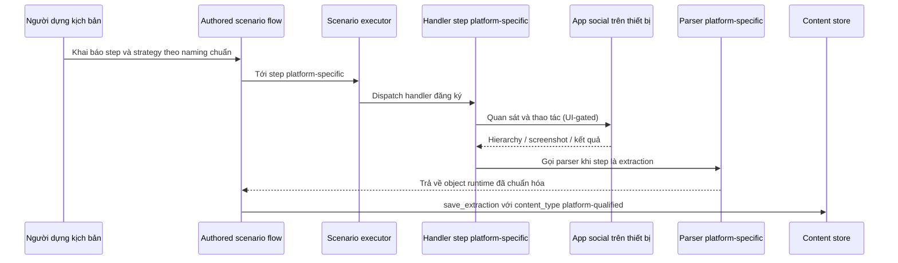

# Mở rộng nền tảng social (Social Platform Extensions)

> **Mã module:** DF-MOD-08
> **Phiên bản:** 1.0
> **Cập nhật lần cuối:** 2026-05-25
> **Trạng thái:** Active (contract); coverage theo platform
> **Đối tượng đọc:** Team Device Farm
> **Tài liệu liên quan:** [Product Overview](../01-product-overview.md), [Glossary](../00-glossary.md), [Capability Matrix](../03-capability-matrix.md), [Campaign, Scenario & Execution](04-campaigns-scenarios-executions.md), [Content/Extraction/Artifacts](06-content-extraction-artifacts.md), [Accounts & Groups](07-accounts-and-groups.md), [MCP Agent Tools](10-mcp-agent-tools.md)

## 1. Tóm tắt (TL;DR)

Module Social Platform Extensions là **giao kèo (contract)** cho việc đưa một social platform mới vào Device Farm — không phải một runner độc lập. Module này quy định cách đặt tên step type, extraction strategy, content type, các artifact bắt buộc cho một platform được coi là draft hay active, và ranh giới rằng mọi hành vi platform-specific phải được biểu diễn dưới dạng scenario step hoặc graph node. Bốn platform mục tiêu giai đoạn đầu là Facebook (Active L2, L3 foundation), TikTok, Threads, Instagram (đều ở trạng thái draft). Một platform mới đi từ draft tới active khi đã có đầy đủ profile, schema, handler, parser, content type, frontend node, test, và doc.

## 2. Bối cảnh & Vấn đề giải quyết

Khi sản phẩm phục vụ nhiều social platform, có một cám dỗ kỹ thuật rất phổ biến: viết một module riêng cho mỗi platform với "runner" độc lập, vì mỗi platform có UI riêng và logic riêng. Cách đó nhanh trong ngắn hạn nhưng tạo ra ba hệ quả tệ trong dài hạn. Thứ nhất, mỗi runner tự định nghĩa cách tổ chức step, cách báo lỗi, cách thu evidence — kết quả là frontend, MCP tool, và đội QA phải biết "logic riêng" của từng platform. Thứ hai, năng lực nền (variable resolution, retry policy, DLQ, checkpoint) phải implement lại nhiều lần. Thứ ba, khi cần thêm platform thứ năm, không có template chuẩn để dựa vào.

Device Farm chọn con đường ngược lại: **một mô hình thực thi duy nhất, mọi hành vi platform-specific là dữ liệu đầu vào của mô hình đó**. Cụ thể, mọi action và extraction platform-specific là một step type được khai báo trong scenario schema; module Campaign chịu trách nhiệm thực thi; module này chỉ định nghĩa naming convention và checklist artifact cần có để platform được coi là hỗ trợ. Người dựng kịch bản nhìn thấy step Facebook giống step TikTok về mặt cấu trúc; người vận hành dispatch một campaign chứa scenario social mà không quan tâm "engine" nào chạy nó.

## 3. Phạm vi

### 3.1 In-scope

Module này sở hữu naming contract cho step type, extraction strategy, và content type platform-specific; checklist artifact bắt buộc cho một platform muốn đạt trạng thái draft hoặc active (profile, schema, handler, parser, content persistence, frontend node, test, doc); quy ước hợp nhất giữa parser platform-specific và content_items chuẩn (qua trường `raw_data` cho field không map được); chính sách giữ legacy alias để tương thích ngược; và ranh giới bất biến rằng không platform nào được implement như runner riêng. Module này cũng xác lập rằng L3 (MCP guardrail riêng theo platform) là điều kiện tách biệt cho việc tuyên bố platform "L3 active" — guardrail generic không đủ để claim L3 theo platform.

### 3.2 Out-of-scope

Module này không sở hữu mã parser cụ thể cho từng platform (mã parser thuộc về module Content/Extraction); không sở hữu logic thực thi step (thuộc module Campaign); không sở hữu transport tới thiết bị (thuộc module Devices & Control Plane); không sở hữu định nghĩa MCP tool generic (thuộc module MCP Agent Tools). Module này cũng không sở hữu nội dung chi tiết của từng platform profile — mỗi profile là một tài liệu riêng tại `platforms/*.md`. Module này không định nghĩa SLA platform-by-platform; SLA gắn với capability matrix tổng và roadmap.

## 4. Personas & Use Cases

### 4.1 Persona liên quan

Hai persona chính tương tác với module này được mô tả chi tiết tại [Personas & Journeys](../02-personas-and-journeys.md). Kỹ sư mở rộng nền tảng (Platform Engineer) là người sở hữu chính — họ đọc contract, tạo profile cho platform mới, viết schema, handler, parser, frontend node, test, và đẩy platform từ draft sang active. Người dựng kịch bản tự động hóa (Automation Builder) là người **tiêu thụ** contract — khi viết scenario social, họ chọn step type đúng naming convention, dùng extraction strategy phù hợp, lưu content với content type chuẩn. Người thu thập dữ liệu social (Social Data Operator) gián tiếp hưởng lợi vì content thu được có cấu trúc nhất quán giữa các platform.

### 4.2 Bảng use case

| ID | Persona | Mô tả | Mức ưu tiên |
|---|---|---|---|
| UC-08-01 | Platform Engineer | Là kỹ sư mở rộng nền tảng, tôi muốn có một checklist artifact rõ ràng để biết khi nào platform mới đã đủ điều kiện vào trạng thái draft hoặc active. | Must |
| UC-08-02 | Platform Engineer | Là kỹ sư mở rộng nền tảng, tôi muốn đặt tên step type và extraction strategy theo một quy ước thống nhất để mọi platform có cùng phong cách. | Must |
| UC-08-03 | Platform Engineer | Là kỹ sư mở rộng nền tảng, tôi muốn lưu các field platform-specific không map vào content_items chuẩn vào trường `raw_data` để không mất thông tin. | Must |
| UC-08-04 | Platform Engineer | Là kỹ sư mở rộng nền tảng, tôi muốn giữ legacy alias (vd `tap_fb_comment_button`) hoạt động cho scenario cũ trong khi triển khai naming canonical mới. | Must |
| UC-08-05 | Automation Builder | Là người dựng kịch bản, tôi muốn step Facebook, TikTok, Threads, Instagram có cùng cấu trúc khai báo trong scenario để tôi không phải học lại với mỗi platform. | Must |
| UC-08-06 | Automation Builder | Là người dựng kịch bản, tôi muốn `extract` luôn dùng kèm `strategy` theo dạng `<platform>_<data_object>` để dễ đọc và tra cứu. | Must |
| UC-08-07 | Automation Builder | Là người dựng kịch bản, tôi muốn content type luôn được qualified theo platform (vd `fb_post`, `tiktok_video`) để truy vấn dữ liệu sau này không cần đoán platform. | Must |
| UC-08-08 | Platform Engineer | Là kỹ sư mở rộng nền tảng, tôi muốn được cảnh báo nếu ai đó cố tạo runner platform riêng bên ngoài scenario step model. | Must |
| UC-08-09 | Platform Engineer | Là kỹ sư mở rộng nền tảng, tôi muốn khai báo L3 guardrail riêng cho platform (allowed action, evidence requirement, handoff condition) trước khi platform được tuyên bố L3 active. | Should |
| UC-08-10 | Platform Engineer | Là kỹ sư mở rộng nền tảng, khi đẩy platform từ draft sang active, tôi muốn capability matrix và roadmap được cập nhật trong cùng release. | Must |

## 5. Luồng nghiệp vụ chính

### 5.1 Vòng đời một platform extension từ draft đến active

Sơ đồ dưới mô tả thứ tự artifact mà một platform mới phải có. Mỗi mũi tên là một phụ thuộc — không thể thêm handler trước khi có schema, không thể tuyên bố active trước khi có test và content persistence.

```mermaid
flowchart TB
    Profile[Hồ sơ platform (platform profile)] --> Naming[Quyết định naming step và strategy]
    Naming --> Schema[Backend step schema và validation]
    Naming --> ContentType[Khai báo content type platform-qualified]
    Schema --> Handler[Scenario step handler]
    Handler --> Parser[Parser platform-specific]
    Parser --> Persistence[Lưu vào content_items + raw_data]
    Handler --> FrontendNode[Frontend flow editor node]
    Persistence --> Tests[Test schema, executor, parser, persistence]
    FrontendNode --> Tests
    Tests --> Docs[Module docs + platform profile cập nhật]
    Docs --> Examples[Scenario template ví dụ]
    Examples --> Status{Đã đủ artifact?}
    Status -->|Một phần| Draft[Trạng thái: Draft target]
    Status -->|Đầy đủ| Active[Trạng thái: Active]
```

Một platform bước vào trạng thái draft khi có profile, naming, và ý định kỹ thuật rõ ràng — nhưng có thể chưa có parser, frontend node, hay test. Platform bước vào active khi đủ artifact và có ít nhất một campaign tham chiếu chạy thành công ở quy mô có ý nghĩa nghiệp vụ.

### 5.2 Runtime contract — cách một step platform-specific chạy trong scenario

Sơ đồ dưới minh họa rằng từ góc nhìn runtime, step platform-specific không khác step generic. Nó đi qua executor chuẩn, dùng handler đăng ký theo naming, parser được gọi khi step là extraction, kết quả lưu vào content store với content type qualified theo platform.



Điểm cốt lõi của sơ đồ này: handler platform-specific không "tự chạy" — nó được executor gọi như một bước trong authored scenario flow. Mọi cơ chế của module Campaign (UI-gated, error policy, retry, checkpoint, artifact) đều áp dụng. Người dựng không phải "khai báo riêng" cho từng platform; họ chỉ chọn đúng step type theo naming convention.

## 6. Đặc tả tính năng (Functional Spec)

| ID | Tính năng | Mô tả nghiệp vụ | Ưu tiên | Acceptance criteria |
|---|---|---|---|---|
| FR-08-01 | Naming convention cho step action platform-specific | Tên step có dạng `<platform>_<verb>_<object>` (vd `fb_tap_comment_button`, `tiktok_open_video_comments`). | Must | Schema chấp nhận tên đúng naming; tên sai naming được flag trong code review; doc liệt kê ví dụ chuẩn cho mỗi platform. |
| FR-08-02 | Naming convention cho extraction strategy | Strategy có dạng `<platform>_<data_object>` (vd `fb_posts`, `tiktok_videos`). | Must | Step `extract` đi kèm `strategy` đúng dạng; strategy không tồn tại bị từ chối ở runtime; doc cập nhật khi thêm strategy mới. |
| FR-08-03 | Naming convention cho content type | Content type có dạng `<platform>_<content_object>` (vd `fb_post`, `ig_comment`, `threads_post`). | Must | `save_extraction` ghi content type qualified; query content có filter theo platform thông qua content type; tránh dùng `post` hay `comment` generic. |
| FR-08-04 | Giữ legacy alias để tương thích ngược | Tên cũ được giữ song song với naming canonical mới để scenario cũ không vỡ. | Must | Schema chấp nhận cả legacy alias và canonical name; runtime dispatch về cùng handler; doc ghi rõ alias là legacy. |
| FR-08-05 | Ranh giới: cấm runner platform riêng | Mọi hành vi platform-specific phải là scenario step hoặc graph node, không tạo runner độc lập. | Must | Code review từ chối module mới chạy platform behavior ngoài scenario; doc nêu rõ ranh giới này trong checklist. |
| FR-08-06 | Profile bắt buộc cho mọi platform | Mỗi platform (active hoặc draft) đều có profile tại `platforms/*.md` theo template chuẩn. | Must | Profile có đủ các mục: product goal, supported data scope, L1/L2/L3 coverage, naming, content type, account requirement, completion criteria, known gaps. |
| FR-08-07 | Map field vào content_items + `raw_data` | Field chung map vào cột content_items chuẩn; field platform-specific không map được lưu vào `raw_data` (JSON). | Must | Content item có cấu trúc nhất quán giữa các platform; `raw_data` giữ field nguyên bản từ parser; query lấy được cả hai khi cần. |
| FR-08-08 | Định nghĩa quan hệ parent-child cho dữ liệu phân cấp | Comment-reply, video-comment được biểu diễn qua `parent_id` và `item_level`. | Must | Mỗi platform profile khai báo quy ước parent-child riêng; lưu trữ phản ánh đúng quan hệ; query hierarchy truy được. |
| FR-08-09 | Khai báo dedupe key theo platform | Mỗi extraction strategy khai báo trường dùng làm khóa dedupe (vd post id, comment id) và phạm vi hash. | Must | Lưu hai lần cùng item không tạo bản ghi trùng trong cùng collection; doc nêu rõ dedupe key. |
| FR-08-10 | Account / session requirement theo platform | Platform profile khai báo yêu cầu account và session (login, captcha, 2FA handling). | Must | Scenario thiếu account khi platform yêu cầu báo lỗi cấu hình rõ ràng; không có fallback ngầm; doc ghi requirement. |
| FR-08-11 | Frontend flow editor node theo platform | Mỗi step platform-specific có node tương ứng trong flow editor để người dựng kéo thả. | Should | Node hiển thị đúng nhãn; param node khớp schema backend; thiếu node bị flag là gap cho platform đó. |
| FR-08-12 | Test bắt buộc: schema, executor, parser, persistence | Mỗi step/strategy mới có ít nhất bốn nhóm test trước khi merge. | Must | CI block PR thiếu test; test cover edge case missing UI, parser malformed input, persistence với raw_data lớn. |
| FR-08-13 | L3 guardrail riêng theo platform | Để claim L3 active cho platform, phải có guardrail allowed action, evidence requirement, handoff condition. | Should | Profile có mục L3; MCP server biết guardrail; thiếu guardrail thì coverage là Foundation, không phải Active. |
| FR-08-14 | Capability matrix luôn đồng bộ với code | Khi platform đổi trạng thái coverage, capability matrix và roadmap được cập nhật trong cùng release. | Must | PR thay đổi platform code yêu cầu cập nhật `03-capability-matrix.md`; release note ghi thay đổi trạng thái. |
| FR-08-15 | Backward compatibility trong content query | Khi content type chuyển từ generic sang qualified, query cũ vẫn truy được dữ liệu cũ. | Should | Query bằng content type cũ vẫn trả dữ liệu legacy; query qualified mới trả dữ liệu mới; migration không phá báo cáo lịch sử. |

## 7. Capability matrix

### 7.1 Trạng thái coverage theo platform

Đây là phần quan trọng nhất của module này — bảng dưới là chân lý hiện tại cho việc "platform X có hỗ trợ tới mức nào". Tra bảng này trước khi đưa ra cam kết về phạm vi hỗ trợ platform.

| Platform | L1 Bulk manual control (Core) | L2 Scenario automation (Core) | L3 MCP agent tools (Preview / Optional) |
|---|---|---|---|
| **Facebook** | Active (qua primitive chung) | **Active** | Foundation (preview) |
| **TikTok** | Active (qua primitive chung) | Draft | Draft (preview) |
| **Threads** | Active (qua primitive chung) | Draft | Draft (preview) |
| **Instagram** | Active (qua primitive chung) | Draft | Draft (preview) |

> **Ghi chú:** L1 và L2 là core coverage levels. Một platform được coi là **Active** khi đạt L2 với đầy đủ artifact core ở mục 7.2. L3 là cấp coverage **preview**, không bắt buộc cho trạng thái Active — được giữ trong bảng để minh bạch về hướng nghiên cứu AI agent.

### 7.2 Artifact theo platform — đã có hay chưa

Bảng dưới chi tiết hơn — liệt kê từng artifact mà contract yêu cầu để một platform được coi là active. Đọc bảng này để biết "Facebook đã có gì, ba platform còn lại còn thiếu gì". Artifact được chia thành hai nhóm: **Core (bắt buộc cho trạng thái Active)** và **Preview / Optional (không bắt buộc cho trạng thái Active — phần mở rộng nghiên cứu AI agent)**.

**Nhóm Core — bắt buộc cho một platform được coi là Active:**

| Artifact core bắt buộc | Facebook | TikTok | Threads | Instagram |
|---|---|---|---|---|
| Platform profile (tại `platforms/*.md`) | Active | Draft | Draft | Draft |
| Step type platform-specific (action) | Active (`tap_fb_comment_button`, đang thêm canonical `fb_tap_comment_button`) | Chưa có | Chưa có | Chưa có |
| Extraction strategy | Active (`fb_posts`, `fb_comments`) | Chỉ tên trong draft (`tiktok_videos`, `tiktok_comments`) | Chỉ tên trong draft (`threads_posts`, `threads_comments`) | Chỉ tên trong draft (`ig_media`, `ig_comments`) |
| Content type platform-qualified | Active (`fb_post`, `fb_comment`) | Draft (`tiktok_video`, `tiktok_comment`) | Draft (`threads_post`, `threads_comment`) | Draft (`ig_media`, `ig_comment`, `ig_profile`) |
| Parser implementation | Active | Chưa có | Chưa có | Chưa có |
| Content persistence với `raw_data` | Active | Chưa có | Chưa có | Chưa có |
| Frontend flow editor node | Active | Đang phát triển | Đang phát triển | Đang phát triển |
| Test (schema + executor + parser + persistence) | Active | Chưa có | Chưa có | Chưa có |
| Scenario template ví dụ user-facing | Active | Chưa có | Chưa có | Chưa có |

**Nhóm Preview / Optional — phần mở rộng nghiên cứu AI agent, KHÔNG bắt buộc cho trạng thái Active:**

| Artifact preview (không bắt buộc cho Active) | Facebook | TikTok | Threads | Instagram |
|---|---|---|---|---|
| L3 guardrail (allowed action, evidence, handoff) — preview | Foundation (preview) | Chưa có | Chưa có | Chưa có |

### 7.3 Đọc ma trận này thế nào

Trên Facebook, một triển khai Device Farm hôm nay có thể dùng "out of the box": dispatch scenario crawl post, crawl comment, debug qua artifact, MCP tool generic. Trên ba platform còn lại, vẫn dùng được Device Farm thông qua các step generic (`tap`, `tap_selector`, `swipe`, `extract` với strategy generic, OCR, AI vision) — nhưng các step và strategy platform-specific chưa có. Use case cần một trong ba platform draft đó nên phối hợp với đội Platform Engineer để hoàn thiện theo contract này, hoặc đợi roadmap.

Thời gian ước tính chuyển một platform từ draft sang active là khoảng 2–4 tuần engineering, tùy độ phức tạp UI.

## 8. Giới hạn, ràng buộc & rủi ro

Phần này minh bạch các giới hạn để có cơ sở đánh giá đúng trước khi cam kết workflow xuyên nhiều platform.

**Chỉ Facebook ở trạng thái L2 active.** Ba platform mục tiêu còn lại (TikTok, Threads, Instagram) đang ở draft target — có khung contract, có tên strategy dự kiến, nhưng chưa có parser, handler, frontend node hoàn chỉnh. Use case cần workflow tự động hóa hoặc thu thập dữ liệu chuyên biệt trên ba platform này cần làm việc với đội Product để đưa vào roadmap, hoặc dùng các step generic L1/L2 trong giai đoạn chờ. Tuyệt đối không nên giả định "tên strategy có trong doc draft nghĩa là chạy được" — nó chỉ là intent.

**Legacy alias còn tồn tại song song với canonical naming.** Ví dụ tên `tap_fb_comment_button` (legacy) vẫn được chấp nhận, trong khi naming canonical mới là `fb_tap_comment_button` (đặt prefix platform trước). Cả hai có cùng hành vi runtime. Trong giai đoạn chuyển tiếp, doc mới và template scenario mới nên dùng naming canonical; doc cũ giữ legacy alias để không vỡ scenario đang chạy. Đội Product sẽ thông báo deprecation cycle chính thức khi alias canonical được implement đầy đủ ở mọi điểm (schema, handler, frontend).

**Một số execution surface có thể áp dụng error policy không đồng nhất.** Đây cùng là rủi ro được nêu trong module Campaign (gap SPG-001/006). Trong ngữ cảnh platform extension, hệ quả là cùng một scenario social chạy qua preview, campaign run, hoặc MCP run có thể có hành vi khác nhau khi step platform-specific fail. Đội Product cam kết audit; trong giai đoạn này, Platform Engineer nên test step mới trên đúng surface mà người vận hành sẽ dùng nhất.

**L3 guardrail riêng theo platform chưa được khai báo đầy đủ.** MCP tool generic (`df_*`) sẵn sàng cho cả bốn platform ở L1/L2, nhưng bộ guardrail "trên Instagram AI không được follow quá X lần/giờ", "trên TikTok gặp captcha phải handoff" chưa được tài liệu hóa cho ba platform ngoài Facebook (và ngay Facebook cũng đang ở Foundation, chưa Active L3). Vì vậy tuyên bố L3 active theo platform là không hợp lệ ở thời điểm hiện tại.

**Content type cũ generic có thể còn tồn tại trong template.** Một số template scenario cũ vẫn lưu content với type `post` hay `comment` generic thay vì `fb_post`, `fb_comment`. Đội Product đang migrate template; trong giai đoạn này, người dựng nên kiểm tra template trước khi dispatch và update content type qualified. Backward compatibility trong query được giữ để không phá báo cáo lịch sử.

**Naming canonical đôi khi đi trước implementation.** Một số tên canonical (vd `fb_tap_comment_button`) đã được công bố trong doc trước khi schema backend, handler, và frontend node hoàn chỉnh. Trong tình huống này, scenario dùng tên canonical chưa implement sẽ bị runtime từ chối. Người dựng nên tra cứu trạng thái thực tế tại bảng artifact (mục 7.2) trước khi áp dụng.

**Hardening secret và credential nằm ở roadmap thấp.** Một số platform yêu cầu account login với mật khẩu hoặc token; hiện config scenario là free-form JSON và có thể chứa giá trị credential. Đội Product khuyến cáo không thiết kế workflow xoay quanh credential plaintext, nhưng chưa có cơ chế vault-backed reference. Đây là gap SPG-008.

## 9. Chỉ số đo lường thành công (KPIs)

| KPI | Mục tiêu | Ghi chú |
|---|---|---|
| Thời gian từ "đồng ý hỗ trợ platform mới" đến trạng thái draft | < 1 tuần | Đo từ ticket Product approval đến profile được merge. |
| Thời gian từ draft đến active cho một platform | 2–4 tuần engineering | Tùy độ phức tạp UI; KPI nội bộ cho Platform Engineer. |
| Tỷ lệ scenario social mới dùng naming canonical | ≥ 90% sau quý chuyển tiếp | Loại trừ template legacy được giữ chủ đích. |
| Tỷ lệ content item social có content type qualified | ≥ 95% | Đo theo content_items mới ghi sau ngày migration template. |
| Số sự cố runner platform riêng vượt ranh giới scenario step | 0 mỗi quý | Vi phạm contract; coi là regression nghiêm trọng. |
| Tỷ lệ platform draft được public lộ trình rõ ràng | 100% | Mỗi profile draft phải có known gaps và completion criteria. |
| Tỷ lệ artifact bắt buộc được đánh dấu trong release note khi platform đổi trạng thái | 100% | Capability matrix update cùng release. |
| Số bug runtime do legacy alias hỏng | 0 mỗi quý | Mỗi bug loại này coi là regression. |

## 10. Glossary refs & Open questions

**Thuật ngữ chính tham chiếu Glossary:** [Platform profile](../00-glossary.md), [Coverage profile](../00-glossary.md), [Platform-qualified content type](../00-glossary.md), [Legacy alias](../00-glossary.md), [Extraction strategy](../00-glossary.md), [Content type](../00-glossary.md), [raw_data](../00-glossary.md), [parent_id / item_level](../00-glossary.md), [Authored scenario flow](../00-glossary.md), [UI-gated](../00-glossary.md), [L1 / L2 / L3](../00-glossary.md), [Guardrail](../00-glossary.md), [Handoff](../00-glossary.md).

**Câu hỏi nghiệp vụ còn mở:**

Khi có yêu cầu platform thứ năm (vd YouTube Shorts, LinkedIn, Reddit), Device Farm có nên cam kết SLA thời gian từ draft sang active không, hay giữ chính sách "tùy độ phức tạp và phối hợp các bên"? Khi naming canonical đã sẵn sàng đầy đủ cho một platform, có nên có deprecation cycle chính thức cho legacy alias (vd "alias hỗ trợ thêm 6 tháng rồi remove"), hay giữ alias vô hạn để tránh phá scenario cũ? L3 guardrail riêng theo platform có nên là tài liệu thuần (doc mô tả allowed action) hay là cấu hình hệ thống (cấu trúc dữ liệu mà MCP server đọc và enforce runtime)? Khi platform có UI thay đổi lớn (vd Instagram redesign), việc "vá scenario" thuộc trách nhiệm Platform Engineer (qua step type mới) hay Automation Builder (qua selector mới trong scenario)? Cuối cùng, có nên cho phép một scenario kết hợp step từ hai platform khác nhau (vd crawl Facebook để lấy URL, sau đó mở TikTok để tương tác) không, hay giữ ràng buộc một scenario một platform để đơn giản hóa account và evidence?
