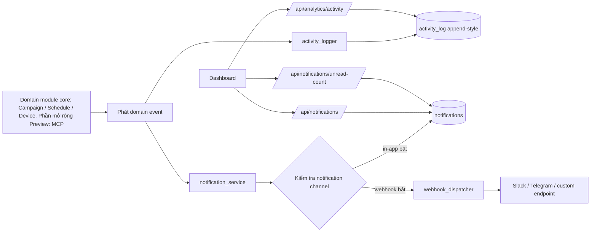
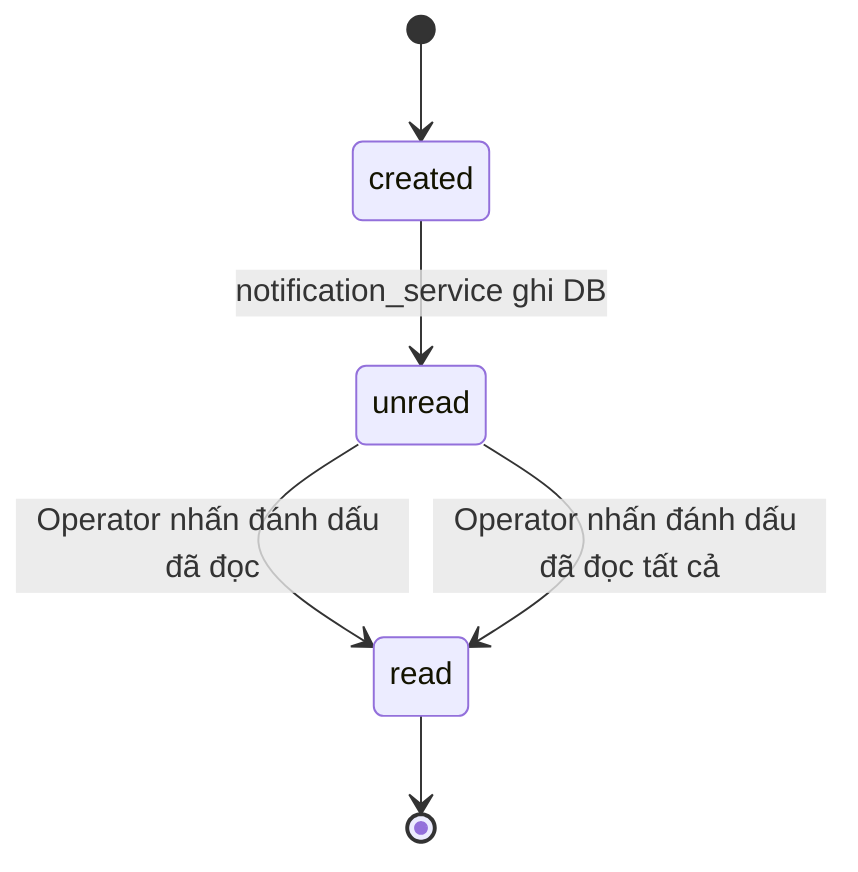
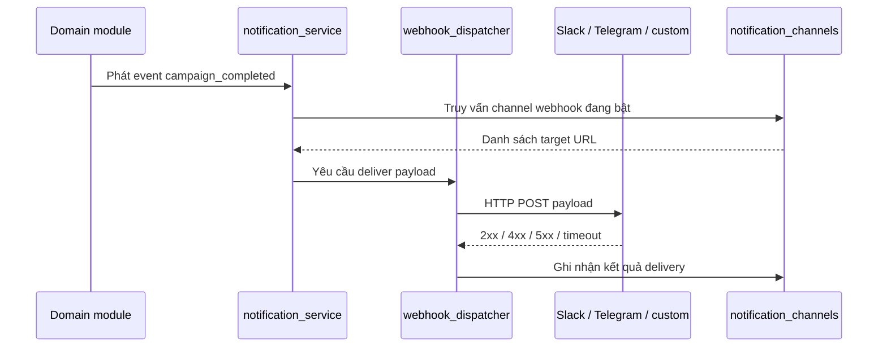
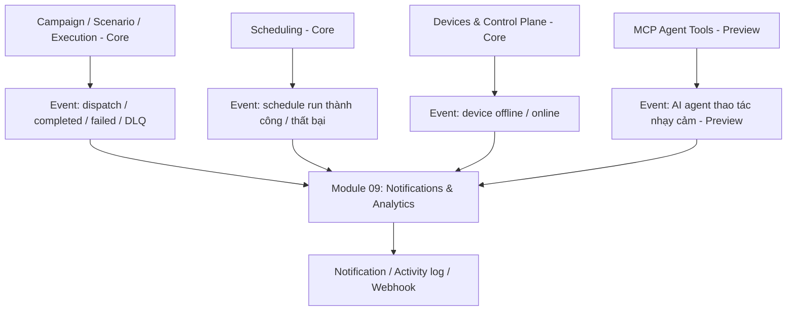

# Thông báo & Analytics (Notifications & Analytics)

> **Mã module:** DF-MOD-09
> **Phiên bản:** 1.0
> **Cập nhật lần cuối:** 2026-05-25
> **Trạng thái:** Active
> **Đối tượng đọc:** Team Device Farm
> **Tài liệu liên quan:** [Product Overview](../01-product-overview.md), [Glossary](../00-glossary.md), [Personas & Journeys](../02-personas-and-journeys.md), [Campaign, Scenario & Execution](04-campaigns-scenarios-executions.md), [Scheduling](05-scheduling.md), [Frontend & Dashboard](11-frontend-dashboard.md)

## 1. Tóm tắt (TL;DR)

Module Thông báo & Analytics là lớp "visibility" — khả năng nhìn thấy — của Device Farm. Module này gom ba năng lực bổ sung lẫn nhau: notification (thông báo) hướng người dùng cuối với trạng thái đã đọc/chưa đọc và unread count (đếm số thông báo chưa đọc); activity log (nhật ký hoạt động) ghi nhận theo kiểu append-style phục vụ audit và lịch sử dashboard; analytics endpoint cho hoạt động cũ. Một sự kiện nghiệp vụ (domain event) như "campaign hoàn thành" được phát đúng một lần và đi song song qua hai con đường — activity_logger ghi vào activity_log, notification_service tạo notification record cho người vận hành. Khi notification channel webhook (kênh đẩy ra ngoài) bật, webhook dispatcher (bộ điều vận webhook) đẩy event lên Slack, Telegram hoặc endpoint tự định nghĩa. Domain module phía trên — Campaign, Scheduling, Devices — không tự viết bản ghi nhìn thấy được mà chỉ phát event qua service; module này chịu trách nhiệm biến event thành dấu vết hiển thị.

## 2. Bối cảnh & Vấn đề giải quyết

Ở quy mô vận hành thực tế, một campaign có thể chạy hàng giờ trên hàng trăm thiết bị, một schedule có thể trigger vào nửa đêm khi không ai ngồi trước dashboard. Người vận hành không thể, và không nên, phải F5 dashboard liên tục để biết "việc đã xong chưa, có bị fail không". Ngược lại, đội Product cũng cần một dấu vết để biết ai đã làm gì, lúc nào, trên tài nguyên nào — phục vụ audit, hỗ trợ vận hành và post-mortem khi có sự cố.

Trước khi có module này, mỗi domain phải tự "vẽ" cách thông báo và cách lưu lịch sử, dễ dẫn tới hai vấn đề. Thứ nhất, format không nhất quán — campaign báo một kiểu, schedule báo kiểu khác, dashboard không có một nơi tổng hợp. Thứ hai, tích hợp ngoài (Slack, Telegram, hệ thống ITSM bên ngoài) phải gắn vào từng domain, không có cơ chế dùng chung.

Device Farm giải bài toán này bằng nguyên tắc thiết kế đơn giản: domain phát event, module Notifications & Analytics chịu trách nhiệm biến event thành ba dạng dấu vết — notification record (cho người dùng cuối), activity log entry (cho audit và analytics), webhook delivery (cho tích hợp ngoài). Domain không tự viết bản ghi nhìn thấy được; mọi đường đều đi qua service.

## 3. Phạm vi

### 3.1 In-scope

Module này sở hữu mô hình notification channel (kênh thông báo: in-app, webhook), bao gồm CRUD (tạo / đọc / cập nhật / xóa) và cấu hình target (Slack URL, Telegram chat id, custom endpoint). Module sở hữu notification record dành cho người dùng cuối với trạng thái đã đọc / chưa đọc, đường endpoint unread count, action "đánh dấu đã đọc" cho từng notification và "đánh dấu đã đọc tất cả". Module sở hữu activity log với schema append-style — bản ghi đã viết không sửa và không xóa qua API thông thường — phục vụ lịch sử dashboard và analytics. Module sở hữu webhook dispatcher đẩy event ra hệ thống bên ngoài theo cấu hình của channel. Module sở hữu hợp đồng nội bộ rằng domain (Campaign, Scheduling, Devices, Content, MCP) không tự ghi vào notifications hay activity_log trực tiếp mà chỉ phát domain event qua notification_service và activity_logger. Module sở hữu endpoint analytics activity dùng cho dashboard lịch sử hoạt động.

### 3.2 Out-of-scope

Module này không sở hữu metric hạ tầng (Prometheus, exporter), distributed tracing, hay external log shipping — các hạng mục này nằm ở roadmap observability và hiện không có sản phẩm trong release này. Module không sở hữu trạng thái thực thi campaign hay schedule — module Campaign vẫn là chân lý cho execution state, Notifications & Analytics chỉ phản ánh event đã được phát. Module không sở hữu phân tích chuyên sâu (BI dashboard, cohort analysis, funnel) — analytics endpoint hiện ở mức activity history; phân tích sâu được thực hiện ngoài hệ thống bằng cách xuất activity log ra warehouse. Module không sở hữu logic alerting proactive — chẳng hạn "phát hiện pattern fail bất thường trên một fleet và tự cảnh báo" — hiện chưa có engine cho luật cảnh báo; người vận hành dựa vào notification per-event và dashboard nhìn xu hướng.

## 4. Personas & Use Cases

### 4.1 Persona liên quan

Module này phục vụ hầu hết persona của Device Farm, vì tất cả người vận hành đều cần biết "việc gì đang diễn ra". Người thu thập dữ liệu social (Social Data Operator) cần notification khi campaign chạy xong hoặc fail để xử lý DLQ kịp thời. Người dựng kịch bản tự động hóa (Automation Builder) cần activity log để truy vết "ai đã sửa scenario, lúc nào". Người vận hành cụm thiết bị (Fleet Operator) cần notification khi device đi offline, khi relay agent rớt heartbeat. Người giám sát AI vận hành (AI Operations Supervisor) cần webhook đẩy ra Slack hoặc Telegram khi AI agent thực hiện hành động vượt ngưỡng để có thể can thiệp ngay. Quản trị tổ chức (Admin) là người cấu hình notification channel và quyết định ai nhận event gì.

### 4.2 Bảng use case

| ID | Persona | Mô tả | Mức ưu tiên |
|---|---|---|---|
| UC-09-01 | Admin tổ chức | Là admin, tôi muốn tạo notification channel kiểu webhook (Slack, Telegram, custom) để event của tổ chức được đẩy ra hệ thống chat đang dùng. | Must |
| UC-09-02 | Admin tổ chức | Là admin, tôi muốn liệt kê, cập nhật, vô hiệu hóa, hoặc xóa notification channel khi cấu hình thay đổi mà không phải làm lại từ đầu. | Must |
| UC-09-03 | Operator (mọi vai trò) | Là người vận hành, tôi muốn thấy danh sách notification in-app trong dashboard với trạng thái đã đọc / chưa đọc rõ ràng. | Must |
| UC-09-04 | Operator | Là người vận hành, tôi muốn thấy unread count nổi bật trên thanh điều hướng để biết ngay có việc cần xử lý mà không phải mở panel. | Must |
| UC-09-05 | Operator | Là người vận hành, tôi muốn đánh dấu một notification đã đọc, hoặc đánh dấu đã đọc tất cả, để dọn dẹp danh sách sau khi đã xử lý. | Must |
| UC-09-06 | Social Data Operator | Là người thu thập dữ liệu, tôi muốn nhận notification ngay khi campaign hoàn thành hoặc fail, kèm link tới execution để mở DLQ nếu cần. | Must |
| UC-09-07 | Operator | Là người vận hành, tôi muốn nhận notification khi schedule run thất bại để xử lý sớm thay vì phát hiện vào sáng hôm sau. | Must |
| UC-09-08 | Fleet Operator | Là người vận hành cụm thiết bị, tôi muốn nhận notification khi device đi offline kéo dài để chủ động kiểm tra phần cứng. | Should |
| UC-09-09 | AI Operations Supervisor | Là người giám sát AI, tôi muốn webhook đẩy ra Slack/Telegram khi MCP agent thực hiện hành động nhạy cảm để có cơ hội review nhanh. | Should |
| UC-09-10 | Operator / Admin | Là người vận hành, tôi muốn xem activity log của tổ chức trong dashboard, lọc theo loại event và khoảng thời gian, để truy vết "ai làm gì lúc nào". | Must |
| UC-09-11 | Admin tổ chức | Là admin, tôi muốn activity log không bị sửa hay xóa qua API thông thường để tin cậy được cho mục đích audit. | Must |
| UC-09-12 | Operator | Là người vận hành, tôi muốn xem analytics activity tổng hợp (số lượng event theo ngày, theo loại) để cảm nhận xu hướng vận hành. | Should |
| UC-09-13 | Admin tổ chức | Là admin, tôi muốn webhook delivery thất bại được ghi nhận để biết kênh ngoài đang gặp vấn đề và xử lý cấu hình. | Should |

## 5. Luồng nghiệp vụ chính

### 5.1 Luồng từ domain event đến ba dạng dấu vết

Sơ đồ dưới mô tả cách một domain event duy nhất — ví dụ "campaign hoàn thành" — phân nhánh đi qua activity_logger và notification_service để sinh ra ba dạng dấu vết song song.

Một sự kiện được phát một lần và rẽ đôi: nhánh activity_logger luôn ghi vào activity_log (mọi event đều có dấu vết audit, không cần cấu hình); nhánh notification_service mới kiểm tra channel của tổ chức để quyết định có tạo notification in-app, có gọi webhook dispatcher hay không. Quan trọng: domain module không nhìn thấy bảng `notifications` hay `activity_log` — domain module chỉ gọi service. Quy ước này giúp đội kỹ thuật thêm dạng dấu vết mới (ví dụ một channel email trong tương lai) mà không phải sửa code của domain.

### 5.2 Vòng đời một notification in-app

Mỗi notification in-app đi qua chuỗi trạng thái sau, từ thời điểm được tạo bởi notification_service đến khi người vận hành đánh dấu đã đọc.

Trạng thái `unread` được tính vào unread count hiển thị trên thanh điều hướng dashboard. Khi người vận hành nhấn vào một notification, frontend gọi endpoint mark-read; khi nhấn "Đánh dấu đã đọc tất cả", frontend gọi endpoint mark-all-read và unread count về 0. Notification không bị xóa khi đọc — bản ghi vẫn còn trong DB để truy vết lịch sử người dùng đã thấy thông tin gì.

### 5.3 Đường webhook delivery ra hệ thống ngoài

Khi tổ chức có notification channel kiểu webhook đang bật, mỗi event đủ điều kiện được webhook dispatcher đẩy ra endpoint đã cấu hình.

Webhook dispatcher cố gắng deliver một lần với timeout hợp lý. Kết quả (thành công, lỗi HTTP, timeout) được ghi nhận để biết kênh ngoài có hoạt động hay không. Ở giai đoạn hiện tại, dispatcher chưa có retry policy (chính sách thử lại) chuyên dụng — chi tiết tại mục Giới hạn. Lưu ý thiết kế endpoint phía nhận sao cho idempotent (chống nhận trùng) nếu sau này bật retry.

### 5.4 Mối quan hệ với module Campaign và Scheduling

Notifications & Analytics không trigger bất kỳ thực thi nào — nó chỉ phản ứng với event của module khác. Sơ đồ dưới phân định ranh giới.

Lợi ích của ranh giới này: thêm một loại event mới (ví dụ event mới về account rotation) không phải sửa module Notifications & Analytics — domain module phát event qua service, module 09 tự nhiên có dấu vết. Ngược lại, đổi cách thông báo (ví dụ thêm channel email) không phải sửa Campaign hay Schedule — chỉ sửa module 09.

## 6. Đặc tả tính năng (Functional Spec)

| ID | Tính năng | Mô tả nghiệp vụ | Ưu tiên | Acceptance criteria |
|---|---|---|---|---|
| FR-09-01 | Tạo notification channel | Admin tạo channel kiểu in-app hoặc webhook với cấu hình target tương ứng. | Must | Tạo channel webhook yêu cầu URL hợp lệ; channel mới ở trạng thái bật mặc định trừ khi khai báo khác; channel gắn đúng organization. |
| FR-09-02 | CRUD notification channel | Liệt kê, đọc chi tiết, cập nhật cấu hình, vô hiệu hóa, và xóa notification channel. | Must | Channel bị vô hiệu hóa không nhận event tiếp; xóa channel không xóa notification record đã tạo; ownership theo organization được tôn trọng. |
| FR-09-03 | Notification in-app | Khi domain event đủ điều kiện được phát, notification_service tạo bản ghi notification gắn người nhận. | Must | Bản ghi có người nhận, organization, loại event, payload tóm tắt, timestamp; mặc định ở trạng thái unread. |
| FR-09-04 | Unread count endpoint | Endpoint riêng trả về số notification chưa đọc của người dùng hiện tại. | Must | Endpoint phản hồi < 500 ms ở mức tải vận hành thông thường; số trả về khớp với số bản ghi `unread` thực tế; cập nhật ngay sau mark-read. |
| FR-09-05 | Đánh dấu đã đọc | Người vận hành đánh dấu một notification đã đọc qua endpoint riêng. | Must | Bản ghi chuyển sang trạng thái `read`; unread count giảm tương ứng; hành động idempotent (gọi nhiều lần không thay đổi thêm). |
| FR-09-06 | Đánh dấu đã đọc tất cả | Người vận hành đánh dấu toàn bộ notification đã đọc trong một thao tác. | Must | Toàn bộ unread của người dùng chuyển sang `read`; unread count về 0; thao tác idempotent. |
| FR-09-07 | Webhook dispatcher gửi ra hệ thống ngoài | Khi channel webhook bật và event đủ điều kiện, dispatcher gọi HTTP POST tới URL channel với payload chuẩn hóa. | Must | Payload có schema ổn định (loại event, organization, resource id, summary, timestamp); HTTP 2xx coi là thành công; lỗi được ghi nhận. |
| FR-09-08 | Domain event chuẩn từ Campaign | Module Campaign phát event ở các mốc: dispatch, completed, failed, DLQ open. | Must | Mỗi mốc tạo đúng một event; notification phản ánh đúng campaign id và execution id; activity_log có entry tương ứng. |
| FR-09-09 | Domain event chuẩn từ Scheduling | Module Schedule phát event khi schedule run kết thúc, đặc biệt khi thất bại. | Must | Schedule run fail luôn sinh notification; kèm reference tới schedule và execution con; người vận hành mở được từ link trong notification. |
| FR-09-10 | Activity log append-style | Bản ghi activity_log không được sửa hoặc xóa qua API người dùng. | Must | Không có endpoint nghiệp vụ cho update/delete activity log; xóa chỉ thực hiện qua quy trình retention quản trị; mỗi entry có timestamp không đổi. |
| FR-09-11 | Endpoint analytics activity | Endpoint trả về danh sách activity log đã lọc theo organization, loại event, khoảng thời gian. | Must | Phân trang được; bộ lọc kết hợp nhiều tiêu chí; thời gian phản hồi < 3 s với top 1000 record. |
| FR-09-12 | Tách biệt write path khỏi domain | Domain module không tự ghi vào bảng notifications hay activity_log; mọi đường đi qua service. | Must | Code review từ chối insert trực tiếp từ domain; mọi event đi qua notification_service hoặc activity_logger; có test guard. |
| FR-09-13 | Ghi nhận kết quả webhook delivery | Mỗi lần gọi webhook ghi nhận trạng thái HTTP và thời gian để admin biết kênh ngoài có hoạt động không. | Should | Admin xem được trạng thái delivery gần đây của channel; lỗi liên tiếp được tô đậm để dễ phát hiện cấu hình hỏng. |
| FR-09-14 | Phân biệt notification cá nhân và notification tổ chức | Một số event hướng tới người vận hành cụ thể (notification cá nhân); một số hướng tới mọi thành viên trong tổ chức (notification chung). | Should | Bản ghi có người nhận xác định cho cá nhân; với chung, dashboard hiển thị cho mọi thành viên; unread count tính độc lập theo người dùng. |
| FR-09-15 | Liên kết notification về tài nguyên gốc | Mỗi notification chứa đường link mở thẳng tới tài nguyên (campaign, execution, schedule, device). | Must | Click notification chuyển về đúng trang chi tiết; nếu tài nguyên đã xóa, dashboard hiển thị message rõ ràng thay vì 404 trắng. |

## 7. Capability matrix

Bảng dưới khai báo trạng thái coverage các năng lực chính của module. Module này không phụ thuộc platform social mục tiêu.

| Nhóm năng lực | Trạng thái |
|---|---|
| Notification channel in-app | Active |
| Notification channel webhook (Slack / Telegram / custom) | Active |
| CRUD notification channel | Active |
| Notification in-app với trạng thái đọc / chưa đọc | Active |
| Unread count endpoint | Active |
| Đánh dấu đã đọc và đánh dấu đã đọc tất cả | Active |
| Activity log append-style | Active |
| Endpoint analytics activity (lịch sử hoạt động) | Active |
| Webhook dispatcher gọi HTTP POST một lần | Active |
| Ghi nhận kết quả webhook delivery | Active |
| Domain event chuẩn từ Campaign (dispatch / completed / failed / DLQ) | Active |
| Domain event chuẩn từ Scheduling (schedule run fail) | Active |
| Domain event chuẩn từ Devices (offline / online) | Active |
| Tách biệt write path khỏi domain | Active |
| Retry policy chuyên dụng cho webhook | Roadmap |
| Retention policy cho activity log | Roadmap |
| Channel email | Roadmap |
| Alerting proactive theo pattern (rule engine) | Roadmap |
| Metric Prometheus / distributed tracing | Roadmap |
| External log shipping ra hệ thống tập trung | Roadmap |

## 8. Giới hạn, ràng buộc & rủi ro

Phần này minh bạch các giới hạn hiện tại của module để có cơ sở đánh giá đúng trước khi đưa vào pipeline vận hành quan trọng.

**Generated frontend client có thể lag backend cho notifications và analytics.** Quy trình sinh TypeScript client từ OpenAPI là chuỗi nhiều bước (xuất spec, copy JSON, chạy generator). Hai phân nhóm route lịch sử thường drift là Notifications và Analytics — backend cập nhật route mà client chưa sinh lại trong cùng release. Hệ quả: dashboard có thể tạm thiếu một số phương thức mới trên generated client, phải dùng Next API proxy thay thế cho tới khi client được regenerate. Đội phát triển kiểm tra hai phân nhóm này đầu tiên khi regenerate. Cần lưu ý điểm này khi tích hợp Device Farm qua thư viện sinh sẵn.

**Chưa có Prometheus metric và distributed tracing.** Module này phục vụ observability cho người vận hành nhìn vào dashboard, không phải observability cho đội hạ tầng. Sản phẩm chưa expose metric chuẩn (counter, histogram, gauge) cho hệ thống giám sát kiểu Prometheus, và chưa có distributed tracing để theo request đi qua các service. Hệ quả: khi có sự cố vận hành sâu, MTTR (Mean Time To Recover — thời gian phục hồi trung bình) phụ thuộc vào log đọc bằng tay. Cả ba hạng mục này nằm ở roadmap hardening cùng với cải thiện observability tổng thể của Device Farm.

**Webhook dispatcher chưa có retry policy chuyên dụng.** Hiện tại dispatcher gọi HTTP POST một lần với timeout hợp lý và ghi nhận kết quả. Khi endpoint phía nhận tạm sự cố hoặc rate limit, event đó coi như mất với kênh webhook (vẫn còn trong notification in-app và activity_log). Roadmap có hạng mục retry với exponential backoff và DLQ riêng cho webhook delivery. Trong giai đoạn này, khuyến nghị thiết kế endpoint nhận sao cho cao khả dụng, và dùng activity_log như "chân lý" khi cần đối soát.

**Activity log có thể grow nhanh, chưa có retention policy mặc định.** Mọi domain event sinh activity_log entry, không phụ thuộc cấu hình notification channel. Ở quy mô vận hành lớn (hàng nghìn campaign run mỗi tuần), dung lượng activity_log có thể tăng nhanh chóng. Hiện tại chưa có chính sách retention tự động trong sản phẩm — bản ghi không bị xóa định kỳ. Hệ quả: dung lượng DB và chi phí lưu trữ tăng theo thời gian. Roadmap có hạng mục retention policy cấu hình được theo organization. Trong giai đoạn này, đội triển khai có thể chạy job dọn dẹp ngoài quy trình sản phẩm; cấu hình phù hợp với khối lượng cụ thể nên được rà soát theo từng triển khai.

**Chưa có alerting proactive theo pattern.** Module này phản ứng theo từng event riêng lẻ; sản phẩm chưa có rule engine để định nghĩa cảnh báo kiểu "khi tỷ lệ DLQ trên một scenario vượt 20% trong 1 giờ, gửi alert". Hệ quả: pattern bất thường được phát hiện khi người vận hành nhìn vào dashboard hoặc qua đối soát thủ công, không tự bật. Roadmap có hạng mục alert engine; trong giai đoạn này, có thể tự xây luật cảnh báo trên hệ thống ngoài bằng cách tiêu thụ webhook và activity log analytics.

**Notification volume có thể nhiều với tổ chức quy mô lớn.** Mỗi campaign run hoàn thành/fail sinh một notification cho người dispatch, mỗi schedule run fail sinh một notification, v.v. Với tổ chức chạy hàng trăm campaign mỗi ngày, panel notification có thể bị "ngợp". Trong giai đoạn này, người vận hành nên dùng "đánh dấu đã đọc tất cả" sau khi xử lý batch và xem activity_log để truy vết lịch sử. Roadmap có hạng mục cấu hình filter mức notification theo loại event và mức ưu tiên.

**Webhook payload chưa được ký HMAC.** Hiện tại payload gửi đi không kèm signature để endpoint phía nhận verify nguồn. Hệ quả: nếu URL webhook bị lộ, hệ thống nhận có thể bị giả mạo. Khuyến nghị tạm thời: dùng URL webhook chứa secret query parameter hoặc đặt sau gateway có whitelist IP. Roadmap có hạng mục HMAC signing cho webhook payload.

## 9. Chỉ số đo lường thành công (KPIs)

| KPI | Mục tiêu | Ghi chú |
|---|---|---|
| Tỷ lệ campaign hoàn thành / fail có notification gắn người dispatch | 100% | Đo từ event Campaign, loại trừ trường hợp dispatch ẩn danh do MCP. |
| Tỷ lệ schedule run fail có notification | 100% | Schedule run fail không sinh notification là sự cố nghiệp vụ nghiêm trọng. |
| Độ trễ từ domain event đến notification record xuất hiện ở dashboard | Trung vị < 5 s; p99 < 30 s | Đo qua timestamp event so với timestamp người dùng nhìn thấy. |
| Tỷ lệ webhook delivery thành công ở channel cấu hình đúng | ≥ 99% trong giờ vận hành | Loại trừ outage của endpoint phía nhận. |
| Độ trễ unread count endpoint | Trung vị < 500 ms; p99 < 2 s | Endpoint được gọi thường xuyên từ dashboard, hiệu năng quan trọng. |
| Tỷ lệ event đi qua service thay vì ghi trực tiếp | 100% | Bảo đảm tính nhất quán; vi phạm được coi là bug. |
| Tỷ lệ notification có deep link mở đúng tài nguyên gốc | 100% trong release ổn định | Loại trừ tài nguyên đã xóa hợp pháp. |
| Số sự cố mất notification (event được phát nhưng không đến người vận hành) | 0 mỗi quý | Mỗi sự cố loại này phải post-mortem. |
| Tỷ lệ activity_log entry sửa hoặc xóa qua API người dùng | 0 | Audit yêu cầu bất biến; vi phạm là sự cố nghiêm trọng. |

## 10. Glossary refs & Open questions

**Thuật ngữ chính tham chiếu Glossary:** [Notification channel](../00-glossary.md), [Notification](../00-glossary.md), [Activity log](../00-glossary.md), [Unread count](../00-glossary.md), [Webhook](../00-glossary.md), [Domain event](../00-glossary.md), [Organization](../00-glossary.md), [Generated client](../00-glossary.md), [OpenAPI](../00-glossary.md), [Campaign](../00-glossary.md), [Schedule](../00-glossary.md), [DLQ](../00-glossary.md).

**Câu hỏi nghiệp vụ còn mở:**

Khi nào Device Farm nên đưa retry policy chuyên dụng cho webhook vào sản phẩm — gắn với chính sách rate limit của Slack/Telegram, hay theo cấu hình tự chọn của tổ chức? Retention policy cho activity_log nên áp ở cấp tổ chức (mỗi tổ chức tự cấu hình) hay áp toàn cluster (đội triển khai quyết định)? Khi nào nên đưa channel email vào danh sách hỗ trợ — gắn với milestone cụ thể có yêu cầu, hay sau khi Slack/Telegram đã chạy ổn định trên một số tổ chức? Alerting proactive theo pattern nên là module riêng (DF-MOD-12 trong tương lai) hay phần mở rộng của module này? Notification volume cao có nên gom theo digest (ví dụ một bản tóm tắt mỗi giờ thay vì từng event) thay vì lọc theo mức ưu tiên? Webhook payload có nên kèm HMAC signature ngay trong release tới, hay chờ use case đầu tiên có yêu cầu compliance cụ thể?
