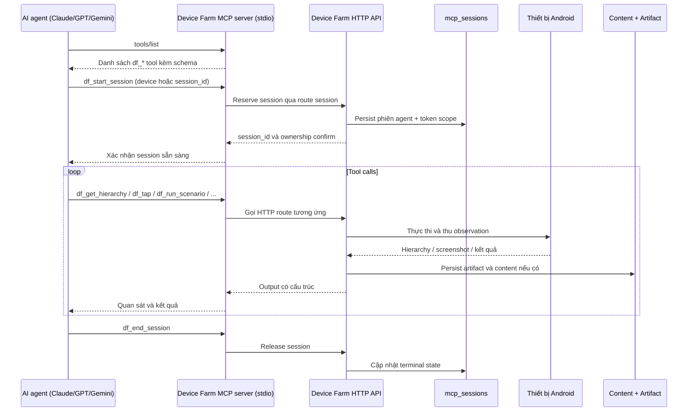
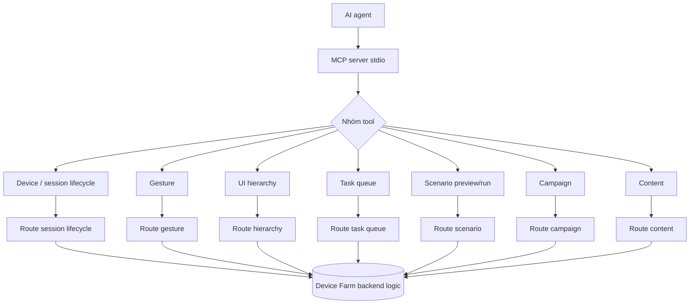
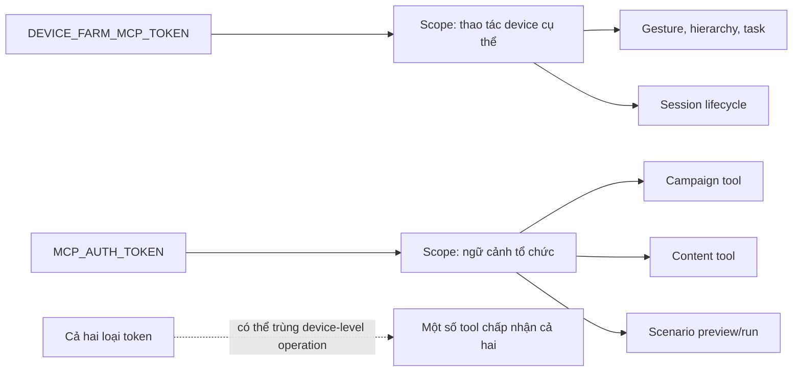
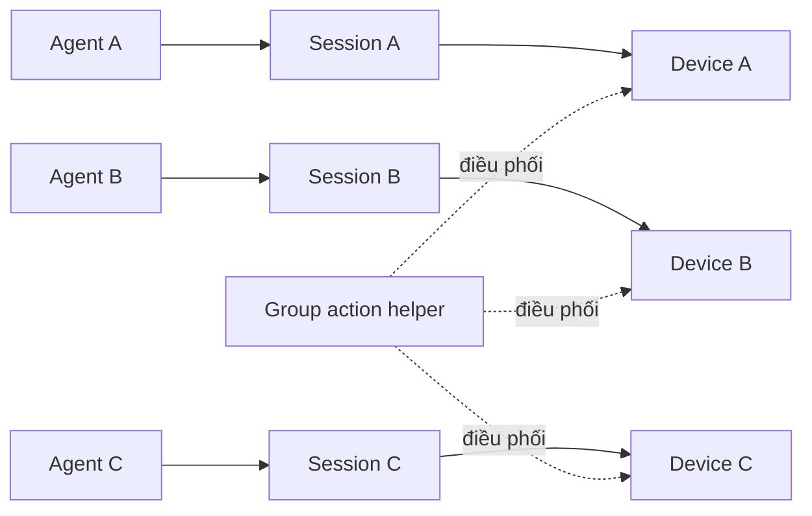

# Công cụ AI Agent qua MCP (MCP Agent Tools)

> **Mã module:** DF-MOD-10
> **Phiên bản:** 1.0
> **Cập nhật lần cuối:** 2026-05-25
> **Trạng thái:** Preview / Experimental — phần mở rộng đang được nghiên cứu, không thuộc nhóm năng lực cốt lõi của sản phẩm
> **Đối tượng đọc:** Team Device Farm
> **Tài liệu liên quan:** [Product Overview](../01-product-overview.md), [Glossary](../00-glossary.md), [Personas & Journeys](../02-personas-and-journeys.md), [Devices & Control Plane](02-devices-and-control-plane.md), [Campaign, Scenario & Execution](04-campaigns-scenarios-executions.md), [Content/Extraction/Artifacts](06-content-extraction-artifacts.md), [Accounts & Groups](07-accounts-and-groups.md), [Social Platform Extensions](08-social-platform-extensions.md)

## 1. Tóm tắt (TL;DR)

> **Lưu ý định vị:** Module này là **phần mở rộng đang được nghiên cứu, không thuộc nhóm năng lực cốt lõi của sản phẩm Device Farm**. Trục cốt lõi của Device Farm là tự động hóa thiết bị Android ở quy mô cho nghiệp vụ social media qua Campaign/Scenario/Fleet (xem các module 02, 04, 06, 07, 08). MCP Agent Tools là forward-looking surface dành cho hướng nghiên cứu AI agent điều khiển device — use case đánh giá Device Farm cho phần core không cần dựa vào module này.

Module Công cụ AI Agent qua MCP (MCP — Model Context Protocol — giao thức chuẩn để AI agent gọi tool) là mặt phẳng điều khiển preview dành cho AI agent (Claude, GPT, Gemini, ...) khi thao tác Device Farm ở mức L3 (cấp coverage experimental). Device Farm vận hành một MCP server stdio (giao tiếp qua đầu vào/đầu ra chuẩn của tiến trình) expose các thao tác device, session, scenario, campaign, và content thành các tool có tiền tố df_ (ví dụ df_start_session, df_tap, df_get_hierarchy, df_run_scenario). Mọi MCP tool đều wrap (bọc) một HTTP route đã có của Device Farm — tức là không có "API bí mật" chỉ dành cho agent; agent thao tác qua cùng các route mà người vận hành dùng, chỉ khác ở giao thức gọi. Mô hình ownership tuân thủ L3: một agent ↔ một device hoặc một session. Auth qua DEVICE_FARM_MCP_TOKEN (token device-scoped, dùng cho thao tác cụ thể trên device đã pair) hoặc MCP_AUTH_TOKEN (token user-scoped, cho phép tool có ngữ cảnh tổ chức như campaign, content). Mọi MCP action được ghi vào activity log để người giám sát review về sau, và mỗi phiên agent được persist vào bảng mcp_sessions.

## 2. Bối cảnh & Vấn đề giải quyết

> **Bối cảnh module:** Mục này mô tả các vấn đề mà phần mở rộng AI agent qua MCP định hướng giải. Đây là hướng nghiên cứu của Device Farm cho tương lai; trục cốt lõi của sản phẩm hiện tại không phụ thuộc vào module này.

Khi đưa AI agent vào vận hành thật, ba bài toán xuất hiện đồng thời. Thứ nhất, AI agent cần một bộ "công cụ" tiêu chuẩn để gọi — không thể đưa AI agent tự gọi REST API tùy ý vì sẽ mất kiểm soát phạm vi và mất audit. Thứ hai, AI agent không có cảm nhận "đây là production" như người vận hành — agent có thể thực hiện thao tác không mong muốn (đăng bài, follow, gửi tin nhắn) nếu không có guardrail (ràng buộc bảo vệ). Thứ ba, khi agent vận hành nhiều giờ trên fleet, cần có cách bàn giao quyền điều khiển từ agent sang người (handoff) khi agent gặp tình huống vượt khả năng — và mọi quyết định của agent phải có evidence để supervisor xét lại.

Device Farm giải ba bài toán này bằng cách dùng MCP — một giao thức chuẩn ngành mà các AI agent hiện đại đều hỗ trợ. MCP server expose các operation Device Farm thành tool có schema rõ ràng (tên, mô tả, input shape, output shape) — agent đọc tool list rồi gọi theo schema, không "đoán" REST API. Mỗi tool wrap một HTTP route đã có để giữ parity (đồng nhất) với surface mà người vận hành dùng — không có hành vi nào AI agent làm được mà người không làm được. Mô hình L3 "một agent ↔ một device/session" đặt giới hạn ngữ cảnh để agent không vô tình thao tác trên thiết bị sai. Guardrail theo platform (allowed action, evidence requirement, handoff condition) — dù đang ở giai đoạn Foundation — định nghĩa khung mà mỗi platform social phải khai báo trước khi L3 active.

## 3. Phạm vi

### 3.1 In-scope

Module này sở hữu việc vận hành một MCP server stdio cho Device Farm, định nghĩa danh sách df_* tool theo các nhóm tool family (device/session lifecycle, gestures, UI hierarchy, task queue, scenario preview/run, campaign, content), cơ chế nhận tham số tool theo device serial hoặc session_id, xác thực tool call qua DEVICE_FARM_MCP_TOKEN hoặc MCP_AUTH_TOKEN, persist phiên làm việc của agent vào bảng mcp_sessions, mô hình ownership L3 (1 agent ↔ 1 device/session), nguyên tắc parity với HTTP route (mỗi tool wrap một route đã có), ghi activity log cho mọi MCP action để supervisor review, và khung guardrail (allowed action, evidence requirement, handoff condition) mà mỗi platform profile phải khai báo trước khi tuyên bố L3 active.

### 3.2 Out-of-scope

Module này không sở hữu chính sách suy luận của AI agent (đó là vấn đề của model provider và prompt do người tích hợp thiết kế). Module này không định nghĩa step social platform-specific (thuộc Social Platform Extensions); module này expose tool generic dành cho L3, còn semantic riêng platform thì khai báo ở profile platform tương ứng. Module này không sở hữu hạ tầng vận hành provider AI (token, billing, rate limit ở phía provider) — đó là cấu hình triển khai. Module này không tự đào tạo agent hay tự sinh prompt template; người vận hành (AI Operations Supervisor) hoặc đội tích hợp tự chuẩn bị. Module này không sở hữu UX bàn giao agent–người (handoff workflow) trên dashboard — hiện chưa có UX rõ ràng, được ghi nhận tại mục 8.

## 4. Personas & Use Cases

### 4.1 Persona liên quan

Hai persona chính tương tác với module này được mô tả tại [Personas & Journeys](../02-personas-and-journeys.md). Người giám sát AI vận hành (AI Operations Supervisor) là người chịu trách nhiệm chính: cấp token cho agent, theo dõi activity log MCP, review evidence sau khi agent kết thúc phiên, và đưa ra quyết định handoff khi agent yêu cầu can thiệp. Người dựng kịch bản tự động hóa dùng AI (Automation Builder) tương tác khi muốn AI agent vận hành scenario có sẵn — họ kết hợp tool df_run_scenario với prompt mô tả mục tiêu. Người vận hành fleet (Fleet Operator) liên quan gián tiếp khi điều phối tài nguyên device cho agent. Người thu thập dữ liệu social (Social Data Operator) tiêu thụ kết quả khi agent đẩy content_items vào content store.

### 4.2 Bảng use case

| ID | Persona | Mô tả | Mức ưu tiên |
|---|---|---|---|
| UC-10-01 | AI Operations Supervisor | Là người giám sát AI vận hành, tôi muốn đăng ký một MCP server Device Farm vào AI agent (Claude, GPT, Gemini) để agent có quyền truy cập các tool df_*. | Must |
| UC-10-02 | AI Operations Supervisor | Là người giám sát AI vận hành, tôi muốn cấp DEVICE_FARM_MCP_TOKEN cho một agent thao tác trên một device cụ thể, hoặc MCP_AUTH_TOKEN cho agent có ngữ cảnh tổ chức. | Must |
| UC-10-03 | Automation Builder | Là người dựng kịch bản dùng AI, tôi muốn agent đọc danh sách tool df_* qua tools/list để biết các thao tác khả dụng trước khi gọi. | Must |
| UC-10-04 | AI Operations Supervisor | Là người giám sát AI vận hành, tôi muốn agent reserve một device qua df_start_session để mọi thao tác sau đó được persist vào mcp_sessions. | Must |
| UC-10-05 | Automation Builder | Là người dựng kịch bản dùng AI, tôi muốn agent gọi tool gesture (df_tap, df_swipe, df_input_text) hoặc tool UI hierarchy (df_get_hierarchy) bằng device serial hoặc session_id. | Must |
| UC-10-06 | Automation Builder | Là người dựng kịch bản dùng AI, tôi muốn agent gọi df_run_scenario để vận hành một scenario có sẵn trên device đang reserve. | Must |
| UC-10-07 | AI Operations Supervisor | Là người giám sát AI vận hành, tôi muốn agent gọi tool content (df_save_extraction, df_list_content) để persist quan sát thành evidence. | Must |
| UC-10-08 | AI Operations Supervisor | Là người giám sát AI vận hành, tôi muốn mọi MCP action được ghi vào activity log để tôi review về sau và tái hiện chuỗi quyết định của agent. | Must |
| UC-10-09 | AI Operations Supervisor | Là người giám sát AI vận hành, tôi muốn ràng buộc L3: một agent chỉ điều khiển một device/session tại một thời điểm để giảm rủi ro tương tác chéo. | Must |
| UC-10-10 | AI Operations Supervisor | Là người giám sát AI vận hành, tôi muốn guardrail theo platform (allowed action, evidence requirement, handoff condition) được khai báo trước khi tuyên bố L3 active cho platform. | Should |
| UC-10-11 | AI Operations Supervisor | Là người giám sát AI vận hành, tôi muốn agent bàn giao điều khiển sang người vận hành khi gặp trạng thái mơ hồ (ví dụ CAPTCHA, OTP) thay vì agent đoán bừa. | Should |
| UC-10-12 | Automation Builder | Là người dựng kịch bản dùng AI, tôi muốn tool df_* wrap đúng HTTP route đã có để hành vi giữa MCP và HTTP nhất quán. | Must |
| UC-10-13 | Fleet Operator | Là người vận hành fleet, tôi muốn biết device nào đang bị một agent reserve qua MCP để không dispatch campaign chồng. | Must |

## 5. Luồng nghiệp vụ chính

### 5.1 Vòng đời phiên AI agent qua MCP

Sơ đồ dưới mô tả tương tác đầy đủ từ thời điểm agent kết nối tới MCP server tới khi phiên kết thúc và evidence được persist.

Khi agent khởi động và đăng ký MCP server Device Farm, bước đầu tiên là gọi tools/list để đọc danh sách tool khả dụng kèm schema. Agent tiếp tục gọi df_start_session với device serial hoặc session_id để xác nhận quyền điều khiển. MCP server forward yêu cầu sang HTTP API; API tạo bản ghi mcp_sessions và xác nhận ownership theo mô hình L3. Trong vòng đời phiên, mỗi tool call của agent được MCP server dịch sang HTTP route tương ứng — đây là điểm cốt yếu để parity với surface người vận hành. Mọi output (hierarchy, screenshot, kết quả gesture) trở thành quan sát mà agent dùng cho quyết định kế tiếp. Khi agent kết thúc, df_end_session đóng phiên và mcp_sessions chuyển sang trạng thái terminal.

### 5.2 Phân loại nhóm tool và quan hệ với HTTP route

Sơ đồ dưới phân loại các tool family chính và nhấn mạnh nguyên tắc wrap HTTP route.

Nguyên tắc thiết kế của module: mỗi MCP tool wrap đúng một HTTP route đã có. Không có "tool MCP bí mật" thực hiện thao tác mà HTTP route không làm. Hệ quả: khi audit hành vi của agent, có thể đối chiếu với hành vi tương ứng khi người vận hành gọi cùng route. Tool có thể nhận device serial hoặc session_id — session_id được khuyến khích cho workflow nhiều bước vì giữ ngữ cảnh phiên; device serial phù hợp cho tool ad-hoc không cần state.

### 5.3 Xác thực và scope của token MCP

Module hỗ trợ hai loại token với scope khác nhau. Sơ đồ dưới mô tả ranh giới giữa hai loại.

DEVICE_FARM_MCP_TOKEN là token device-scoped — agent dùng token này thực hiện được các thao tác trực tiếp trên một device (gesture, hierarchy, task queue) nhưng không có ngữ cảnh tổ chức để gọi tool campaign hay content. MCP_AUTH_TOKEN là token user-scoped — gắn với một user trong tổ chức, cho phép agent gọi tool có ngữ cảnh tổ chức (campaign, content, scenario có id) nhưng phải tuân thủ ownership của user đó. Một số tool device-level chấp nhận cả hai loại để linh hoạt. Nguyên tắc nghiệp vụ: chọn token scope hẹp nhất đủ cho mục đích — không cấp MCP_AUTH_TOKEN cho agent chỉ cần thao tác device.

### 5.4 Mô hình L3: một agent ↔ một device/session

Mô hình L3 là ràng buộc nghiệp vụ cốt lõi của module. Sơ đồ dưới minh họa cách tài nguyên được phân bổ.

Mỗi agent tại một thời điểm sở hữu duy nhất một session, và mỗi session ràng buộc với một device. Hệ quả: agent A không thể vô tình thao tác trên device B; agent A muốn chuyển sang device khác phải kết thúc session hiện tại rồi mở session mới. Group action helper (nếu có) là cơ chế phối hợp ở tầng cao hơn (do supervisor hoặc orchestration layer ở tầng ngoài quản lý) — không phải tool MCP thay đổi ownership.

## 6. Đặc tả tính năng (Functional Spec)

| ID | Tính năng | Mô tả nghiệp vụ | Ưu tiên | Acceptance criteria |
|---|---|---|---|---|
| FR-10-01 | MCP server stdio | Device Farm chạy một MCP server giao tiếp qua stdio để AI agent đăng ký. | Must | Server khởi động độc lập với HTTP API; agent gọi tools/list trả về danh sách df_* tool kèm schema; không expose endpoint nội bộ ra ngoài MCP. |
| FR-10-02 | df_* tool family chuẩn | Tool nhóm theo các family: device/session lifecycle, gesture, UI hierarchy, task queue, scenario preview/run, campaign, content. | Must | Mỗi tool có tiền tố df_; schema mô tả input/output đầy đủ; doc nói rõ family của từng tool. |
| FR-10-03 | Tham số device serial hoặc session_id | Mỗi device-level tool chấp nhận một trong hai để định danh đối tượng. | Must | Schema chấp nhận cả hai; session_id được khuyến khích cho workflow nhiều bước; thiếu cả hai báo lỗi rõ. |
| FR-10-04 | DEVICE_FARM_MCP_TOKEN (device-scoped) | Token cho thao tác trực tiếp trên device đã pair. | Must | Token có scope device-level; tool campaign/content yêu cầu token này sẽ bị từ chối; token rotation được hỗ trợ. |
| FR-10-05 | MCP_AUTH_TOKEN (user-scoped) | Token cho tool có ngữ cảnh tổ chức (campaign, content, scenario có id). | Must | Token gắn với user trong tổ chức; ownership theo organization được giữ; agent không bypass được ownership. |
| FR-10-06 | Persist phiên agent vào mcp_sessions | Mỗi phiên agent qua df_start_session sinh bản ghi mcp_sessions để truy vết. | Must | Bản ghi có agent identifier, device serial hoặc session_id, timestamp bắt đầu/kết thúc, terminal state; truy vấn được theo organization. |
| FR-10-07 | Mô hình L3: 1 agent ↔ 1 device/session | Một agent tại một thời điểm sở hữu duy nhất một session/device. | Must | df_start_session khi agent đang giữ session khác bị từ chối hoặc yêu cầu close trước; doc nói rõ giới hạn. |
| FR-10-08 | Parity với HTTP route | Mỗi MCP tool wrap chính xác một HTTP route đã có; không có "API bí mật" chỉ qua MCP. | Must | Mỗi tool có route tham chiếu; thay đổi behavior route phải đồng bộ với MCP doc; audit so sánh HTTP và MCP định kỳ. |
| FR-10-09 | Activity log cho mọi MCP action | Mọi tool call được ghi vào activity log để supervisor review. | Must | Activity log có agent id, tool, input, output, timestamp, organization; truy vấn được theo agent hoặc theo session. |
| FR-10-10 | Khung guardrail theo platform | Mỗi platform profile khai báo allowed action, evidence requirement, handoff condition để claim L3 active. | Should | Platform thiếu guardrail bị mark L3 Foundation (không Active); MCP server biết guardrail của platform khi cần gating; tài liệu module Social Platform Extensions đồng bộ. |
| FR-10-11 | Evidence requirement cho action L3 | Một số action quan trọng yêu cầu phải capture evidence (screenshot, hierarchy) trước khi commit. | Should | Tool có cờ require_evidence; thiếu evidence bị từ chối; evidence được persist vào artifact store. |
| FR-10-12 | Handoff condition cho agent–người | Khi agent gặp trạng thái cần can thiệp (ví dụ CAPTCHA, OTP, quota), agent có cơ chế bàn giao sang người vận hành. | Should | Có tool df_request_handoff (hoặc cờ trên existing tool) để raise yêu cầu; supervisor nhận notification; session chuyển sang trạng thái pending-handoff. |
| FR-10-13 | Tool device/session lifecycle | df_start_session, df_end_session, df_get_session_info để quản lý phiên. | Must | Tool wrap route session lifecycle; trả về session_id và ownership; end_session idempotent. |
| FR-10-14 | Tool gesture | df_tap, df_swipe, df_long_tap, df_input_text, df_key (back, home, ...) để thao tác device. | Must | Tool wrap route gesture; chấp nhận tọa độ hoặc selector tùy tool; trả về kết quả có cấu trúc. |
| FR-10-15 | Tool UI hierarchy | df_get_hierarchy, df_get_screenshot, df_find_element để quan sát màn hình. | Must | Tool wrap route hierarchy/media; output chuẩn cho agent đọc; có thể trả URL artifact thay vì payload lớn. |
| FR-10-16 | Tool task queue | df_enqueue_task, df_get_task_status để gửi task không đồng bộ. | Should | Tool wrap route task queue; trả task_id; agent poll trạng thái qua df_get_task_status. |
| FR-10-17 | Tool scenario preview/run | df_run_scenario, df_preview_scenario để vận hành scenario có sẵn qua agent. | Must | Tool yêu cầu MCP_AUTH_TOKEN; chấp nhận scenario_id và biến runtime; trả execution id để theo dõi. |
| FR-10-18 | Tool campaign | df_dispatch_campaign, df_get_campaign_status để khởi tạo và theo dõi campaign từ agent. | Should | Tool yêu cầu MCP_AUTH_TOKEN; tuân thủ ownership; trả campaign run id. |
| FR-10-19 | Tool content | df_save_extraction, df_list_content, df_get_content_item để agent persist và đọc dữ liệu nghiệp vụ. | Must | Tool yêu cầu MCP_AUTH_TOKEN; content_type platform-qualified; trả về content id để truy vết. |
| FR-10-20 | Không tự bypass session ownership qua MCP | MCP không có tool nào cho phép agent A thao tác trên session do agent B sở hữu. | Must | Test guard xác nhận ownership cross-agent bị từ chối; vi phạm là sự cố bảo mật cấp cao. |

## 7. Capability matrix

Bảng dưới khai báo trạng thái tool family và guardrail theo từng platform social mục tiêu. Tool family là độc lập platform — guardrail mới là phần gắn với platform cụ thể.

| Năng lực | Facebook | TikTok | Threads | Instagram |
|---|---|---|---|---|
| MCP server stdio expose df_* tool | Active | Active | Active | Active |
| Tool device/session lifecycle | Active | Active | Active | Active |
| Tool gesture (tap, swipe, input, key) | Active | Active | Active | Active |
| Tool UI hierarchy và media | Active | Active | Active | Active |
| Tool task queue | Active | Active | Active | Active |
| Tool scenario preview/run | Active | Active | Active | Active |
| Tool campaign | Active | Active | Active | Active |
| Tool content (save_extraction, list, get) | Active | Active | Active | Active |
| Mô hình L3 (1 agent ↔ 1 device/session) | Active | Active | Active | Active |
| Auth DEVICE_FARM_MCP_TOKEN và MCP_AUTH_TOKEN | Active | Active | Active | Active |
| Persist mcp_sessions | Active | Active | Active | Active |
| Activity log cho MCP action | Active | Active | Active | Active |
| Guardrail platform-specific (allowed action, evidence requirement, handoff condition) | Foundation (đang profile) | Foundation | Foundation | Foundation |
| Handoff workflow agent–người trên dashboard | Roadmap | Roadmap | Roadmap | Roadmap |
| Concurrency lock chặt (1 session ↔ 1 agent ở mọi đường) | Roadmap (xem mục 8) | Roadmap | Roadmap | Roadmap |

Trạng thái "Active" nghĩa là tool và cơ chế generic đã sẵn dùng; "Foundation" nghĩa là khung đã có nhưng nội dung cụ thể cho platform chưa được khai báo đủ để tuyên bố L3 active; "Roadmap" là cam kết phát triển nhưng chưa có trong release hiện tại.

## 8. Giới hạn, ràng buộc & rủi ro

Phần này minh bạch các điểm cần biết trước khi đưa AI agent vào vận hành thật qua MCP.

**MCP có thể trở thành parallel API surface nếu không bảo trì kỷ luật.** MCP tool wrap HTTP route — nhưng nếu đội phát triển thêm tool nhanh hơn cập nhật route (hoặc ngược lại), sẽ xuất hiện hành vi không đồng bộ giữa hai surface. Đội Product cam kết audit định kỳ MCP tool list so với route matrix để đảm bảo parity. Khi tích hợp nên tránh giả định "MCP có gì đó HTTP không có" và ngược lại; mọi khác biệt nên được coi là gap cần báo cáo.

**Guardrail L3 platform-specific chưa được profile đầy đủ (SPG-006).** Khung guardrail (allowed action, evidence requirement, handoff condition) đã được định nghĩa, nhưng nội dung cụ thể cho từng platform (Facebook, TikTok, Threads, Instagram) chưa được khai báo đủ để tuyên bố L3 active. Hệ quả: trong giai đoạn này, agent có thể gọi mọi tool df_* trên mọi platform mà không bị gating bởi guardrail riêng. Đội Product đang ưu tiên profile guardrail Facebook trước (vì L2 đã active), các platform khác theo sau. Khuyến nghị: trong giai đoạn này, nên tự định nghĩa guardrail ở tầng prompt agent và ở tầng supervisor — không phụ thuộc hoàn toàn vào gating của Device Farm.

**Concurrency lock 1 session 1 agent chưa được enforce chặt ở mọi đường.** Mô hình L3 là một nguyên tắc nghiệp vụ; tuy nhiên hiện chưa có concurrency lock cấp database hay ở tầng API ngăn hoàn toàn việc hai agent cùng cố reserve một session. Trong vận hành bình thường, tình huống này hiếm xảy ra do agent có schema rõ và supervisor cấp phát device tường minh. Tuy nhiên đây là gap được ghi nhận; khuyến nghị: nên cấp DEVICE_FARM_MCP_TOKEN có scope hẹp (cho từng device) thay vì token chung để giảm khả năng vô tình reserve trùng.

**Handoff workflow agent–người chưa có UX rõ ràng.** Khái niệm handoff đã có trong khung guardrail, nhưng UX cụ thể (agent gửi yêu cầu, supervisor nhận notification và takeover session, lưu lại điểm bàn giao) chưa được triển khai trong dashboard. Hiện tại agent có thể "raise" qua tool hoặc qua log, nhưng việc supervisor phản hồi cần đi qua kênh ngoài (Slack, email, kênh nội bộ). Roadmap có hạng mục handoff workflow trên dashboard. Trong giai đoạn này, nên có quy trình vận hành riêng cho tình huống cần handoff.

**Activity log có thể rất lớn nếu agent gọi tool dày đặc.** Mỗi tool call được ghi vào activity log — một agent vận hành nhiều giờ có thể tạo hàng nghìn bản ghi. Dung lượng activity log và chi phí truy vấn cần được giám sát. Chính sách retention activity log có thể được cấu hình ở triển khai; nên cân nhắc giữ chi tiết bao lâu trước khi archive.

**Provider AI có rate limit và outage riêng.** MCP server không kiểm soát rate limit của Claude, GPT, Gemini — đây là vấn đề ở phía provider mà người tích hợp cấu hình. Khi provider bị outage hoặc rate limit, agent có thể fail giữa chừng phiên. Khuyến nghị: thiết kế supervisor để phát hiện tình huống agent dừng đột ngột và đưa session vào pending-handoff thay vì để session "lơ lửng".

**Tool campaign và content qua MCP_AUTH_TOKEN dùng quyền user.** Khi agent dùng MCP_AUTH_TOKEN, mọi tool campaign và content được thực hiện với quyền của user gắn với token đó. Hệ quả: agent có thể tạo, sửa, xóa tài nguyên trong phạm vi user. Nên cấp MCP_AUTH_TOKEN cho user "service account" có scope hẹp (chỉ những resource agent cần), không dùng token của user thật có quyền admin tổ chức.

**Không có hỗ trợ multi-agent cooperation ở tầng MCP.** Mô hình L3 hiện là một agent ↔ một device/session. Mọi cooperation giữa các agent (ví dụ một agent điều phối nhiều agent con) phải được orchestrate ở tầng trên — Device Farm không có tool df_orchestrate hay tương tự. Đây là chủ ý: giữ ranh giới ownership rõ ràng để audit và handoff đơn giản.

## 9. Chỉ số đo lường thành công (KPIs)

| KPI | Mục tiêu | Ghi chú |
|---|---|---|
| Tỷ lệ parity giữa MCP tool và HTTP route (mỗi tool wrap đúng một route) | 100% | Audit mỗi release; lệch là gap phải khắc phục. |
| Tỷ lệ MCP action được ghi vào activity log | 100% | Loại trừ tool đọc không thay đổi state nếu chính sách cho phép. |
| Tỷ lệ phiên agent có evidence đầy đủ (screenshot, hierarchy) tại các action quan trọng | ≥ 95% | Cần để supervisor review về sau. |
| Số sự cố agent bypass ownership session (agent A thao tác session do B sở hữu) | 0 mỗi quý | Sự cố cấp cao; post-mortem ngay. |
| Tỷ lệ platform có guardrail L3 đầy đủ (allowed action + evidence + handoff) | Mục tiêu 100% với 4 platform mục tiêu | Hiện tại Foundation; theo dõi tiến độ profile. |
| Trung vị thời gian từ agent gọi tool đến nhận response | < 2 s cho tool device-level | Loại trừ tool chạy scenario hoặc dispatch campaign. |
| Tỷ lệ session agent kết thúc ở terminal state (không "lơ lửng") | ≥ 98% | Session lơ lửng phản ánh thiếu cleanup hoặc thiếu handoff. |
| Số yêu cầu handoff mà supervisor xử lý trong < 15 phút | ≥ 90% | Đo từ lúc agent raise tới khi supervisor takeover. |
| Tỷ lệ tool campaign/content được gọi với MCP_AUTH_TOKEN có scope hẹp (không phải token admin tổ chức) | ≥ 95% | Phản ánh kỷ luật cấp token; admin token cho agent là rủi ro. |
| Trung vị dung lượng activity log mỗi phiên agent | Có baseline + cảnh báo | Dự báo chi phí lưu trữ và performance truy vấn. |

## 10. Glossary refs & Open questions

**Thuật ngữ chính tham chiếu Glossary:** [MCP (Model Context Protocol)](../00-glossary.md), [MCP server](../00-glossary.md), [MCP session](../00-glossary.md), [df_* tool](../00-glossary.md), [Guardrail](../00-glossary.md), [Handoff](../00-glossary.md), [L1 / L2 / L3](../00-glossary.md), [Device session](../00-glossary.md), [Reservation](../00-glossary.md), [Activity log](../00-glossary.md), [Organization](../00-glossary.md), [Authored scenario flow](../00-glossary.md), [Artifact](../00-glossary.md), [Content item](../00-glossary.md).

**Câu hỏi nghiệp vụ còn mở:**

Khi nào Device Farm nên tuyên bố một platform là L3 active — gắn với việc khai báo đủ guardrail platform-specific (SPG-006), hay chỉ cần có MCP tool generic và để guardrail là responsibility của đội tích hợp? Concurrency lock 1 session 1 agent có nên được enforce ở cấp database (lock cứng) hay ở cấp API (lock mềm có retry)? Handoff workflow agent–người trên dashboard có nên hỗ trợ "supervisor takeover ngay lập tức" (cướp session) hay "supervisor request nhận handoff và agent confirm trước khi nhả"? Có nên hỗ trợ multi-agent cooperation tại tầng MCP (ví dụ tool df_share_observation giữa các agent) hay giữ ranh giới một agent ↔ một session để audit đơn giản? Activity log MCP có nên được tách riêng khỏi activity log chung của tổ chức để retention và phân quyền độc lập? Cuối cùng, mô hình token hai loại (DEVICE_FARM_MCP_TOKEN và MCP_AUTH_TOKEN) có nên mở rộng thành scoped token chi tiết hơn (ví dụ token chỉ cho phép gesture, token chỉ cho phép content) để áp dụng nguyên tắc least-privilege cho từng agent profile?
