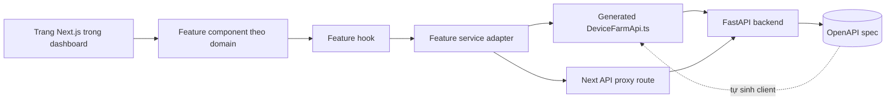
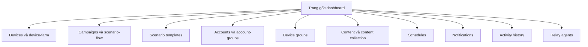
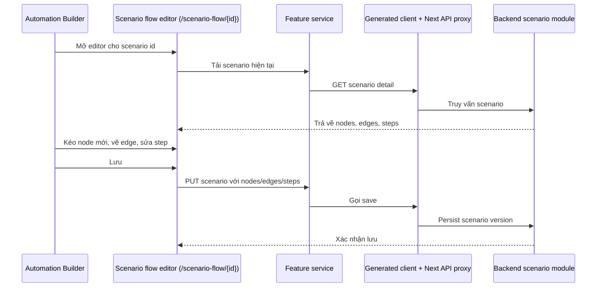
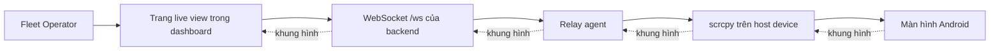

# Frontend & Dashboard

> **Mã module:** DF-MOD-11
> **Phiên bản:** 1.0
> **Cập nhật lần cuối:** 2026-05-25
> **Trạng thái:** Active
> **Đối tượng đọc:** Team Device Farm
> **Tài liệu liên quan:** [Product Overview](../01-product-overview.md), [Glossary](../00-glossary.md), [Personas & Journeys](../02-personas-and-journeys.md), [Nền tảng & Bảo mật truy cập](01-platform-runtime-and-access.md), [Devices & Control Plane](02-devices-and-control-plane.md), [Campaign, Scenario & Execution](04-campaigns-scenarios-executions.md), [Notifications & Analytics](09-notifications-and-analytics.md)

## 1. Tóm tắt (TL;DR)

Module Frontend & Dashboard là cánh cửa duy nhất mà mọi persona của Device Farm sử dụng để tương tác với hệ thống. Dashboard được xây dựng trên Next.js với cấu trúc feature folder per domain — devices, campaigns, scenario-templates, accounts, account-groups, device-groups, content, schedules, notifications, analytics, relay-agents — mỗi domain sở hữu UI, hook, và service adapter riêng. Hợp đồng quan trọng nhất của module này là frontend không tự định nghĩa "chân lý API"; backend phát hành OpenAPI spec, từ đó sinh ra TypeScript client (DeviceFarmApi.ts) mà frontend tiêu thụ. Khi một route backend chưa nằm trong generated client, Next API proxy (lớp adapter route trong Next.js) đứng ra làm cầu tạm thời. Dashboard cung cấp scenario flow editor dạng graph cho người dựng kịch bản, live view qua scrcpy stream cho Fleet Operator, panel notification và activity log cho mọi persona, và i18n routing theo tiền tố locale cho triển khai đa ngôn ngữ.

## 2. Bối cảnh & Vấn đề giải quyết

Một sản phẩm B2B phục vụ nhiều persona khác nhau — người thu thập dữ liệu, người dựng kịch bản, người vận hành cụm thiết bị, người giám sát AI — có xu hướng nguy hiểm là vẽ một dashboard "tất-cả-cho-tất-cả", tích lũy logic ad hoc theo từng yêu cầu mới, và cuối cùng trở thành một monolith UI không ai dám đụng. Hệ quả ở quy mô: sửa một module backend phải kéo theo sửa nhiều chỗ frontend tản mát, code base UI không tách được theo trách nhiệm, đội mới mất tuần để định vị code thuộc về tính năng nào.

Vấn đề thứ hai là contract giữa frontend và backend. Khi hai phía tự định nghĩa schema riêng, mỗi thay đổi nhỏ ở backend dễ gây drift (lệch pha) ngầm — frontend gọi field cũ trong khi backend đã đổi tên. Bug loại này chỉ lộ ở runtime, thường khi người vận hành đã làm việc nửa chừng.

Device Farm giải hai bài toán này bằng hai nguyên tắc kiến trúc. Thứ nhất, **feature folder per domain**: mỗi domain nghiệp vụ tương ứng với một thư mục feature riêng, trong đó UI, hook và service adapter cùng sống. Thay đổi nội bộ một feature không lan ra feature khác. Thứ hai, **OpenAPI là chân lý API duy nhất, frontend chỉ tiêu thụ generated client**: backend xuất bản OpenAPI, generator sinh TypeScript client, frontend gọi client như gọi hàm có kiểm tra kiểu. Drift bị catch ở thời điểm build, không phải runtime.

## 3. Phạm vi

### 3.1 In-scope

Module này sở hữu cấu trúc thư mục feature của dashboard Next.js — mỗi domain nghiệp vụ (devices, campaigns, scenario-templates, accounts, account-groups, device-groups, content, schedules, notifications, analytics, relay-agents) là một feature folder gồm UI, hook và service. Module sở hữu việc tiêu thụ generated TypeScript client từ OpenAPI; client là cách mặc định gọi backend. Module sở hữu Next API proxy là lớp route Next.js đứng giữa khi một endpoint backend chưa có trong generated client. Module sở hữu scenario flow editor tại `/scenario-flow/{id}` — graph builder cho Automation Builder (người dựng kịch bản tự động hóa) dùng để vẽ node, edge, và step. Module sở hữu dashboard health của fleet và relay agent — view trạng thái, online/offline, heartbeat gần nhất. Module sở hữu i18n routing kiểu `/[locale]/dashboard/...` cho phép triển khai dashboard đa ngôn ngữ. Module sở hữu live view device qua scrcpy stream cho phép Fleet Operator xem màn hình realtime. Module sở hữu notification panel hiển thị danh sách notification và unread count, cùng activity log view phục vụ truy vết.

### 3.2 Out-of-scope

Module này không sở hữu chân lý API — backend route và OpenAPI generation mới là chân lý. Module này không định nghĩa schema dữ liệu nghiệp vụ — schema thuộc backend module tương ứng. Module này không sở hữu logic xác thực JWT, refresh token, hay device-auth — thuộc module Nền tảng & Bảo mật truy cập; frontend chỉ tiêu thụ JWT đã cấp. Module này không sở hữu transport gRPC tới relay agent — thuộc module Agent Boot & Relay; frontend chỉ tiêu thụ stream qua WebSocket trung gian. Module này không sở hữu state runtime của campaign hay execution — frontend chỉ là view của trạng thái backend. Module này không sở hữu BI tool hay phân tích sâu — analytics ở mức activity history; phân tích sâu thực hiện ngoài dashboard.

## 4. Personas & Use Cases

### 4.1 Persona liên quan

Module này phục vụ toàn bộ persona Device Farm vì dashboard là điểm tiếp xúc chung. Người thu thập dữ liệu social (Social Data Operator) dùng dashboard để dispatch campaign, mở content collection, xử lý DLQ. Người dựng kịch bản tự động hóa (Automation Builder) dùng scenario flow editor để vẽ graph, preview run, debug scenario. Người vận hành cụm thiết bị (Fleet Operator) dùng dashboard devices, device-groups, relay-agents để theo dõi sức khỏe fleet và mở live view khi cần can thiệp. Quản trị tổ chức (Admin) dùng dashboard accounts, account-groups, notification-channels để cấu hình tổ chức. Người giám sát AI vận hành (AI Operations Supervisor) — persona forward-looking thuộc phần mở rộng AI agent đang được nghiên cứu — dùng dashboard activity và notification để review hành động AI agent ở chế độ Preview.

### 4.2 Bảng use case

| ID | Persona | Mô tả | Mức ưu tiên |
|---|---|---|---|
| UC-11-01 | Mọi persona | Là người vận hành, tôi muốn đăng nhập dashboard và thấy navigation tới các domain (devices, campaigns, content, schedules, notifications, ...) tổ chức rõ ràng để định vị tính năng nhanh. | Must |
| UC-11-02 | Mọi persona | Là người vận hành, tôi muốn dashboard hiển thị bằng ngôn ngữ địa phương qua i18n routing `/[locale]/dashboard/...` để đội đa quốc gia làm việc thoải mái. | Must |
| UC-11-03 | Fleet Operator | Là người vận hành cụm thiết bị, tôi muốn mở trang `/dashboard/devices` để xem trạng thái online/offline, heartbeat gần nhất, và thông tin định danh của từng device. | Must |
| UC-11-04 | Fleet Operator | Là người vận hành cụm thiết bị, tôi muốn mở live view một device qua scrcpy stream để quan sát màn hình realtime khi cần can thiệp thủ công. | Must |
| UC-11-05 | Fleet Operator | Là người vận hành cụm thiết bị, tôi muốn xem dashboard `/dashboard/relay-agents` để biết relay agent nào đang hoạt động, mất kết nối, hoặc cần restart. | Must |
| UC-11-06 | Automation Builder | Là người dựng kịch bản, tôi muốn mở `/scenario-flow/{id}` để vẽ graph scenario gồm node và edge có nhánh điều kiện, lưu lại để campaign tiêu thụ. | Must |
| UC-11-07 | Automation Builder | Là người dựng kịch bản, tôi muốn thấy scenario template tại `/dashboard/scenario-templates` để tái sử dụng các đoạn flow phổ biến thay vì vẽ lại từ đầu. | Must |
| UC-11-08 | Social Data Operator | Là người thu thập dữ liệu, tôi muốn dispatch campaign tại `/dashboard/campaigns` và theo dõi tiến độ từng device trong campaign đang chạy. | Must |
| UC-11-09 | Social Data Operator | Là người thu thập dữ liệu, tôi muốn mở `/dashboard/content` để duyệt content item theo collection, lọc theo platform và content type. | Must |
| UC-11-10 | Operator | Là người vận hành, tôi muốn cấu hình schedule tại `/dashboard/schedules` với cron expression, bật/tắt theo nhu cầu mà không phải xóa. | Must |
| UC-11-11 | Operator | Là người vận hành, tôi muốn mở panel notification và thấy unread count nổi bật trên thanh điều hướng để biết ngay có việc cần xử lý. | Must |
| UC-11-12 | Operator | Là người vận hành, tôi muốn mở `/dashboard/activity-history` để truy vết lịch sử hoạt động của tổ chức theo loại event và khoảng thời gian. | Must |
| UC-11-13 | Admin tổ chức | Là admin, tôi muốn cấu hình account và account group tại `/dashboard/accounts` và `/dashboard/device-farm/account-groups` để gán account vào device và scenario. | Must |
| UC-11-14 | Platform Engineer | Là kỹ sư mở rộng nền tảng, tôi muốn frontend tự đồng bộ với backend qua generated TypeScript client để không phải duy trì client thủ công. | Must |
| UC-11-15 | Platform Engineer | Là kỹ sư mở rộng nền tảng, khi backend có route mới chưa có trong generated client, tôi muốn dùng Next API proxy như một adapter tạm thời cho tới khi client được regenerate. | Must |

## 5. Luồng nghiệp vụ chính

### 5.1 Cách dashboard tiêu thụ backend qua generated client và Next API proxy

Sơ đồ dưới mô tả hai đường gọi backend từ một feature component và lý do vì sao cả hai cùng tồn tại.

Đường mặc định là **generated client**. Backend xuất bản OpenAPI spec; quy trình build sinh ra `DeviceFarmApi.ts` cho frontend. Feature service gọi method của client như gọi hàm có kiểm tra kiểu — sai field, sai kiểu tham số bị catch tại compile time. Đây là đường an toàn nhất và là đường mặc định cho mọi feature mới.

Đường thứ hai là **Next API proxy**. Khi backend bổ sung route mới mà generated client chưa được regenerate (phổ biến với Notifications và Analytics — xem mục Giới hạn), feature service có thể gọi qua một route Next.js đứng làm trung gian. Đường này linh hoạt nhưng không có lợi thế kiểm tra kiểu, vì vậy chỉ dùng làm cầu tạm cho tới khi generated client bắt kịp. Nguyên tắc: nếu một route bền vững thì nó phải xuất hiện trong OpenAPI và generated client; Next API proxy không phải nơi định nghĩa chân lý API.

### 5.2 Bản đồ feature folder theo domain

Mỗi domain nghiệp vụ của Device Farm tương ứng với một feature folder riêng trong dashboard, đồng thời tương ứng với một mục điều hướng riêng.

Lợi ích của tổ chức này: thay đổi nội bộ một feature (vd thêm bộ lọc mới cho danh sách device) không lan ra feature khác. Đội mới có một mental model rõ ràng: muốn sửa gì thì vào đúng feature folder tương ứng. Quy ước này cũng phản ánh bản đồ module backend — mỗi feature frontend thường gắn 1-1 với một module backend, dễ tra cứu cross-reference.

### 5.3 Scenario flow editor và dòng đời graph

Đường dẫn `/scenario-flow/{id}` là một surface đặc biệt: thay vì form điền field, người dựng vẽ scenario thành graph với node và edge.

Yêu cầu nghiệp vụ then chốt: graph trên editor phải tương thích với `ScenarioModel` của backend — cùng nodes, edges, steps. Frontend không được "thêm field riêng" mà backend không hiểu, vì khi đó scenario lưu xong không chạy được. Quy ước này được nhắc lại trong agent implementation checklist của module frontend.

### 5.4 Live view device qua scrcpy stream

Khi Fleet Operator cần xem màn hình thiết bị realtime, dashboard mở stream qua scrcpy đi qua WebSocket backend.

Live view không thay thế kênh điều khiển; nó là kênh observability. Khi muốn can thiệp thủ công (tap, swipe), người vận hành mở session reservation và gọi gesture qua API, không qua stream. Stream chỉ chuyển hình ảnh một chiều từ device về dashboard. Khi mất kết nối WebSocket, dashboard tự cố gắng reconnect và hiển thị trạng thái mất stream cho người dùng.

### 5.5 i18n routing và panel notification

Dashboard dùng tiền tố locale ở mọi route — ví dụ `/vi/dashboard/campaigns` cho tiếng Việt, `/en/dashboard/campaigns` cho tiếng Anh. Người vận hành chọn ngôn ngữ một lần, lựa chọn được giữ trong phiên. Panel notification ở góc trên dashboard hiển thị unread count cập nhật theo endpoint `/api/notifications/unread-count` từ module [Notifications & Analytics](09-notifications-and-analytics.md); click vào notification mở deep link tới tài nguyên gốc (campaign, execution, schedule, device). Activity log view tại `/dashboard/activity-history` hiển thị lịch sử event của tổ chức, lọc theo loại và khoảng thời gian.

## 6. Đặc tả tính năng (Functional Spec)

| ID | Tính năng | Mô tả nghiệp vụ | Ưu tiên | Acceptance criteria |
|---|---|---|---|---|
| FR-11-01 | Cấu trúc feature folder theo domain | Mỗi domain nghiệp vụ có thư mục feature riêng chứa UI, hook và service. | Must | Mỗi feature có entrypoint rõ; thay đổi nội bộ feature không sửa file feature khác; code review từ chối logic feature A đặt trong feature B. |
| FR-11-02 | Generated TypeScript client là cách mặc định gọi backend | `DeviceFarmApi.ts` sinh từ `openapi.json` của backend; feature service dùng client làm đường mặc định. | Must | Tham số sai kiểu bị catch ở compile time; không có handcrafted client song song cho route đã có trong generated client; build CI fail nếu client out-of-sync. |
| FR-11-03 | Next API proxy làm adapter cho route ngoài generated client | Khi route backend chưa có trong client, Next API proxy đứng làm trung gian tạm thời. | Must | Proxy được document là proxy-only hoặc owns transformation; mỗi proxy có ghi chú lý do tồn tại; danh sách proxy được audit định kỳ. |
| FR-11-04 | i18n routing theo tiền tố locale | Dashboard route có dạng `/[locale]/dashboard/...` cho phép đa ngôn ngữ. | Must | Đổi locale chuyển route đúng prefix; nội dung dịch nạp đúng theo locale; thiếu bản dịch không vỡ trang. |
| FR-11-05 | Trang devices dashboard | `/dashboard/devices` và `/dashboard/device-farm` hiển thị danh sách device với trạng thái online/offline và metadata. | Must | Lọc theo nhóm, theo trạng thái; refresh không phải reload toàn trang; click device mở chi tiết. |
| FR-11-06 | Live view device qua scrcpy stream | Trang live view mở WebSocket nhận khung hình stream của device. | Must | Stream mở trong < 3 s với kết nối tốt; mất kết nối hiển thị trạng thái rõ; reconnect tự động. |
| FR-11-07 | Dashboard relay agent | `/dashboard/relay-agents` hiển thị trạng thái relay agent kèm heartbeat gần nhất. | Must | Tách rõ relay online/offline/dead; mỗi relay hiển thị device đang quản lý; cảnh báo khi heartbeat trễ. |
| FR-11-08 | Scenario flow editor | `/scenario-flow/{id}` cho phép vẽ scenario dạng graph với node và edge có nhánh điều kiện. | Must | Lưu graph tương thích `ScenarioModel` backend; preview run scenario được; undo / redo trong phiên chỉnh sửa. |
| FR-11-09 | Trang campaign và scenario template | `/dashboard/campaigns` và `/dashboard/scenario-templates` cho phép tạo, sửa, dispatch campaign và quản lý template. | Must | Dispatch campaign yêu cầu chọn device hoặc device group; theo dõi tiến độ theo từng device; mở DLQ entry trực tiếp từ campaign view. |
| FR-11-10 | Trang accounts và account-groups | Cho phép tạo, gắn nhãn, gán account vào device và scenario. | Must | Hỗ trợ filter và bulk action; gắn account không kéo theo lưu password vào content; ownership theo organization được tôn trọng. |
| FR-11-11 | Trang content | `/dashboard/content` cho phép duyệt content item theo collection, platform, content type, campaign, khoảng thời gian. | Must | Bộ lọc kết hợp nhiều tiêu chí; phân trang; mở chi tiết content item với breadcrumb truy vết về execution. |
| FR-11-12 | Trang schedules | `/dashboard/schedules` cho phép tạo schedule với cron expression, toggle bật/tắt, run-now và xem lịch sử. | Must | Validate cron ở phía frontend trước khi gọi backend; toggle không xóa cấu hình; lịch sử run mở được chi tiết execution. |
| FR-11-13 | Notification panel và unread count | Panel notification ở thanh điều hướng hiển thị danh sách notification và unread count. | Must | Unread count refresh ở khoảng hợp lý; click notification mở deep link đúng tài nguyên; "đánh dấu đã đọc tất cả" cập nhật ngay UI. |
| FR-11-14 | Activity log view | `/dashboard/activity-history` hiển thị lịch sử event của tổ chức với bộ lọc loại event và thời gian. | Must | Phân trang; bộ lọc kết hợp; thời gian phản hồi < 3 s với top 1000 record. |
| FR-11-15 | Feature-local service module | Mỗi feature có service module riêng, không dùng ad hoc fetch trong component. | Must | Code review từ chối fetch trực tiếp trong component; mọi gọi backend đi qua service; service test được riêng. |

## 7. Capability matrix

Bảng dưới khai báo trạng thái coverage các năng lực chính của module. Frontend không phụ thuộc platform social mục tiêu.

| Nhóm năng lực | Trạng thái |
|---|---|
| Feature folder per domain | Active |
| Generated TypeScript client từ OpenAPI | Active |
| Next API proxy làm adapter cho route ngoài client | Active |
| i18n routing theo tiền tố locale | Active |
| Trang devices và device-farm | Active |
| Live view device qua scrcpy stream | Active |
| Trang relay-agents | Active |
| Scenario flow editor `/scenario-flow/{id}` | Active |
| Trang campaigns và scenario-templates | Active |
| Trang accounts và account-groups | Active |
| Trang content | Active |
| Trang schedules | Active |
| Trang notifications và activity-history | Active |
| Refactor `control-record-view.tsx` (~1070 dòng) | Backlog |
| Loại bỏ dual JWT storage (cookie + localStorage) | Backlog |
| Loại bỏ hoặc commit dùng Zustand | Backlog |
| Offline mode | Roadmap |
| Audit user action ở frontend (ngoài activity log backend) | Roadmap |
| BI dashboard và phân tích sâu | Roadmap (out-of-scope module 11) |

## 8. Giới hạn, ràng buộc & rủi ro

Phần này minh bạch các giới hạn hiện tại của module để có cơ sở đánh giá đúng trước khi mở dashboard ra cho nhiều người dùng cuối.

**Một số service frontend tiêu thụ route không có trong generated client (parity gap).** Sản phẩm có lịch sử drift giữa OpenAPI spec và TypeScript client cho một vài phân nhóm route, đáng chú ý là Notifications, Analytics và Relay agents. Hệ quả: một số feature service phải gọi qua Next API proxy thay vì gọi trực tiếp generated client. Cách dùng này hoạt động nhưng làm giảm lợi thế kiểm tra kiểu, và mỗi proxy là một điểm cần audit khi backend đổi schema. Đội phát triển coi `docs/api/route-matrix.md` là parity checklist (danh sách đối chiếu) và tiến hành regenerate client mỗi release. Lưu ý: khi tự xây tích hợp riêng, ưu tiên đọc OpenAPI spec làm chân lý, không đọc proxy.

**Component `control-record-view.tsx` đã phình tới khoảng 1070 dòng — refactor nằm trong backlog.** Component này chịu trách nhiệm hiển thị và điều khiển một session reservation kèm record action. Lịch sử phát triển khiến nó tích lũy business logic, state, và rendering trong cùng một file. Hệ quả: thay đổi nhỏ trong khu vực này có chi phí review cao, conflict khi nhiều người sửa song song, và test coverage khó tăng. Đội kỹ thuật ghi nhận đây là technical debt và lên kế hoạch tách thành nhiều component nhỏ theo trách nhiệm. Trong giai đoạn này, mọi thay đổi vào component này được rà soát kỹ hơn so với component khác.

**Dual JWT storage (cookie + localStorage) có thể có rủi ro XSS.** Hiện tại JWT của người vận hành được lưu song song ở cả httpOnly cookie và localStorage. Nếu JWT lấy được từ localStorage thì kịch bản XSS (Cross-Site Scripting — chèn script độc hại) có thể exfiltrate token; ngược lại, nếu chỉ dùng httpOnly cookie thì không cần localStorage. Việc duy trì cả hai thường phản ánh confusion về security model. Vấn đề này được ghi nhận tại M3 trong tài liệu architecture review nội bộ. Đội kỹ thuật đang đánh giá chuyển hẳn sang httpOnly cookie và bỏ localStorage. Trong giai đoạn chuyển tiếp, khuyến nghị triển khai dashboard sau reverse proxy có CSP (Content Security Policy — chính sách bảo mật nội dung) chặt, hạn chế nguồn script và inline JS.

**Zustand được install nhưng chưa dùng.** Trong dependency của frontend có thư viện Zustand (state management) nhưng codebase hiện chưa tiêu thụ. Hệ quả: dead dependency tăng bundle size một chút và gây confusion cho người mới — họ không rõ "có nên dùng Zustand cho feature mới hay không". Đội kỹ thuật đang quyết định giữa hai hướng: bỏ Zustand khỏi dependency, hoặc commit chính thức vào dùng cho một số use case state phức tạp. Trong giai đoạn này, khuyến nghị feature mới giữ nguyên pattern hiện tại (React state + service) cho tới khi đội kỹ thuật chốt định hướng.

**Chưa có offline mode.** Dashboard yêu cầu kết nối liên tục tới backend; mọi thao tác đều gọi API ngay. Khi mất mạng, dashboard hiện thị lỗi và người dùng phải đợi mạng trở lại. Sản phẩm chưa có cơ chế "offline-first" hay caching cục bộ cho phép tiếp tục thao tác và sync khi mạng trở lại. Đây là giới hạn có chủ ý cho release hiện tại — hầu hết thao tác nghiệp vụ yêu cầu tương tác realtime với thiết bị Android, không phù hợp mô hình offline. Roadmap có thể xem xét partial offline cho một số view chỉ-đọc (vd content listing) sau khi đo nhu cầu thực tế.

**Chưa có audit chuyên dụng cho user action ở frontend ngoài activity log backend.** Hiện tại activity log do backend ghi khi event nghiệp vụ xảy ra (campaign dispatch, schedule fail, ...). Hành vi tinh tế hơn ở phía UI — người vận hành mở trang nào, xem record nào, lọc theo gì — chưa được audit. Hệ quả: khi cần điều tra "ai đã xem dữ liệu cụ thể nào", chỉ có thể truy vết qua backend log của API mà người dùng đã gọi. Roadmap có hạng mục frontend audit cho use case có yêu cầu compliance chặt.

**Generated client lag backend có thể tạm thời ảnh hưởng tính năng mới.** Quy trình regenerate client là chuỗi nhiều bước (xuất spec, copy JSON, chạy generator) và hiện chưa hoàn toàn tự động một-bước. Hệ quả: khi backend thêm route mới, frontend có thể tạm phải dùng Next API proxy cho tới release sau. Khuyến nghị: feature mới nên đợi generated client cập nhật trước khi GA (general availability — phát hành chính thức); nếu cần đẩy nhanh, dùng Next API proxy có ghi chú "tạm thời" và issue tracking để gỡ proxy sau.

## 9. Chỉ số đo lường thành công (KPIs)

| KPI | Mục tiêu | Ghi chú |
|---|---|---|
| Tỷ lệ feature mới tiêu thụ generated client thay vì Next API proxy | ≥ 90% | Proxy chỉ cho route chưa kịp vào generated client; đo tại mỗi release. |
| Tỷ lệ feature folder không có ad hoc fetch trong component | 100% | Mọi gọi backend đi qua service; vi phạm bị code review chặn. |
| Thời gian tải trang dashboard chính (Largest Contentful Paint) | Trung vị < 2 s; p99 < 5 s | Đo qua real user monitoring. |
| Thời gian mở scenario flow editor cho scenario trung bình | Trung vị < 3 s | Đo từ click tới lúc graph render đầy đủ. |
| Thời gian mở live view device | Trung vị < 3 s; p99 < 8 s | Đo từ thời điểm yêu cầu tới khung hình đầu tiên. |
| Tỷ lệ reconnect tự động thành công khi WebSocket rớt | ≥ 95% | Trong điều kiện mạng người dùng còn | Đo qua telemetry frontend. |
| Tỷ lệ bản dịch i18n đầy đủ cho mỗi locale được hỗ trợ chính thức | ≥ 95% | Loại trừ chuỗi mới chưa kịp dịch trong release. |
| Số sự cố cross-domain leak qua feature folder vi phạm ranh giới | 0 mỗi quý | Code review là cổng kiểm soát chính. |
| Tỷ lệ Next API proxy có ghi chú lý do và issue tracking | 100% | Mỗi proxy là technical debt cần được theo dõi. |
| MTTR (Mean Time To Recover) khi backend đổi schema gây vỡ frontend | < 4 giờ | Đo từ khi phát hiện tới khi dashboard chạy lại bình thường. |

## 10. Glossary refs & Open questions

**Thuật ngữ chính tham chiếu Glossary:** [OpenAPI](../00-glossary.md), [Generated client](../00-glossary.md), [Next API proxy](../00-glossary.md), [Feature folder](../00-glossary.md), [Scenario flow editor](../00-glossary.md), [i18n](../00-glossary.md), [scrcpy](../00-glossary.md), [WebSocket](../00-glossary.md), [Notification](../00-glossary.md), [Activity log](../00-glossary.md), [JWT](../00-glossary.md), [Organization](../00-glossary.md), [Campaign](../00-glossary.md), [Scenario](../00-glossary.md), [Device](../00-glossary.md), [Relay agent](../00-glossary.md).

**Câu hỏi nghiệp vụ còn mở:**

Khi nào Device Farm nên ưu tiên refactor `control-record-view.tsx` — gắn với một milestone tính năng cụ thể trên control view, hay đặt thành một hạng mục độc lập trong sprint hardening? Việc chuyển hẳn từ dual JWT storage sang httpOnly cookie nên đi cùng release nâng cấp bảo mật chung hay tách thành change riêng để dễ rollback? Có nên commit chính thức vào dùng Zustand cho một số state phức tạp (vd scenario flow editor) hay bỏ hẳn để giữ stack đơn giản? Offline mode có nên hỗ trợ một phần cho view chỉ-đọc (content listing, activity history) ngay trong release tới, hay đợi nhu cầu cụ thể? Frontend audit ở mức user action có nên là tính năng mặc định cho mọi tổ chức hay chỉ bật cho use case có yêu cầu compliance? Khi backend thêm route mới, có nên block release backend đó cho tới khi generated client cũng sẵn sàng, hay chấp nhận tạm thời dùng Next API proxy như hiện nay?
