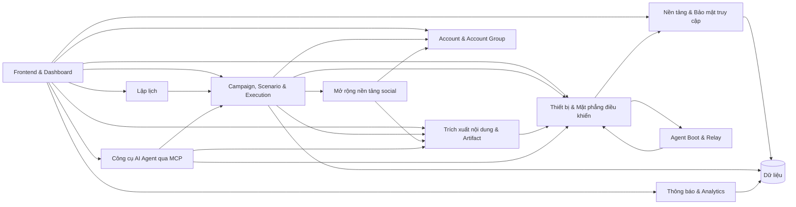

# Module nghiệp vụ — Index

> **Mã tài liệu:** DF-DOC-MODULES-INDEX
> **Phiên bản:** 1.0
> **Cập nhật lần cuối:** 2026-05-25
> **Trạng thái:** Approved
> **Đối tượng đọc:** Team Device Farm
> **Tài liệu liên quan:** [Product Overview](../01-product-overview.md), [Personas & Journeys](../02-personas-and-journeys.md), [Capability Matrix](../03-capability-matrix.md), [Glossary](../00-glossary.md)

## 1. Mục đích thư mục

Thư mục `modules/` chứa tài liệu nghiệp vụ chi tiết cho mỗi module Device Farm. Một module ở đây là một đơn vị nghiệp vụ có ranh giới rõ ràng: có người sở hữu, có persona phục vụ, có capability đo lường được, và có ranh giới đầu vào / đầu ra với các module khác.

Mỗi tài liệu module áp dụng cùng cấu trúc 10 phần để team có thể đọc cross-module mà không cần đoán format. Cấu trúc này được mô tả ở mục 3 dưới đây.

## 2. Danh sách module

| # | Mã module | Tên module | Persona chính | Trạng thái |
|---|---|---|---|---|
| 01 | DF-MOD-01 | [Nền tảng & Bảo mật truy cập](01-platform-runtime-and-access.md) | Platform Engineer, Admin | Active |
| 02 | DF-MOD-02 | [Thiết bị & Mặt phẳng điều khiển](02-devices-and-control-plane.md) | Fleet Operator, Social Data Operator | Active |
| 03 | DF-MOD-03 | [Agent Boot & Relay](03-agent-boot-and-relay.md) | Fleet Operator, Platform Engineer | Active |
| 04 | DF-MOD-04 | [Campaign, Scenario & Execution](04-campaigns-scenarios-executions.md) | Automation Builder, Social Data Operator | Active |
| 05 | DF-MOD-05 | [Lập lịch (Scheduling)](05-scheduling.md) | Operator, Automation Builder | Active |
| 06 | DF-MOD-06 | [Trích xuất nội dung & Artifact](06-content-extraction-artifacts.md) | Social Data Operator | Active |
| 07 | DF-MOD-07 | [Account & Account Group](07-accounts-and-groups.md) | Social Data Operator | Active |
| 08 | DF-MOD-08 | [Mở rộng nền tảng social](08-social-platform-extensions.md) | Platform Engineer | Active (contract); coverage theo platform |
| 09 | DF-MOD-09 | [Thông báo & Analytics](09-notifications-and-analytics.md) | Operator, Supervisor | Active |
| 10 | DF-MOD-10 | [Công cụ AI Agent qua MCP](10-mcp-agent-tools.md) | AI Operations Supervisor (forward-looking) | Preview / Experimental — phần mở rộng đang nghiên cứu, không thuộc năng lực cốt lõi |
| 11 | DF-MOD-11 | [Frontend & Dashboard](11-frontend-dashboard.md) | Tất cả persona | Active |

## 3. Cấu trúc chuẩn một tài liệu module

Mọi tài liệu module trong thư mục này tuân thủ cấu trúc 10 phần cố định sau đây:

1. **Tóm tắt (TL;DR)** — 5–7 dòng tổng quan module.
2. **Bối cảnh & Vấn đề giải quyết** — vấn đề nghiệp vụ module này giải.
3. **Phạm vi** — chia rõ in-scope và out-of-scope.
4. **Personas & Use Cases** — persona liên quan và use case ID cụ thể.
5. **Luồng nghiệp vụ chính** — sơ đồ Mermaid kèm narrative.
6. **Đặc tả tính năng (Functional Spec)** — bảng tính năng với ID, mô tả, ưu tiên, acceptance criteria.
7. **Capability matrix (nếu áp dụng)** — trạng thái coverage theo L1/L2/L3 hoặc theo platform.
8. **Giới hạn, ràng buộc & rủi ro** — minh bạch về những gì module không làm hoặc làm chưa tốt.
9. **Chỉ số đo lường thành công (KPIs)** — KPI nghiệp vụ và mục tiêu.
10. **Glossary refs & Open questions** — thuật ngữ tham chiếu và câu hỏi nghiệp vụ còn mở.

Cấu trúc này được thiết kế để có thể đọc bất kỳ module nào theo cùng một flow tinh thần. Bảng "Đặc tả tính năng" có thể trích ra Jira/Asana làm backlog mà không cần biên tập lại.

## 4. Bản đồ phụ thuộc giữa các module

Đọc bản đồ này thế nào? Mũi tên đi từ "module phụ thuộc" sang "module cung cấp năng lực". Ví dụ Campaigns phụ thuộc Devices vì Campaigns gửi lệnh thông qua Devices. Frontend phụ thuộc gần như mọi module backend.

## 5. Lộ trình đọc theo nhu cầu

**Để hiểu nghiệp vụ vận hành end-to-end:** đọc theo thứ tự 02 → 04 → 06 → 07 → 05 → 09.

**Để hiểu hạ tầng và bảo mật:** đọc theo thứ tự 01 → 03 → 02.

**Để hiểu phần mở rộng AI (Preview):** đọc theo thứ tự 04 → 10 → 08. Đây là phần đang được nghiên cứu, không phản ánh trục cốt lõi của sản phẩm.

**Để hiểu trải nghiệm người dùng cuối:** đọc theo thứ tự 11 → 02 → 04 → 06.

## 6. Quy ước cập nhật

Mỗi tài liệu module có header riêng ghi ngày cập nhật và phiên bản. Khi mã nguồn của module có thay đổi đủ lớn (thay đổi capability, thay đổi contract, thay đổi cấu trúc dữ liệu nhìn thấy được từ phía nghiệp vụ), tài liệu nghiệp vụ phải được cập nhật trong cùng release.

Trường hợp tài liệu nghiệp vụ và tài liệu kỹ thuật (`docs/modules/`) có khác biệt, tài liệu kỹ thuật là chân lý cho hành vi hệ thống, tài liệu nghiệp vụ này là chân lý cho cách trình bày nghiệp vụ. Khi mâu thuẫn, đội Product điều phối điều chỉnh hai bên.
