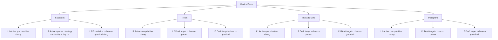
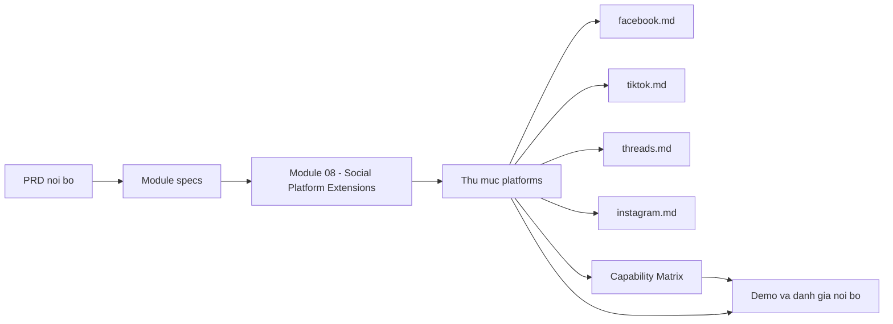

# Hồ sơ các social platform được hỗ trợ

> **Mã tài liệu:** DF-PLATFORMS-INDEX
> **Phiên bản:** 1.0
> **Cập nhật lần cuối:** 2026-05-25
> **Trạng thái:** Approved
> **Đối tượng đọc:** Team Device Farm
> **Tài liệu liên quan:** [Product Overview](../01-product-overview.md), [Capability Matrix](../03-capability-matrix.md), [Social Platform Extensions](../modules/08-social-platform-extensions.md)

## 1. Mục đích thư mục

Thư mục `platforms/` tập hợp toàn bộ hồ sơ nền tảng (platform profile) chính thức cho các social platform mà Device Farm đặt làm mục tiêu giai đoạn đầu. Mỗi hồ sơ trình bày một bức tranh thống nhất ở cả ba cấp coverage L1, L2, L3 (ba cấp năng lực — bulk manual control, scenario automation, MCP agent tools), kèm theo phạm vi dữ liệu, yêu cầu account, và tiêu chí hoàn thiện cụ thể. **Lưu ý quan trọng:** L1 và L2 là core coverage levels; một platform được coi là Active khi đạt L2 với đầy đủ artifact L2. L3 (MCP agent tools) là phần mở rộng preview, không bắt buộc cho trạng thái Active, được giữ trong hồ sơ để minh bạch về hướng nghiên cứu AI agent. Hồ sơ là chân lý nghiệp vụ khi cần trả lời câu hỏi "platform X được hỗ trợ tới mức nào trên Device Farm".

Mỗi hồ sơ tuân thủ một template 10 phần cố định: tóm tắt, mục tiêu sản phẩm, phạm vi dữ liệu, coverage hiện tại, đặc tả L2, đặc tả L3, account & session requirement, config contract, tiêu chí hoàn thiện, và giới hạn cùng lộ trình. Cấu trúc cố định cho phép đọc đối chiếu giữa các platform mà không phải đoán bố cục, và giúp team nhanh chóng định vị các hạng mục còn thiếu khi đẩy một platform từ Draft sang Active.

Bộ tài liệu này không chứa mã nguồn. Mọi mô tả về step type (loại bước), extraction strategy (chiến lược trích xuất), và content type (kiểu nội dung) đều ở mức nghiệp vụ; chi tiết schema và mã handler là tài sản của các tài liệu module nội bộ và mã nguồn.

## 2. Bốn platform mục tiêu giai đoạn đầu

Device Farm hiện đặt mục tiêu hỗ trợ chuyên biệt cho bốn nền tảng social phổ biến nhất trong scope giai đoạn đầu: Facebook, TikTok, Threads (Meta), và Instagram. Bảng dưới tóm tắt trạng thái coverage hiện tại của từng platform — chi tiết đầy đủ nằm trong từng hồ sơ riêng.

| Platform | Mã hồ sơ | Trạng thái | Coverage hiện tại | Coverage mục tiêu | Hồ sơ chi tiết |
|---|---|---|---|---|---|
| **Facebook** | DF-PLATFORM-01 | Active (L2 core), Foundation (L3 preview) | L1 + L2 active (core), L3 foundation (preview) | L1 + L2 (core); L3 (preview, không bắt buộc) | [facebook.md](facebook.md) |
| **TikTok** | DF-PLATFORM-02 | Draft target | L1 qua primitive chung (core); L2 chưa active; L3 draft (preview) | L1 + L2 (core); L3 (preview, không bắt buộc) | [tiktok.md](tiktok.md) |
| **Threads (Meta)** | DF-PLATFORM-03 | Draft target | L1 qua primitive chung (core); L2 chưa active; L3 draft (preview) | L1 + L2 (core); L3 (preview, không bắt buộc) | [threads.md](threads.md) |
| **Instagram** | DF-PLATFORM-04 | Draft target | L1 qua primitive chung (core); L2 chưa active; L3 draft (preview) | L1 + L2 (core); L3 (preview, không bắt buộc) | [instagram.md](instagram.md) |

Tại thời điểm phát hành phiên bản này của bộ tài liệu, **Facebook là platform duy nhất đã đạt L2 Active**, có đầy đủ parser, extraction strategy, content type platform-qualified, frontend node trong flow editor, và test. Ba platform còn lại đang ở Draft target — đã có contract dự kiến (tên strategy, tên step, tên content type), nhưng chưa có parser, handler, frontend support, hay test platform-specific. L1 trên cả bốn platform đều khả dụng thông qua các primitive chung của Device Farm.

## 3. Bản đồ visual L1/L2/L3 cho cả bốn platform

Sơ đồ dưới mô tả vị trí coverage hiện tại của bốn platform mục tiêu trên trục ba cấp L1, L2, L3. Các nhánh được tô khác nhau để phân biệt Active, Foundation, và Draft target.

Đọc sơ đồ này như sau. Tất cả bốn platform đều có thể vận hành ở L1 ngay hôm nay vì Device Farm cung cấp các primitive chung (gesture, hierarchy, screenshot, stream, session reservation) độc lập với app cụ thể. Chênh lệch thực sự nằm ở L2 và L3 — nơi Device Farm phải hiểu UI của từng platform để dựng step type chuyên biệt và parser chuyên biệt. Facebook là implementation reference; ba platform còn lại sẽ đi theo cùng contract khi engineering capacity cho phép.

## 4. Quy ước trạng thái

Để tránh hiểu nhầm giữa "đã có ý định" và "đã chạy được", team áp dụng quy ước trạng thái sau xuyên suốt các hồ sơ platform:

| Trạng thái | Ý nghĩa nghiệp vụ |
|---|---|
| **Active** | Platform đã có đầy đủ parser, scenario step, extraction strategy, content type platform-qualified, frontend node, test, và doc. Có thể dispatch scenario production-grade trên platform này. |
| **Foundation** | Platform đã có khung contract và một số artifact nền móng, nhưng chưa đủ điều kiện claim Active. Ví dụ điển hình: Facebook L3 — đã có MCP tool generic nhưng chưa có guardrail platform-specific. |
| **Draft target** | Platform mới có hồ sơ profile và contract dự kiến. Chưa có parser, handler, frontend node, hay test. Chỉ dùng được qua primitive L1 generic. |
| **N/A** | Không nằm trong scope giai đoạn đầu. |

Khi một hồ sơ ghi "Draft target", không nên giả định các tên strategy hoặc tên step trong hồ sơ đó "chạy được" — chúng là intent kỹ thuật, không phải năng lực sản xuất. Khi đẩy một platform từ Draft sang Active, team cập nhật cả hồ sơ và Capability Matrix trong cùng một release.

## 5. Hướng dẫn đọc theo nhu cầu

Tùy mục đích sử dụng, các lộ trình đọc khác nhau dưới đây giúp tiết kiệm thời gian:

**Khi chuẩn bị demo hoặc đánh giá nội bộ**, đọc theo thứ tự sau:

- [Capability Matrix](../03-capability-matrix.md) — nắm bảng tổng quan trước
- [facebook.md](facebook.md) — đây là "out of the box demo path" duy nhất hiện có
- Lướt nhanh ba hồ sơ Draft target để biết câu trả lời trung thực cho câu hỏi "có hỗ trợ TikTok/Threads/Instagram không"

**Khi lập kế hoạch backlog hoặc viết user story**:

- [Social Platform Extensions](../modules/08-social-platform-extensions.md) — contract chuẩn cho việc đưa platform từ Draft sang Active
- Đọc hồ sơ platform mục tiêu để hiểu gap cụ thể (parser, handler, frontend node, test, guardrail)
- Ước lượng theo timeline 2-4 tuần engineering cho mỗi platform được nêu trong tài liệu Capability Matrix

**Khi triển khai pilot**:

- Xác định platform mục tiêu của use case — nếu là Facebook thì có thể bắt đầu pilot ngay
- Nếu là một trong ba platform Draft target, chốt scope L1 thuần (dùng primitive generic) hoặc đợi engineering hoàn thiện L2
- Đọc kỹ phần "Account & Session requirement" trong hồ sơ tương ứng để chuẩn bị account và proxy

## 6. Mối quan hệ giữa các tài liệu

Sơ đồ dưới minh họa nơi hồ sơ platform nằm trong hệ tài liệu sản phẩm và các tài liệu tham chiếu chéo:

Mỗi hồ sơ platform là một extension cụ thể của contract được mô tả trong [Social Platform Extensions](../modules/08-social-platform-extensions.md). Khi cùng một thông tin xuất hiện ở cả Capability Matrix và hồ sơ platform, hồ sơ platform là chi tiết — Capability Matrix chỉ chốt trạng thái tổng quan.

## 7. Cập nhật và governance

Các hồ sơ tại thư mục này được sở hữu bởi team Product. Khi trạng thái coverage của một platform thay đổi (Draft → Foundation → Active hoặc ngược lại do regression), hồ sơ tương ứng, Capability Matrix, và release note được cập nhật trong cùng một thay đổi. Engineering báo cho Product khi đẩy code thay đổi trạng thái coverage, để cập nhật trong cùng release.

Mọi yêu cầu hỗ trợ platform mới ngoài bốn platform mục tiêu giai đoạn đầu (ví dụ YouTube Shorts, LinkedIn, Reddit) đi qua quy trình mô tả tại [Capability Matrix - mục 7](../03-capability-matrix.md). Platform mới phải đáp ứng đầy đủ checklist contract tại Social Platform Extensions trước khi vào trạng thái Draft target.
