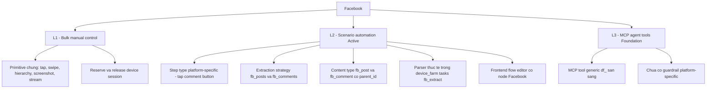
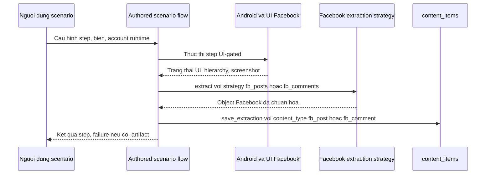

# Hồ sơ Platform — Facebook

> **Mã tài liệu:** DF-PLATFORM-01
> **Platform:** Facebook
> **Phiên bản:** 1.0
> **Cập nhật lần cuối:** 2026-05-25
> **Trạng thái:** Active (L2 core), Foundation (L3 preview)
> **Coverage mục tiêu:** L1 + L2 (core); L3 (preview, không bắt buộc cho trạng thái Active)
> **Coverage hiện tại:** L1 + L2 active (core), L3 foundation (preview, không bắt buộc cho trạng thái Active)
> **Đối tượng đọc:** Team Device Farm
> **Tài liệu liên quan:** [Product Overview](../01-product-overview.md), [Capability Matrix](../03-capability-matrix.md), [Social Platform Extensions](../modules/08-social-platform-extensions.md)

## 1. Tóm tắt

Facebook là platform reference của Device Farm — nền tảng đầu tiên đạt L2 Active và là implementation mẫu cho contract Social Platform Extensions. Triển khai Device Farm hôm nay có thể dispatch ngay scenario tự động hóa thu thập post từ feed và group, thu thập comment kèm quan hệ cha-con, lưu nội dung vào content collection có truy vết tới device và campaign. Toàn bộ luồng được biểu diễn dưới dạng authored scenario flow (luồng kịch bản tường minh) trên cùng scenario executor với các platform khác, không có Facebook runner riêng. Ở cấp L3, các MCP tool generic đã sẵn sàng cho AI agent thao tác device trên Facebook, nhưng bộ guardrail riêng cho platform này (giới hạn action, evidence requirement, handoff condition) chưa hoàn thiện — vì vậy L3 đang ở trạng thái Foundation, không tuyên bố Active.

## 2. Mục tiêu sản phẩm

Hỗ trợ Facebook trên Device Farm cho phép dựng scenario tự động hóa thao tác Facebook trên thiết bị Android thật, thu thập dữ liệu post và comment ở quy mô lớn, và debug được mọi failure qua artifact thực thi chuẩn (screenshot, hierarchy snapshot, step log). Mọi hành vi platform-specific đều được biểu diễn dưới dạng scenario step và extraction strategy, đi qua scenario executor chuẩn — vì vậy team dùng cùng một bộ công cụ và quy trình giám sát cho Facebook như cho mọi platform khác trong roadmap.

Ở khía cạnh nghiệp vụ, hỗ trợ Facebook L2 phục vụ ba use case chính: thu thập dữ liệu social cho mục đích nghiên cứu thị trường và sentiment analysis, theo dõi group hoặc page cụ thể theo lịch, và crawl comment theo chuỗi thảo luận với traceability đầy đủ tới account và device đã thực thi.

## 3. Phạm vi dữ liệu hỗ trợ

Phạm vi dữ liệu Facebook mà Device Farm chính thức hỗ trợ ở phiên bản hiện tại bao gồm hai content type (kiểu nội dung) chuẩn:

- **`fb_post`** — post hiển thị trong feed hoặc trong group, bao gồm các trường nghiệp vụ chung: nội dung văn bản, tác giả và id tác giả, URL/permalink, các counter tương tác (lượt thích, bình luận, chia sẻ), URL media đính kèm, ngày đăng. Các trường platform-specific không map vào cột content_items chuẩn sẽ được lưu vào `raw_data` (trường JSON dự phòng) để không mất thông tin.
- **`fb_comment`** — comment dưới một post, có quan hệ cha-con qua `parent_id` (id của post hoặc comment cha) và `item_level` (cấp bậc — 1 là comment trực tiếp, 2 là reply của comment, và tiếp tục). Nhờ cặp trường này, có thể tái lập cây thảo luận khi cần phân tích.

Mọi content item lưu vào hệ thống đều mang traceability đầy đủ tới device đã thực thi, scenario và campaign tương ứng, execution cụ thể, và content collection mà người dựng kịch bản đã chỉ định. Quan hệ traceability này là yêu cầu cứng — không có content item nào được lưu "nặc danh".

## 4. Coverage hiện tại theo L1/L2/L3

L1 và L2 là core coverage levels cho Facebook trên Device Farm. L3 (MCP agent tools) là phần mở rộng preview, không bắt buộc cho trạng thái Active của platform này. Phần dưới đây mô tả tình trạng nghiên cứu hiện tại của L3 song song với core L1/L2.

Sơ đồ dưới minh họa trạng thái coverage hiện tại của Facebook ở cả ba cấp:

Ở cấp **L1**, điều khiển ứng dụng Facebook trên Android như mọi app khác — mở app qua launch hoặc URL navigation, quan sát UI hierarchy, chụp screenshot, thực hiện gesture (tap, swipe, long_tap, scroll), reserve/release session. L1 không hàm ý một "Facebook console" riêng; đây đơn giản là bề mặt điều khiển generic áp dụng cho app Facebook.

Ở cấp **L2 (Active)**, Device Farm đã có đầy đủ artifact platform-specific. Đó là step type Facebook (action mở context comment), extraction strategy `fb_posts` và `fb_comments`, content type `fb_post` và `fb_comment` qualified theo platform, parser thực tế nằm tại `device_farm/tasks/fb_extract/*`, frontend flow editor node, test ở các tầng schema, executor, parser, và persistence. Có thể dispatch scenario production-grade trên Facebook ngay.

Ở cấp **L3 (Foundation)**, các MCP tool generic của Device Farm (`df_*` — device control, session lifecycle, scenario invocation, content query) đã sẵn sàng cho AI agent thao tác trên một device chạy Facebook. Tuy nhiên, bộ guardrail riêng theo Facebook chưa được khai báo đầy đủ: chưa có rule giới hạn action cap, chưa có quy ước handoff cho captcha hoặc account safety, chưa có evidence requirement cụ thể cho action AI thực hiện. Vì vậy L3 chưa được tuyên bố Active cho Facebook — trạng thái hiện tại là Foundation và sẽ được nâng lên Active sau khi guardrail được khai báo theo contract Social Platform Extensions.

## 5. L2 — Scenario automation

Sơ đồ dưới mô tả vòng đời thực thi của một scenario Facebook trên Device Farm. Người dựng cấu hình scenario; executor chạy step UI-gated trên app Facebook; extraction strategy gọi parser khi đến step `extract`; kết quả lưu vào content_items với content type platform-qualified:

Bảng đặc tả nghiệp vụ các năng lực L2 hiện có trên Facebook như sau:

| Năng lực | Tên canonical | Tên legacy (nếu có) | Output nghiệp vụ |
|---|---|---|---|
| Trích xuất Facebook post | `extract` với strategy `fb_posts` | Cùng tên | Object runtime `posts`, lưu thành content item `fb_post` |
| Trích xuất Facebook comment | `extract` với strategy `fb_comments` | Cùng tên | Object runtime `comments` có parent_id và item_level, lưu thành content item `fb_comment` |
| Mở context comment của một post | `fb_tap_comment_button` (đề xuất canonical) | `tap_fb_comment_button` (đang sử dụng) | Đưa UI vào trạng thái comment-list để bước extract tiếp theo có ngữ cảnh đúng |

Lưu ý quan trọng về **legacy alias**: tên `tap_fb_comment_button` là dạng đang sử dụng trong production code, còn `fb_tap_comment_button` là tên canonical đề xuất theo naming convention `<platform>_<verb>_<object>`. Hai tên có cùng hành vi runtime. Trong giai đoạn chuyển tiếp, doc mới và template scenario mới nên dùng tên canonical; doc cũ giữ legacy alias để không phá scenario đang chạy. Gap SPG-002 trong tài liệu Social Platform Extensions theo dõi việc hoàn thiện naming canonical này.

Về **failure semantics**, Facebook step tuân theo authored scenario flow giống mọi step khác: action UI là UI-gated mặc định, một step fail sẽ chặn các step phía sau trừ khi scenario đã khai báo tường minh `retry`, `branch`, `skip`, hoặc nested scenario phục hồi. `ignore_error` và `on_error` chỉ có hiệu lực khi được khai báo rõ ràng ở scope step hoặc scenario. Riêng `tap_fb_comment_button` hiện có hành vi mặc định "miss-tolerant" mang tính legacy — các action Facebook mới phải khai báo non-stop behavior tường minh qua error policy.

## 6. L3 — MCP agent tools (Preview)

> **Lưu ý:** Mục này mô tả phần mở rộng đang được nghiên cứu. Khi đánh giá Device Farm cho use case core không cần đọc mục này. Trạng thái Active của Facebook trên Device Farm được xác định bởi L2 (đã đạt) — không phụ thuộc vào L3.

Ở cấp L3 hiện tại, Facebook đang ở trạng thái **Foundation (preview)**, không phải Active. Các MCP tool generic `df_*` đã sẵn sàng cho AI agent: tool device control, tool session lifecycle, tool dispatch scenario, tool query content và artifact. AI agent có thể reserve một device, mở app Facebook, thực hiện gesture, gọi extraction strategy `fb_posts` hoặc `fb_comments`, và lưu content — tất cả qua MCP protocol.

Tuy nhiên, **guardrail riêng cho Facebook chưa được khai báo đầy đủ**. Cụ thể, các hạng mục sau đang thiếu và là điều kiện để chuyển L3 từ Foundation lên Active:

- **Allowed action cap** — giới hạn số action mỗi phút và mỗi giờ AI agent được phép thực hiện trên Facebook (vd giới hạn comment, like, follow để bảo vệ account)
- **Evidence requirement** — danh sách bằng chứng AI agent phải thu sau mỗi loại action (vd screenshot trước/sau action, hierarchy snapshot tại điểm quyết định)
- **Handoff condition** — điều kiện AI agent phải bàn giao về người vận hành, đặc biệt cho captcha, security checkpoint, two-factor authentication, hoặc state thiết bị bất thường
- **Account safety policy** — rule bảo vệ account khỏi các hành vi có thể trigger ban hoặc rate limit từ Facebook

Cho tới khi các hạng mục này được khai báo, AI Operations Supervisor có thể vận hành AI agent trên Facebook nhưng phải tự áp dụng kỷ luật giám sát thủ công — Device Farm không tự enforce guardrail platform-specific.

## 7. Account & Session requirement

Scenario Facebook trên Device Farm có thể sử dụng các giá trị liên quan đến account từ nhiều nguồn: scenario config (cấu hình mức scenario), device context (cấu hình per-device override), tham chiếu account group/resource, hoặc các runtime input user-authored khác. Điểm cốt lõi: **scenario author own intent — Device Farm KHÔNG suy diễn fallback account**. Nếu một scenario Facebook cần account login mà người dựng quên khai báo, scenario sẽ báo lỗi cấu hình rõ ràng tại runtime; hệ thống không tự chọn một account "phù hợp" nào đó.

Về **session lifetime**, scenario Facebook chạy trong một device session reserved cho scenario đó. Khi scenario chạy xong (hoặc fail), session được release để device về pool. Nếu workflow yêu cầu chuỗi nhiều scenario chia sẻ context (vd đăng nhập một lần rồi crawl nhiều group), người dựng có thể sử dụng nested scenario hoặc khai báo một scenario tổng đi qua nhiều bước.

Về **proxy và credential**, hiện tại config scenario là free-form JSON và có thể chứa giá trị credential. Khuyến cáo không thiết kế workflow Facebook xoay quanh credential plaintext; vault-backed reference cho credential nằm ở roadmap trung hạn.

## 8. Cấu hình (Config contract)

Cấu hình scenario Facebook hiện ở dạng free-form JSON hợp lệ. Để dễ tổ chức cấu hình, khuyến nghị nhóm các key theo các nhóm nghiệp vụ sau:

- **Platform identity** — khai báo platform mục tiêu, package name của app Facebook trên Android, locale hiển thị (ảnh hưởng tới UI text khi scenario dựa vào text selector)
- **Account runtime config** — id account, username, id account group nếu dùng rotation, các input login nếu scenario tự xử lý đăng nhập
- **Target inputs** — đầu vào nghiệp vụ của workflow: URL hoặc id group, search query, URL post cụ thể cần crawl, giới hạn scroll
- **Extraction config** — id content collection lưu kết quả, số lượng item tối đa, trường dùng làm dedupe key, biến tham chiếu parent post id khi crawl comment
- **Error policy** — cấu hình mức step cho `retry`, `ignore_error`, `on_error`

Không cần khai báo typed schema cho từng key — Device Farm phiên bản hiện tại chấp nhận mọi JSON hợp lệ. Tuy nhiên, khuyến nghị template scenario nội bộ ghi rõ key kỳ vọng để các thành viên mới dựng kịch bản không phải đoán.

## 9. Tiêu chí hoàn thiện (Completion criteria)

Một platform được coi là **Active** trên Device Farm khi đạt L2 với đầy đủ artifact L2. L3 không nằm trong tiêu chí Active — L3 là phần mở rộng preview, theo dõi riêng cho hướng nghiên cứu AI agent.

Facebook đã đạt L2 Active vì thỏa mãn toàn bộ checklist hoàn thiện L2 sau:

- Extract post sinh ra content item `fb_post` với traceability đầy đủ
- Extract comment sinh ra content item `fb_comment` có `parent_id` và `item_level` để tái lập cây thảo luận
- Bước điều hướng comment (mở context comment của một post) được biểu diễn dưới dạng scenario step
- Mọi content lưu được đều có traceability tới device, scenario, campaign, execution, và collection cụ thể
- Failure báo step lỗi rõ ràng và đi kèm UI evidence dùng được (screenshot hoặc hierarchy snapshot tại thời điểm fail)
- Các example và template chính thức dùng authored scenario flow, không có "Facebook runner ẩn"

Phần L3 (preview) của Facebook đang ở Foundation và được theo dõi riêng cho hướng nghiên cứu AI agent — không phải tiêu chí đánh giá trạng thái Active của platform. Khi guardrail L3 được khai báo đủ (action cap, evidence requirement, handoff condition, account safety policy — xem phần 6), hồ sơ này sẽ được cập nhật, nhưng việc Facebook là Active đã được xác định ngay từ L2.

## 10. Giới hạn, rủi ro và lộ trình

Các giới hạn còn lại được nêu minh bạch để có bức tranh đầy đủ trước khi cam kết workflow lớn trên Facebook:

**Naming canonical đi trước implementation.** Tên `fb_tap_comment_button` đã xuất hiện trong doc canonical, nhưng implementation alias chính thức trong schema và frontend node vẫn dùng `tap_fb_comment_button`. Trong giai đoạn chuyển tiếp, scenario nên dùng tên legacy đang chạy thực tế; chuyển sang tên canonical sẽ được công bố qua release note khi alias canonical sẵn sàng đầy đủ. Đây là gap SPG-002 trong tài liệu Social Platform Extensions.

**L3 guardrail platform-specific chưa được khai báo.** AI agent vận hành Facebook qua MCP có thể thực hiện hầu hết hành vi mà device hỗ trợ, nhưng không có rule enforcement riêng cho Facebook. AI Ops Supervisor cần áp dụng kỷ luật giám sát thủ công cho tới khi guardrail hoàn thiện. Lộ trình ước tính: nằm trong roadmap quý hiện tại.

**Account/login hardening đang ưu tiên thấp.** Hiện tại scenario có thể chứa credential plaintext trong config. Khuyến cáo không xây workflow phụ thuộc vào điều này. Vault-backed reference cho credential nằm trong roadmap trung hạn (3-6 tháng).

**Content type generic cũ có thể còn tồn tại trong template di sản.** Một số template scenario di sản có thể lưu content với type `post` hoặc `comment` generic thay vì `fb_post`, `fb_comment`. Khi áp dụng cho workflow mới, nên kiểm tra template trước khi dispatch và đảm bảo content type qualified. Backward compatibility trong query được giữ để không phá báo cáo lịch sử.

**Vai trò Facebook như platform reference.** Vì Facebook là platform đầu tiên đạt L2 Active, hồ sơ này được coi là implementation reference cho contract Social Platform Extensions. Mọi thay đổi lớn về naming convention, content type structure, hoặc parser pattern trên Facebook đều cần đánh giá tác động tới ba platform Draft target khác (TikTok, Threads, Instagram) trước khi merge — vì các platform đó sẽ noi theo cùng pattern.

**Lộ trình ngắn hạn** cho Facebook tập trung vào: hoàn thiện naming canonical `fb_*`, khai báo L3 guardrail để chuyển Foundation lên Active, và bổ sung scenario template reference cho các workflow phổ biến (crawl group, crawl page, monitor comment chain).
