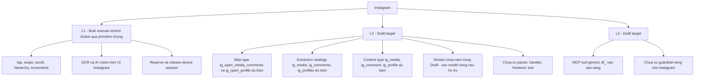

# Hồ sơ Platform — Instagram

> **Mã tài liệu:** DF-PLATFORM-04
> **Platform:** Instagram
> **Phiên bản:** 1.0
> **Cập nhật lần cuối:** 2026-05-25
> **Trạng thái:** Draft target
> **Coverage mục tiêu:** L1 + L2 (core); L3 (preview, không bắt buộc cho trạng thái Active)
> **Coverage hiện tại:** L1 khả dụng qua primitive chung (core); L2 chưa active (core, mục tiêu kế tiếp); L3 Draft target (preview, không bắt buộc cho trạng thái Active)
> **Đối tượng đọc:** Team Device Farm
> **Tài liệu liên quan:** [Product Overview](../01-product-overview.md), [Capability Matrix](../03-capability-matrix.md), [Social Platform Extensions](../modules/08-social-platform-extensions.md)

## 1. Tóm tắt

Instagram hiện ở trạng thái **Draft target** trên Device Farm. Team đã định nghĩa contract dự kiến cho content type, extraction strategy, và action step, đặt mục tiêu chuyển Instagram lên L2 Active rồi tới L3 Active theo cùng pattern Facebook. Đặc thù của Instagram so với ba platform còn lại là phạm vi dữ liệu rộng hơn: ngoài media post và comment, hồ sơ này còn bao gồm profile như một content type độc lập, vì nhu cầu nghiệp vụ thu thập thông tin creator/account là phổ biến trong các use case Instagram. Stories có TTL ngắn nên chưa nằm trong Draft hiện tại; nếu được hỗ trợ trong tương lai sẽ cần model riêng. Parser, handler, frontend support, test, và guardrail platform-specific đều chưa được implement ở phiên bản hiện tại.

## 2. Mục tiêu sản phẩm

Hỗ trợ Instagram trên Device Farm hướng tới việc cho phép dựng scenario tự động hóa thao tác Instagram trên thiết bị Android thật, thu thập dữ liệu media (photo, video, reel), comment, và profile, và biểu diễn cơ chế recovery qua authored scenario flow tường minh. Khi đạt L2 Active, team sẽ dùng cùng một bộ công cụ scenario builder và content collection cho Instagram như cho Facebook.

Ở khía cạnh nghiệp vụ, hỗ trợ Instagram phục vụ các use case: thu thập media theo hashtag, theo creator, hoặc theo location; theo dõi engagement (comment) dưới các media viral; thu thập profile data để phục vụ creator discovery, influencer marketing, và brand monitoring. Đây là các use case phổ biến trong các workflow growth và data team.

## 3. Phạm vi dữ liệu hỗ trợ (proposed)

Khi Instagram đạt L2 Active, phạm vi dữ liệu được hỗ trợ chính thức sẽ bao gồm ba content type platform-qualified:

- **`ig_media`** — đơn vị media post trên Instagram, bao trùm cả ba dạng phổ biến: photo, video, và reel. Các trường nghiệp vụ chung gồm: tác giả và id tác giả, caption, URL/permalink, các counter tương tác (lượt thích, comment, share, save), URL media (image hoặc video), ngày đăng, loại media (photo/video/reel ghi nhận qua trường phân loại). Các trường platform-specific không map vào content_items chuẩn lưu vào `raw_data`.
- **`ig_comment`** — comment dưới một media, có quan hệ cha-con qua `parent_id` và `item_level` tương tự pattern Facebook. Comment cấp 1 trỏ về `ig_media`, reply trỏ về comment cấp 1.
- **`ig_profile`** — profile của một account Instagram, bao gồm các trường: username, display name, bio, follower count, following count, post count, avatar URL, trạng thái (verified, business, creator), category. Đây là content type độc lập, không phải sub-component của `ig_media` — phù hợp với use case creator discovery và influencer screening nơi cần lưu profile như một bản ghi riêng có lifecycle độc lập với media.

**Về stories**: Instagram stories có TTL (time-to-live — thời gian tồn tại) ngắn, chỉ 24 giờ, và có cấu trúc khá khác với media post chuẩn. Nếu được hỗ trợ trong tương lai, stories sẽ cần một content type riêng (vd `ig_story`) với logic capture chuyên biệt vì TTL ngắn ảnh hưởng tới chiến lược crawl. **Stories chưa nằm trong Draft hiện tại** và không phải mục tiêu giai đoạn này — được nêu ở đây để có bức tranh đầy đủ về phạm vi tương lai.

## 4. Coverage hiện tại theo L1/L2/L3

L1 và L2 là core coverage levels cho Instagram trên Device Farm. L3 (MCP agent tools) là phần mở rộng preview, không bắt buộc cho trạng thái Active của platform này. Phần dưới đây mô tả tình trạng nghiên cứu hiện tại của L3 song song với core L1/L2.

Sơ đồ dưới minh họa trạng thái coverage hiện tại của Instagram ở cả ba cấp:

Ở cấp **L1**, điều khiển app Instagram trên Android giống mọi app khác — mở app, scroll feed, tap vào media, swipe reel, mở profile, mở comment panel. Các extraction generic (`screen_data`, OCR, AI vision) hoạt động trên screenshot Instagram bình thường. Đây là path khả dụng ngay hôm nay khi cần thu thập dữ liệu Instagram ở quy mô nhỏ.

Ở cấp **L2 (Draft target)**, các artifact platform-specific cho Instagram hiện chưa có: chưa có parser, chưa có handler, chưa có frontend node, chưa có test, chưa có template reference. Tên `ig_media`, `ig_comments`, `ig_profiles`, `ig_open_media_comments`, `ig_open_profile` trong contract chỉ là intent.

Ở cấp **L3 (Draft target)**, các MCP tool generic vẫn sẵn sàng nhưng chưa có guardrail riêng cho Instagram. Instagram là platform nhạy cảm nhất về account safety trong bốn platform mục tiêu — guardrail Instagram khi triển khai sẽ cần policy giới hạn follow/unfollow, like, comment rate khá chặt.

## 5. L2 — Scenario automation (proposed)

Khi Instagram đạt L2 Active, luồng thực thi sẽ tuân theo pattern Facebook chuẩn. Bảng đặc tả nghiệp vụ các năng lực L2 dự kiến cho Instagram:

| Năng lực | Tên canonical đề xuất | Tên legacy | Output nghiệp vụ |
|---|---|---|---|
| Trích xuất Instagram media | `extract` với strategy `ig_media` | Chưa có | Object runtime `media`, lưu thành content item `ig_media` (photo, video, hoặc reel) |
| Trích xuất Instagram comment | `extract` với strategy `ig_comments` | Chưa có | Object runtime `comments` có parent_id và item_level, lưu thành content item `ig_comment` |
| Trích xuất Instagram profile | `extract` với strategy `ig_profiles` | Chưa có | Object runtime `profiles`, lưu thành content item `ig_profile` |
| Mở context comment của một media | `ig_open_media_comments` | Chưa có | Đưa UI vào trạng thái comment-list của media để bước extract tiếp theo có ngữ cảnh đúng |
| Mở context profile của một account | `ig_open_profile` | Chưa có | Đưa UI vào trạng thái profile detail để bước extract `ig_profiles` hoặc duyệt feed của profile |

Mọi cơ chế recovery từ biến thể UI Instagram phải được người dựng kịch bản khai báo tường minh qua branch, retry, loop, hoặc scenario error policy. Instagram thay đổi UI khá thường xuyên, đặc biệt là layout reel và profile — đây là yếu tố cần lưu ý khi dựng scenario.

Về **phân biệt media type bên trong `ig_media`**: vì cả photo, video, và reel đều là content type `ig_media`, người dựng nên dùng một trường phân loại (vd `media_type` trong content payload) để query và phân tách sau này. Đây là cách tiếp cận đồng nhất với cấu trúc nội bộ của Instagram nơi reel là một dạng video đặc biệt nằm trong cùng feed graph.

## 6. L3 — MCP agent tools (Preview)

> **Lưu ý:** Mục này mô tả phần mở rộng đang được nghiên cứu. Khi đánh giá Device Farm cho use case core không cần đọc mục này. Trạng thái Active của Instagram trên Device Farm sẽ được xác định khi đạt L2 — không phụ thuộc vào L3.

Ở thời điểm hiện tại, L3 cho Instagram **chưa có guardrail platform-specific**. Instagram là platform có hệ thống anti-abuse khắt khe — guardrail khi triển khai cần khai báo các hạng mục sau trước khi tuyên bố L3 Active:

- **Allowed action cap nghiêm ngặt** — giới hạn số follow/unfollow, like, comment, DM AI agent được phép thực hiện trên Instagram mỗi đơn vị thời gian; ngưỡng phải thấp hơn rõ rệt so với các platform khác do đặc thù Instagram nhạy cảm
- **Captcha và verification handling** — quy ước handoff về người vận hành khi gặp challenge Meta hoặc khi Instagram yêu cầu verify identity
- **Evidence requirement** — bằng chứng phải thu trước và sau mỗi action AI thực hiện, bao gồm screenshot trạng thái UI và hierarchy snapshot
- **Account safety policy chia sẻ hệ Meta** — cân nhắc tác động cross-platform khi account Instagram cũng dùng cho Facebook hoặc Threads (xem hồ sơ Threads để biết quy ước chia sẻ account hệ Meta)
- **Shadowban detection và escalation** — quy ước phát hiện dấu hiệu shadowban và escalate cho người vận hành thay vì để AI tiếp tục thao tác

Trước khi guardrail hoàn thiện, khuyến cáo **không** vận hành AI agent Instagram ở chế độ tự chủ trên account production — chỉ dùng cho mục đích thử nghiệm trên account thử.

## 7. Account & Session requirement

Scenario Instagram có thể sử dụng các giá trị account từ scenario config, device context, account group/resource reference, hoặc runtime input user-authored. **Scenario author own intent — Device Farm KHÔNG suy diễn fallback account Instagram**. Khi scenario thiếu account, runtime sẽ báo lỗi cấu hình rõ ràng.

Về **quan hệ hệ Meta**, account Instagram có thể chia sẻ một số khía cạnh với Facebook và Threads. Tuy nhiên, **Device Farm KHÔNG mặc định coi một account là dùng được trên cả ba platform**. Scenario phải khai báo rõ account nào cho platform nào. Xem hồ sơ Threads để biết quy ước này được áp dụng đồng nhất trong hệ Meta.

Về **session lifetime**, scenario Instagram chạy trong device session reserved cho scenario đó. Khi scenario kết thúc, session được release.

Về **proxy**, Instagram khá nhạy cảm với rate limit theo IP — khi đẩy lên Active, khuyến nghị bổ sung hướng dẫn cấu hình proxy theo account hoặc theo device, tham chiếu vào account runtime config.

## 8. Cấu hình (Config contract) — proposed

Khi Instagram đạt Active, cấu hình scenario sẽ tổ chức theo các nhóm key nghiệp vụ:

- **Platform identity** — platform mục tiêu (`instagram`), package name app Instagram trên Android, locale hiển thị
- **Account runtime config** — id account, username, id account group nếu dùng rotation, login input nếu workflow tự xử lý login; nếu account chia sẻ với Facebook hoặc Threads, phải khai báo tường minh
- **Target inputs** — hashtag mục tiêu, id account creator cần crawl, URL media cụ thể, location id, giới hạn scroll
- **Extraction config** — id collection lưu kết quả, số lượng item tối đa, dedupe field (vd `media_id`, `comment_id`, `profile_id`), biến tham chiếu parent media id khi crawl comment
- **Error policy** — cấu hình mức step cho `retry`, `ignore_error`, `on_error`

Cấu hình vẫn là free-form JSON hợp lệ. Typed schema chưa bắt buộc.

## 9. Tiêu chí hoàn thiện (Completion criteria)

Một platform được coi là **Active** trên Device Farm khi đạt L2 với đầy đủ artifact L2. L3 không nằm trong tiêu chí Active — L3 là phần mở rộng preview, theo dõi riêng cho hướng nghiên cứu AI agent.

Instagram sẽ được coi là Active khi đạt L2 với đầy đủ checklist sau:

- Extract media sinh ra content item `ig_media` (bao trùm photo, video, reel) với traceability đầy đủ
- Extract comment sinh ra content item `ig_comment` có `parent_id` và `item_level` đúng cấu trúc thảo luận
- Extract profile sinh ra content item `ig_profile` lưu được như bản ghi độc lập
- Các bước điều hướng (`ig_open_media_comments`, `ig_open_profile`) được biểu diễn dưới dạng scenario step có handler
- Parser Instagram hoàn thiện và được kiểm thử trên các biến thể UI phổ biến của ba dạng media
- Frontend flow editor có node Instagram cho người dựng kéo thả
- Test ở các tầng schema, executor, parser, persistence đầy đủ
- Có ít nhất một campaign reference chạy thành công ở quy mô có ý nghĩa
- Capability matrix và roadmap được cập nhật cùng release

Phần L3 (preview) cho Instagram được theo dõi riêng cho hướng nghiên cứu AI agent — không phải tiêu chí đánh giá trạng thái Active của platform. Guardrail nghiêm ngặt liệt kê ở phần 6, đặc biệt là policy chia sẻ account hệ Meta và rule shadowban detection, sẽ được hoàn thiện sau khi L2 đạt Active.

## 10. Giới hạn, rủi ro và lộ trình

Các giới hạn và rủi ro được nêu minh bạch để đánh giá đúng:

**Gap nghiệp vụ là rất lớn — chưa có parser, schema, handler, frontend support, test, hay L3 guardrail.** Trong giai đoạn chờ L2, dùng L1 generic.

**Stories chưa nằm trong Draft hiện tại.** Khi có nhu cầu thu thập stories, cần đưa vào roadmap mở rộng. Stories cần model riêng vì TTL ngắn (24 giờ) ảnh hưởng tới chiến lược crawl — không thể tái sử dụng `ig_media` cho stories.

**Rủi ro account safety là cao nhất trong bốn platform mục tiêu.** Instagram có hệ thống anti-abuse khá tinh vi, dễ trigger shadowban hoặc lockdown khi action vượt ngưỡng. Khuyến cáo không bật L3 cho Instagram trên account production cho tới khi guardrail và shadowban detection hoàn thiện.

**Rủi ro UI biến đổi nhanh.** Instagram cập nhật UI thường xuyên, đặc biệt là layout reel, layout profile, và bottom navigation. Khi đẩy lên L2 Active, engineering cần xác định selector và parser robust qua các phiên bản, có chiến lược test regression khi app cập nhật.

**Rủi ro cross-platform impact hệ Meta.** Vì Instagram chia sẻ hệ thống Meta với Facebook và Threads, một AI agent thao tác sai có thể impact account trên cả ba platform. Cần đặc biệt thận trọng khi dựng workflow Instagram cho L3.

**Lộ trình ước tính.** Chuyển Instagram từ Draft target sang L2 Active mất khoảng 2-4 tuần engineering, có thể nhiều hơn nếu cần xử lý đồng thời ba dạng media (photo/video/reel) trong cùng parser. Lộ trình ưu tiên giữa TikTok, Threads, Instagram phụ thuộc vào nhu cầu pilot. Đạt L3 Active đi sau L2 Active và cần thêm thời gian để khai báo guardrail nghiêm ngặt cùng shadowban detection rule.
