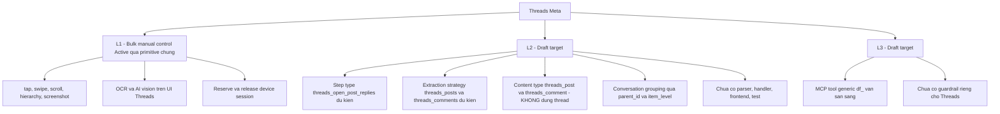
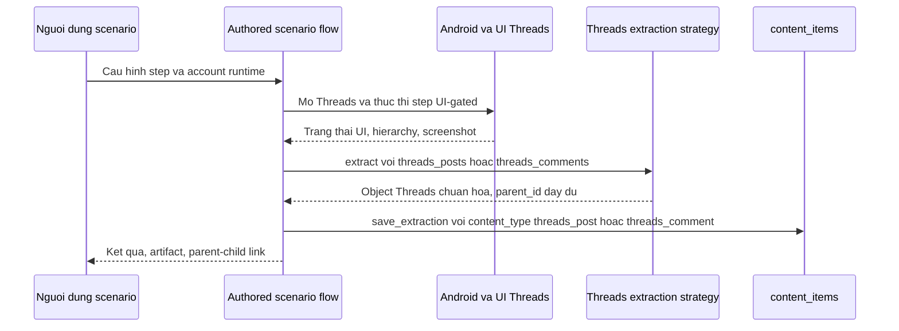

# Hồ sơ Platform — Threads (Meta)

> **Mã tài liệu:** DF-PLATFORM-03
> **Platform:** Threads (Meta)
> **Phiên bản:** 1.0
> **Cập nhật lần cuối:** 2026-05-25
> **Trạng thái:** Draft target
> **Coverage mục tiêu:** L1 + L2 (core); L3 (preview, không bắt buộc cho trạng thái Active)
> **Coverage hiện tại:** L1 khả dụng qua primitive chung (core); L2 chưa active (core, mục tiêu kế tiếp); L3 Draft target (preview, không bắt buộc cho trạng thái Active)
> **Đối tượng đọc:** Team Device Farm
> **Tài liệu liên quan:** [Product Overview](../01-product-overview.md), [Capability Matrix](../03-capability-matrix.md), [Social Platform Extensions](../modules/08-social-platform-extensions.md)

## 1. Tóm tắt

Threads (Meta) hiện ở trạng thái **Draft target** trên Device Farm. Team đã định nghĩa contract dự kiến cho content type, extraction strategy, và action step, đặt mục tiêu chuyển Threads lên L2 Active rồi tới L3 Active theo cùng pattern Facebook. Tuy nhiên ở phiên bản hiện tại, parser, handler, frontend support, test, và guardrail platform-specific đều chưa được implement. Một lưu ý đặc biệt quan trọng xuyên suốt hồ sơ này: **không** dùng từ `thread` làm content type generic vì sẽ gây nhầm lẫn với khái niệm "conversation thread" trong các sản phẩm chat. Toàn bộ content type và strategy sẽ qualified theo platform bằng prefix `threads_` — cụ thể là `threads_post` và `threads_comment`. Conversation grouping (gom các comment thuộc cùng một chuỗi thảo luận) được biểu diễn qua parent-child link và raw metadata, không qua một content type riêng tên `thread`.

## 2. Mục tiêu sản phẩm

Hỗ trợ Threads (Meta) trên Device Farm hướng tới việc cho phép dựng scenario tự động hóa thao tác Threads trên thiết bị Android thật, thu thập dữ liệu post và reply, và biểu diễn quan hệ thảo luận đúng cấu trúc mà không nhầm với khái niệm conversation thread generic của các sản phẩm khác. Khi đạt L2 Active, team sẽ dùng cùng một bộ công cụ scenario builder, campaign dispatcher, content collection, và observability cho Threads như cho Facebook.

Ở khía cạnh nghiệp vụ, hỗ trợ Threads phục vụ các use case: thu thập dữ liệu post theo creator hoặc theo topic, theo dõi chuỗi reply dưới các post viral, và monitoring brand mention trên Threads. Vì Threads là sản phẩm Meta cùng hệ với Instagram và Facebook, một số pilot có nhu cầu cross-platform analytics — yêu cầu này nằm trong roadmap dài hạn của Device Farm.

## 3. Phạm vi dữ liệu hỗ trợ (proposed)

Khi Threads đạt L2 Active, phạm vi dữ liệu được hỗ trợ chính thức sẽ bao gồm hai content type platform-qualified:

- **`threads_post`** — post trên Threads, bao gồm các trường nghiệp vụ chung: tác giả và id tác giả, nội dung văn bản, URL/permalink post, các counter tương tác (lượt thích, reply, repost, quote), URL media đính kèm nếu có, ngày đăng. Các trường platform-specific như quote-post chain, repost source, hoặc metadata riêng của Threads sẽ được lưu vào `raw_data` (trường JSON dự phòng).
- **`threads_comment`** — reply dưới một post Threads, có quan hệ cha-con qua `parent_id` (id của post hoặc reply cha) và `item_level` (cấp bậc reply). Quan hệ này dùng cho cả reply trực tiếp và sub-reply.

**Lưu ý đặc biệt về naming** — đây là điểm khác biệt cốt lõi của hồ sơ này: **CẤM tuyệt đối việc dùng `thread` làm content type generic**. Lý do nghiệp vụ:

- Từ "thread" trong ngữ cảnh phần mềm thường gợi tới "conversation thread" của Slack, Discord, hay email — một khái niệm hoàn toàn khác với "Threads" là tên platform Meta
- Nếu content type là `thread`, query và báo cáo sẽ rất khó đọc và dễ dẫn tới hiểu nhầm khi cross-reference với platform khác
- Khi Device Farm trong tương lai hỗ trợ conversation grouping ở mức model riêng (chưa có ở Draft hiện tại), khái niệm `thread` cần được dành cho mô hình đó

Vì vậy, content type Threads là `threads_post`, không phải `thread`. Conversation grouping (gom các comment thuộc cùng chuỗi thảo luận) được biểu diễn qua `parent_id` và `item_level` trong content_items, hoặc qua raw metadata trong `raw_data` nếu cần thêm context, cho tới khi có mô hình conversation chuyên biệt.

## 4. Coverage hiện tại theo L1/L2/L3

L1 và L2 là core coverage levels cho Threads trên Device Farm. L3 (MCP agent tools) là phần mở rộng preview, không bắt buộc cho trạng thái Active của platform này. Phần dưới đây mô tả tình trạng nghiên cứu hiện tại của L3 song song với core L1/L2.

Sơ đồ dưới minh họa trạng thái coverage hiện tại của Threads ở cả ba cấp:

Ở cấp **L1**, điều khiển app Threads trên Android giống mọi app khác — mở app, scroll feed, tap vào post, mở reply panel, đọc hierarchy, chụp screenshot. Các extraction generic (`screen_data`, OCR, AI vision) hoạt động trên screenshot Threads bình thường.

Ở cấp **L2 (Draft target)**, các artifact platform-specific cho Threads hiện chưa có: chưa có parser, chưa có handler, chưa có frontend node, chưa có test, chưa có template reference. Tên `threads_posts`, `threads_comments`, `threads_open_post_replies` xuất hiện trong contract chỉ là intent.

Ở cấp **L3 (Draft target)**, các MCP tool generic vẫn sẵn sàng, nhưng không có guardrail riêng cho Threads — chưa có rule action cap, chưa có handoff condition, chưa có evidence requirement chuyên biệt.

## 5. L2 — Scenario automation (proposed)

Khi Threads đạt L2 Active, luồng thực thi sẽ tuân theo pattern Facebook chuẩn. Sơ đồ dưới minh họa luồng dự kiến:

Bảng đặc tả nghiệp vụ các năng lực L2 dự kiến cho Threads:

| Năng lực | Tên canonical đề xuất | Tên legacy | Output nghiệp vụ |
|---|---|---|---|
| Trích xuất Threads post | `extract` với strategy `threads_posts` | Chưa có | Object runtime `posts`, lưu thành content item `threads_post` |
| Trích xuất Threads reply/comment | `extract` với strategy `threads_comments` | Chưa có | Object runtime `comments` có parent_id và item_level, lưu thành content item `threads_comment` |
| Mở context reply của một post | `threads_open_post_replies` | Chưa có | Đưa UI vào trạng thái reply-list để bước extract tiếp theo có ngữ cảnh đúng |

Mọi cơ chế recovery từ biến thể UI Threads phải được người dựng kịch bản khai báo tường minh qua branch, retry, loop, hoặc scenario error policy.

Về **biểu diễn conversation grouping**: khi crawl một post và toàn bộ chuỗi reply, mỗi `threads_comment` sẽ có `parent_id` trỏ về `threads_post` cha (cho reply cấp 1) hoặc về `threads_comment` cha (cho sub-reply). Trường `item_level` ghi cấp bậc trong cây thảo luận. Khi cần phân tích conversation, truy vấn theo `parent_id` và reconstruct cây từ content_items — không cần một content type riêng tên `thread` hoặc `conversation`.

## 6. L3 — MCP agent tools (Preview)

> **Lưu ý:** Mục này mô tả phần mở rộng đang được nghiên cứu. Khi đánh giá Device Farm cho use case core không cần đọc mục này. Trạng thái Active của Threads trên Device Farm sẽ được xác định khi đạt L2 — không phụ thuộc vào L3.

Ở thời điểm hiện tại, L3 cho Threads **chưa có guardrail platform-specific**. Khi triển khai, contract đòi hỏi các hạng mục sau phải được khai báo trước khi tuyên bố L3 Active cho Threads:

- **Allowed action cap** — giới hạn số action (post, reply, like, follow) AI agent được phép thực hiện trên Threads mỗi đơn vị thời gian
- **Captcha và verification handling** — quy ước handoff về người vận hành khi gặp challenge của Meta
- **Evidence requirement** — bằng chứng phải thu trước và sau mỗi action AI thực hiện
- **Account safety policy chia sẻ với hệ Meta** — vì Threads dùng cùng tài khoản Meta như Instagram (và một phần liên kết với Facebook), guardrail cần cân nhắc rủi ro cross-platform impact khi một account bị flag

Trước khi guardrail hoàn thiện, AI Ops Supervisor có thể vận hành AI agent trên Threads bằng MCP tool generic nhưng phải tự giám sát thủ công.

## 7. Account & Session requirement

Scenario Threads có thể sử dụng các giá trị account từ scenario config, device context, account group/resource reference, hoặc runtime input user-authored. **Scenario author own intent — Device Farm KHÔNG suy diễn fallback account Threads**. Khi scenario thiếu account mà workflow đòi hỏi login, runtime sẽ báo lỗi cấu hình rõ ràng.

**Quan hệ Meta cần lưu ý đặc biệt**: account/credentials trên Threads có thể chia sẻ với Facebook và/hoặc Instagram trong một số trường hợp vì cùng hệ sinh thái Meta. Tuy nhiên, **Device Farm KHÔNG mặc định coi một account là dùng được trên cả ba platform**. Scenario phải khai báo rõ ràng account nào dùng cho platform nào. Nguyên nhân nghiệp vụ:

- Một account Meta có thể đã đăng ký Threads nhưng chưa kích hoạt session trên app Threads trên device đó
- Account safety policy (rate limit, anti-abuse) có thể khác giữa các platform Meta — một action vô hại trên Facebook có thể trigger flag trên Threads hoặc Instagram
- Workflow cross-platform Meta phức tạp hơn workflow đơn-platform và cần được người dựng kịch bản khai báo chủ động, không suy diễn

Về **session lifetime**, scenario Threads chạy trong device session reserved cho scenario đó. Khi scenario kết thúc, session được release.

## 8. Cấu hình (Config contract) — proposed

Khi Threads đạt Active, cấu hình scenario sẽ tổ chức theo các nhóm key nghiệp vụ:

- **Platform identity** — platform mục tiêu (`threads`), package name app Threads trên Android, locale hiển thị
- **Account runtime config** — id account, username, id account group nếu dùng rotation, login input nếu workflow tự xử lý login; nếu account chia sẻ với Facebook hoặc Instagram, phải khai báo tường minh
- **Target inputs** — id account creator cần crawl, URL post cụ thể, hashtag hoặc topic mục tiêu, giới hạn scroll feed
- **Extraction config** — id collection lưu kết quả, số lượng item tối đa, dedupe field (vd `post_id` cho post, `comment_id` cho reply), biến tham chiếu parent post id khi crawl reply
- **Error policy** — cấu hình mức step cho `retry`, `ignore_error`, `on_error`

Cấu hình vẫn là free-form JSON hợp lệ. Typed schema chưa bắt buộc.

## 9. Tiêu chí hoàn thiện (Completion criteria)

Một platform được coi là **Active** trên Device Farm khi đạt L2 với đầy đủ artifact L2. L3 không nằm trong tiêu chí Active — L3 là phần mở rộng preview, theo dõi riêng cho hướng nghiên cứu AI agent.

Threads sẽ được coi là Active khi đạt L2 với đầy đủ checklist sau:

- Extract post sinh ra content item `threads_post` (KHÔNG dùng `thread` generic) với traceability đầy đủ
- Extract reply/comment sinh ra content item `threads_comment` có `parent_id` và `item_level` đúng cấu trúc thảo luận
- Bước điều hướng reply của post (`threads_open_post_replies`) được biểu diễn dưới dạng scenario step có handler
- Parser Threads hoàn thiện và được kiểm thử trên các biến thể UI phổ biến
- Frontend flow editor có node Threads cho người dựng kéo thả
- Test ở các tầng schema, executor, parser, persistence đầy đủ
- Có ít nhất một campaign reference chạy thành công ở quy mô có ý nghĩa
- Capability matrix và roadmap được cập nhật cùng release
- Doc và template chính thức tuân thủ quy tắc "không dùng `thread` generic"

Phần L3 (preview) cho Threads được theo dõi riêng cho hướng nghiên cứu AI agent — không phải tiêu chí đánh giá trạng thái Active của platform. Guardrail liệt kê ở phần 6, bao gồm policy chia sẻ account với Facebook và Instagram, sẽ được hoàn thiện sau khi L2 đạt Active.

## 10. Giới hạn, rủi ro và lộ trình

Các giới hạn và rủi ro được nêu minh bạch để đánh giá đúng:

**Gap nghiệp vụ là rất lớn — chưa có parser, schema, handler, frontend support, test, hay L3 guardrail.** Trong giai đoạn chờ L2, dùng L1 generic.

**Rủi ro confusion với khái niệm conversation thread.** Đây là rủi ro nghiệp vụ trực tiếp ảnh hưởng tới query, báo cáo, và hiểu nhầm giữa các đội. Team cam kết enforce quy tắc "không dùng `thread` generic" trong code review, template, và doc. Khi mở rộng sang conversation grouping mức model riêng trong tương lai, sẽ cần đặt tên khác (vd `conversation`, `discussion_thread`) chứ không tái sử dụng `thread`.

**Rủi ro account safety hệ Meta.** Vì Threads dùng chung hệ thống Meta, một AI agent thao tác sai có thể impact account trên Instagram và Facebook. Khuyến cáo không bật L3 cho Threads trên account production cho tới khi guardrail hệ Meta hoàn thiện và được tài liệu hóa rõ ràng.

**Rủi ro UI Threads còn đang phát triển.** Threads ra mắt tương đối muộn so với Instagram và Facebook; Meta vẫn cập nhật UI thường xuyên. Khi đẩy lên L2 Active, engineering cần lựa chọn selector và parser robust qua nhiều phiên bản.

**Lộ trình ước tính.** Chuyển Threads từ Draft target sang L2 Active mất khoảng 2-4 tuần engineering. Lộ trình ưu tiên giữa TikTok, Threads, Instagram phụ thuộc vào nhu cầu pilot — team quyết định theo từng quý. Đạt L3 Active đi sau L2 Active và cần thêm thời gian để khai báo guardrail hệ Meta.
