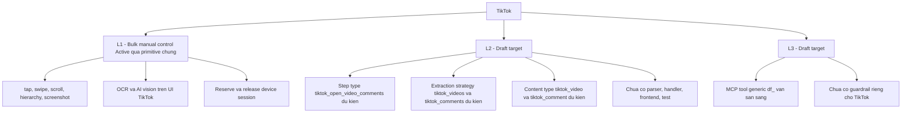

# Hồ sơ Platform — TikTok

> **Mã tài liệu:** DF-PLATFORM-02
> **Platform:** TikTok
> **Phiên bản:** 1.0
> **Cập nhật lần cuối:** 2026-05-25
> **Trạng thái:** Draft target
> **Coverage mục tiêu:** L1 + L2 (core); L3 (preview, không bắt buộc cho trạng thái Active)
> **Coverage hiện tại:** L1 khả dụng qua primitive chung (core); L2 chưa active (core, mục tiêu kế tiếp); L3 Draft target (preview, không bắt buộc cho trạng thái Active)
> **Đối tượng đọc:** Team Device Farm
> **Tài liệu liên quan:** [Product Overview](../01-product-overview.md), [Capability Matrix](../03-capability-matrix.md), [Social Platform Extensions](../modules/08-social-platform-extensions.md)

## 1. Tóm tắt

TikTok hiện ở trạng thái **Draft target** trên Device Farm. Team đã định nghĩa contract dự kiến (tên content type, extraction strategy, action step) và đặt mục tiêu chuyển dần TikTok lên L2 Active rồi tới L3 Active theo cùng pattern mà Facebook đã đi qua. Tuy nhiên ở phiên bản hiện tại, parser, handler, frontend flow editor support, test, và guardrail platform-specific cho TikTok đều chưa được implement. Use case dùng Device Farm trên TikTok vẫn có thể chạy ở mức L1 thông qua các primitive chung (gesture, hierarchy, screenshot, OCR, AI vision) — nhưng không nên kỳ vọng các step và strategy mang tiền tố `tiktok_` chạy được như mô tả trong contract. Thời gian ước tính để chuyển TikTok sang L2 Active là khoảng 2-4 tuần engineering.

## 2. Mục tiêu sản phẩm

Hỗ trợ TikTok trên Device Farm hướng tới việc cho phép dựng scenario tự động hóa thao tác TikTok trên thiết bị Android thật, thu thập dữ liệu video và comment, và phục hồi từ các biến thể UI dự kiến của TikTok qua authored scenario flow (luồng kịch bản tường minh). Khi đạt L2 Active, team sẽ dùng cùng một bộ công cụ scenario builder, campaign dispatcher, content collection, và observability cho TikTok như cho Facebook — không cần học một engine riêng cho TikTok.

Ở khía cạnh nghiệp vụ, hỗ trợ TikTok phục vụ các use case: thu thập dữ liệu video theo hashtag hoặc theo account creator để phục vụ market research, theo dõi comment chain dưới video viral, và monitoring nội dung trên các profile mục tiêu. Đây là các use case được pilot đề xuất; team đưa vào contract và đặt làm Draft target.

## 3. Phạm vi dữ liệu hỗ trợ (proposed)

Khi TikTok đạt L2 Active, phạm vi dữ liệu được hỗ trợ chính thức sẽ bao gồm hai content type platform-qualified:

- **`tiktok_video`** — video hoặc post trên TikTok, bao gồm các trường nghiệp vụ chung: tác giả và id tác giả, mô tả/caption, URL video, các counter tương tác (lượt xem, like, comment, share), URL media, ngày đăng. Các trường platform-specific như music id, sound track, hashtag list, hoặc các metadata riêng của TikTok sẽ được lưu vào `raw_data` (trường JSON dự phòng) khi không map vào cột content_items chuẩn.
- **`tiktok_comment`** — comment dưới một video, có quan hệ cha-con qua `parent_id` và `item_level` tương tự pattern Facebook. Comment cha trỏ về `tiktok_video`, reply trỏ về comment cấp 1, v.v.

Toàn bộ content item sẽ có traceability đầy đủ tới device, scenario, campaign, execution, và collection — đây là yêu cầu cứng của contract Social Platform Extensions, không thay đổi giữa các platform.

## 4. Coverage hiện tại theo L1/L2/L3

L1 và L2 là core coverage levels cho TikTok trên Device Farm. L3 (MCP agent tools) là phần mở rộng preview, không bắt buộc cho trạng thái Active của platform này. Phần dưới đây mô tả tình trạng nghiên cứu hiện tại của L3 song song với core L1/L2.

Sơ đồ dưới minh họa trạng thái coverage hiện tại của TikTok ở cả ba cấp:

Ở cấp **L1**, điều khiển ứng dụng TikTok trên Android giống như mọi app khác — mở app, scroll feed, tap vào video, swipe để chuyển video, mở comment panel, đọc UI hierarchy, chụp screenshot. Các extraction generic như `screen_data`, OCR, và AI vision (qua tích hợp OpenAI hoặc Gemini) hoạt động trên screenshot TikTok bình thường. Đây là con đường khả dụng ngay hôm nay khi cần thu thập dữ liệu TikTok ở quy mô nhỏ hoặc trong giai đoạn pilot.

Ở cấp **L2 (Draft target)**, các artifact platform-specific cho TikTok hiện chưa có. Cụ thể: chưa có parser implementation, chưa có scenario step handler riêng, chưa có frontend flow editor node TikTok, chưa có test ở các tầng schema/executor/parser/persistence, chưa có scenario template reference. Tên `tiktok_videos`, `tiktok_comments`, `tiktok_open_video_comments` xuất hiện trong contract chỉ là intent — chưa chạy được ở runtime.

Ở cấp **L3 (Draft target)**, các MCP tool generic `df_*` đã sẵn sàng và AI agent có thể thao tác device chạy TikTok qua các tool generic này. Tuy nhiên không có guardrail riêng cho TikTok: không có rule giới hạn action, không có quy ước handoff khi gặp captcha hoặc rate limit từ TikTok, không có evidence requirement chuyên biệt. Khi TikTok L2 hoàn thiện và bắt đầu khai báo guardrail, L3 sẽ chuyển từ Draft target lên Foundation rồi Active.

## 5. L2 — Scenario automation (proposed)

Khi TikTok đạt L2 Active, sơ đồ luồng thực thi sẽ theo đúng pattern Facebook. Người dựng cấu hình scenario; executor chạy step UI-gated trên app TikTok; extraction strategy gọi parser khi đến step `extract`; kết quả lưu vào content_items với content type platform-qualified `tiktok_video` hoặc `tiktok_comment`. Không có TikTok runner riêng — mọi hành vi platform-specific là dữ liệu đầu vào của scenario executor chuẩn.

Bảng đặc tả nghiệp vụ các năng lực L2 dự kiến cho TikTok:

| Năng lực | Tên canonical đề xuất | Tên legacy | Output nghiệp vụ |
|---|---|---|---|
| Trích xuất TikTok video | `extract` với strategy `tiktok_videos` | Chưa có | Object runtime `videos`, lưu thành content item `tiktok_video` |
| Trích xuất TikTok comment | `extract` với strategy `tiktok_comments` | Chưa có | Object runtime `comments` có parent_id và item_level, lưu thành content item `tiktok_comment` |
| Mở context comment của một video | `tiktok_open_video_comments` | Chưa có | Đưa UI vào trạng thái comment-list để bước extract tiếp theo có ngữ cảnh đúng |

Mọi cơ chế recovery từ biến thể UI TikTok (UI thay đổi giữa các phiên bản app, hoặc UI khác giữa locale) phải được người dựng kịch bản khai báo tường minh qua branch, retry, loop, hoặc scenario error policy. Device Farm không tự suy diễn nhánh phục hồi — đây là quyết định thiết kế xuyên suốt sản phẩm, áp dụng đồng đều cho mọi platform.

Về **naming convention**, các tên dự kiến cho TikTok đều tuân theo pattern canonical `<platform>_<verb>_<object>` cho action step và `<platform>_<data_object>` cho extraction strategy. Vì TikTok chưa có code legacy, sẽ không có legacy alias đi kèm — khác với Facebook nơi tồn tại `tap_fb_comment_button` trong code production. Đây là lợi thế nhỏ: implementation cho TikTok có thể bắt đầu trực tiếp với canonical naming, không phải chuyển đổi.

## 6. L3 — MCP agent tools (Preview)

> **Lưu ý:** Mục này mô tả phần mở rộng đang được nghiên cứu. Khi đánh giá Device Farm cho use case core không cần đọc mục này. Trạng thái Active của TikTok trên Device Farm sẽ được xác định khi đạt L2 — không phụ thuộc vào L3.

Ở thời điểm hiện tại, L3 cho TikTok **chưa có guardrail platform-specific**. Khi triển khai, contract đòi hỏi các hạng mục sau phải được khai báo trước khi tuyên bố L3 Active cho TikTok:

- **Allowed action cap** — giới hạn số action mỗi phút và mỗi giờ AI agent được phép thực hiện trên TikTok (follow, like, comment) để tránh trigger anti-abuse của platform
- **Captcha handling rule** — quy ước khi AI agent gặp captcha hoặc verification challenge của TikTok thì phải handoff về người vận hành, không tự thử resolve
- **Evidence requirement** — danh sách bằng chứng phải thu trước và sau mỗi loại action (screenshot, hierarchy snapshot) cho mục đích audit
- **Account safety policy** — quy ước bảo vệ account TikTok khỏi shadowban hoặc lockdown

Trước khi các hạng mục này hoàn thiện, AI Ops Supervisor có thể vận hành AI agent trên TikTok bằng các MCP tool generic, nhưng phải tự giám sát thủ công và áp dụng kỷ luật vận hành riêng.

## 7. Account & Session requirement

Scenario TikTok có thể sử dụng các giá trị account từ scenario config, device context, account group/resource reference, hoặc các runtime input user-authored khác. **Scenario author own intent — Device Farm KHÔNG suy diễn fallback account TikTok**. Khi scenario thiếu account mà workflow đòi hỏi login, runtime sẽ báo lỗi cấu hình rõ ràng; hệ thống không tự chọn account thay người dựng. Pattern này đồng nhất với Facebook và sẽ áp dụng cho mọi platform khác.

Về **session lifetime**, scenario TikTok chạy trong device session reserved cho scenario đó. Khi scenario kết thúc, session được release. Workflow chuỗi nhiều scenario chia sẻ context có thể dùng nested scenario.

Về **proxy**, TikTok đặc biệt nhạy cảm với rate limit theo IP — khi đẩy lên Active, team khuyến nghị bổ sung hướng dẫn cấu hình proxy theo account hoặc theo device, tham chiếu vào account runtime config. Hiện tại chưa có chính sách cứng về proxy ở Device Farm core.

## 8. Cấu hình (Config contract) — proposed

Khi TikTok đạt Active, cấu hình scenario sẽ tổ chức theo các nhóm key nghiệp vụ tương tự Facebook:

- **Platform identity** — platform mục tiêu (`tiktok`), package name app TikTok, locale hiển thị
- **Account runtime config** — id account, username, id account group nếu dùng rotation, login input nếu workflow tự xử lý login
- **Target inputs** — hashtag mục tiêu, id account creator cần crawl, URL video cụ thể, giới hạn scroll feed
- **Extraction config** — id collection lưu kết quả, số lượng item tối đa, dedupe field (vd `video_id` cho video, `comment_id` cho comment), biến tham chiếu parent video id khi crawl comment
- **Error policy** — cấu hình mức step cho `retry`, `ignore_error`, `on_error`

Cấu hình vẫn là free-form JSON hợp lệ. Typed schema cho từng key chưa bắt buộc.

## 9. Tiêu chí hoàn thiện (Completion criteria)

Một platform được coi là **Active** trên Device Farm khi đạt L2 với đầy đủ artifact L2. L3 không nằm trong tiêu chí Active — L3 là phần mở rộng preview, theo dõi riêng cho hướng nghiên cứu AI agent.

TikTok sẽ được coi là Active khi đạt L2 với đầy đủ checklist sau (đồng nhất với pattern Facebook đã đi qua):

- Extract video sinh ra content item `tiktok_video` với traceability đầy đủ tới device, scenario, campaign, execution, collection
- Extract comment sinh ra content item `tiktok_comment` có `parent_id` và `item_level` đúng cấu trúc thảo luận
- Bước điều hướng comment của video (`tiktok_open_video_comments`) được biểu diễn dưới dạng scenario step có handler implementation
- Parser TikTok hoàn thiện và được kiểm thử trên các biến thể UI phổ biến
- Frontend flow editor có node TikTok cho phép người dựng kéo thả
- Test ở các tầng schema, executor, parser, persistence đầy đủ
- Có ít nhất một campaign reference chạy thành công ở quy mô có ý nghĩa nghiệp vụ
- Capability matrix và roadmap được cập nhật cùng release

Phần L3 (preview) cho TikTok được theo dõi riêng cho hướng nghiên cứu AI agent — không phải tiêu chí đánh giá trạng thái Active của platform. Các hạng mục guardrail liệt kê ở phần 6 sẽ được hoàn thiện sau khi L2 đạt Active.

## 10. Giới hạn, rủi ro và lộ trình

Các giới hạn hiện tại được nêu minh bạch để đánh giá đúng trước khi cam kết workflow lớn trên TikTok:

**Gap nghiệp vụ là rất lớn — không có parser, schema, handler, frontend support, test, hay L3 guardrail.** Mọi thứ ngoài primitive L1 generic đều phải implement từ đầu. Use case workflow tự động hóa hoặc thu thập dữ liệu chuyên biệt trên TikTok cần đưa vào roadmap, hoặc tận dụng L1 trong giai đoạn chờ.

**L1 generic là path khả dụng ngay.** Trong giai đoạn chờ L2 hoàn thiện, có thể dùng các step generic `tap`, `tap_selector`, `swipe`, `scroll`, `extract` với strategy `screen_data`, OCR, hoặc AI vision trên screenshot TikTok. Hiệu quả thấp hơn parser chuyên biệt nhưng đủ cho pilot và proof-of-concept.

**Rủi ro UI biến đổi nhanh.** TikTok cập nhật app khá thường xuyên và có nhiều biến thể UI theo locale. Khi đẩy lên L2 Active, engineering sẽ phải xác định một bộ selector và parser robust qua các phiên bản. Đây là rủi ro nghiệp vụ thực sự — nó ảnh hưởng tới chi phí maintenance của hồ sơ này sau khi đạt Active.

**Rủi ro account safety.** TikTok có hệ thống anti-abuse khá mạnh; AI agent vận hành ở L3 mà không có guardrail có thể vô tình gây shadowban hoặc lock account. Khuyến cáo không bật L3 cho TikTok trên account production cho tới khi guardrail hoàn thiện.

**Lộ trình ước tính.** Chuyển TikTok từ Draft target sang L2 Active mất khoảng 2-4 tuần engineering, tùy độ phức tạp UI và mức độ ưu tiên trong roadmap quý. Khi đẩy L2 lên Active, team sẽ cập nhật capability matrix, hồ sơ này, và phát hành release note. Việc đạt L3 Active đi sau L2 Active và phụ thuộc vào hoàn thiện bộ guardrail platform-specific.
