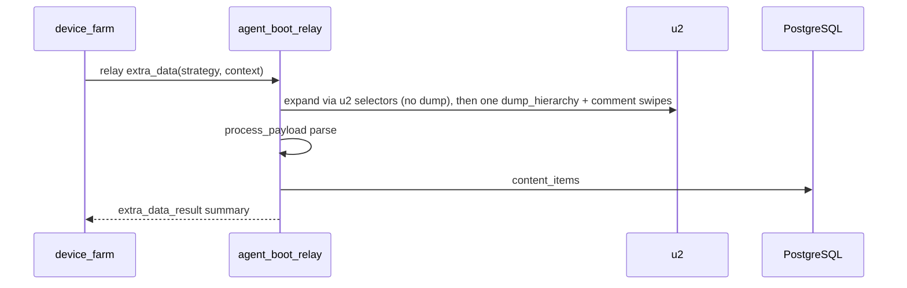

# Edge Extra Data Runbook

## PA B (relay-only) — recommended

Edge extract runs entirely on **agent-boot** via relay. No APK WebSocket (`/device-agent`) and no phone HTTP POST to `:8765` on the hot path.



### agent-boot

```bash
RELAY_MODE=grpc
RELAY_SERVER=localhost:50051
RELAY_API_KEY=...
RELAY_ENROLLMENT_TOKEN=...

U2_BATCH_ENABLED=true
AGENT_BOOT_CONTENT_DB_ENABLED=1
AGENT_BOOT_CONTENT_DATABASE_URL=postgresql://...@localhost:5432/device_farm
AGENT_BOOT_CONTENT_DB_POOL_SIZE=2

# Optional: HTTP ingest for debugging only (not used by PA B relay path)
# AGENT_BOOT_EXTRA_ENABLED=1
# AGENT_BOOT_EXTRA_PORT=8765
```

`DEVICE_FARM_WS` is **not** required for edge extract (still optional for other APK control features).

### device_farm

```bash
EDGE_EXTRA_DATA_ENABLED=1
EDGE_EXTRA_RELAY_ENABLED=1
EDGE_EXTRA_TIMEOUT_S=90
```

Scenario step (no `edge_extra_agent_url` / token needed):

```json
{
  "type": "extract",
  "strategy": "ig_posts",
  "collection": "my_collection",
  "edge_extra_data": true,
  "dedupe_field": "post_key"
}
```

### Success checklist

1. Relay agent **online**; device serial appears in relay registry.
2. u2/atx-agent healthy on the phone (same as scrcpy control).
3. Scenario step logs: `edge_extra route=relay_u2` (device_farm).
4. Step result: `parsed=N inserted=M` without `no_agent` / `no_relay`.
5. Rows in `content_items`; Content UI shows new items.
6. Control UI hierarchy (`GET /hierarchy`) still works via relay u2 — independent of extract.

### Failure codes

| Error | Meaning |
|-------|---------|
| `no_relay` | No relay mapping for device — start agent-boot, register device |
| `no_relay_manager` | device_farm relay manager not initialized |
| `u2_hierarchy_unavailable` | u2 dump failed on agent-boot |
| `extra_data_not_configured` | `AGENT_BOOT_CONTENT_DB_ENABLED` off or ingest not injected |
| `u2_batch_not_enabled` | Set `U2_BATCH_ENABLED=true` on agent-boot |

---

## Legacy HTTP/APK path (deprecated for extract)

The previous flow required phone → HTTP `:8765` and APK WS `extra_data_xml`. PA B replaces it for scenario extract. HTTP ingest may remain enabled for ad-hoc debugging:

```bash
AGENT_BOOT_EXTRA_ENABLED=1
AGENT_BOOT_EXTRA_TOKEN=<shared-secret>
```

---

## Observability

Summary fields: `parsed_count`, `inserted_attempted`, `inserted_count`, `duplicate_count`, `xml_bytes`, `xml_sha256`, `parse_ms`, `db_ms`, `elapsed_ms`, `diagnostic.reason_code`.

Still missing before broad rollout: staging p95 measurements, DB-role security checks, cross-tenant dedupe integration tests, and explicit metric export for queue depth/rejections.
