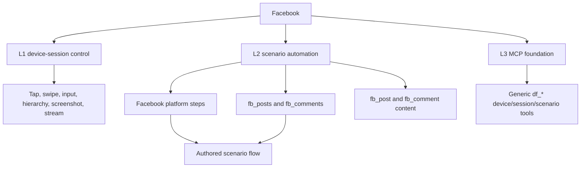
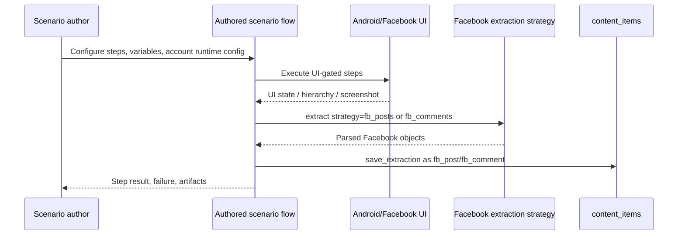

# Facebook Platform Profile

Status: active
Last audited: 2026-05-19
Current coverage: L2 scenario automation
Target coverage: L3 MCP agent tools

## Product Goal

Facebook support enables users to author scenarios that operate Facebook on real
Android devices, collect post/comment data, and debug failures through normal
scenario execution evidence.

Facebook automation is not a separate runner. It is expressed through scenario
steps/nodes, extraction strategies, scenario config, device context, and explicit
scenario error policy.

## Coverage Summary

| Level | Status | Notes |
|---|---|---|
| L1 Independent device-session control | Supported by generic device primitives | Facebook uses the same device/session control surface as other apps |
| L2 Scenario automation | Active | Current platform-specific behavior exists for post/comment extraction and comment navigation |
| L3 MCP agent tools | Foundation only | Generic MCP tools can operate a device/session, but Facebook-specific agent guardrails are not fully profiled |

## Supported Data Scope

Initial supported Facebook data objects:

| Data object | Platform-qualified `content_type` | Extraction strategy |
|---|---|---|
| Feed/group post | `fb_post` | `fb_posts` |
| Comment | `fb_comment` | `fb_comments` |

Common fields should map to `content_items` columns where possible: body/text,
author, author id, URL/permalink, engagement counters, media URLs, content date,
parent id, item level, device, campaign, execution, and collection.

Facebook-specific parser details, diagnostics, and unmatched fields belong in
`raw_data`.

## L1 Independent Device-Session Control

Facebook L1 workflows use generic Device Farm device controls:

- open Facebook through app launch or URL navigation
- inspect current UI hierarchy and screenshot
- tap, swipe, input text, press keys, and interact by selector
- reserve/release independent device sessions
- stream or screenshot the device for manual supervision

L1 does not imply a separate Facebook console. It is the generic device-session
control surface applied to the Facebook app.

## L2 Scenario Automation

### Scenario Model

Supported platform automation capabilities:

| Capability | Canonical form | Current/legacy form | Output |
|---|---|---|---|
| Extract Facebook posts | `type: "extract", strategy: "fb_posts"` | same | runtime `posts`, saved `fb_post` items |
| Extract Facebook comments | `type: "extract", strategy: "fb_comments"` | same | runtime `comments`, saved `fb_comment` items |
| Tap Facebook comment button | `fb_tap_comment_button` | `tap_fb_comment_button` | opens comment context for downstream comment extraction |

`tap_fb_comment_button` is the current implemented legacy alias shape. New docs
and examples should prefer the platform-prefix action naming model
`fb_tap_comment_button` once the implementation alias exists.

## Authored Flow And Failure Semantics

- Facebook steps follow the authored scenario flow.
- UI actions are UI-gated by default.
- A failed step blocks later steps unless the scenario explicitly defines retry,
  branch, skip, pause, or recovery behavior.
- `ignore_error` and `on_error` are scenario error policy when explicitly set.
- The current `tap_fb_comment_button` implementation has legacy default
  miss-tolerant behavior. New Facebook actions should make non-stop behavior
  explicit through scenario error policy.
- Missing account/login config is a scenario configuration error owned by the
  scenario author. Device Farm should not infer a fallback Facebook account.

## Account And Session Requirements

Facebook scenarios may use account-related values from scenario config, device
context, account group/resource references, or other user-authored runtime
config.

Credential separation is desired hardening, but not required for this product
slice. The scenario author is responsible for providing the login/account inputs
their authored flow needs.

## Config Contract

Config is currently free-form valid JSON. Facebook scenarios should document
their expected keys in examples or templates, but typed schema metadata is not
required yet.

Recommended config categories:

| Category | Examples |
|---|---|
| Platform identity | `platform`, `app_package`, `locale` |
| Account runtime config | `account_id`, `username`, `account_group_id`, login inputs when user-authored |
| Target inputs | group URL/id, search query, post URL, scroll limits |
| Extraction config | collection, max items, dedupe field, parent post id variable |
| Error policy | step-level `retry`, `ignore_error`, `on_error` |

## Completion Criteria

Facebook profile is considered active for L2 when:

- post extraction can produce `fb_post`
- comment extraction can produce `fb_comment`
- comment navigation is representable as a scenario step
- saved content is traceable to device, scenario/campaign/execution, and
  collection
- failures report the failed step and usable UI evidence
- examples use authored scenario flow rather than hidden Facebook runner logic

## Known Gaps

- Canonical `fb_tap_comment_button` alias is not yet implemented; current code
  uses `tap_fb_comment_button`.
- Facebook-specific L3 MCP guardrails are not fully profiled.
- Account/login hardening is intentionally low priority for now.
- Platform-specific typed config schema is not required yet.
