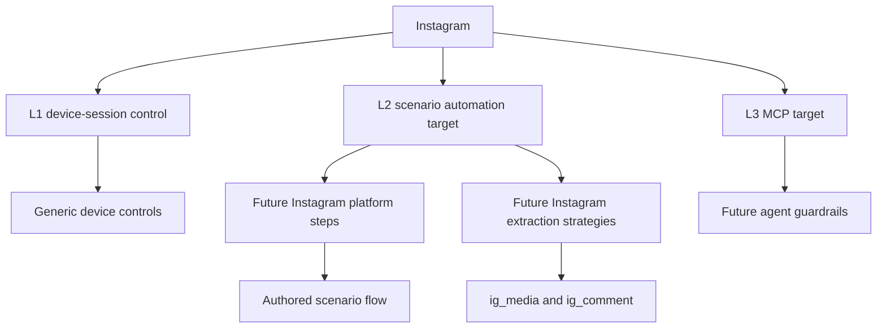

# Instagram Platform Profile

Status: draft
Last audited: 2026-05-19
Current coverage: not active
Target coverage: L2 scenario automation, then L3 MCP agent tools

## Product Goal

Instagram support should let users author scenarios that operate Instagram on
real Android devices, collect media/post/comment data, and model recovery
through explicit scenario branches, retry, loops, or error policy.

This is a draft profile. It defines intended contracts and gaps only; it does
not claim active Instagram implementation support.

## Coverage Summary

| Level | Status | Notes |
|---|---|---|
| L1 Independent device-session control | Available through generic primitives | No Instagram-specific L1 surface yet |
| L2 Scenario automation | Draft target | Needs explicit Instagram steps, extraction strategies, tests, and examples |
| L3 MCP agent tools | Draft target | Needs Instagram-specific guardrails and observations |

## Supported Data Scope

Draft target data objects:

| Data object | Platform-qualified `content_type` | Proposed extraction strategy |
|---|---|---|
| Media/post | `ig_media` | `ig_media` |
| Comment | `ig_comment` | `ig_comments` |
| Profile | `ig_profile` | `ig_profiles` |

Platform-specific parser fields should remain in `raw_data` unless they map
cleanly to common content columns.

## L2 Scenario Automation

Future Instagram automation must be implemented as scenario steps/nodes and
extraction strategies. Do not add a separate Instagram runner.

Candidate capabilities:

| Capability | Proposed canonical form | Output |
|---|---|---|
| Extract media/posts | `type: "extract", strategy: "ig_media"` | runtime media, saved `ig_media` items |
| Extract comments | `type: "extract", strategy: "ig_comments"` | runtime comments, saved `ig_comment` items |
| Open media comments | `ig_open_media_comments` | comment UI context for downstream extraction |
| Open profile | `ig_open_profile` | profile UI context for downstream extraction |

All recovery from UI variants must be authored with branches, retry, loops, or
scenario error policy.

## Account And Session Requirements

Instagram scenarios may use account runtime config through scenario config,
device context, or explicit account resource references. Missing required
login/account inputs are scenario configuration errors discovered by running the
authored scenario.

## Known Gaps

- No active Instagram parser/profile implementation is documented in current
  code.
- No Instagram-specific step schema, handler, frontend editor support, or tests
  are active yet.
- No Instagram-specific L3 MCP guardrails are defined.
