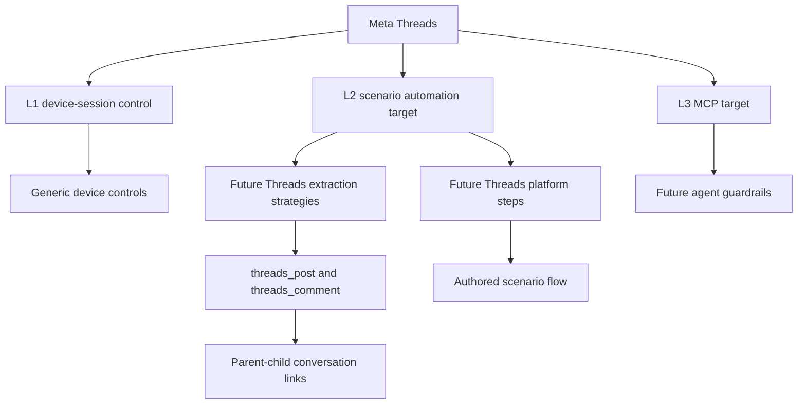

# Threads Platform Profile

Status: draft
Last audited: 2026-05-19
Current coverage: not active
Target coverage: L2 scenario automation, then L3 MCP agent tools

## Product Goal

Threads support should let users author scenarios that operate Meta Threads on
real Android devices, collect post/comment data, and represent conversation
relationships without confusing the Threads platform with generic conversation
threads.

This is a draft profile. It defines intended contracts and gaps only; it does
not claim active Threads implementation support.

## Coverage Summary

| Level | Status | Notes |
|---|---|---|
| L1 Independent device-session control | Available through generic primitives | No Threads-specific L1 surface yet |
| L2 Scenario automation | Draft target | Needs explicit Threads steps, extraction strategies, tests, and examples |
| L3 MCP agent tools | Draft target | Needs Threads-specific guardrails and observations |

## Supported Data Scope

Draft target data objects:

| Data object | Platform-qualified `content_type` | Proposed extraction strategy |
|---|---|---|
| Threads post | `threads_post` | `threads_posts` |
| Comment/reply | `threads_comment` | `threads_comments` |

Do not use `thread` as a generic content object. Conversation grouping should
use parent-child links or raw platform metadata until a dedicated conversation
model is needed.

## L2 Scenario Automation

Future Threads automation must be implemented as scenario steps/nodes and
extraction strategies. Do not add a separate Threads runner.

Candidate capabilities:

| Capability | Proposed canonical form | Output |
|---|---|---|
| Extract posts | `type: "extract", strategy: "threads_posts"` | runtime posts, saved `threads_post` items |
| Extract comments/replies | `type: "extract", strategy: "threads_comments"` | runtime comments, saved `threads_comment` items |
| Open post replies | `threads_open_post_replies` | reply UI context for downstream extraction |

All recovery from UI variants must be authored with branches, retry, loops, or
scenario error policy.

## Account And Session Requirements

Threads scenarios may use account runtime config through scenario config, device
context, or explicit account resource references. Missing required login/account
inputs are scenario configuration errors discovered by running the authored
scenario.

## Known Gaps

- No active Threads parser/profile implementation is documented in current code.
- No Threads-specific step schema, handler, frontend editor support, or tests
  are active yet.
- No Threads-specific L3 MCP guardrails are defined.
