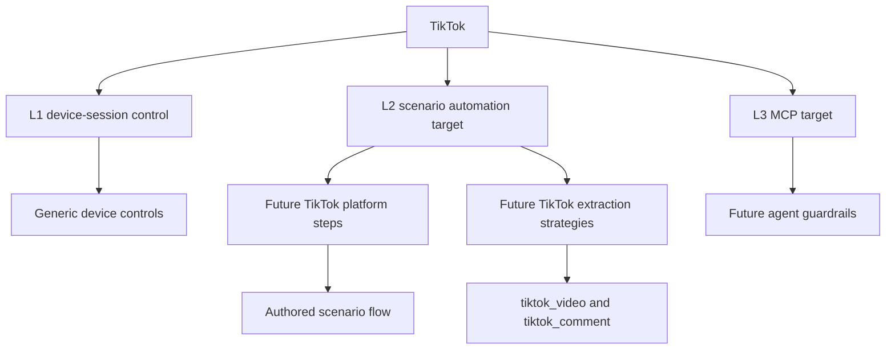

# TikTok Platform Profile

Status: draft
Last audited: 2026-05-19
Current coverage: not active
Target coverage: L2 scenario automation, then L3 MCP agent tools

## Product Goal

TikTok support should let users author scenarios that operate TikTok on real
Android devices, collect video/comment data, and recover from expected UI
variants through authored scenario flow.

This is a draft profile. It defines intended contracts and gaps only; it does
not claim active TikTok implementation support.

## Coverage Summary

| Level | Status | Notes |
|---|---|---|
| L1 Independent device-session control | Available through generic primitives | No TikTok-specific L1 surface yet |
| L2 Scenario automation | Draft target | Needs explicit TikTok steps, extraction strategies, tests, and examples |
| L3 MCP agent tools | Draft target | Needs TikTok-specific guardrails and observations |

## Supported Data Scope

Draft target data objects:

| Data object | Platform-qualified `content_type` | Proposed extraction strategy |
|---|---|---|
| Video/post | `tiktok_video` | `tiktok_videos` |
| Comment | `tiktok_comment` | `tiktok_comments` |

Platform-specific parser fields should remain in `raw_data` unless they map
cleanly to common content columns.

## L2 Scenario Automation

Future TikTok automation must be implemented as scenario steps/nodes and
extraction strategies. Do not add a separate TikTok runner.

Candidate capabilities:

| Capability | Proposed canonical form | Output |
|---|---|---|
| Extract videos | `type: "extract", strategy: "tiktok_videos"` | runtime videos, saved `tiktok_video` items |
| Extract comments | `type: "extract", strategy: "tiktok_comments"` | runtime comments, saved `tiktok_comment` items |
| Open video comments | `tiktok_open_video_comments` | comment UI context for downstream extraction |

All recovery from UI variants must be authored with branches, retry, loops, or
scenario error policy.

## Account And Session Requirements

TikTok scenarios may use account runtime config through scenario config, device
context, or explicit account resource references. Missing required login/account
inputs are scenario configuration errors discovered by running the authored
scenario.

## Known Gaps

- No active TikTok parser/profile implementation is documented in current code.
- No TikTok-specific step schema, handler, frontend editor support, or tests are
  active yet.
- No TikTok-specific L3 MCP guardrails are defined.
