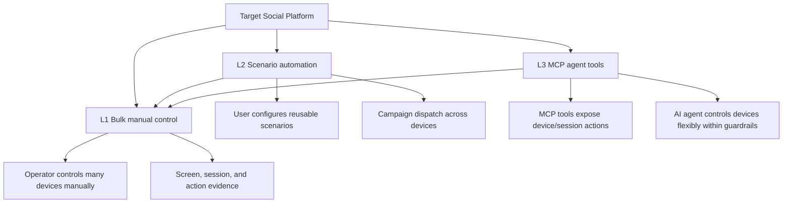
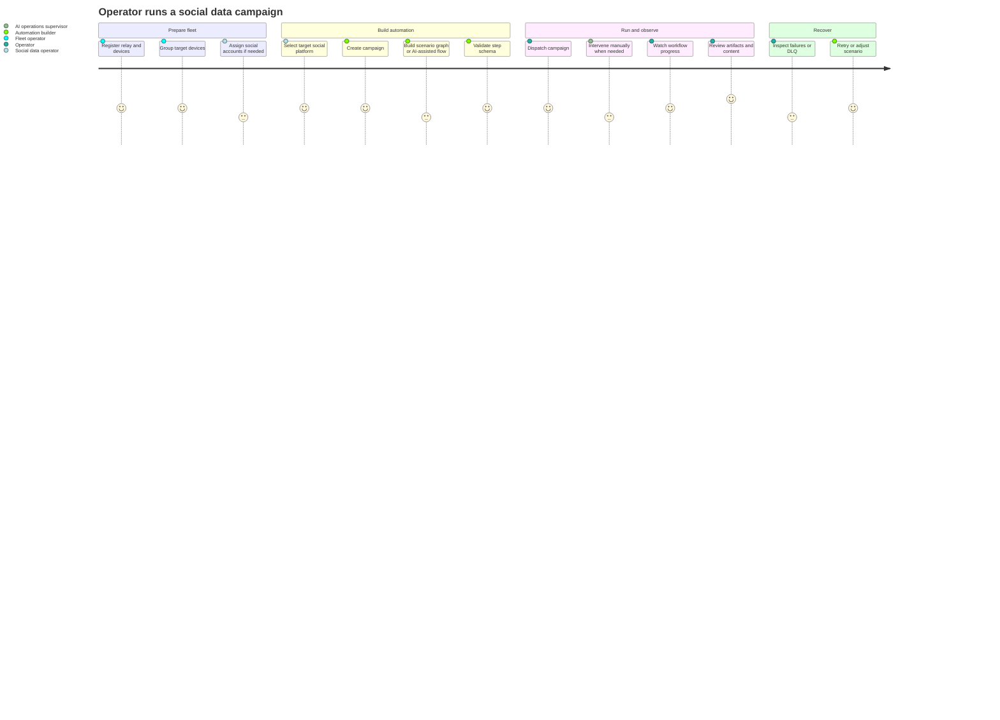
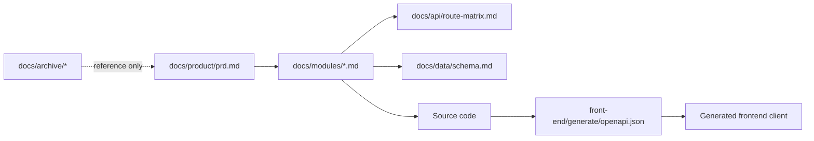

# Device Farm Product Requirements

Status: active
Last audited: 2026-05-19

This is the product-facing source of truth for Device Farm. It defines what the
product is for, who it serves, which capabilities matter, and which outcomes
prove success. Implementation contracts live in `docs/modules/`.

## Product Summary

Device Farm is a social-media automation and data-collection platform built on
top of managed Android devices. Its primary focus is automating and assisting
workflows across popular social platforms such as TikTok, Threads, Facebook,
Instagram, and other mainstream social apps, including large-scale data
collection through automatic, manual, and AI-agent assisted operation.

## Problem

Teams that collect or operate on social media at scale need a way to control
many real Android devices, run repeatable social workflows, supervise manual
interventions, use AI agents for intelligent operation, and extract screen or
content data without manually touching each device. Generic Android automation
and app testing remain possible platform uses, but they are not the current
product focus.

## Product Goals

1. Provide automation methods for social-media-related workflows on real Android devices.
2. Support large-scale social data collection across mainstream social
   platforms, starting with TikTok, Threads, Facebook, and Instagram.
3. Let operators combine automatic execution, manual supervision, and AI-agent
   assisted operation.
4. Let operators build, run, resume, and inspect automation scenarios across many devices.
5. Provide enough observability for operators to understand device, campaign,
   execution, notification, and activity state.
6. Keep documentation structured enough that implementation agents can extend
   modules without relying on archived specs.

## Non-Goals

- Device Farm is not a generic mobile cloud marketplace.
- Device Farm is not a test-case management system.
- Generic app automation and mobile testing are broader platform possibilities,
  but they are secondary to the current social-media automation focus.
- Device Farm is not an external-tool clone of STF, Maestro, Droidrun, or GADS.
  Those archived PRDs are reference material only.
- Device Farm does not treat frontend proxy routes as the backend source of
  truth for API behavior.

## Primary Users

| Persona | Need | Success signal |
|---|---|---|
| Social data operator | Collect social media data at scale across target platforms | Data and evidence are traceable to campaign, device, platform, and account context |
| Automation builder | Create social automation scenarios and campaigns that run across selected devices | Scenario runs are repeatable, debuggable, and visible |
| AI operations supervisor | Use AI-assisted flows while retaining manual override and review | AI actions are observable, bounded, and recoverable |
| Fleet operator | Register, group, monitor, reserve, and recover devices | Devices can be controlled and diagnosed without physical access |
| Platform engineer | Extend modules safely and keep API/data contracts consistent | New modules follow existing boundaries and docs stay in sync with source |

## Capability Map

```mermaid
flowchart TB
    Product[Device Farm] --> Fleet[Device fleet management]
    Product --> Control[Remote control plane]
    Product --> SocialAutomation[Social media automation]
    Product --> SocialData[Social data collection]
    Product --> AIAgent[AI-agent assisted operation]
    Product --> Automation[Campaign and scenario automation]
    Product --> Content[Content extraction and artifacts]
    Product --> Accounts[Account and group rotation]
    Product --> Scheduling[Scheduling]
    Product --> Visibility[Notifications and analytics]
    Product --> Relay[Agent boot and relay]

    SocialAutomation --> Platforms[TikTok, Threads, Facebook, Instagram, ...]
    SocialAutomation --> Manual[Manual supervised actions]
    SocialAutomation --> Auto[Automatic scenario execution]
    SocialData --> Crawl[Large-scale crawl campaigns]
    AIAgent --> Intelligent[Screen-aware intelligent actions]
    Fleet --> DeviceGroups[Device groups]
    Control --> Gestures[Gestures, UI hierarchy, media]
    Automation --> ScenarioGraph[Scenario graph and step schema]
    Automation --> Executions[Executions, workflows, DLQ]
    Content --> OCR[Hierarchy, OCR, AI extraction]
    Content --> Artifacts[Screenshots and execution artifacts]
    Accounts --> AccountGroups[Account groups and assignment]
    Visibility --> Activity[Activity log]
    Visibility --> Notifications[Notification channels]
    Relay --> Channels[ADB, u2, scrcpy, STF]
```

## Current Capability Requirements

### Social Media Automation Direction

- The target platform scope is broad coverage of mainstream social platforms,
  starting with TikTok, Threads, Facebook, and Instagram.
- Platform-specific social behavior is expressed as scenario steps or graph
  nodes. Facebook automation, TikTok automation, Threads automation, Instagram
  automation, and future platform support must extend the scenario step model
  instead of introducing separate platform runners.
- Social workflows have three coverage levels: L1 independent device-session
  control, L2 user-configured scenario automation, and L3 MCP tools for
  AI-agent control.
- Social data collection is a first-class product outcome, not only a side
  effect of automation runs.
- Generic Android app automation and testing may reuse the same platform
  capabilities, but current product decisions should optimize for social-media
  automation and data collection first.

### Platform Coverage Levels

| Level | Canonical meaning | Product requirement |
|---|---|---|
| L1 Independent device-session control | Operators coordinate many independent device sessions through tools and scenario context | Devices can be grouped, viewed, reserved, controlled, inspected, and run independently at scale |
| L2 Scenario automation | Users configure scripts/scenarios that use the same control tools automatically | Scenarios are reusable, targetable by campaign/device group, observable, and retryable |
| L3 MCP agent tools | One AI agent controls one device/session through Device Farm MCP tools | MCP exposes bounded device/session/campaign/content tools with auth, evidence, and human override expectations |

Platform support must declare the highest coverage level currently supported.
L2 and L3 depend on L1 primitives; they must not bypass session ownership,
device identity, or artifact/evidence collection. Devices are expected to work
independently by default. Group-level bulk actions are allowed when needed, but
they are coordination helpers rather than the primary execution model.

### Target Social Platforms

Initial target platforms:

- TikTok
- Threads
- Facebook
- Instagram

Future platforms should be added through the same module contracts rather than
one-off platform-specific code paths. A platform is considered supported only
when its automation flows, data extraction expectations, account/session
requirements, evidence artifacts, and failure modes are documented.
Platform-specific actions and extraction capabilities must be documented as
scenario steps/nodes, including required inputs, outputs, device context,
failure modes, and supported data objects.

Platform profiles live in `docs/product/platforms/`.

### Fleet And Control

- Operators can register, pair, group, list, inspect, and remove Android devices.
- Operators can reserve/release devices for active control sessions.
- Operators can send gestures, key events, text input, URL/app launch commands,
  and inspect UI hierarchy.
- Operators can view screenshots and streams through the device control surface.

Implementation contract: `docs/modules/devices-control-plane.md`.

### Campaigns, Scenarios, And Executions

- Operators can create campaigns containing one or more scenarios.
- Scenarios support ordered steps and graph representation.
- Social-platform-specific automation is represented as scenario steps/nodes.
  Current code is focused on Facebook-specific actions and extraction
  strategies; future TikTok, Threads, Instagram, and other platform support
  should follow the same step/node extension model.
- Every scenario has a default scenario config used throughout the run.
- Every independent device session has device context/config. If a device does
  not define a value, the run falls back to the scenario default config.
- Per-device overrides allow the same scenario to run independently across many
  devices with different social accounts, target inputs, pacing, or extraction
  parameters.
- If a scenario requires account/login information, that requirement must be
  expressed by the scenario config, per-device context, or explicit account
  group/resource reference. Device Farm executes the scenario as written; if
  missing login config causes the run to get stuck or fail, that is a scenario
  configuration error rather than a signal for Device Farm to infer a fallback
  account.
- Config is currently accepted as free-form valid JSON. Typed config schemas are
  a desired future quality layer, but they should not block current social
  automation workflows.
- Product intent is that config should not contain secrets. Current acceptance
  still allows any valid JSON for simplicity; secret filtering or vault-backed
  references are lower-priority hardening work.
- Runs can target devices or device groups.
- Execution state includes progress, per-device results, artifacts, checkpoints,
  cancellation, and DLQ retry.
- Scenario steps are UI-gated by default. If a step cannot act on the expected
  UI state, the scenario stops and reports the failed step unless the scenario
  explicitly defines retry, branching, or recovery.
- Users who want recovery from unexpected UI state must model that recovery in
  the scenario through explicit branches, retry, skip/pause policy, loops, or
  nested recovery steps.
- Product behavior is defined by the authored scenario flow, not by a specific
  backend execution engine.
- Explicit scenario error policy such as `ignore_error` or `on_error` is part
  of the authored scenario flow. Default behavior remains stop on failed step.
- New step types must be represented in backend schema, executor handlers,
  frontend editor behavior, tests, and docs together.

Implementation contract: `docs/modules/campaigns-scenarios-executions.md`.

### Content, Extraction, And Artifacts

- Operators can extract screen data through hierarchy, OCR, or AI-backed paths.
- Scenario steps can save normalized extraction output as content items.
- Content can be grouped into collections.
- Operators can review execution artifacts and screenshots for debugging.

Implementation contract: `docs/modules/content-extraction-artifacts.md`.

### Accounts And Groups

- Operators can manage external-platform accounts and account metadata.
- Operators can assign accounts to devices and group accounts for rotation.
- Social accounts are resources, but current scenario execution may carry
  account-related values through free-form scenario/device config for
  simplicity.
- Account/login intent belongs to the scenario. Device Farm should not silently
  invent account selection for a scenario that did not configure it.
- Product intent is still to avoid designing workflows around plaintext
  credentials. Strong credential separation, vault-backed references, and
  secret filtering are lower-priority hardening work.

Implementation contract: `docs/modules/accounts-groups.md`.

### Scheduling

- Operators can schedule campaign/fleet dispatches.
- Schedules support create, update, toggle, run-now, and run-history inspection.
- Scheduler behavior must remain clear when Temporal is unavailable.

Implementation contract: `docs/modules/scheduling.md`.

### Notifications And Analytics

- Operators can configure notification channels.
- Operators can see in-app notifications, unread counts, and activity history.
- Domain events should flow through notification/activity services rather than
  writing UI records directly.

Implementation contract: `docs/modules/notifications-analytics.md`.

### Agent Boot And Relay

- Platform engineers can bootstrap relay hosts and connected devices.
- Relay agents can maintain device heartbeat, command execution, and streaming
  channels.
- Relay paths must keep device serial, ADB serial, relay identity, and DB device
  id distinct.

Implementation contract: `docs/modules/agent-boot-relay.md`.

### MCP Agent Tools

- AI agents can discover and call Device Farm tools through the MCP stdio server.
- MCP tools may control a device directly or through a reserved session.
- MCP tools must expose enough feedback for an agent to reason about screen
  state, action success, extraction output, and campaign progress.
- MCP-authenticated campaign/content tools must not bypass user auth boundaries.

Implementation contract: `docs/modules/mcp-agent-tools.md`.

## User Journey

## Success Metrics

| Area | Metric |
|---|---|
| Social data collection | Campaigns produce traceable content records and execution evidence for target social platforms |
| Social automation coverage | Common TikTok, Threads, Facebook, Instagram, and future target-platform workflows can be represented as scenarios or AI-assisted flows |
| Coverage levels | Each target platform declares L1/L2/L3 support status and missing gaps |
| Fleet reliability | Devices can be registered, controlled, and recovered without manual DB intervention |
| Execution reliability | Campaign runs expose progress, terminal state, retry/DLQ state, and artifacts |
| Agent implementation quality | New features update module docs, API route matrix, and data schema ownership |
| API consistency | Backend routes, OpenAPI, generated frontend client, and route docs are kept in parity |
| Operator visibility | Activity history, notifications, execution artifacts, and content records are traceable |

## Documentation Contract

## Open Product Questions

These are not implementation tasks until answered and reflected in module docs.

- Which persona is primary for the next milestone: social data operator,
  automation builder, AI operations supervisor, or fleet operator?
- Should agent-generated implementation be allowed to start from module docs
  alone, or must every new capability also have an acceptance checklist in this PRD?
- What is the minimum product-quality bar for a capability to be considered
  complete: API only, backend + frontend, or backend + frontend + tests + runbook?
