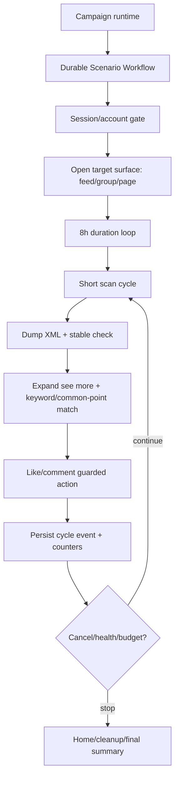

# Research Report: Kien truc scenario automation chay 8 tieng

Timestamp: 2026-08-13 10:19 +07

## Executive Summary

Scenario 8 tieng khong nen la mot step/action den hop chay lien tuc. Kien truc dung la: workflow dai song lau, nhung moi lan tac dong vao phone la mot chunk ngan co timeout, progress, cancel, resume va checkpoint ro rang. Neu mot chunk fail thi retry/cleanup chunk do, khong lap lai ca 8 tieng.

Voi device-farm hien tai, nen giu `loop.duration_seconds` lam khung thoi gian, nhung moi vong phai la "scan cycle" huu han: mo dung surface, dump XML, match keyword, click xem them neu can, like/comment neu hop le, ghi summary, heartbeat/progress, roi tiep tuc. Khong nen them delay dai, khong nen feedback tap theo toa do cu, khong nen de target count/scroll timeout nam ngoai contract variable.

Gioi han quan trong: chi dung cho QA/automation hop le, tai khoan duoc phep, rate-limit va audit ro rang. Khong thiet ke de spam hay ne policy nen tang.

## Research Methodology

- Sources consulted: 5 external official/primary sources + local repo scan + memory notes.
- Date range: Temporal docs current crawl 2026-08-13; Android UI Automator doc updated gan day; Appium UiAutomator2 current GitHub docs.
- Search terms: `Temporal long running Activity heartbeats`, `Android UI Automator wait stable`, `Appium UiAutomator2 real devices`, `OpenTelemetry metric cardinality long running jobs`.
- Boundaries: architecture and implementation guidance only; no anti-detection/spam tactics.

## Key Findings

### 1. Long-running orchestration

Temporal recommends Start-To-Close timeout for Activities, and for long-running Activities use Heartbeats + Heartbeat Timeout. Heartbeat payload can carry progress and cancellation is delivered when Activities heartbeat. See:
- https://docs.temporal.io/encyclopedia/detecting-activity-failures
- https://temporal.io/blog/activity-timeouts

Implication for device-farm:
- 8h should be Workflow duration, not one opaque Activity.
- Phone action chunk should be short: 1-5 minutes practical default.
- Each chunk emits progress: cycle index, screen count, scroll count, matched count, liked/commented count, last target fingerprint, last XML hash.
- Cancellation must be checked between cycles and before side-effect actions.

### 2. Mobile UI automation style

Android UI Automator is for cross-app/system UI testing and supports built-in wait and app-state APIs. It is designed around visible UI elements, accessibility windows, screenshots, and stable app states. See:
- https://developer.android.com/training/testing/other-components/ui-automator

Appium UiAutomator2 proxies commands to a UiAutomator2 server and works on real devices; real devices must be visible as online via ADB. See:
- https://github.com/appium/appium-uiautomator2-driver

Implication:
- Prefer XML/accessibility node matching over raw coordinates.
- Use "wait until state" and "wait stable", not blind sleep.
- For long feeds, use scroll-to-node / scroll within known scrollable area, not repeated feedback tap.
- Re-dump XML after each significant UI transition.

### 3. Observability

OpenTelemetry warns against high-cardinality metric attributes such as trace IDs directly in metrics; use exemplars or link traces separately. See:
- https://opentelemetry.io/docs/languages/dotnet/metrics/best-practices/

Implication:
- Metrics should be low-cardinality: scenario_name, step_type, platform, outcome, device_pool.
- Put high-cardinality details in execution events/logs: execution_id, target_id, XML hash, matched text fingerprint.

## Current Repo Fit

Relevant existing pieces:
- `device_farm/tasks/scenario/executor.py` has top-level checkpointing and resume from `checkpoint_step`.
- `device_farm/tasks/scenario/steps/control_flow.py` has `loop.duration_seconds`, cancel checks, mid-loop `_loop_iter` persistence, retained sub-result truncation.
- `device_farm/db/seeds/scenario_templates.py` already has 8h post/feed and group templates using `POST_RUN_SECONDS=28800`, `POST_SCAN_CYCLES=9999`, `GROUP_SCAN_SECONDS=28800`, `fb_scan_posts_interact`.
- `fb_scan_posts_interact` dispatches to agent-boot U2 flow, where XML scan/match/like/comment happens.

Gap:
- Progress heartbeat is not yet first-class per scan cycle in the step result/event stream.
- A loop can run 8h, but user-facing "what happened in the last 10 minutes" is weak unless cycle summaries are persisted.
- Need explicit stopping policy: run until duration, until target_count, until action budget, or until health/cooldown trips.
- Need separate budgets for scan, action, and comment. Do not use one `MAX_SCROLLS` for everything.

## Recommended Architecture



### Core contracts

1. `run_budget`
   - `duration_seconds`: wall-clock max, e.g. 28800.
   - `max_cycles`: upper hard cap, e.g. 9999.
   - `cycle_timeout_seconds`: per-cycle RPC/activity timeout, e.g. 180-300.

2. `scan_budget`
   - `max_scrolls_per_cycle`: e.g. 20-60.
   - `screen_stable_timeout`: e.g. 6-10s.
   - `no_new_screen_limit`: stop cycle when same fingerprint repeats.

3. `action_budget`
   - `max_likes_per_run`, `max_comments_per_run`, `max_actions_per_cycle`.
   - `min_common_points`: keyword/common group/page/person signal.
   - `dedupe_by_post_fingerprint`.

4. `progress`
   - Persist every cycle:
     - cycle index
     - elapsed seconds
     - surface name/group index
     - screens scanned
     - scrolls
     - matched posts
     - liked/commented
     - no-match reason
     - last XML hash/screenshot ref if failed

5. `recovery`
   - If app leaves target surface: reopen surface.
   - If comment/filter sheet opens: close sheet or use node-scoped scroll.
   - If device offline/U2 failure: mark transient, retry chunk, do not duplicate prior actions.
   - If session/account mismatch: pause/fail closed.

## Implementation Recommendations

### Minimal change path

1. Keep current template shape:
   - `loop.duration_seconds = ${POST_RUN_SECONDS}`.
   - `fb_scan_posts_interact` inside loop.

2. Add/standardize variables:
   - `POST_RUN_SECONDS`
   - `POST_SCAN_CYCLE_TIMEOUT_SECONDS`
   - `MAX_SCROLLS_PER_CYCLE`
   - `MAX_ACTIONS_PER_CYCLE`
   - `MAX_LIKES_PER_RUN`
   - `MAX_COMMENTS_PER_RUN`
   - `NO_NEW_SCREEN_LIMIT`

3. Make `fb_scan_posts_interact` return cycle summary every time:
   - no match is still success but emits useful counters.
   - action failures include reason and bounds/XML hash.

4. Persist cycle-level event from scenario executor:
   - event type: `scenario_cycle_progress`
   - payload: summary from `_post_scan` / `_group_post_scan`

5. Stop conditions:
   - duration reached
   - run action budget reached
   - cancel requested
   - session gate failed
   - repeated transient failure threshold reached

### Pseudocode

```python
while elapsed < run_budget.duration_seconds:
    ensure_session_ready()
    ensure_surface_open()

    result = scan_posts_interact(
        keywords=keywords,
        max_scrolls=max_scrolls_per_cycle,
        timeout=cycle_timeout_seconds,
        action_budget=remaining_action_budget,
    )

    persist_cycle_progress(result)
    heartbeat(progress=result)

    if cancel_requested() or budget_reached(result):
        break
    if repeated_transient_failures():
        pause_or_fail_closed()
```

## Common Pitfalls

- Pitfall: 8h as one blocking U2 call.
  - Fix: split into short cycles.

- Pitfall: `max_scrolls` accidentally resolves to `0`.
  - Fix: support both literal and `_var` fields; assert in tests.

- Pitfall: raw coordinate click after feed changes.
  - Fix: locate by XML node each time; re-dump after scroll/expand/comment open.

- Pitfall: no-match treated as failure.
  - Fix: no-match is normal cycle outcome; emit metrics and continue.

- Pitfall: duplicate like/comment after retry.
  - Fix: fingerprint posts and action ledger/dedupe before action.

- Pitfall: too much metric cardinality.
  - Fix: aggregate counters in metrics, detailed target IDs only in events/logs.

## Concrete Recommendation For This Repo

Do not rebuild architecture. Tighten current one:

1. Reuse `loop.duration_seconds` for 8h wall-clock.
2. Use `fb_scan_posts_interact` as per-cycle chunk, not whole-run owner.
3. Promote scan/action budget variables into template UI.
4. Emit `scenario_cycle_progress` events from each loop iteration.
5. Make campaign monitor show:
   - elapsed / remaining
   - current group/page/feed surface
   - cycles
   - matched / liked / commented
   - last outcome
   - pause reason if any

## Unresolved Questions

- Should action budgets be per account, per device, per campaign, or per scenario run?
- Should no-match cycles continue forever until 8h, or backoff/reopen surface after N no-match cycles?
- Where should final compliance/rate policy live: template variables, campaign policy, or account policy?
- Should group multi-run divide 8h across groups or run 8h per group? Current group template uses `GROUP_SCAN_SECONDS=28800`, which means 8h per group.

## References

- Temporal Activity failures, timeouts, heartbeats: https://docs.temporal.io/encyclopedia/detecting-activity-failures
- Temporal Activity timeout types: https://temporal.io/blog/activity-timeouts
- Android UI Automator official docs: https://developer.android.com/training/testing/other-components/ui-automator
- Appium UiAutomator2 driver docs/source: https://github.com/appium/appium-uiautomator2-driver
- OpenTelemetry metric best practices: https://opentelemetry.io/docs/languages/dotnet/metrics/best-practices/
