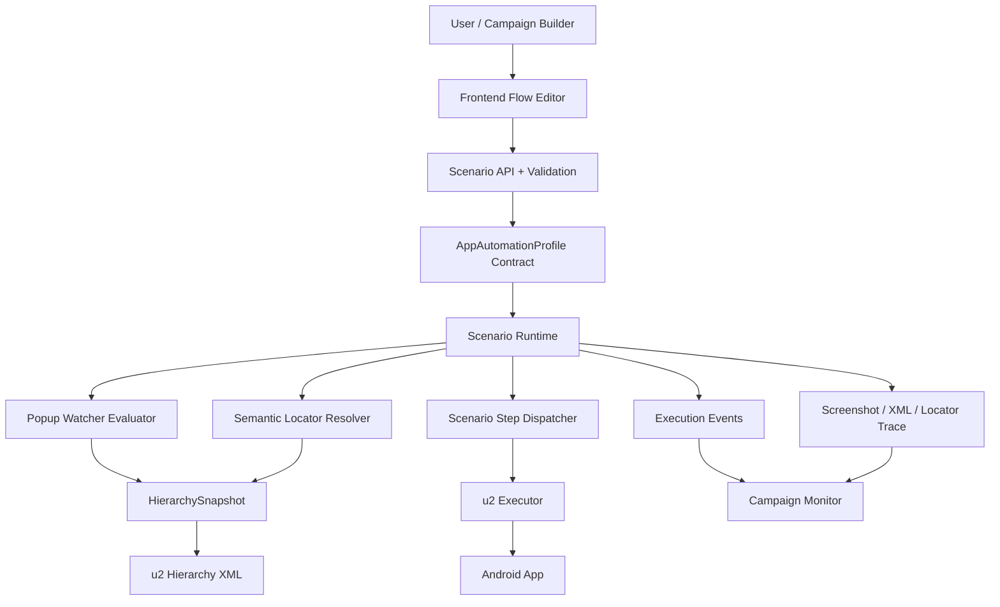
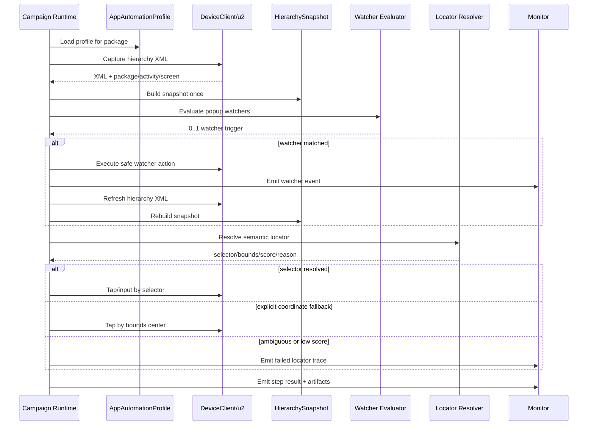
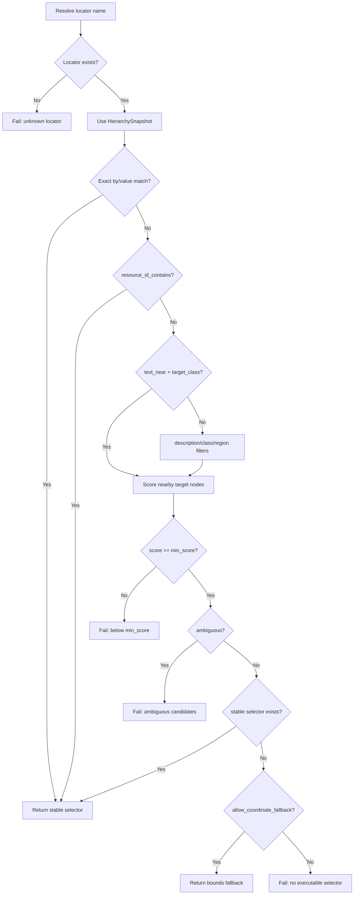
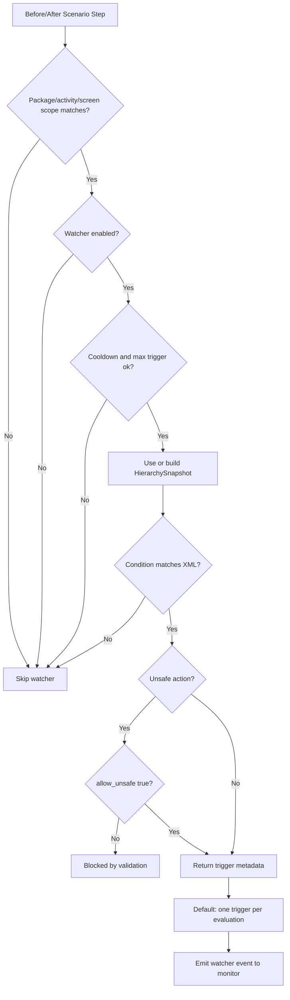
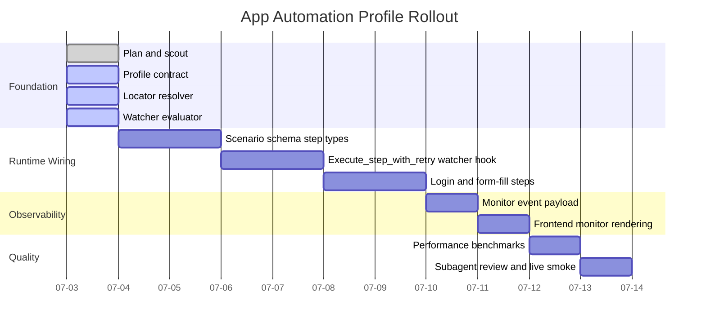

# App Automation Profile Diagrams

## Recommendation

Use Mermaid for this phase.

- Mermaid: best for repo docs, architecture review, PR diff, and iterative design.
- Draw.io: better later for polished stakeholder diagrams or UI-heavy documentation.

## System Architecture

## Runtime Flow

## Locator Decision Tree

## Popup Watcher Safety Flow

## Implementation Roadmap

