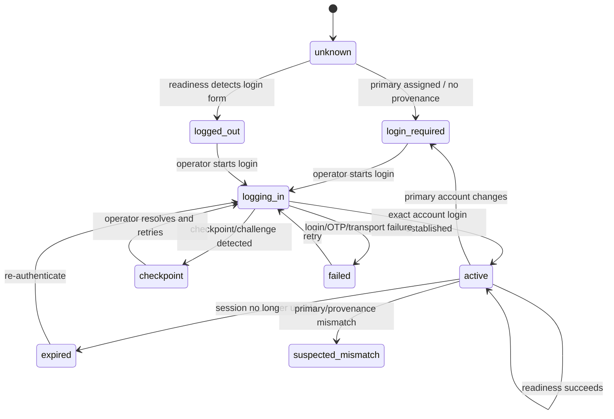
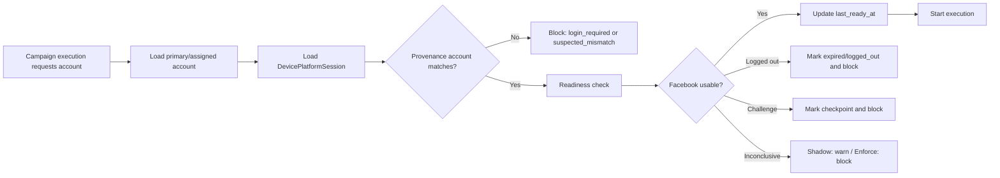
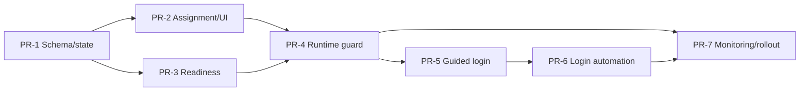

# Plan: Facebook Session Provenance And Controlled Login

**Mục tiêu:** Biết phone nào đang được hệ thống tin là dùng Facebook account nào mà không suy đoán identity từ UI obfuscated; block campaign khi assignment không khớp session provenance; chỉ login lại khi account đổi hoặc session không còn usable.

**Trạng thái:** Draft v1 - 2026-08-08

**Phạm vi v1:** Facebook Android `com.facebook.katana`, device/account assignment, campaign runtime, operator UI và audit/metrics.

**Ngoài phạm vi v1:** Reverse-engineer private Facebook providers/tokens, root app-data extraction, tự động bypass checkpoint/challenge, login lại trước mọi execution, tự động chọn Page/profile phụ.

---

## 1. Bối Cảnh Và Quyết Định

Research trực tiếp trên Facebook Android `573.0.0.37.74` cho thấy:

- Logged-in menu/profile vẫn chạy dưới `com.facebook.katana.LoginActivity`; activity name không biểu diễn login state.
- Resource IDs bị obfuscate thành `com.facebook.katana:id/(name removed)` hoặc để trống.
- Menu, profile và profile switcher chỉ expose display name, không expose exact username, provider ID hoặc profile URL.
- Public Android `AccountManager` không expose Facebook account.
- Private content providers/authenticator không phải contract production ổn định và không được dùng để đọc credential/session internals.

Vì vậy hệ thống chuyển từ mô hình:

```text
Inspect Facebook UI -> guess active account
```

sang:

```text
Establish session -> record provenance -> monitor readiness
```

### Quyết định bắt buộc

1. Một phone chỉ có một active Facebook session tại một thời điểm.
2. Nhiều account vẫn có thể assigned vào phone để quản lý inventory, nhưng chỉ account trùng session provenance mới được chạy.
3. Display name là diagnostic evidence, không phải identity proof.
4. `verified` chỉ được tạo bởi exact trusted identifier hoặc controlled login thành công.
5. Không logout/login lại nếu assignment không đổi và session còn healthy.
6. Primary account đổi sẽ invalidate provenance hiện tại và chuyển session sang `login_required`.
7. Checkpoint, OTP failure hoặc challenge phải block execution và cần operator xử lý; không tự bypass.

---

## 2. Domain Model

### 2.1 `DevicePlatformSession`

Thêm bảng tenant-scoped `device_platform_sessions`, một row cho mỗi `(device_id, platform)`:

| Field | Type | Ý nghĩa |
|---|---|---|
| `id` | UUID/string | Primary key |
| `org_id` | UUID/string | Tenant boundary |
| `device_id` | FK devices | Phone sở hữu session |
| `platform` | string | `facebook` trong v1 |
| `account_id` | nullable FK accounts | Account đã thiết lập session; null khi unknown/logged out |
| `state` | enum/string | State machine bên dưới |
| `state_reason` | nullable string | Stable reason code |
| `established_at` | nullable timestamp | Controlled login hoàn tất |
| `last_ready_at` | nullable timestamp | Readiness check gần nhất thành công |
| `last_checked_at` | nullable timestamp | Lần check gần nhất |
| `invalidated_at` | nullable timestamp | Assignment/session bị invalidated |
| `login_attempt_id` | nullable string | Correlation với login attempt |
| `establishment_method` | nullable string | `operator_confirmed`, `controlled_login`, `trusted_identifier` |
| `app_package` | string | `com.facebook.katana` |
| `app_version` | nullable string | Build đã establish/check |
| `display_name_observed` | nullable string | Diagnostic only |
| `evidence` | JSON | Sanitized evidence, không credential/token/XML thô |
| `version` | integer | Optimistic concurrency |
| `created_at`, `updated_at` | timestamp | Audit timestamps |

Constraints/indexes:

```text
UNIQUE(org_id, device_id, platform)
INDEX(org_id, platform, state)
INDEX(org_id, account_id, state)
```

### 2.2 State machine



Allowed states:

```text
unknown
logged_out
login_required
logging_in
active
suspected_mismatch
checkpoint
expired
failed
```

### 2.3 Invariants

- `active` yêu cầu `account_id`, `established_at`, `establishment_method`.
- `controlled_login` chỉ ghi `active` sau khi login workflow hoàn tất và readiness pass.
- Primary assignment không tự tạo active session.
- Remove account đang giữ provenance phải invalidate session trong cùng transaction.
- Set primary sang account khác phải chuyển session sang `login_required` trong cùng transaction.
- Tenant ownership của device và account phải được kiểm tra trước mọi read/write.
- Không lưu password, TOTP secret, cookie, token, full hierarchy hoặc screenshot nhạy cảm trong `evidence`.

---

## 3. Kiến Trúc Runtime



### Identity proof precedence

1. Controlled login provenance.
2. Exact provider ID from qualified trusted source.
3. Exact username from qualified trusted source.
4. Operator confirmation with audit trail, allowed only as transitional migration method.
5. Display name match, never sufficient for `verified`.

### Readiness detector v1

Readiness answers whether Facebook is usable, not who the account is:

- Package foreground or launchable.
- Authenticated home/menu/profile marker exists.
- Login/password form absent.
- Checkpoint/challenge markers absent.
- App responsive within timeout.

Output:

```text
ready
logged_out
checkpoint
unresponsive
unsupported_build
inconclusive
```

Locale-specific labels must live in versioned detector fixtures, not inline runtime conditionals.

---

## 4. Delivery Plan

### PR-1 - Session Schema And State Transitions

**Mục tiêu:** Tạo source of truth trước khi thay runtime behavior.

Files dự kiến:

- `device_farm/db/models/device_platform_session.py`
- `device_farm/db/models/enums.py`
- `device_farm/db/migrations/099_device_platform_sessions.py` hoặc migration number tiếp theo còn trống
- `device_farm/db/crud/device_platform_session.py`
- `device_farm/services/device_platform_session.py`
- Focused model/service tests

Tasks:

- Thêm model, migration upgrade/downgrade và indexes.
- Thêm typed state/reason enums.
- Implement transition service với optimistic concurrency.
- Implement `get_or_create`, `mark_login_required`, `mark_active`, `mark_expired`, `mark_checkpoint`, `invalidate`.
- Emit account/device audit milestones, không emit mỗi readiness poll.

Acceptance criteria:

- Transition không hợp lệ bị reject.
- Cross-tenant access không trả session.
- Hai update đồng thời không silently overwrite.
- Evidence sanitizer loại secrets và payload lớn.

Verification:

```bash
cd device_farm
uv run pytest -q tests/test_device_platform_session.py
```

### PR-2 - Assignment Integration And Manual Provenance

**Mục tiêu:** Primary assignment và provenance không thể drift âm thầm.

Files dự kiến:

- `device_farm/api/routes/accounts.py`
- `device_farm/db/crud/account.py`
- `device_farm/api/schemas/account.py`
- `device_farm/api/routes/devices.py` hoặc route session riêng
- `front-end/src/features/accounts/components/device-accounts-panel.tsx`

Tasks:

- Set primary sang account khác -> session `login_required`.
- Remove provenance account -> invalidate session.
- Add endpoint đọc session state theo device/platform.
- Add audited operator action `Confirm current session` cho migration only.
- Operator confirmation yêu cầu explicit account, reason và recent readiness evidence.
- UI hiển thị tách biệt `Assigned`, `Primary`, `Session active`.

API draft:

```text
GET  /api/devices/{device_id}/platform-sessions
GET  /api/devices/{device_id}/platform-sessions/facebook
POST /api/devices/{device_id}/platform-sessions/facebook/confirm
POST /api/devices/{device_id}/platform-sessions/facebook/invalidate
```

Acceptance criteria:

- Set primary không tự hiển thị account mới là active.
- UI cảnh báo rõ `Login required`.
- Manual confirmation có actor, timestamp, reason và account ID trong audit.

### PR-3 - Facebook Readiness Detector

**Mục tiêu:** Phân biệt session usable/logged-out/checkpoint mà không đoán identity.

Files dự kiến:

- `device_farm/services/facebook_readiness.py`
- `device_farm/services/account_verification.py`
- Fixture XML đã scrub PII trong `device_farm/tests/fixtures/facebook/`
- Detector tests theo build/locale

Tasks:

- Extract pure resolver `resolve_facebook_readiness(xml, package, app_version)`.
- Thêm fixture: authenticated menu, profile, switcher, login form, checkpoint, unknown.
- Scrub names/birthdays/friend data khỏi fixtures.
- Return typed status/reason/evidence hash.
- Không phụ thuộc `LoginActivity` hoặc obfuscated resource ID.
- Rate-limit hierarchy dumps và reuse per-device lock hiện có.

Acceptance criteria:

- Authenticated menu/profile -> `ready`.
- Login form -> `logged_out`.
- Challenge/checkpoint -> `checkpoint`.
- Feed content hoặc display name đơn lẻ không chứng minh readiness/identity.
- Unknown Facebook build fails safe as `inconclusive` or `unsupported_build`.

### PR-4 - Campaign Session Guard

**Mục tiêu:** Campaign không chạy bằng session sai account.

Risk: `start_execution_runtime()` có blast radius CRITICAL; bắt buộc GitNexus impact analysis và warning trước edit.

Files dự kiến:

- `device_farm/services/campaign/execution_runtime.py`
- `device_farm/services/account_verification.py`
- Execution schema/meta tests

Guard order:

1. Resolve expected account.
2. Load session provenance.
3. Require matching `account_id` and `active` state.
4. Run readiness according to mode/cache age.
5. Persist sanitized snapshot to `Execution.meta.facebook_session`.
6. Start phone I/O only after DB transaction release.

Modes:

```text
off     - observe nothing; emergency rollback only
shadow  - record mismatch/readiness but do not block
enforce - block unless provenance matches and readiness is ready
```

Suggested configuration:

```env
FACEBOOK_SESSION_GUARD_MODE=shadow
FACEBOOK_SESSION_READY_TTL_SECONDS=300
FACEBOOK_SESSION_CHECK_CONCURRENCY=8
FACEBOOK_SESSION_CHECK_TIMEOUT_SECONDS=6
```

Acceptance criteria:

- Different primary/provenance account blocks in enforce.
- Expired/checkpoint blocks in enforce.
- Readiness cache prevents one hierarchy dump per execution burst.
- Shadow mode never changes execution outcome.
- Execution metadata includes expected account, provenance account, state, readiness, reason and timestamps.

### PR-5 - Operator Login Workflow Foundation

**Mục tiêu:** Tạo controlled workflow boundary trước khi tự động nhập credential.

Không automate credential entry trong PR này.

Tasks:

- Add `LoginAttempt` correlation record hoặc audit entity.
- Endpoint `start login` chuyển state sang `logging_in` và reserve device.
- UI guided mode mở live view, chỉ dẫn operator login account expected.
- `Complete login` chạy readiness, yêu cầu explicit confirmation, rồi ghi provenance.
- Timeout/cancel trả state về `login_required` hoặc `failed`.
- Redact keyboard/password events khỏi logs/captures.

API draft:

```text
POST /api/devices/{device_id}/platform-sessions/facebook/login-attempts
POST /api/devices/{device_id}/platform-sessions/facebook/login-attempts/{id}/complete
POST /api/devices/{device_id}/platform-sessions/facebook/login-attempts/{id}/cancel
```

Acceptance criteria:

- Device reservation ngăn campaign/login workflow chạy đồng thời.
- Completion chỉ active expected account đã chọn trong attempt.
- Không log password/TOTP/touch keyboard details.
- Checkpoint có first-class state và operator guidance.

### PR-6 - Controlled Login Automation

**Mục tiêu:** Tự động login chỉ khi policy yêu cầu và sau khi guided workflow ổn định.

Preconditions:

- PR-1 đến PR-5 chạy production shadow ổn định.
- Có test accounts và phone lab riêng.
- Security review credential handling hoàn tất.
- Facebook Terms/policy và business risk được owner chấp thuận.

Tasks:

- Implement explicit login state machine: launch, logged-out detection, credential entry, submit, TOTP, post-login readiness.
- Credential lấy qua secret boundary, không trả về API/frontend/log.
- Không automate CAPTCHA/checkpoint/recovery.
- Per-account and per-device login rate limits.
- Exponential backoff, circuit breaker và daily login cap.
- On success record exact expected account as `controlled_login` provenance.

Acceptance criteria:

- Wrong password, OTP timeout, checkpoint và network failure có reason riêng.
- Không retry vô hạn.
- Không login lại khi session active/ready.
- Một account không login song song trên nhiều phone nếu policy cấm.
- Emergency kill switch hoạt động không cần deploy.

### PR-7 - Monitoring, Alerts And Enforce Rollout

Metrics:

```text
facebook_session_state_total{state,reason}
facebook_session_readiness_total{status,app_version}
facebook_session_readiness_duration_seconds
facebook_login_attempt_total{outcome,reason}
facebook_session_guard_total{mode,outcome}
facebook_session_provenance_age_seconds
```

Alerts:

- `checkpoint` spike.
- `logged_out`/`expired` spike.
- `unsupported_build` after Facebook release.
- Provenance mismatch.
- Login failure rate or daily login volume above baseline.

Rollout gates:

1. Shadow on test phones.
2. Shadow on 5% production phones.
3. Shadow fleet-wide for at least one Facebook release cycle.
4. Enforce only on one-account-per-phone cohort.
5. Expand enforce after zero false blocks and acceptable inconclusive rate.

Rollback:

- Set guard mode to `shadow`.
- Disable controlled login kill switch.
- Preserve provenance/audit data; do not rewrite state automatically.

---

## 5. Security And Safety Requirements

- Never query or persist Facebook private tokens/cookies/providers.
- Never store hierarchy XML or screenshots containing PII by default.
- Hash hierarchy for correlation; retain only sanitized reason/evidence.
- Encrypt account credentials at rest and decrypt only inside login executor.
- Password/TOTP must never cross to browser UI after account creation/import.
- Disable step capture around credential entry.
- Audit actor, device, account, attempt and outcome, not secret values.
- Require tenant and `accounts:update`/`devices:execute` permissions.
- Apply per-org, per-device and per-account rate limits.
- Treat Facebook checkpoint as terminal automation state requiring human action.

---

## 6. Test Strategy

### Unit

- Every state transition and invalid transition.
- Evidence sanitization.
- Readiness resolver against scrubbed fixtures.
- Guard decision matrix for mode/provenance/readiness.

### API integration

- Tenant isolation and RBAC.
- Primary change invalidates provenance atomically.
- Remove active account invalidates provenance atomically.
- Optimistic conflict returns `409`.
- Login attempt lifecycle.

### Runtime integration

- Matching active session allows execution.
- Mismatch, expired and checkpoint block in enforce.
- Shadow records but does not block.
- Timeout releases lock only after worker completion.
- DB transaction is not held during phone I/O.

### Device lab

- Vietnamese and English locale.
- Current Facebook production build and next released build.
- Logged in, logged out, expired, checkpoint and network-offline states.
- Same display name on two test accounts to prove display name is not identity.
- App update while provenance exists.

---

## 7. Data Migration And Compatibility

- Existing `DeviceAccount.verification_*` fields remain during migration.
- Backfill one `unknown` session row per device with Facebook assignment; do not infer `account_id` from primary.
- Existing verification snapshots remain historical evidence.
- New runtime reads session provenance first; old resource-ID verifier remains shadow fallback only.
- Remove old verifier only after session guard runs through one release cycle and no external consumer depends on fields.

Backfill rule:

```text
Facebook assignment exists -> session state unknown, account_id null
No Facebook assignment      -> no session row until first read/write
```

---

## 8. Definition Of Done

- Phone detail distinguishes assigned, primary and active session account.
- Primary change cannot leave stale active provenance.
- Campaign execution records a deterministic guard decision.
- Enforce mode never allows a known mismatch/checkpoint/expired session.
- No display-name-only path produces `verified`.
- No private Facebook API/provider/token dependency exists.
- Controlled login is bounded, auditable and kill-switchable.
- Full focused backend/frontend tests, OpenAPI generation and deployment config validation pass.
- GitNexus impact analysis runs before every edited symbol; `detect_changes()` runs before commit.

---

## 9. Recommended Execution Order



Ưu tiên triển khai PR-1 đến PR-4 trước. Chúng giải quyết mismatch và tạo source of truth mà chưa tăng login frequency. PR-5 cung cấp operator workflow an toàn. PR-6 chỉ bắt đầu sau khi có production evidence và security/policy approval.

---

## 10. Open Decisions Before PR-6

Các quyết định này không block PR-1 đến PR-5:

1. Có cho phép một Facebook account active đồng thời trên nhiều phone không?
2. Daily login cap theo account/device/org là bao nhiêu?
3. TOTP secret được decrypt ở backend hay dedicated secret worker?
4. Operator nào được resolve checkpoint và xác nhận provenance?
5. Retention của login attempt evidence/audit là bao lâu?
6. Có cần Page/profile switching hay v1 chỉ hỗ trợ personal account?
7. Chính sách Facebook/Meta và business owner có chấp thuận controlled login automation không?
