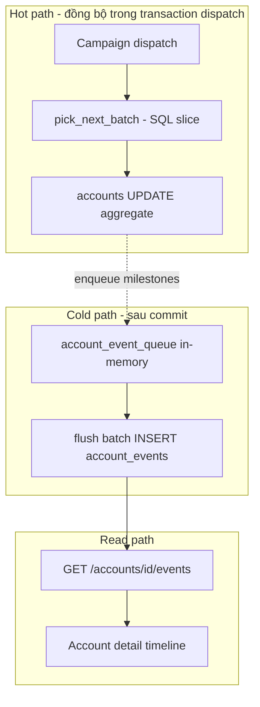
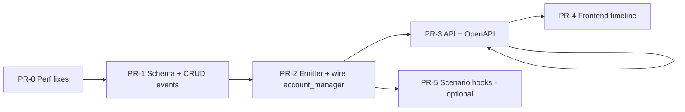

# Plan: Account Profile History + Performance Hardening

**Mục tiêu:** Lưu lịch sử vận hành theo từng social account (login session, dispatch, status, cooldown, device assign) mà **không làm chậm** hot path dispatch/scenario.

**Phạm vi:** Social `accounts` (DF-007). Không gộp `mcp_sessions`, `device_sessions`, JWT dashboard user.

**Trạng thái:** Draft v1 — 2026-05-22

---

## 1. Tóm tắt kiến trúc

### Hai tầng dữ liệu (bắt buộc)

| Tầng | Bảng / field | Mục đích | Tần suất ghi |
|------|----------------|----------|--------------|
| **Hot aggregate** | `accounts.*` (`last_used_at`, `usage_*`, `status`) | Rotation, cooldown, UI badge | 1–2 UPDATE / phiên automation |
| **Cold audit** | `account_events` (append-only) | Timeline, debug, compliance | Milestone only; batch/async OK |

**Không** ghi event đồng bộ mỗi Temporal step. **Không** mở rộng `activity_log` làm timeline account (query chậm, action namespace lẫn).

### Sơ đồ luồng



---

## 2. Phụ thuộc & thứ tự PR



| PR | Tên | Có thể song song |
|----|-----|------------------|
| **PR-0** | Performance hardening (không schema mới) | — (làm trước) |
| **PR-1** | `account_events` migration + model + CRUD | Sau PR-0 |
| **PR-2** | `AccountEventService` + emit + wire lifecycle | Sau PR-1 |
| **PR-3** | REST `GET /accounts/{id}/events` | Sau PR-2 |
| **PR-4** | UI timeline + pagination | Sau PR-3 |
| **PR-5** | Scenario `session_death` / login detect | Sau PR-2, có thể defer |

---

## 3. Chi tiết từng phase

### PR-0 — Performance hardening (không đổi product)

**Mục tiêu:** Giảm latency dispatch trước khi thêm write path history.

#### 3.0.1 Batch `scenario_device_variables`

**File:** `device_farm/db/crud/scenario_device_variable.py`, `device_farm/services/campaign_dispatch.py`

- Thêm `get_scenario_device_variables_bulk(db, scenario_ids, device_ids) -> dict[(scenario_id, device_id), dict]`
- Một query: `WHERE scenario_id IN (...) AND device_id IN (...)`
- Thay vòng `for scen × for device: db.get` trong `_build_per_scenario_device_runtime_vars`

**SLO:** Dispatch 10 scenarios × 50 devices: ≤ 5 query account-related (không phải 500+).

#### 3.0.2 `pick_next_batch` — SQL slice, không `.all()`

**File:** `device_farm/db/crud/account_group.py`

- Round-robin: `ORDER BY position` + `OFFSET cursor % total_usable` + `LIMIT count` (subquery đếm usable hoặc cache `member_count` trên group)
- `least_recent`: giữ `ORDER BY last_used_at NULLS FIRST` + `LIMIT count` (đã có index `idx_agm_group_lru`)
- Vẫn `FOR UPDATE` group row — nhưng payload query nhỏ

**SLO:** Group 1000 members, pick 50: < 50ms DB (local PG), không load 1000 rows vào Python.

#### 3.0.3 `update_account` — không reload thừa

**File:** `device_farm/db/crud/account.py`

- Thêm `reload: bool = True` hoặc `update_account_values()` trả `RETURNING` không `selectinload(device_links)`
- Hot path (`start_account_usage`) dùng `reload=False`

#### 3.0.4 Index rotation global

**Migration `040_accounts_lru_index.py`:**

```sql
CREATE INDEX CONCURRENTLY IF NOT EXISTS idx_accounts_platform_active_lru
  ON accounts (platform, last_used_at NULLS FIRST)
  WHERE status = 'active';
```

#### 3.0.5 Wire background cooldown (hiện orphan)

**File:** `device_farm/web/server.py`

- Schedule `check_and_reset_cooldowns` mỗi 5 phút, `reset_daily_usage` midnight UTC
- Không block request path

**Verification PR-0:**

```bash
cd device_farm && pytest tests/ -k "account_group or campaign_dispatch" -q
# Benchmark thủ công: log query count trong dispatch (tùy chọn script)
```

---

### PR-1 — Schema `account_events`

#### 3.1.1 Migration `040_account_events.py` (hoặc 041 nếu 040 dùng cho index)

```sql
CREATE TABLE account_events (
  id            VARCHAR(36) PRIMARY KEY,
  account_id    VARCHAR(36) NOT NULL REFERENCES accounts(id) ON DELETE CASCADE,
  user_id       VARCHAR(36) REFERENCES users(id) ON DELETE SET NULL,
  event_type    VARCHAR(50) NOT NULL,
  device_serial VARCHAR(100),
  platform      VARCHAR(50),
  entity_type   VARCHAR(50),   -- execution | campaign | device | account_group
  entity_id     VARCHAR(36),
  details       JSONB NOT NULL DEFAULT '{}',
  created_at    TIMESTAMPTZ NOT NULL DEFAULT NOW()
);

CREATE INDEX idx_account_events_account_created
  ON account_events (account_id, created_at DESC);

CREATE INDEX idx_account_events_type_created
  ON account_events (event_type, created_at DESC);

CREATE INDEX idx_account_events_user_created
  ON account_events (user_id, created_at DESC)
  WHERE user_id IS NOT NULL;
```

**Không** tạo `account_sessions` ở v1 — dùng cặp event `usage_started` / `usage_ended` + `details.session_id` (UUID) nếu cần correlate.

#### 3.1.2 Model + enum

**Files:**

- `device_farm/db/models/account_event.py`
- `device_farm/db/models/enums.py` — `AccountEventType` (frozen str enum)

**Event types v1 (whitelist):**

| `event_type` | Khi emit |
|--------------|----------|
| `account.created` | POST account |
| `account.updated` | PATCH (không log password/metadata secrets) |
| `account.status_changed` | PATCH status |
| `account.deleted` | DELETE |
| `account.device_assigned` | link device |
| `account.device_unassigned` | unlink |
| `account.picked` | `pick_next_batch` |
| `account.usage_started` | dispatch có `__ACCOUNT_ID__` / execution start |
| `account.usage_ended` | execution terminal |
| `account.cooldown_entered` | `end_account_usage` → cooldown |
| `account.cooldown_cleared` | background reset |
| `account.session_death` | scenario detect (PR-5) |
| `account.banned` | status → banned (manual/auto) |

#### 3.1.3 CRUD

**File:** `device_farm/db/crud/account_event.py`

- `insert_events_batch(db, rows: list[dict])` — single executemany / INSERT multi-row
- `list_account_events(db, account_id, *, limit, cursor_created_at, cursor_id, event_type?)` — keyset pagination
- `count_account_events` — optional cho UI total

**Verification:**

```bash
pytest device_farm/tests/test_account_events.py -q
```

---

### PR-2 — Emitter service + lifecycle wiring

#### 3.2.1 `AccountEventRecorder`

**File:** `device_farm/services/account_event_recorder.py`

```python
class AccountEventRecorder:
    """Enqueue events; flush on commit hook or background tick."""
    def record(self, *, account_id, event_type, ...) -> None: ...
    async def flush(self, db: AsyncSession) -> int: ...
```

**Quy tắc:**

- `record()` chỉ append vào list in-memory (per-request hoặc singleton có lock)
- `flush()` gọi **sau** `db.commit()` thành công trên cùng request, hoặc `asyncio.create_task` fire-and-forget với session mới (chấp nhận mất event nếu process crash — document)
- Batch tối đa 100 events / flush
- `details` **redact**: `password`, `password_encrypted`, `cookies`, `token`, `2fa_secret`

#### 3.2.2 Wire emit points

| Điểm | Events |
|------|--------|
| `api/routes/accounts.py` | created, updated, status_changed, deleted, device_* |
| `db/crud/account_group.pick_next_batch` | picked (1 event / account picked, `entity_type=account_group`) |
| `services/campaign_dispatch.py` | usage_started per device có account vars (sau commit rotation) |
| `db/crud/execution` hoặc workflow completion handler | usage_ended |
| `services/account_manager.py` | cooldown_entered, cooldown_cleared; gọi `start/end_account_usage` thật |

#### 3.2.3 `executions.account_id` (optional trong PR-2)

**Migration:** nullable `account_id VARCHAR(36) REFERENCES accounts(id) ON DELETE SET NULL`

- Set lúc dispatch từ `__ACCOUNT_ID__`
- Giúp join analytics không scan JSON

#### 3.2.4 Config

**File:** `device_farm/core/config.py` — `AccountHistoryConfig`:

```python
@dataclass
class AccountHistoryConfig:
    enabled: bool = True
    flush_async: bool = True          # flush sau commit, không trong FOR UPDATE
    max_batch_size: int = 100
    retention_days: int = 90          # v2: archive job
```

Env: `ACCOUNT_HISTORY_ENABLED`, `ACCOUNT_HISTORY_FLUSH_ASYNC`

**Verification:**

- Integration: dispatch campaign → có `picked` + `usage_started` trong DB
- Execution done → `usage_ended` + `accounts.last_used_at` cập nhật

---

### PR-3 — API

```
GET /api/accounts/{account_id}/events
  ?limit=50          # max 200
  ?cursor=           # base64(created_at|id) keyset
  ?event_type=       # optional filter
```

**Response:**

```json
{
  "items": [{ "id", "event_type", "device_serial", "entity_type", "entity_id", "details", "created_at" }],
  "next_cursor": "...",
  "has_more": true
}
```

- Auth: cùng tenant `user_id` như account
- Không trả secrets trong `details` (sanitize ở recorder)

**OpenAPI:** regenerate `swagger/openapi.json`, `front-end/generate`

---

### PR-4 — Frontend

**Files:**

- `front-end/src/features/accounts/components/account-history-timeline.tsx`
- Hook `useAccountEvents(accountId, { cursor })`
- Tab "Lịch sử" trên account detail (hoặc drawer từ list)

**UX:**

- Infinite scroll / "Load more" với cursor
- Badge màu theo `event_type`
- Không fetch khi list page load — chỉ khi mở detail

**List accounts:** thêm server pagination (`limit`/`offset` hoặc cursor) — tách ticket nếu PR-4 quá lớn.

---

### PR-5 — Scenario hooks (defer được)

- `login_screen` / ban OCR → `session_death`, `banned`
- Gọi `AccountEventRecorder` từ activity qua HTTP internal hoặc shared DB session nhẹ
- Phụ thuộc fb-crawl stability plan

---

## 4. Ràng buộc performance (SLO)

| Path | Ngân sách thêm (so với hiện tại sau PR-0) |
|------|-------------------------------------------|
| `pick_next_batch` | +0 query blocking (emit sau commit); +1 batch INSERT async |
| Campaign dispatch | +1 bulk vars query saved; emit N events async N ≤ device count |
| Temporal activity / step | **0** DB write account_events |
| `GET /accounts/{id}/events` | p95 < 100ms @ limit=50 với index |
| Account list page | Không JOIN events |

**Anti-patterns (cấm):**

- INSERT event trong `with_for_update()` transaction
- `OFFSET` pagination sâu trên `account_events`
- Log full `metadata` / password
- Ghi event mỗi `update_account` field nhỏ (gom `account.updated` 1 lần/PATCH)

---

## 5. Mở rộng (v2+)

| Hạng mục | Cách mở rộng |
|----------|----------------|
| Volume | Partition `account_events` by month; retention job |
| Real-time UI | SSE từ `activity_log` chung **hoặc** PG NOTIFY — không block v1 |
| `account_sessions` | Bảng riêng nếu cần query "đang active" — derive từ started/ended |
| Multi-tenant | `user_id` đã có; thêm RLS PG nếu cần |
| Analytics | `executions.account_id` + materialized view daily usage |
| Export | CSV timeline theo account_id + date range |

---

## 6. Test plan

| Loại | Nội dung |
|------|----------|
| Unit | `insert_events_batch`, keyset cursor, redaction |
| Unit | `pick_next_batch` LIMIT behavior, mock 200 members pick 10 |
| Integration | dispatch → events; execution end → usage_ended |
| Regression | campaign dispatch tests pass; no extra queries in hot path (assert mock optional) |
| Load (manual) | 500 accounts group, pick 50, measure latency before/after PR-0 |

---

## 7. Adversarial review (tự review plan)

### 7.1 Performance — Đạt / Rủi ro

| Tiêu chí | Đánh giá | Ghi chú |
|----------|----------|---------|
| Hot path tách cold | ✅ Pass | FOR UPDATE không chứa INSERT events |
| PR-0 trước history | ✅ Pass | Fix N×M + pick_all trước khi thêm write |
| Async flush | ⚠️ Risk | Process crash mất events — chấp nhận cho audit; critical events mirror vào `accounts.status` |
| Fire-and-forget task | ⚠️ Risk | Cần backpressure (`max_queue`); tràn thì drop + log metric |
| Index đủ | ✅ Pass | `(account_id, created_at DESC)` |
| Temporal 0 write | ✅ Pass | Explicit trong anti-patterns |

**Điều chỉnh sau review:** Thêm `max_pending_events=1000` và metric `account_events_dropped_total` trong PR-2.

### 7.2 Structure — Đạt / Rủi ro

| Tiêu chí | Đánh giá | Ghi chú |
|----------|----------|---------|
| Separation of concerns | ✅ Pass | `AccountEventRecorder` tách CRUD/route |
| Không overload ActivityLog | ✅ Pass | Domain timeline riêng |
| Enum event whitelist | ✅ Pass | Tránh string typos |
| `reload=False` update | ✅ Pass | PR-0 |
| Optional `executions.account_id` | ✅ Pass | Join sạch hơn JSON |

**Điều chỉnh:** Không duplicate `account_manager` logic — `end_account_usage` là single source cho cooldown + emit `cooldown_entered`.

### 7.3 Khả năng mở rộng — Đạt / Rủi ro

| Tiêu chí | Đánh giá | Ghi chú |
|----------|----------|---------|
| Append-only events | ✅ Pass | Scale write |
| Keyset pagination | ✅ Pass | Scale read |
| retention_days config | ✅ Pass | v2 archive |
| PR tách nhỏ | ✅ Pass | 5–6 PR reviewable |
| Scenario hooks defer | ✅ Pass | PR-5 optional |

**Rủi ro:** Một `AccountEventRecorder` singleton global — multi-worker uvicorn cần flush per-process (OK); không share queue cross-process (OK).

### 7.4 Tối ưu tổng thể — Verdict

| | |
|--|--|
| **Verdict** | **Approve với điều kiện:** PR-0 bắt buộc merge trước PR-1; PR-2 phải có queue limit + redaction tests |
| **Không làm v1** | `account_sessions` table, sync event per step, extend `activity_log` only |
| **Effort ước lượng** | PR-0: S · PR-1: S · PR-2: M · PR-3: S · PR-4: M · PR-5: M (optional) |

### 7.5 Gaps phát hiện khi review

1. **Chưa có account detail page** — PR-4 có thể cần drawer từ list row trước.
2. **Migration numbering** — kiểm tra `040` chưa tồn tại khi implement (hiện latest `039`).
3. **OpenAPI + i18n** — thêm key `accountsFeature.history` cho timeline.
4. **Docs** — cập nhật `docs/specs/DF-007` § history sau PR-3.

---

## 8. Checklist triển khai (operator)

- [ ] PR-0 merged & dispatch latency đo trước/sau
- [ ] Migration `account_events` chạy trên staging
- [ ] `ACCOUNT_HISTORY_ENABLED=true` staging 24h — monitor queue drop
- [ ] PR-4 UI với account có >100 events — scroll mượt
- [ ] Runbook: retention/archive (v2)

---

## 9. Tài liệu tham chiếu

- `docs/specs/DF-007-account-profile-manager.md`
- `device_farm/db/crud/account_group.py` — `pick_next_batch`
- `device_farm/services/campaign_dispatch.py` — vars + N×M
- `device_farm/services/account_manager.py` — usage/cooldown (orphan)
- `plans/crawling-enhancement/`, `docs/plans/fb-crawl-stability/` — session_death follow-up
